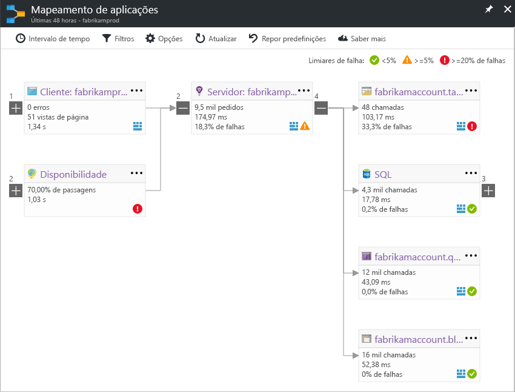

# Mapa de aplicação no Application InsightsApplication Map in Application Insights
No [Azure Application Insights](app-insights-overview.md), o mapeamento de aplicações é um esquema visual de relações de dependência de Olá dos componentes da aplicação.In [Azure Application Insights](app-insights-overview.md), Application Map is a visual layout of hello dependency relationships of your application components. Cada componente mostra KPIs, tais como toohelp de carga, desempenho, falhas e os alertas, detetar qualquer componente causar um problema de desempenho ou a falha.Each component shows KPIs such as load, performance, failures, and alerts, toohelp you discover any component causing a performance issue or failure. Pode clicar sucessivamente de qualquer componente toomore detalhadas de diagnóstico, tais como eventos do Application Insights.You can click through from any component toomore detailed diagnostics, such as Application Insights events. Se a sua aplicação utiliza serviços do Azure, também pode clicar sucessivamente tooAzure diagnostics, manutenção automática, tais como recomendações do Assistente de base de dados do SQL Server.If your app uses Azure services, you can also click through tooAzure diagnostics, such as SQL Database Advisor recommendations.

Como outros gráficos, pode afixar um toohello de mapa de aplicação dashboard do Azure, onde este fica totalmente funcional.Like other charts, you can pin an application map toohello Azure dashboard, where it is fully functional. 

## Mapa de aplicação Olá abertaOpen hello application map
Mapa de Olá aberto a partir do painel de descrição geral de Olá para a sua aplicação:Open hello map from hello overview blade for your application:

mapa de Olá mostra:hello map shows:

* Testes de disponibilidadeAvailability tests
* Componente do lado do cliente (monitorizado com Olá JavaScript SDK)Client-side component (monitored with hello JavaScript SDK)
* Componente do lado do servidorServer-side component
* Dependências de componentes de cliente e servidor OláDependencies of hello client and server components

Pode expandir e fechar a grupos de ligação de dependência:You can expand and collapse dependency link groups:

Se tiver uma grande quantidade de dependências de um tipo (SQL Server, etc. HTTP), que possam aparecer agrupados.If you have many dependencies of one type (SQL, HTTP etc.), they may appear grouped. 

## Problemas de lugar para cimaSpot problems
Cada nó tem indicadores de desempenho relevantes, tais como as taxas de carga, desempenho e falha Olá desse componente.Each node has relevant performance indicators, such as hello load, performance, and failure rates for that component. 

Ícones de aviso destacar informações sobre problemas possíveis.Warning icons highlight possible problems. Um aviso laranja significa que existem falhas nos pedidos, vistas de página ou chamadas de dependência.An orange warning means there are failures in requests, page views or dependency calls. Vermelho significa uma taxa de falhas superior a 5%.Red means a failure rate above 5%. Se quiser tooadjust estes limiares, abra as opções.If you want tooadjust these thresholds, open Options.

Active Directory também alertas Mostrar cópias de segurança:Active alerts also show up: 

Se utilizar o SQL Azure, há um ícone que mostra quando existem recomendações sobre como melhorar o desempenho.If you use SQL Azure, there's an icon that shows when there are recommendations on how you can improve performance. 

Clique em qualquer tooget ícone mais detalhes:Click any icon tooget more details:

## Clique em diagnóstico através doDiagnostic click through
Cada um de nós de Olá num mapa Olá oferece clique visado através de diagnóstico.Each of hello nodes on hello map offers targeted click through for diagnostics. Opções de Olá variam consoante o tipo de Olá do nó de Olá.hello options vary depending on hello type of hello node.

Para os componentes que estão alojados no Azure, as opções de Olá incluem hiperligações diretas toothem.For components that are hosted in Azure, hello options include direct links toothem.

## Filtros e o intervalo de tempoFilters and time range
Por predefinição, o mapa de Olá resume todos os dados de Olá disponíveis para Olá escolhido o intervalo de tempo.By default, hello map summarizes all hello data available for hello chosen time range. Mas pode filtrar os nomes de operações específicas apenas de tooinclude ou dependências.But you can filter it tooinclude only specific operation names or dependencies.

* Nome da operação: inclui os vistas de página e os tipos de pedido do lado do servidor.Operation name: This includes both page views and server-side request types. Com esta opção, Olá mapa mostra Olá KPI no nó do lado do servidor/cliente Olá para apenas operações de Olá selecionado.With this option, hello map shows hello KPI on hello server/client-side node for hello selected operations only. Mostra as dependências de Olá chamadas no contexto de Olá dessas operações específicas.It shows hello dependencies called in hello context of those specific operations.
* Nome de base de dependência: Isto inclui as dependências de browser de AJAX Olá e dependências do lado do servidor.Dependency base name: This includes hello AJAX browser dependencies and server-side dependencies. Se o relatório telemetria de dependência personalizado com Olá TrackDependency API, também aparecem aqui.If you report custom dependency telemetry with hello TrackDependency API, they also appear here. Pode selecionar Olá dependências tooshow num mapa Olá.You can select hello dependencies tooshow on hello map. Atualmente esta seleção não filtrar pedidos do lado do servidor de Olá ou vistas de página do lado do cliente Olá.Currently this selection does not filter hello server-side requests, or hello client-side page views.

## Guardar filtrosSave filters
filtros de Olá toosave tiver aplicado, Olá pin filtrado vista para um [dashboard](app-insights-dashboards.md).toosave hello filters you have applied, pin hello filtered view onto a [dashboard](app-insights-dashboards.md).

## Painel de erroError pane
Quando clicar num nó de mapa de Olá, um painel de erro é apresentado no lado direito Olá resumir falhas para esse nó.When you click a node in hello map, an error pane is displayed on hello right-hand side summarizing failures for that node. Falhas são agrupadas primeiro por ID de operação e, em seguida, agrupadas por ID do problema.Failures are grouped first by operation ID and then grouped by problem ID.

Clicar numa falha leva-o toohello instância mais recente do que falha.Clicking on a failure takes you toohello most recent instance of that failure.

## Estado de funcionamento de recursosResource health
Alguns tipos de recurso, o estado de funcionamento do recurso é apresentado, Olá parte superior do painel de erro Olá.For some resource types, resource health is displayed at hello top of hello error pane. Por exemplo, clicando num nó do SQL Server irá mostrar o estado de funcionamento do Olá da base de dados e todos os alertas que tenham desencadeou.For example, clicking a SQL node will show hello database health and any alerts that have fired.

Pode clicar em métricas descrição geral de padrão tooview de nome de recurso de Olá para esse recurso.You can click hello resource name tooview standard overview metrics for that resource.

## Mapas de aplicação de sistema de ponto a pontoEnd-to-end system app maps

*Requer SDK versão 2.3 ou superior**Requires SDK version 2.3 or higher*

Se a aplicação tem vários componentes - por exemplo, um serviço de back-end além toohello aplicação de web -, em seguida, que pode apresentá-las a todos os num mapa de uma aplicação integrada.If your application has several components - for example, a back-end service in addition toohello web app - then you can show them all on one integrated app map.

mapa de aplicação Olá localiza nós do servidor seguindo quaisquer chamadas de dependência HTTP feitas entre servidores com Olá que Application Insights SDK instalado.hello app map finds server nodes by following any HTTP dependency calls made between servers with hello Application Insights SDK installed. Cada recurso do Application Insights é assumido toocontain um servidor.Each Application Insights resource is assumed toocontain one server.

### Mapa de aplicação de função multi (pré-visualização)Multi-role app map (preview)

funcionalidade de mapa de aplicação de função multi de pré-visualização Olá permite-lhe toouse Olá aplicação mapa com vários servidores de envio de dados toohello mesmo recurso do Application Insights / chave de instrumentação.hello preview multi-role app map feature allows you toouse hello app map with multiple servers sending data toohello same Application Insights resource  / instrumentation key. Servidores no mapa de Olá são segmentados pela propriedade de cloud_RoleName Olá em itens de telemetria.Servers in hello map are segmented by hello cloud_RoleName property on telemetry items. Definir *mapa de aplicação de função Multi* demasiado*no* de Olá pré-visualizações painel tooenable esta configuração.Set *Multi-role Application Map* too*On* from hello Previews blade tooenable this configuration.

Esta abordagem poderá ser pretendida numa aplicação microserviços ou noutros cenários onde pretende que os eventos de toocorrelate em vários servidores dentro de um único recurso do Application Insights.This approach may be desired in a micro-services application, or in other scenarios where you want toocorrelate events across multiple servers within a single Application Insights resource.

## VídeoVideo

> [!VIDEO https://channel9.msdn.com/events/Connect/2016/112/player] 

## ComentáriosFeedback
Forneça comentários através da opção de portal comentários de Olá.Please provide feedback through hello portal feedback option.

## Passos seguintesNext steps

* [Portal do AzureAzure portal](https://portal.azure.com)
