# Descrição geral do Application Insights para DevOps

Com [Application Insights](app-insights-overview.md), pode rapidamente descobrir como a aplicação está a funcionar e a ser utilizado quando se encontra em direto. Se existir um problema, permite-lhe saber sobre, ajuda a avaliar o impacto de Olá e ajuda a determinar a causa de Olá.

Segue-se uma conta de um agrupamento que desenvolvidas pela organização aplicações web:

* *"Alguns há dias, foi implementada uma correção 'secundária'. Iremos não foram executados uma passagem de teste abrangente, mas Infelizmente alguma alteração inesperada obteve intercalada na payload Olá, fazendo com que incompatibilidade entre frente Olá e back-ends. Imediatamente, desencadeou o nosso alerta surged exceções de servidor, e foram notificados da situação de Olá. Alguns cliques ausente no portal do Application Insights Olá, iremos obteve informações suficientes da exceção callstacks toonarrow baixo problema Olá. Foi revertida imediatamente e limitada danos Olá. Application Insights efetuou esta parte do devops Olá ciclo muito fácil e acionáveis."*

Neste artigo, siga uma equipa na Fabrikam Bank que desenvolvidas pela organização Olá online bancária toosee de sistema (OBS) como utilizar Application Insights tooquickly responder toocustomers e efetuar atualizações.  

equipa de Olá funciona num ciclo de DevOps representado no Olá ilustração a seguir:

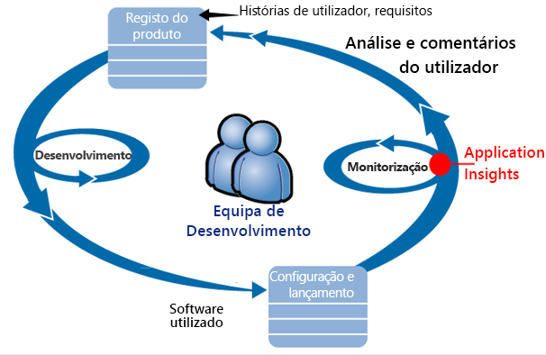

Requisitos do feed no respetivo registo de segurança do desenvolvimento (lista de tarefas). Funcionam em suma sprints, que frequentemente entregar o trabalho de software - normalmente no formulário de Olá da aplicação existente de toohello melhoramentos e extensões. aplicação em direto Olá é atualizada frequentemente com novas funcionalidades. Enquanto estiver em direto, a equipa de Olá monitoriza-desempenho e a utilização com a ajuda de Olá do Application Insights. Estes dados APM feeds no respetivo registo de segurança de desenvolvimento.

equipa de Olá utiliza a aplicação web em direto do Application Insights toomonitor Olá rigorosamente para:

* Desempenho. Pretendem toounderstand como tempos de resposta variar de acordo com a contagem de pedido quanto CPU, rede, disco e outros recursos estão a ser utilizados; e onde estão os congestionamentos de Olá.
* Falhas. Se existirem exceções de pedidos falhados ou se um contador de desempenho ficar fora do intervalo familiarizado, Olá equipa necessidades tooknow rapidamente, para que o podem tomar medidas.
* Utilização. Sempre que for lançada uma nova funcionalidade, a equipa de Olá pretende tooknow toowhat extensão é utilizado e, se os utilizadores têm dificuldades com o mesmo.

Vamos concentrar-se na parte de comentários de Olá do ciclo de Olá:

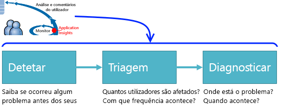

## Detetar disponibilidade fraca
Marcela Markova é um programador sénior na equipa OBS Olá e demora Olá antecedência na monitorização do desempenho online. A Joana configura vários [testes de disponibilidade](app-insights-monitor-web-app-availability.md):

* Um teste de URL único para a página de destino principal de Olá da aplicação Olá, http://fabrikambank.com/onlinebanking/. A Joana define os critérios de texto e o código de HTTP 200 'Bem-vindo!'. Se este teste falhar, não há um muito a sério problema com a rede de Olá ou servidores de Olá ou talvez um problema de implementação. (Ou alguém mudou Olá bem-vindo! mensagem na página Olá sem que o respetivo know.)
* Um mais profundo teste com vários passos, que inicia sessão e obtém uma conta atual listagem, alguns detalhes chaves em cada página de verificação. Este teste verifica que a base de dados de contas de toohello de ligação do Olá está a funcionar. Ela utiliza um id de cliente fictícios: alguns deles são mantidas para fins de teste.

Com estes testes, configurar, Marcela é certeza que se esta equipa Olá rapidamente ficará a saber sobre qualquer interrupção.  

Falhas de apareçam como vermelhos pontos no gráfico de teste do Olá web:

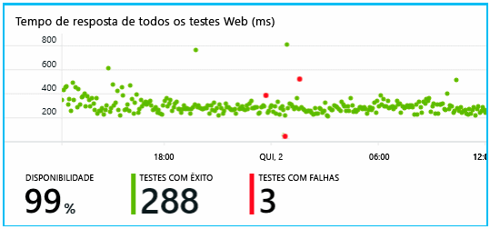

Mas, mais importante ainda, um alerta sobre qualquer falha é enviado por e-mail toohello equipa de desenvolvimento. Dessa forma, que já estão habituados acerca do mesmo antes de Olá quase todos os clientes.

## Monitorizar o desempenho
Na página de descrição geral de Olá no Application Insights, está um gráfico que mostra uma variedade de [chave métricas](app-insights-web-monitor-performance.md).

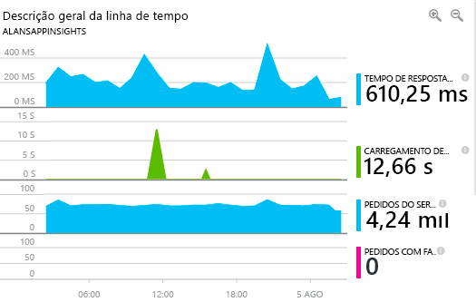

Tempo de carregamento de página do browser é derivado de telemetria enviada diretamente a partir de páginas web. Tempo de resposta do servidor, a contagem de pedidos do servidor e a contagem de pedidos falhados são todos medidas no servidor de web de Olá e enviados tooApplication Insights a partir daí.

Marcela é ligeiramente preocupado com gráfico de resposta do servidor de Olá. Este gráfico mostra o tempo médio de Olá entre quando o servidor de Olá recebe um pedido de HTTP do browser do utilizador e, quando se retomam resposta Olá. Não se encontra toosee invulgar uma variação neste gráfico, como a carga no sistema de Olá varia. Mas neste caso, parece toobe uma correlação entre pequeno aumenta Olá contagem de pedidos e grande aumenta no tempo de resposta de Olá. Que pode indicar que o sistema de Olá está a funcionar apenas na respetivos limites.

Abre gráficos de servidores de Olá:

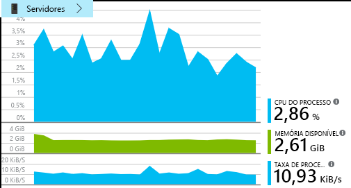

Parece toobe sem sinal de limitação de recursos existe, pelo que maybe Olá bumps nos gráficos de resposta do servidor de Olá são apenas um coincidence.

## Definir alertas toomeet objetivos
Contudo, a Joana gostaria tookeep par em tempos de resposta de Olá. Se avançam demasiado elevados, que pretende imediatamente tooknow acerca do mesmo.

Para que ela define um [alerta](app-insights-metrics-explorer.md), para tempos de resposta maiores do que um limiar normal. Isto permite que a confiança de que ela vai conhecê-lo se tempos de resposta são lentos.

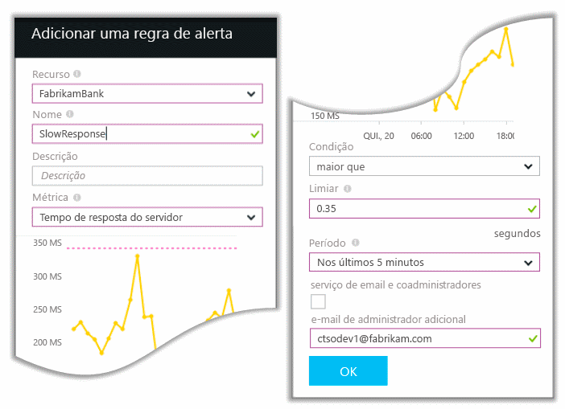

Alertas podem ser definidos numa ampla variedade de outras métricas. Por exemplo, pode receber mensagens de correio eletrónico se a contagem de exceção Olá torna elevada ou a memória disponível Olá fica baixa, ou se houver um horário de pico nos pedidos de cliente.

## Manter-se informado com alertas de deteção inteligente
Dia seguinte, uma mensagem de e-mail de alerta chegam do Application Insights. Mas, quando abre-lo, ela localiza não se encontra alerta de tempo de resposta Olá que ela definidas. Em vez disso, se lhe indica tiver ocorrido um aumento súbito repentino no pedidos falhados - ou seja, pedidos de tem devolvido códigos de falha de 500 ou mais.

Pedidos falhados são onde os utilizadores têm visto um erro - normalmente, seguindo uma excepção iniciada no código Olá. Talvez veem uma mensagem a indicar "Lamentamos mas não foi possível atualizar os detalhes da sua neste momento." Em alternativa, na pior embarrassing absoluto, as informações de pilha aparece no ecrã de utilizador Olá, courtesy of servidor web de Olá.

Este alerta é um surprise porque hello hora da última ela consultou, hello de pedidos falhados contagem era encouragingly baixa. Um pequeno número de falhas é toobe esperado num servidor ocupado.

Foi também um bits de um surprise para lhe porque ela não tive tooconfigure este alerta. Application Insights incluem a deteção inteligente. Ajusta automaticamente da aplicação tooyour padrão de falha habitual e falhas "é utilizado para" a uma página específica ou em carga elevada ou métricas tooother ligado. Gera um alarme Olá apenas se existir um aumento súbito acima que it vem tooexpect.

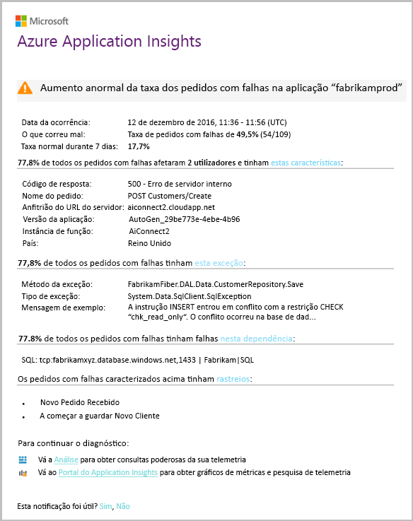

Este é um e-mail muito úteis. Apenas se não elevar um alarme. Faz uma grande quantidade de trabalho de diagnóstico e de triagem de Olá demasiado.

Mostra o número de clientes serem afetado e que as páginas web ou operações. Marcela pode decidir se que precisa que a equipa de todo de Olá de tooget trabalhar neste como um exercício fire, ou se pode ser ignorado até próximas semanas.

e-mail de Olá também mostra que ocorreu uma exceção específica, sendo - ainda mais interessante - essa falha Olá associada chamadas falhadas tooa específica da base de dados. Isto explica por que motivo falhas Olá apareceu subitamente, apesar de equipa do Marcela não implementada quaisquer atualizações recentemente.

Marcella faz o ping leader Olá da equipa de base de dados de Olá com base neste e-mail. A Joana aprende que eles lançada uma correção frequente no Olá passada meia hora; e UPS, talvez poderá tiver ocorrido uma alteração de esquema secundárias...

Por isso, problema Olá se Olá forma toobeing corrigido, antes dos registos a investigar e, em 15 minutos-resultantes. No entanto, Marcela clica Olá ligação tooopen Application Insights. Abre-se diretamente para um pedido falhado e ela consegue ver a base de dados falhou a chamada Olá associado da lista de chamadas de dependência.

## Detetar exceções
Com um pouco de configuração, [exceções](app-insights-asp-net-exceptions.md) são comunicado tooApplication Insights automaticamente. Estes podem também ser capturadas explicitamente através da inserção de chamadas demasiado[trackexception ()](app-insights-api-custom-events-metrics.md#trackexception) em código Olá:  

    var telemetry = new TelemetryClient();
    ...
    try
    { ...
    }
    catch (Exception ex)
    {
       // Set up some properties:
       var properties = new Dictionary <string, string>
         {{"Game", currentGame.Name}};

       var measurements = new Dictionary <string, double>
         {{"Users", currentGame.Users.Count}};

       // Send hello exception telemetry:
       telemetry.TrackException(ex, properties, measurements);
    }

equipa de Fabrikam banco Olá evoluiu e deu lugar tem prática Olá sempre que envia a telemetria uma exceção, a menos que exista uma recuperação óbvias.  

Na verdade, a respetiva estratégia é mesmo mais abrangente do que: enviam telemetria em cada caso em que o cliente Olá é frustrado no que pretendiam toodo, se correspondendo tooan exceção no código Olá ou não. Por exemplo, se o sistema de transferência do banco entre externo Olá devolve uma mensagem "não é possível concluir esta transação", por algum motivo operacional (sem falhas do cliente de Olá), em seguida, eles monitorizam esse evento.

    var successCode = AttemptTransfer(transferAmount, ...);
    if (successCode < 0)
    {
       var properties = new Dictionary <string, string>
            {{ "Code", returnCode, ... }};
       var measurements = new Dictionary <string, double>
         {{"Value", transferAmount}};
       telemetry.TrackEvent("transfer failed", properties, measurements);
    }

TrackException é utilizado tooreport exceções porque envia uma cópia da pilha de Olá. TrackEvent é tooreport utilizado outros eventos. Pode anexar quaisquer propriedades que poderão ser úteis para diagnósticos adicionais.

Exceções e eventos de apareçam no Olá [pesquisa de diagnóstico](app-insights-diagnostic-search.md) painel. Pode ver os pormenores propriedades adicionais de Olá toosee-los e rastreio da pilha.

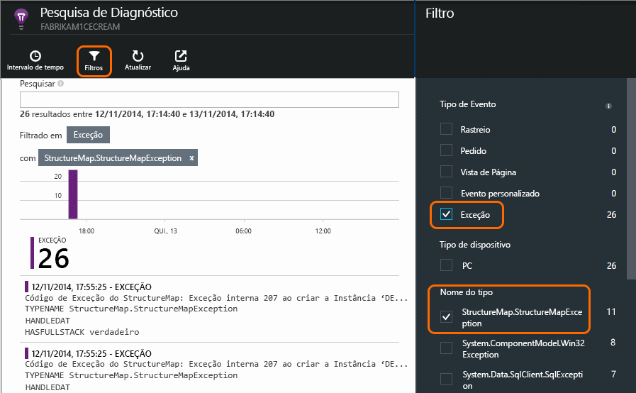

## Monitorizar proativamente
Marcela não manter-se apenas à volta a aguardar para alertas. Logo após cada reimplementação, ela demora uma vista de olhos [tempos de resposta](app-insights-web-monitor-performance.md) - ambos Olá geral figura e tabela Olá de pedidos mais lentos, bem como exceção contagens.  

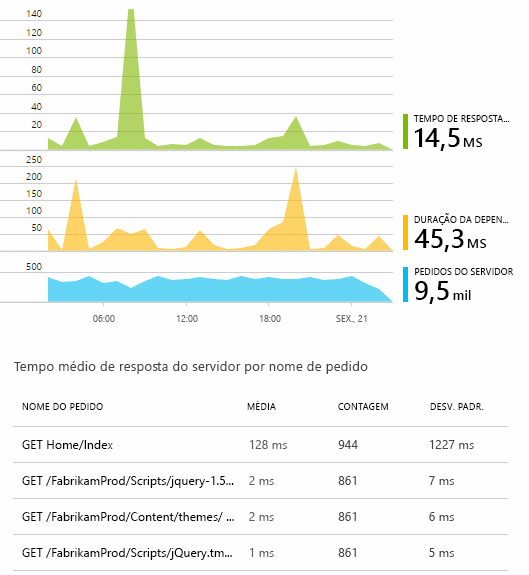

Ela pode avaliar o efeito de desempenho de Olá de todas as implementações, normalmente, a comparação com todas as semanas com Olá pela última vez. Se existir um worsening repentino, ela gera que com programadores relevantes Olá.

## Problemas de triagem
Triagem - avaliar gravidade Olá e grau de um problema - é o primeiro passo de Olá após deteção. Deve chamamos saída equipa Olá à meia-noite? Ou pode ser deixado até intervalo conveniente seguinte no registo de segurança de Olá Olá? Existem algumas questões-chave no triagem.

Frequência acontece? gráficos de Olá no painel de descrição geral de Olá dê algum problema de tooa de perspetiva. Por exemplo, Olá Fabrikam aplicação gerados alertas de teste web quatro um noite. Consultar o gráfico de Olá na manhã Olá, equipa Olá foi Consulte que ocorreram, de facto, alguns pontos vermelhos, embora ainda maior parte dos testes de Olá foram verde. Desagregação em gráfico de disponibilidade de Olá, estava claro que todos estes problemas intermitentes foram da localização de um teste. Obviamente foi um problema de rede que afetam apenas uma rota e provavelmente pretende limpar próprio.  

Por outro lado, um aumento súbito enormes e estável no gráfico de Olá de contagens de exceção ou tempos de resposta obviamente é algo toopanic sobre.

Tática uma triagem útil é tente-lo por si. Caso se depare com Olá mesmo problema, sabe que é real.

Que fração de utilizadores são afetados? tooobtain uma resposta aproximada, taxa de falhas de Olá de divisão por número de sessões de Olá.

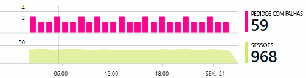

Quando existem lentas, compare tabela Olá de pedidos mais lentos responder com frequência de utilização de Olá de cada página.

Como importante é o cenário de Olá bloqueado? Se este for um problema funcional bloquear uma história de utilizador em particular,-importa muito? Se os clientes não é possível pagar os respetivos faturas, esta é grave; Se não podem alterar as respetivas preferências de cor do ecrã, talvez-lo pode aguardar. Olá, detalhe do evento de Olá ou exceção ou identidade Olá de páginas lento Olá, indica onde os clientes com dificuldades.

## Diagnosticar problemas
Diagnóstico não é bastante Olá igual a depuração. Antes de iniciar o rastreio através de código Olá, deve ter uma ideia aproximada do motivo, onde e quando o problema de Olá está a ocorrer.

**Quando se acontecer?**  vista históricos Olá fornecida pelo gráficos de eventos e a métrica de Olá faz com que os efeitos de toocorrelate fácil com as causas possíveis. Se existirem picos intermitentes taxas de exceção ou tempo de resposta, observe a contagem de pedido de Olá: se este peaks em Olá mesmo tempo, em seguida, o aspeto que tem um problema de recurso. Necessita de tooassign mais CPU ou memória? Ou é uma dependência que não é possível gerir a carga de Olá?

**É-nos?**  Se tiver uma redução repentino no desempenho de um determinado tipo de pedido - por exemplo quando o cliente de Olá pretende uma instrução de conta -, em seguida, é possível pode ser um subsistema externo em vez da aplicação web. No Explorador de métricas, selecione a taxa de falhas de dependência de Olá e taxas de duração da dependência e comparar os respetivos histories através de Olá passado algumas horas ou dias, fazendo com que foi detectado um problema Olá. Se é correlacionando que são as alterações, poderá ser um subsistema externo tooblame.  

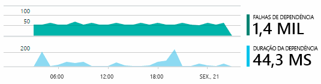

Alguns problemas de dependência lenta são problemas de geolocalização. Fabrikam banco utiliza máquinas virtuais do Azure e detetados que que tinham inadvertidamente localizados os seus servidor web e o servidor de conta em diferentes países. Uma melhoria enormes foi colocada ao migrar um deles.

**O que podemos fazer?** Se o problema de Olá não aparecer toobe numa dependência e se não sempre existe, é provavelmente provocado por uma alteração recente. Olá perspetiva histórica fornecida pelo gráficos de métricas e eventos de Olá torna mais fácil toocorrelate quaisquer alterações repentino com as implementações. Que restringe-se para baixo de pesquisa de Olá para problema Olá.

**Que está a suceder?** Alguns problemas ocorrem raramente e podem ser difícil tootrack baixo testando offline. Todos os podemos fazer é erros de Olá tootry toocapture quando ocorrer em direto. Pode inspecionar capturas da pilha de Olá nos relatórios de exceção. Além disso, pode escrever chamadas de rastreio, com a arquitetura de registo favorita ou com tracktrace () ou trackevent ().  

Fabrikam teve um problema intermitente faça com conta entre transferências, mas apenas com determinados tipos de conta. melhor dos toounderstand que estava a acontecer, estes inseridos chamadas tracktrace () na chaves pontos no código Olá, anexar Olá o tipo de conta como uma chamada de tooeach de propriedade. Que efetuadas-toofilter fácil enviados apenas esses rastreios de pesquisa de diagnóstico. Ligados também os valores dos parâmetros como chamadas de rastreio toohello propriedades e as medidas.

## Responder a problemas de toodiscovered
Assim que tiver diagnosticado problema Olá, pode efetuar um plano toofix-lo. Talvez terá tooroll novamente uma alteração recente ou talvez apenas podem avançar e corrigi-la. Depois de corrigir Olá é concluído, o Application Insights indica se é concluída com êxito.  

Equipa de desenvolvimento da Fabrikam banco demorar uma medida de tooperformance abordagem mais estruturada que utilizaram toobefore a IETF utilizou o Application Insights.

* Configuram metas de desempenho em termos de medidas específicas na página de descrição geral do Application Insights Olá.
* Estas medidas de desempenho de design numa aplicação Olá do início Olá, tal como métricas de Olá que medem o progresso do utilizador através de 'funnels'.  

## Monitorizar a atividade do utilizador
Quando o tempo de resposta é boa consistentemente e existem algumas exceções, pode passar equipa de desenvolvimento de Olá toousability. Estes podem pensar sobre como tooimprove Olá experiência dos utilizadores e como tooencourage pretendido Olá de tooachieve utilizadores mais objetivos.

Application Insights também podem ser utilizado toolearn que os utilizadores fazem com uma aplicação. Assim que estiver a executar facilmente, equipa Olá gostaria tooknow que funcionalidades estão Olá mais popular, o que os utilizadores, como ou tem dificuldade em com e a frequência voltar atrás. Que irá ajudá-los a dar prioridade ao seu trabalho futuros. E podem planear com êxito de Olá toomeasure de cada funcionalidade como parte do ciclo de desenvolvimento de Olá. 

Por exemplo, um journey típica de utilizador através do web site do Olá tem um limpar "funil." Muitos clientes observe taxas de Olá de diferentes tipos de loan. Um número mais pequeno avance toofill no formulário de aspas Olá. De quem obter uma aspas, algumas avançar em remova loan Olá.

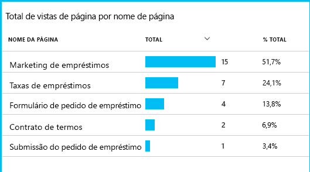

Ao considerar onde Olá números mais de clientes drop out, negócio Olá pode trabalhar saída como o tooget mais utilizadores através de toohello inferior de Olá funil. Em alguns casos, poderá haver uma falha de experiência (UX) do utilizador - por exemplo, o botão 'Seguinte' Olá está toofind rígido ou instruções de Olá não são óbvias. Mais provavelmente, existem mais significativas razões comerciais para largar outs: talvez taxas de loan Olá são demasiado elevadas.

Qualquer motivos Olá, dados de Olá ajuda a equipa de Olá descobrir que os utilizadores estão a fazer. Mais controlo chamadas podem ser inseridos toowork saída mais detalhada. Trackevent () podem ser utilizado toocount qualquer ação do utilizador, de detalhe Olá de clica no botão individuais, feitos toosignificant como pagar desativar um loan.

equipa de Olá está a obter toohaving utilizados informações sobre a atividade do utilizador. Nowadays, sempre que o se estruturar uma nova funcionalidade, funcionam enviados como que irão obter comentários sobre a sua utilização. Estruture a chamadas de registo para funcionalidade Olá desde o início de Olá. Se utilizarem a funcionalidade de Olá de tooimprove de comentários de Olá em cada ciclo de desenvolvimento.

[Saiba mais sobre o controlo da utilização](app-insights-usage-overview.md).

## Aplicar o ciclo de DevOps Olá
Por isso que é como uma equipa utilização Application Insights indivíduo não apenas toofix problemas, mas tooimprove respetivo ciclo de vida de desenvolvimento. Posso hope-lhe forneceu algumas ideias sobre como Application Insights pode ajudá-lo com a gestão de desempenho de aplicações nas suas próprias aplicações.

## Vídeo

> [!VIDEO https://channel9.msdn.com/events/Connect/2016/112/player]

## Passos seguintes
Pode começar a utilizar de várias formas, consoante as características de Olá da sua aplicação. Escolha o adequado para si:

* [Aplicação web ASP.NET](app-insights-asp-net.md)
* [Aplicação web em Java](app-insights-java-get-started.md)
* [Aplicação web node.js](app-insights-nodejs.md)
* Já implementada aplicações, alojadas no [IIS](app-insights-monitor-web-app-availability.md), [J2EE](app-insights-java-live.md), ou [Azure](app-insights-azure.md).
* [Páginas Web](app-insights-javascript.md) -única página aplicação ou página comum de web - utilizá-lo no seu próprio ou em tooany adição das opções de servidor Olá.
* [Testes de disponibilidade](app-insights-monitor-web-app-availability.md) tootest Olá, a aplicação da internet pública.
