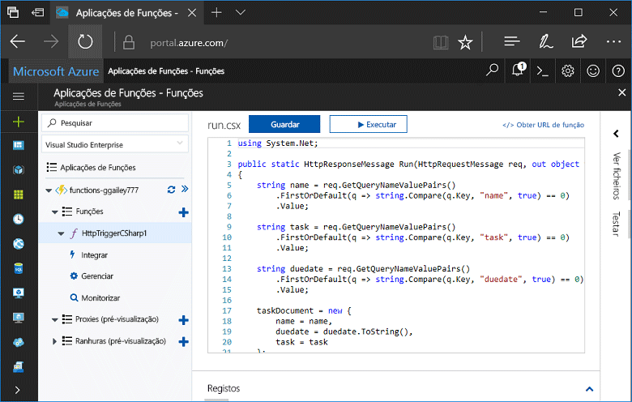
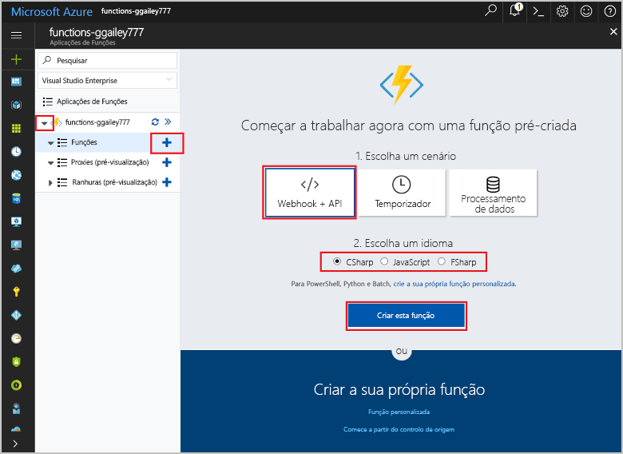
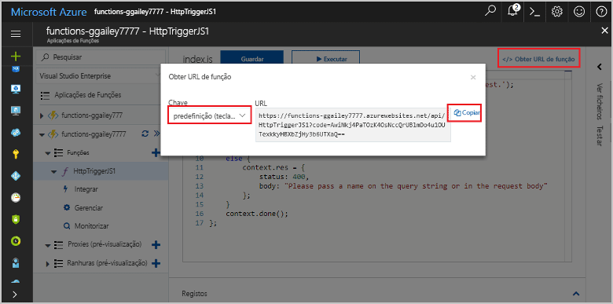
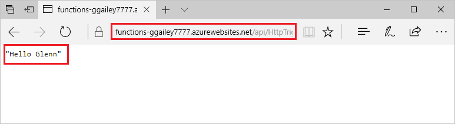
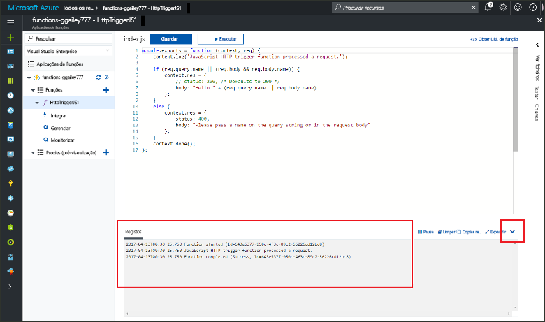

# Criar a sua primeira função no Olá portal do AzureCreate your first function in hello Azure portal

As funções do Azure permite-lhe executar o seu código num ambiente sem servidor sem ter toofirst criar uma VM ou publicar uma aplicação web.Azure Functions lets you execute your code in a serverless environment without having toofirst create a VM or publish a web application. Neste tópico, saiba como toouse funciona toocreate uma função de "Olá mundo" Olá portal do Azure.In this topic, learn how toouse Functions toocreate a "hello world" function in hello Azure portal.

[!INCLUDE [quickstarts-free-trial-note](../../includes/quickstarts-free-trial-note.md)]

## Inicie sessão no tooAzureLog in tooAzure

Inicie sessão no toohello [portal do Azure](https://portal.azure.com/).Log in toohello [Azure portal](https://portal.azure.com/).

## Criar uma aplicação de funçãoCreate a function app

Tem de ter uma execução de Olá do função aplicação toohost das suas funções.You must have a function app toohost hello execution of your functions. As aplicações App Function permitem-lhe agrupar funções como unidades lógicas para uma gestão, implementação e partilha de recursos mais fácil.A function app lets you group functions as a logic unit for easier management, deployment, and sharing of resources. 

[!INCLUDE [Create function app Azure portal](../../includes/functions-create-function-app-portal.md)]

[!INCLUDE [functions-portal-favorite-function-apps](../../includes/functions-portal-favorite-function-apps.md)]

Em seguida, crie uma função na nova aplicação de função Olá.Next, you create a function in hello new function app.

## Criar uma função acionada por HTTPCreate an HTTP triggered function

1. Expanda a nova aplicação de função, em seguida, clique em Olá  **+**  no botão seguinte demasiado**funções**.Expand your new function app, then click hello **+** button next too**Functions**.

2.  No Olá **começar rapidamente** página, selecione **WebHook + API**, **escolher um idioma** para a função e clique em **criar esta função** .In hello **Get started quickly** page, select **WebHook + API**, **Choose a language** for your function, and click **Create this function**. 
   
    

Uma função é criada no idioma que escolheu utilizando o modelo de Olá para uma função de acionada de HTTP.A function is created in your chosen language using hello template for an HTTP triggered function. Pode executar a nova função de Olá ao enviar um pedido HTTP.You can run hello new function by sending an HTTP request.

## Testar a função de OláTest hello function

1. Na sua nova função, clique em **</> Obter URL da função**, selecione **predefinição (tecla de função)** e, em seguida, clique em **Copiar**.In your new function, click **</> Get function URL**, select **default (Function key)**, and then click **Copy**. 

    

2. Colar Olá função URL na barra de endereço do browser.Paste hello function URL into your browser's address bar. Acrescentar a cadeia de consulta Olá `&name=<yourname>` toothis URL e prima Olá `Enter` chave no seu pedido de Olá tooexecute teclado.Append hello query string `&name=<yourname>` toothis URL and press hello `Enter` key on your keyboard tooexecute hello request. Olá segue-se um exemplo de resposta de Olá devolvida pela função Olá no browser Edge de Olá:hello following is an example of hello response returned by hello function in hello Edge browser:

    

    pedido de Olá URL inclui uma chave que é necessário, por predefinição, tooaccess a função através de HTTP.hello request URL includes a key that is required, by default, tooaccess your function over HTTP.   

3. Quando a função é executada, informações de rastreio são escritas toohello registos.When your function runs, trace information is written toohello logs. resultados de rastreio de Olá toosee da execução anterior do Olá, regresse a função tooyour no portal de Olá e clique em Olá segurança seta na parte inferior de Olá de Olá ecrã tooexpand **registos**.toosee hello trace output from hello previous execution, return tooyour function in hello portal and click hello up arrow at hello bottom of hello screen tooexpand **Logs**. 

   

## Limpar recursosClean up resources

[!INCLUDE [Clean up resources](../../includes/functions-quickstart-cleanup.md)]

## Passos seguintesNext steps

Criou uma aplicação App Function com uma função acionada por HTTP simples.You have created a function app with a simple HTTP triggered function.  

[!INCLUDE [Next steps note](../../includes/functions-quickstart-next-steps.md)]

Para obter mais informações, veja [Azure Functions HTTP and webhook bindings](functions-bindings-http-webhook.md) (Enlaces de HTTP e webhook das Funções do Azure).For more information, see [Azure Functions HTTP and webhook bindings](functions-bindings-http-webhook.md).

