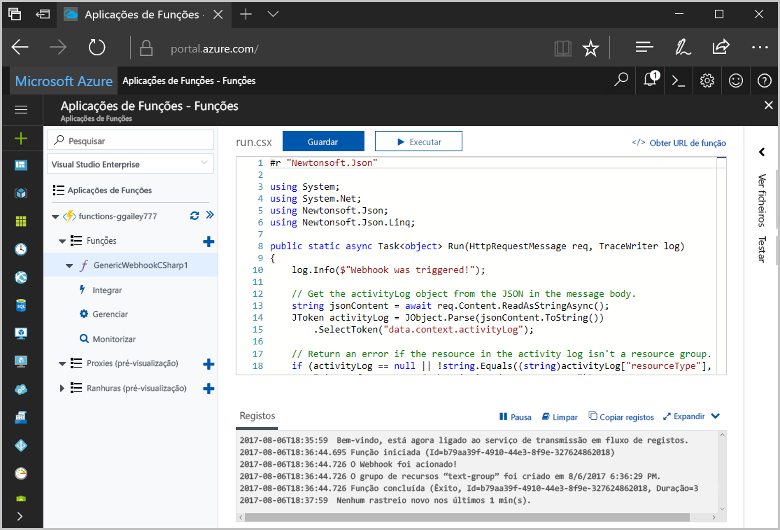
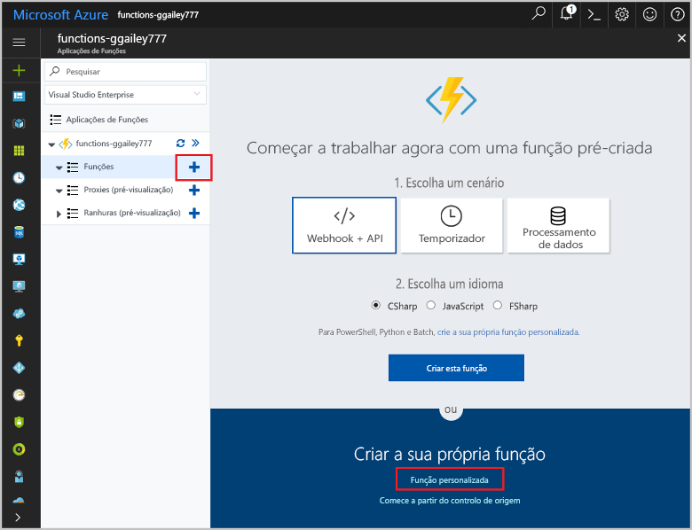
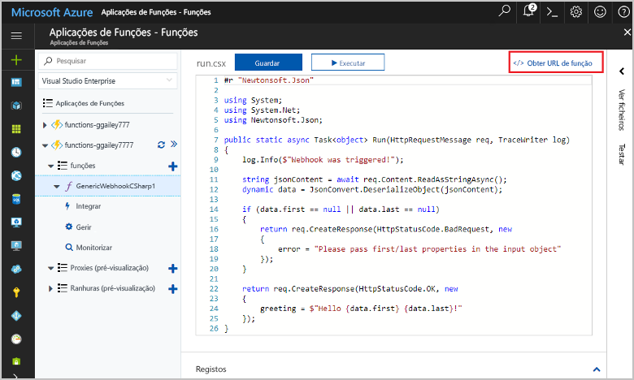
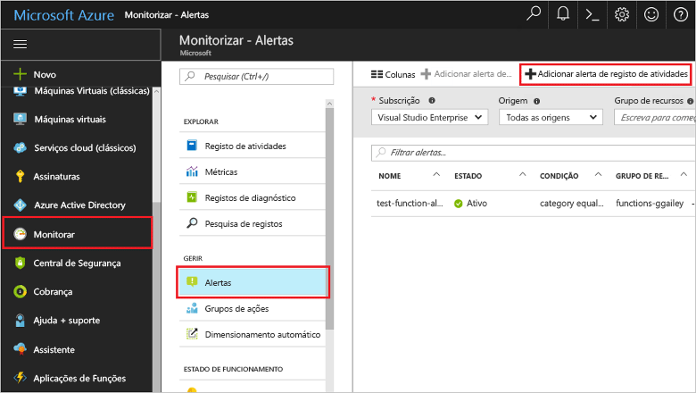
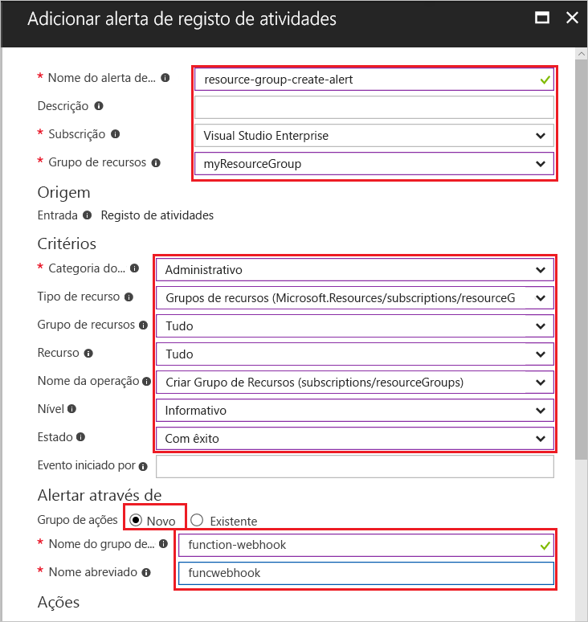
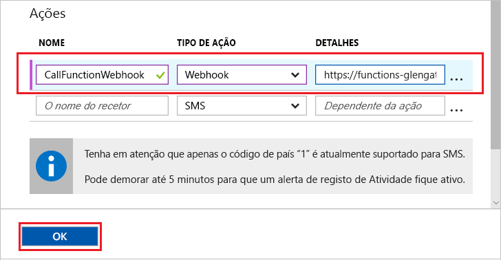
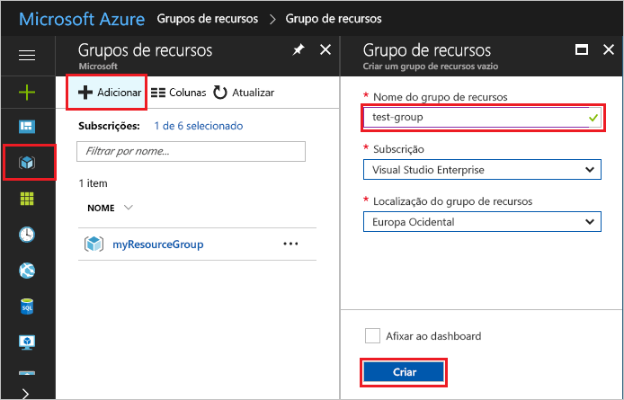
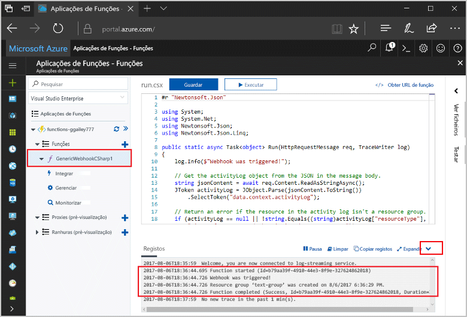

# <a name="create-a-function-triggered-by-a-generic-webhook"></a>Criar uma função acionada por um webhook genérico

As funções do Azure permite-lhe executar o seu código num ambiente sem servidor sem ter toofirst criar uma VM ou publicar uma aplicação web. Por exemplo, pode configurar toobe uma função acionada por um alerta gerado pelo Monitor do Azure. Este tópico mostra como tooexecute código c# quando um grupo de recursos é adicionado tooyour subscrição.   



## <a name="prerequisites"></a>Pré-requisitos 

toocomplete neste tutorial:

+ Se não tiver uma subscrição do Azure, crie uma [conta gratuita](https://azure.microsoft.com/free/?WT.mc_id=A261C142F) antes de começar.

[!INCLUDE [functions-portal-favorite-function-apps](../../includes/functions-portal-favorite-function-apps.md)]

## <a name="create-an-azure-function-app"></a>Criar uma aplicação de Funções do Azure

[!INCLUDE [Create function app Azure portal](../../includes/functions-create-function-app-portal.md)]

Em seguida, crie uma função na nova aplicação de função Olá.

## <a name="create-function"></a>Criar uma função de webhook genérico acionada

1. Expanda a sua aplicação de função e clique em Olá  **+**  no botão seguinte demasiado**funções**. Se esta função é hello um primeiro na sua aplicação de função, selecione **função personalizada**. Esta ação apresenta o conjunto completo de Olá dos modelos de função.

    

2. Selecione Olá **WebHook genérico - c#** modelo. Escreva um nome para a função de c#, em seguida, selecione **criar**.

      

2. Na sua nova função, clique em **<> / Get função URL**, em seguida, copie e guarde o valor de Olá. Utilize o valor tooconfigure Olá webhook. 

    
         
Em seguida, crie um ponto final de webhook num alerta de registo de atividade no Monitor do Azure. 

## <a name="create-an-activity-log-alert"></a>Criar um alerta de registo de atividade

1. No portal do Azure de Olá, navegue toohello **Monitor** serviço, selecione **alertas**e clique em **Adicionar alerta de registo de atividade**.   

    

2. Utilize as definições de Olá conforme especificado na tabela de Olá:

    

    | Definição      |  Valor sugerido   | Descrição                              |
    | ------------ |  ------- | -------------------------------------------------- |
    | **Nome de alerta de registo de atividade** | recursos-grupo-criar-alerta | Nome do alerta de registo de atividade Olá. |
    | **Subscrição** | A sua subscrição | subscrição Olá que estiver a utilizar para este tutorial. | 
    |  **Grupo de Recursos** | myResourceGroup | grupo de recursos de Olá recursos alerta Olá implementadas. Utilizar Olá mesmo grupo de recursos, como a sua aplicação de função torna mais fácil tooclean cópias de segurança depois de concluir o tutorial Olá. |
    | **Categoria de evento** | Administrativos | Esta categoria inclui as alterações efetuadas tooAzure recursos.  |
    | **Tipo de recurso** | Grupos de recursos | Filtra a agrupar atividades tooresource alertas. |
    | **Grupo de Recursos**<br/>e **recursos** | Todos | Monitorize todos os recursos. |
    | **Nome da operação** | Criar Grupo de Recursos | Filtros de operações de toocreate de alertas. |
    | **Nível** | Informativo | Inclua alertas informativos de nível. | 
    | **Estado** | Bem-sucedido | Filtros tooactions de alertas que foram concluídos com êxito. |
    | **Grupo de ação** | novo | Crie um novo grupo de ação, que define Olá ação demora quando for gerado um alerta. |
    | **Nome do grupo de ação** | função de webhook | Um grupo de ação do nome tooidentify Olá.  | 
    | **Nome abreviado** | funcwebhook | Um nome abreviado do grupo de ação de Olá. |  

3. No **ações**, adicionar uma ação com as definições de Olá conforme especificado na tabela de Olá: 

    

    | Definição      |  Valor sugerido   | Descrição                              |
    | ------------ |  ------- | -------------------------------------------------- |
    | **Nome** | CallFunctionWebhook | Um nome para a ação de Olá. |
    | **Tipo de ação** | Webhook | alerta de toohello Olá resposta é que é chamado um URL do Webhook. |
    | **Detalhes** | URL de função | Cole no URL do webhook Olá da função de Olá que copiou anteriormente. |v

4. Clique em **OK** toocreate Olá alerta e ação de grupo.  

chama-se agora Olá webhook quando é criado um grupo de recursos na sua subscrição. Em seguida, atualize o código de Olá no seu Olá toohandle de função dados de registo JSON no corpo de Olá de pedido de Olá.   

## <a name="update-hello-function-code"></a>Atualizar o código de função Olá

1. Navegue tooyour back-a aplicação de função no portal de Olá e expandir a sua função. 

2. Substitua o código de script de Olá c# na função de Olá no portal de Olá com Olá seguinte código:

    ```csharp
    #r "Newtonsoft.Json"
    
    using System;
    using System.Net;
    using Newtonsoft.Json;
    using Newtonsoft.Json.Linq;
    
    public static async Task<object> Run(HttpRequestMessage req, TraceWriter log)
    {
        log.Info($"Webhook was triggered!");
    
        // Get hello activityLog object from hello JSON in hello message body.
        string jsonContent = await req.Content.ReadAsStringAsync();
        JToken activityLog = JObject.Parse(jsonContent.ToString())
            .SelectToken("data.context.activityLog");
    
        // Return an error if hello resource in hello activity log isn't a resource group. 
        if (activityLog == null || !string.Equals((string)activityLog["resourceType"], 
            "Microsoft.Resources/subscriptions/resourcegroups"))
        {
            log.Error("An error occured");
            return req.CreateResponse(HttpStatusCode.BadRequest, new
            {
                error = "Unexpected message payload or wrong alert received."
            });
        }
    
        // Write information about hello created resource group toohello streaming log.
        log.Info(string.Format("Resource group '{0}' was {1} on {2}.",
            (string)activityLog["resourceGroupName"],
            ((string)activityLog["subStatus"]).ToLower(), 
            (DateTime)activityLog["submissionTimestamp"]));
    
        return req.CreateResponse(HttpStatusCode.OK);    
    }
    ```

Agora pode testar a função de Olá ao criar um novo grupo de recursos na sua subscrição.

## <a name="test-hello-function"></a>Testar a função de Olá

1. Clique em ícone de grupo de recursos de Olá no lado esquerdo de Olá do portal do Azure, selecione de Olá **+ adicionar**, escreva um **nome do grupo de recursos**e selecione **criar** toocreate um grupo de recursos em branco.
    
    

2. Volte a função tooyour e expanda Olá **registos** janela. Depois de criar o grupo de recursos de Olá, hello acionadores de alerta de registo de atividade Olá webhook e executa a função de Olá. Pode ver o nome Olá Olá novo grupo de recursos escrito toohello registos.  

    

3. (Opcional) Voltar atrás e elimine o grupo de recursos de Olá que criou. Tenha em atenção que esta actividade não acionar a função de Olá. Isto acontece porque eliminar operações são filtradas por alerta Olá. 

## <a name="clean-up-resources"></a>Limpar recursos

[!INCLUDE [Next steps note](../../includes/functions-quickstart-cleanup.md)]

## <a name="next-steps"></a>Passos seguintes

Foi criada com uma função que é executado quando é recebido um pedido de um webhook genérico. 

[!INCLUDE [Next steps note](../../includes/functions-quickstart-next-steps.md)]

Para obter mais informações sobre os acionadores de webhook, veja [Enlaces de HTTP e webhook das Funções do Azure](functions-bindings-http-webhook.md). toolearn mais informações sobre desenvolver as funções em c#, consulte [referência para programadores script Azure funções c#](functions-reference-csharp.md).

