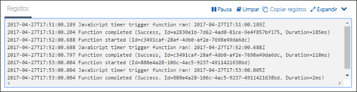

# Criar uma função no Azure que é acionada por um temporizadorCreate a function in Azure that is triggered by a timer

Saiba como toouse das funções do Azure toocreate uma função que executa com base numa agenda que definir.Learn how toouse Azure Functions toocreate a function that runs based a schedule that you define.

## Pré-requisitosPrerequisites

toocomplete neste tutorial:toocomplete this tutorial:

+ Se não tiver uma subscrição do Azure, crie uma [conta gratuita](https://azure.microsoft.com/free/?WT.mc_id=A261C142F) antes de começar.If you don't have an Azure subscription, create a [free account](https://azure.microsoft.com/free/?WT.mc_id=A261C142F) before you begin.

[!INCLUDE [functions-portal-favorite-function-apps](../../includes/functions-portal-favorite-function-apps.md)]

## Criar uma aplicação de Funções do AzureCreate an Azure Function app

[!INCLUDE [Create function app Azure portal](../../includes/functions-create-function-app-portal.md)]

Em seguida, crie uma função na nova aplicação de função Olá.Next, you create a function in hello new function app.

## Criar uma função acionada por temporizadorCreate a timer triggered function

1. Expanda a sua aplicação de função e clique em Olá  **+**  no botão seguinte demasiado**funções**.Expand your function app and click hello **+** button next too**Functions**. Se esta for a primeira função de Olá na sua aplicação de função, selecione **função personalizada**.If this is hello first function in your function app, select **Custom function**. Esta ação apresenta o conjunto completo de Olá dos modelos de função.This displays hello complete set of function templates.

    

2. Selecione Olá **TimerTrigger** modelo para o idioma pretendido.Select hello **TimerTrigger** template for your desired language. Em seguida, utilize definições de Olá conforme especificado na tabela de Olá:Then use hello settings as specified in hello table:

    

    | DefiniçãoSetting | Valor sugeridoSuggested value | DescriçãoDescription |
    |---|---|---|
    | **Dar um nome à função****Name your function** | TimerTriggerCSharp1TimerTriggerCSharp1 | Define o nome de Olá da sua função de temporizador acionado.Defines hello name of your timer triggered function. |
    | **[Agenda](http://en.wikipedia.org/wiki/Cron#CRON_expression)****[Schedule](http://en.wikipedia.org/wiki/Cron#CRON_expression)** | 0 \*/1 \* \* \* \*0 \*/1 \* \* \* \* | Um campo seis [expressão CRON](http://en.wikipedia.org/wiki/Cron#CRON_expression) que agendas toorun sua função de cada minuto.A six field [CRON expression](http://en.wikipedia.org/wiki/Cron#CRON_expression) that schedules your function toorun every minute. |

2. Clique em **Criar**.Click **Create**. É criada uma função na linguagem que escolheu e que é executada todos os minutos.A function is created in your chosen language that runs every minute.

3. Certifique-se a execução através da visualização de informações de rastreio escritas toohello registos.Verify execution by viewing trace information written toohello logs.

    

Agora, pode alterar a agenda da função de Olá para que seja executado com menos frequência, por exemplo, uma vez a cada hora.Now, you can change hello function's schedule so that it runs less often, such as once every hour. 

## Atualizar o agendamento de temporizador OláUpdate hello timer schedule

1. Expanda a função e clique em **Integrar**.Expand your function and click **Integrate**. Este é onde definir entrada e saída enlaces para a sua função e também definir agenda Olá.This is where you define input and output bindings for your function and also set hello schedule. 

2. Introduza um valor para **Agenda** novo de `0 0 */1 * * *` e clique em **Guardar**.Enter a new **Schedule** value of `0 0 */1 * * *`, and then click **Save**.  

Tem agora uma função que é executada uma vez por hora.You now have a function that runs once every hour. 

## Limpar recursosClean up resources

[!INCLUDE [Next steps note](../../includes/functions-quickstart-cleanup.md)]

## Passos seguintesNext steps

Criou uma função que é executada com base numa agenda.You have created a function that runs based on a schedule.

[!INCLUDE [Next steps note](../../includes/functions-quickstart-next-steps.md)]

Para obter mais informações sobre os acionadores de temporizadores, veja [Schedule code execution with Azure Functions](functions-bindings-timer.md) (Agendar a execução de código com as Funções do Azure).For more information timer triggers, see [Schedule code execution with Azure Functions](functions-bindings-timer.md).