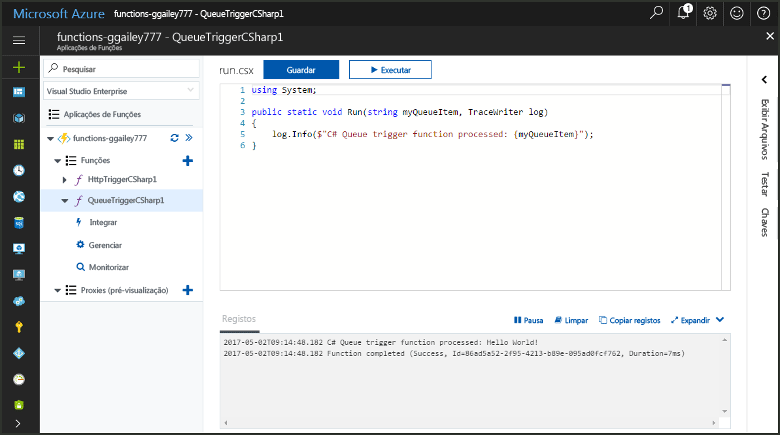
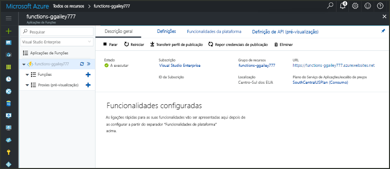
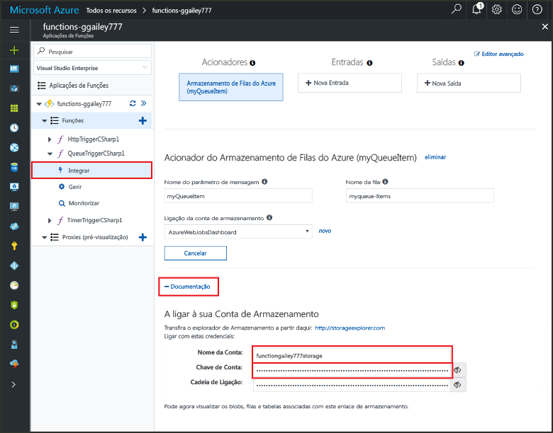
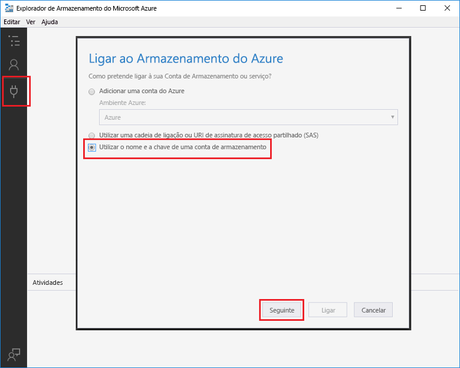
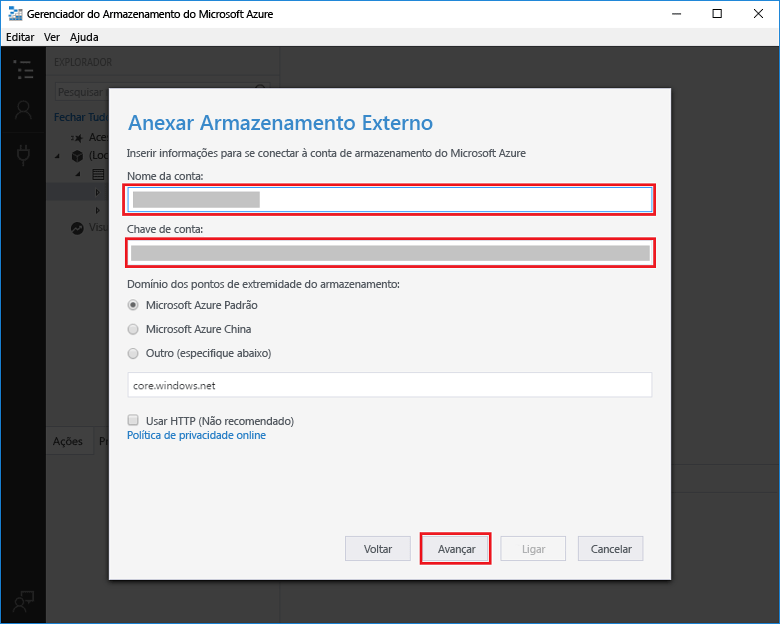
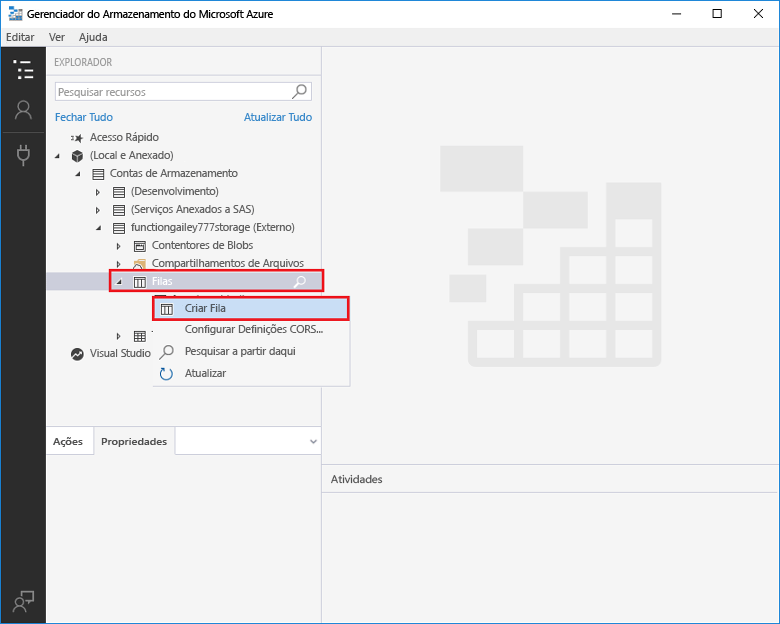
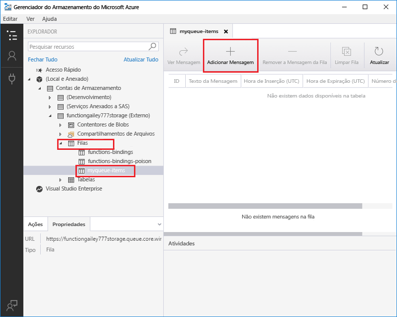
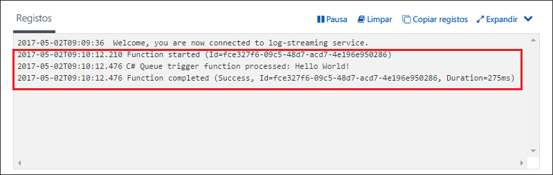

# Criar uma função acionada pelo Armazenamento de filas do Azure

Saiba como toocreate uma função acionada quando as mensagens são submetidos tooan fila de armazenamento do Azure.

## Pré-requisitos

- Transfira e instale Olá [Explorador de armazenamento do Microsoft Azure](http://storageexplorer.com/).

- Uma subscrição do Azure. Se não tiver uma, crie uma [conta gratuita](https://azure.microsoft.com/free/?WT.mc_id=A261C142F) antes de começar.

[!INCLUDE [functions-portal-favorite-function-apps](../../includes/functions-portal-favorite-function-apps.md)]

## Criar uma aplicação de Funções do Azure

[!INCLUDE [Create function app Azure portal](../../includes/functions-create-function-app-portal.md)]

Em seguida, crie uma função na nova aplicação de função Olá.

## Criar uma função acionada por Fila

1. Expanda a sua aplicação de função e clique em Olá  **+**  no botão seguinte demasiado**funções**. Se esta for a primeira função de Olá na sua aplicação de função, selecione **função personalizada**. Esta ação apresenta o conjunto completo de Olá dos modelos de função.

    

2. Selecione Olá **QueueTrigger** modelo para o idioma pretendido e utilize as definições de Olá conforme especificado na tabela de Olá.

    
    
    | Definição | Valor sugerido | Descrição |
    |---|---|---|
    | **Nome da fila**   | myqueue-items    | Nome do Olá fila tooconnect tooin sua conta do Storage. |
    | **Ligação da conta de armazenamento** | AzureWebJobStorage | Pode utilizar a ligação de conta de armazenamento de Olá já a ser utilizada pela sua aplicação de função ou crie um novo.  |
    | **Dar um nome à função** | Exclusivo na aplicação Function App | O nome desta função acionada por fila. |

3. Clique em **criar** toocreate sua função.

Em seguida, ligar a conta de armazenamento do Azure tooyour e criar Olá **myqueue itens** fila de armazenamento.

## Criar fila Olá

1. Na sua função, clique em **Integrar**, expanda **Documentação** e copie **Nome da conta** e **Chave da conta**. Pode utilizar estas credenciais tooconnect toohello armazenamento conta. Se já tiver estabelecido ligação a conta do storage, ignore toostep 4.

    v

1. Executar Olá [Explorador de armazenamento do Microsoft Azure](http://storageexplorer.com/) ferramenta, clique em Olá ligar ícone Olá esquerda, escolha **utilizar um nome de conta de armazenamento e a chave**e clique em **seguinte**.

    

1. Introduza Olá **nome da conta** e **chave da conta** do passo 1, clique em **seguinte** e, em seguida, **Connect**.

    

1. Expanda a conta de armazenamento de Olá anexado, com o botão direito **filas**, clique em **criar fila**, tipo `myqueue-items`, e, em seguida, prima enter.

    

Agora que tem uma fila de armazenamento, pode testar a função Olá adicionando uma fila de toohello de mensagens.

## Testar a função de Olá

1. No portal do Azure Olá, procurar tooyour função expanda Olá **registos** em Olá parte inferior da página Olá e certifique-se de que registo de transmissão em fluxo não está em pausa.

1. No Storage Explorer, expanda a conta de armazenamento, **Filas** e **myqueue-items** e clique em **Adicionar mensagem**.

    

1. Escreva a sua mensagem “Hello World” em **Texto da mensagem** e clique em **OK**.

1. Aguarde alguns segundos, em seguida, voltar atrás tooyour registos de funções e certifique-se de que essa nova mensagem de Olá lidas a partir do fila Olá.

    

1. No Explorador de armazenamento, clique **atualizar** e verifique essa mensagem de saudação foi processada e já não se encontra na fila de Olá.

## Limpar recursos

[!INCLUDE [Next steps note](../../includes/functions-quickstart-cleanup.md)]

## Passos seguintes

Foi criada com uma função que é executado quando uma mensagem é adicionada tooa fila de armazenamento.

[!INCLUDE [Next steps note](../../includes/functions-quickstart-next-steps.md)]

Para obter mais informações sobre os acionadores do Armazenamento de filas, veja [Azure Functions Storage queue bindings](functions-bindings-storage-queue.md) (Enlaces da fila de Armazenamento das Funções do Azure).