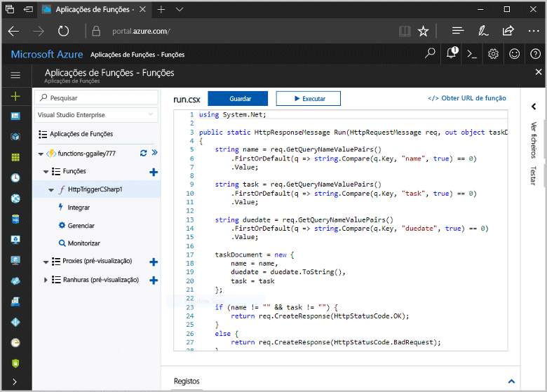
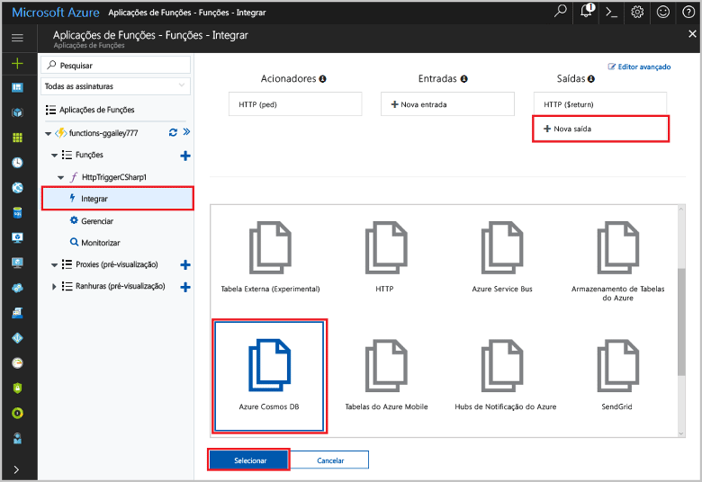
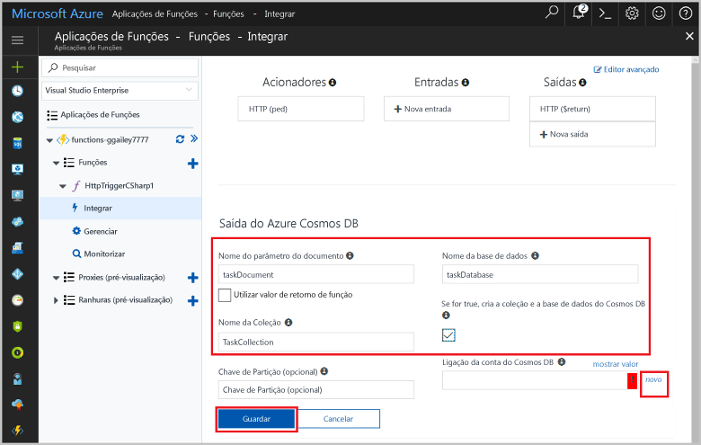
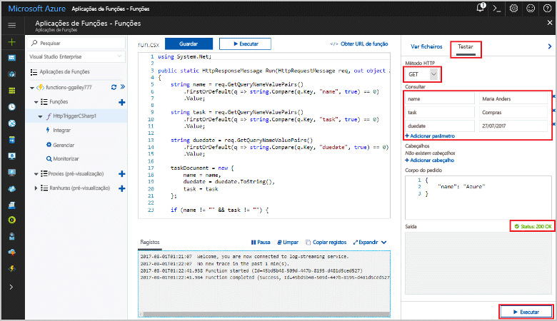
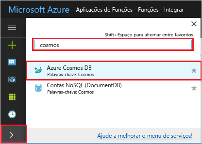
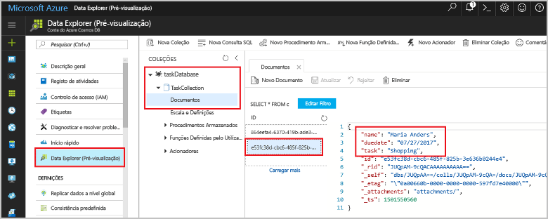

# <a name="store-unstructured-data-using-azure-functions-and-cosmos-db"></a><span data-ttu-id="89f97-104">Armazenar dados não estruturados usando as funções do Azure e o Cosmos DB</span><span class="sxs-lookup"><span data-stu-id="89f97-104">Store unstructured data using Azure Functions and Cosmos DB</span></span>

<span data-ttu-id="89f97-105">[BD do Azure do Cosmos](https://azure.microsoft.com/services/cosmos-db/) é uma excelente forma toostore não estruturado e dados JSON.</span><span class="sxs-lookup"><span data-stu-id="89f97-105">[Azure Cosmos DB](https://azure.microsoft.com/services/cosmos-db/) is a great way toostore unstructured and JSON data.</span></span> <span data-ttu-id="89f97-106">Combinado com funções do Azure, o Cosmos DB torna o armazenamento de dados rápido e fácil, sendo necessário menos códigos para armazenar dados numa base de dados relacional.</span><span class="sxs-lookup"><span data-stu-id="89f97-106">Combined with Azure Functions, Cosmos DB makes storing data quick and easy with much less code than required for storing data in a relational database.</span></span>

<span data-ttu-id="89f97-107">As funções do Azure, enlaces de entrada e de saída fornecem uma forma declarativa tooconnect tooexternal serviço de dados da sua função.</span><span class="sxs-lookup"><span data-stu-id="89f97-107">In Azure Functions, input and output bindings provide a declarative way tooconnect tooexternal service data from your function.</span></span> <span data-ttu-id="89f97-108">Neste tópico, saiba como tooupdate um existente c# funcionar tooadd um enlace de saída que armazena dados não estruturados um documento de BD do Cosmos.</span><span class="sxs-lookup"><span data-stu-id="89f97-108">In this topic, learn how tooupdate an existing C# function tooadd an output binding that stores unstructured data in a Cosmos DB document.</span></span> 



## <a name="prerequisites"></a><span data-ttu-id="89f97-110">Pré-requisitos</span><span class="sxs-lookup"><span data-stu-id="89f97-110">Prerequisites</span></span>

<span data-ttu-id="89f97-111">toocomplete neste tutorial:</span><span class="sxs-lookup"><span data-stu-id="89f97-111">toocomplete this tutorial:</span></span>

[!INCLUDE [Previous quickstart note](../../includes/functions-quickstart-previous-topics.md)]

## <a name="add-an-output-binding"></a><span data-ttu-id="89f97-112">Adicionar um enlace de saída</span><span class="sxs-lookup"><span data-stu-id="89f97-112">Add an output binding</span></span>

1. <span data-ttu-id="89f97-113">Expanda a aplicação Function App e a função.</span><span class="sxs-lookup"><span data-stu-id="89f97-113">Expand both your function app and your function.</span></span>

1. <span data-ttu-id="89f97-114">Selecione **integrar** e **+ nova saída**, que é em Olá principais lado direito da página Olá.</span><span class="sxs-lookup"><span data-stu-id="89f97-114">Select **Integrate** and **+ New Output**, which is at hello top right of hello page.</span></span> <span data-ttu-id="89f97-115">Escolha **Azure Cosmos DB** e clique em **Selecionar**.</span><span class="sxs-lookup"><span data-stu-id="89f97-115">Choose **Azure Cosmos DB**, and click **Select**.</span></span>

    

3. <span data-ttu-id="89f97-117">Olá utilize **saída de base de dados do Azure Cosmos** definições conforme especificado na tabela de Olá:</span><span class="sxs-lookup"><span data-stu-id="89f97-117">Use hello **Azure Cosmos DB output** settings as specified in hello table:</span></span> 

    

    | <span data-ttu-id="89f97-119">Definição</span><span class="sxs-lookup"><span data-stu-id="89f97-119">Setting</span></span>      | <span data-ttu-id="89f97-120">Valor sugerido</span><span class="sxs-lookup"><span data-stu-id="89f97-120">Suggested value</span></span>  | <span data-ttu-id="89f97-121">Descrição</span><span class="sxs-lookup"><span data-stu-id="89f97-121">Description</span></span>                                |
    | ------------ | ---------------- | ------------------------------------------ |
    | <span data-ttu-id="89f97-122">**Nome do parâmetro do documento**</span><span class="sxs-lookup"><span data-stu-id="89f97-122">**Document parameter name**</span></span> | <span data-ttu-id="89f97-123">taskDocument</span><span class="sxs-lookup"><span data-stu-id="89f97-123">taskDocument</span></span> | <span data-ttu-id="89f97-124">Nome que referencia o objeto de base de dados do Cosmos toohello no código.</span><span class="sxs-lookup"><span data-stu-id="89f97-124">Name that refers toohello Cosmos DB object in code.</span></span> |
    | <span data-ttu-id="89f97-125">**Nome da base de dados**</span><span class="sxs-lookup"><span data-stu-id="89f97-125">**Database name**</span></span> | <span data-ttu-id="89f97-126">taskDatabase</span><span class="sxs-lookup"><span data-stu-id="89f97-126">taskDatabase</span></span> | <span data-ttu-id="89f97-127">Nome de documentos de toosave de base de dados.</span><span class="sxs-lookup"><span data-stu-id="89f97-127">Name of database toosave documents.</span></span> |
    | <span data-ttu-id="89f97-128">**Nome da coleção**</span><span class="sxs-lookup"><span data-stu-id="89f97-128">**Collection name**</span></span> | <span data-ttu-id="89f97-129">TaskCollection</span><span class="sxs-lookup"><span data-stu-id="89f97-129">TaskCollection</span></span> | <span data-ttu-id="89f97-130">Nome da coleção de bases de dados do Cosmos DB.</span><span class="sxs-lookup"><span data-stu-id="89f97-130">Name of collection of Cosmos DB databases.</span></span> |
    | <span data-ttu-id="89f97-131">**Se for VERDADEIRO, cria a base de dados do Olá Cosmos base de dados e coleção**</span><span class="sxs-lookup"><span data-stu-id="89f97-131">**If true, creates hello Cosmos DB database and collection**</span></span> | <span data-ttu-id="89f97-132">Assinalado</span><span class="sxs-lookup"><span data-stu-id="89f97-132">Checked</span></span> | <span data-ttu-id="89f97-133">coleção de Olá não já existe, pelo que criá-la.</span><span class="sxs-lookup"><span data-stu-id="89f97-133">hello collection doesn't already exist, so create it.</span></span> |

4. <span data-ttu-id="89f97-134">Selecione **novo** toohello seguinte **ligação de documento do Cosmos DB** etiqueta e selecione **+ criar nova**.</span><span class="sxs-lookup"><span data-stu-id="89f97-134">Select **New** next toohello **Cosmos DB document connection** label, and select **+ Create new**.</span></span> 

5. <span data-ttu-id="89f97-135">Olá utilize **nova conta** definições conforme especificado na tabela de Olá:</span><span class="sxs-lookup"><span data-stu-id="89f97-135">Use hello **New account** settings as specified in hello table:</span></span> 

    

    | <span data-ttu-id="89f97-137">Definição</span><span class="sxs-lookup"><span data-stu-id="89f97-137">Setting</span></span>      | <span data-ttu-id="89f97-138">Valor sugerido</span><span class="sxs-lookup"><span data-stu-id="89f97-138">Suggested value</span></span>  | <span data-ttu-id="89f97-139">Descrição</span><span class="sxs-lookup"><span data-stu-id="89f97-139">Description</span></span>                                |
    | ------------ | ---------------- | ------------------------------------------ |
    | <span data-ttu-id="89f97-140">**ID**</span><span class="sxs-lookup"><span data-stu-id="89f97-140">**ID**</span></span> | <span data-ttu-id="89f97-141">Nome da base de dados</span><span class="sxs-lookup"><span data-stu-id="89f97-141">Name of database</span></span> | <span data-ttu-id="89f97-142">ID exclusivo para a base de dados do Olá Cosmos DB</span><span class="sxs-lookup"><span data-stu-id="89f97-142">Unique ID for hello Cosmos DB database</span></span>  |
    | <span data-ttu-id="89f97-143">**API**</span><span class="sxs-lookup"><span data-stu-id="89f97-143">**API**</span></span> | <span data-ttu-id="89f97-144">SQL (DocumentDB)</span><span class="sxs-lookup"><span data-stu-id="89f97-144">SQL (DocumentDB)</span></span> | <span data-ttu-id="89f97-145">Selecione a API de base de dados de documento Olá.</span><span class="sxs-lookup"><span data-stu-id="89f97-145">Select hello document database API.</span></span>  |
    | <span data-ttu-id="89f97-146">**Subscrição**</span><span class="sxs-lookup"><span data-stu-id="89f97-146">**Subscription**</span></span> | <span data-ttu-id="89f97-147">Subscrição do Azure</span><span class="sxs-lookup"><span data-stu-id="89f97-147">Azure Subscription</span></span> | <span data-ttu-id="89f97-148">Subscrição do Azure</span><span class="sxs-lookup"><span data-stu-id="89f97-148">Azure Subscription</span></span>  |
    | <span data-ttu-id="89f97-149">**Grupo de Recursos**</span><span class="sxs-lookup"><span data-stu-id="89f97-149">**Resource Group**</span></span> | <span data-ttu-id="89f97-150">myResourceGroup</span><span class="sxs-lookup"><span data-stu-id="89f97-150">myResourceGroup</span></span> |  <span data-ttu-id="89f97-151">Utilize Olá grupo de recursos existente que contenha a aplicação de função.</span><span class="sxs-lookup"><span data-stu-id="89f97-151">Use hello existing resource group that contains your function app.</span></span> |
    | <span data-ttu-id="89f97-152">**Localização**</span><span class="sxs-lookup"><span data-stu-id="89f97-152">**Location**</span></span>  | <span data-ttu-id="89f97-153">WestEurope</span><span class="sxs-lookup"><span data-stu-id="89f97-153">WestEurope</span></span> | <span data-ttu-id="89f97-154">Selecione uma localização perto tooeither a sua aplicação de função ou tooother aplicações que utilizam Olá documentos armazenados.</span><span class="sxs-lookup"><span data-stu-id="89f97-154">Select a location near tooeither your function app or tooother apps that use hello stored documents.</span></span>  |

6. <span data-ttu-id="89f97-155">Clique em **OK** base de dados do toocreate Olá.</span><span class="sxs-lookup"><span data-stu-id="89f97-155">Click **OK** toocreate hello database.</span></span> <span data-ttu-id="89f97-156">Pode demorar alguns minutos toocreate Olá base de dados.</span><span class="sxs-lookup"><span data-stu-id="89f97-156">It may take a few minutes toocreate hello database.</span></span> <span data-ttu-id="89f97-157">Depois de criar a base de dados de Olá, cadeia de ligação de base de dados de Olá é armazenada como uma definição de aplicação de função.</span><span class="sxs-lookup"><span data-stu-id="89f97-157">After hello database is created, hello database connection string is stored as a function app setting.</span></span> <span data-ttu-id="89f97-158">nome de Olá desta definição de aplicação é inserido no **ligação de conta de base de dados do Cosmos**.</span><span class="sxs-lookup"><span data-stu-id="89f97-158">hello name of this app setting is inserted in **Cosmos DB account connection**.</span></span> 
 
8. <span data-ttu-id="89f97-159">Depois de definir a cadeia de ligação de Olá, selecione **guardar** enlace de Olá toocreate.</span><span class="sxs-lookup"><span data-stu-id="89f97-159">After hello connection string is set, select **Save** toocreate hello binding.</span></span>

## <a name="update-hello-function-code"></a><span data-ttu-id="89f97-160">Atualizar o código de função Olá</span><span class="sxs-lookup"><span data-stu-id="89f97-160">Update hello function code</span></span>

<span data-ttu-id="89f97-161">Substitua Olá c# função código existente pelo Olá seguinte código:</span><span class="sxs-lookup"><span data-stu-id="89f97-161">Replace hello existing C# function code with hello following code:</span></span>

```csharp
using System.Net;

public static HttpResponseMessage Run(HttpRequestMessage req, out object taskDocument, TraceWriter log)
{
    string name = req.GetQueryNameValuePairs()
        .FirstOrDefault(q => string.Compare(q.Key, "name", true) == 0)
        .Value;

    string task = req.GetQueryNameValuePairs()
        .FirstOrDefault(q => string.Compare(q.Key, "task", true) == 0)
        .Value;

    string duedate = req.GetQueryNameValuePairs()
        .FirstOrDefault(q => string.Compare(q.Key, "duedate", true) == 0)
        .Value;

    taskDocument = new {
        name = name,
        duedate = duedate.ToString(),
        task = task
    };

    if (name != "" && task != "") {
        return req.CreateResponse(HttpStatusCode.OK);
    }
    else {
        return req.CreateResponse(HttpStatusCode.BadRequest);
    }
}

```
<span data-ttu-id="89f97-162">Este exemplo de código lê Olá pedido HTTP cadeias de consulta e atribui-las toofields no Olá `taskDocument` objeto.</span><span class="sxs-lookup"><span data-stu-id="89f97-162">This code sample reads hello HTTP Request query strings and assigns them toofields in hello `taskDocument` object.</span></span> <span data-ttu-id="89f97-163">Olá `taskDocument` enlace envia dados de objeto Olá deste toobe de parâmetro de enlace armazenado na base de dados de documento vinculada de Olá.</span><span class="sxs-lookup"><span data-stu-id="89f97-163">hello `taskDocument` binding sends hello object data from this binding parameter toobe stored in hello bound document database.</span></span> <span data-ttu-id="89f97-164">base de dados de Olá criada Olá pela primeira vez Olá função é executada.</span><span class="sxs-lookup"><span data-stu-id="89f97-164">hello database is created hello first time hello function runs.</span></span>

## <a name="test-hello-function-and-database"></a><span data-ttu-id="89f97-165">Função de Olá de teste e a base de dados</span><span class="sxs-lookup"><span data-stu-id="89f97-165">Test hello function and database</span></span>

1. <span data-ttu-id="89f97-166">Expanda a janela de direito de Olá e selecione **teste**.</span><span class="sxs-lookup"><span data-stu-id="89f97-166">Expand hello right window and select **Test**.</span></span> <span data-ttu-id="89f97-167">Em **consulta**, clique em **+ Adicionar parâmetro** e adicione Olá seguinte cadeia de consulta de toohello parâmetros:</span><span class="sxs-lookup"><span data-stu-id="89f97-167">Under **Query**, click **+ Add parameter** and add hello following parameters toohello query string:</span></span>

    + `name`
    + `task`
    + `duedate`

2. <span data-ttu-id="89f97-168">Clique em **Executar** e certifique-se de que é devolvido um estado 200.</span><span class="sxs-lookup"><span data-stu-id="89f97-168">Click **Run** and verify that a 200 status is returned.</span></span>

    

1. <span data-ttu-id="89f97-170">No Olá à esquerda do lado do Olá portal do Azure, expanda a barra de ícone de Olá, tipo `cosmos` na Olá procure campo e selecione **Azure Cosmos DB**.</span><span class="sxs-lookup"><span data-stu-id="89f97-170">On hello left side of hello Azure portal, expand hello icon bar, type `cosmos` in hello search field, and select **Azure Cosmos DB**.</span></span>

    

2. <span data-ttu-id="89f97-172">Base de dados de Olá selecione que criou, em seguida, selecione **Explorador de dados**.</span><span class="sxs-lookup"><span data-stu-id="89f97-172">Select hello database you created, then select **Data Explorer**.</span></span> <span data-ttu-id="89f97-173">Expanda Olá **coleções** nós, selecione o novo documento de Olá e confirme esse documento Olá contém os valores de cadeia de consulta, juntamente com alguns metadados adicionais.</span><span class="sxs-lookup"><span data-stu-id="89f97-173">Expand hello **Collections** nodes, select hello new document, and confirm that hello document contains your query string values, along with some additional metadata.</span></span> 

    

<span data-ttu-id="89f97-175">Adicionou com êxito um acionador HTTP do enlace tooyour que armazena dados não estruturados numa base de dados de base de dados do Cosmos.</span><span class="sxs-lookup"><span data-stu-id="89f97-175">You have successfully added a binding tooyour HTTP trigger that stores unstructured data in a Cosmos DB database.</span></span>

[!INCLUDE [Clean-up section](../../includes/clean-up-section-portal.md)]

## <a name="next-steps"></a><span data-ttu-id="89f97-176">Passos seguintes</span><span class="sxs-lookup"><span data-stu-id="89f97-176">Next steps</span></span>

[!INCLUDE [functions-quickstart-next-steps](../../includes/functions-quickstart-next-steps.md)]

<span data-ttu-id="89f97-177">Para obter mais informações sobre a base de dados do enlace tooa Cosmos DB, consulte [enlaces de base de dados do Azure funções Cosmos](functions-bindings-documentdb.md).</span><span class="sxs-lookup"><span data-stu-id="89f97-177">For more information about binding tooa Cosmos DB database, see [Azure Functions Cosmos DB bindings](functions-bindings-documentdb.md).</span></span>
