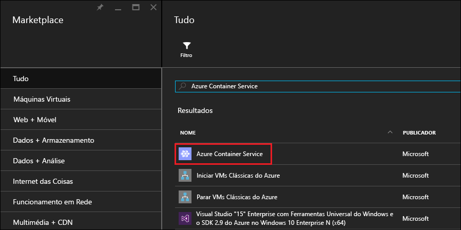
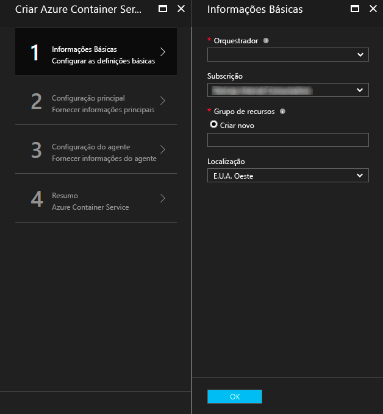
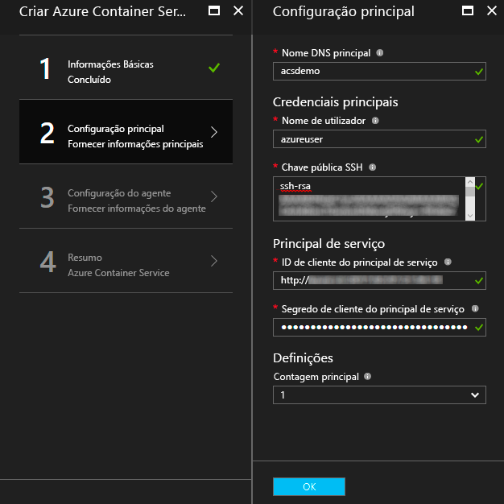
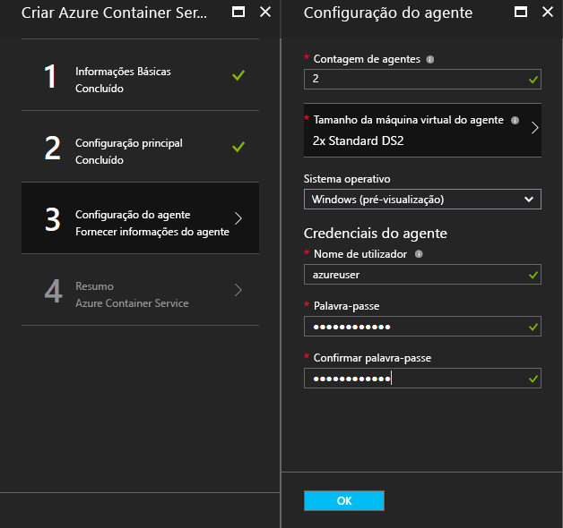
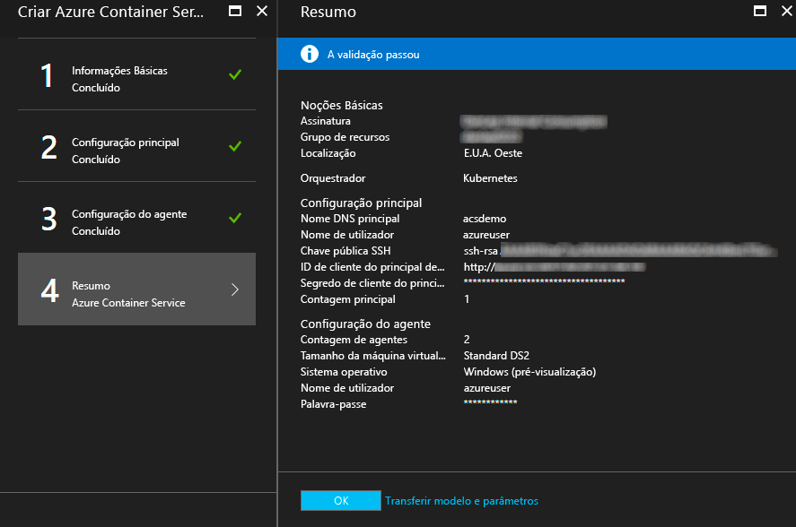
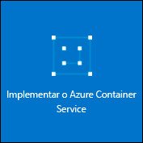

# <a name="deploy-a-docker-container-hosting-solution-using-hello-azure-portal"></a><span data-ttu-id="a58bf-104">Implementar um contentor de Docker alojamento solução utilizando Olá portal do Azure</span><span class="sxs-lookup"><span data-stu-id="a58bf-104">Deploy a Docker container hosting solution using hello Azure portal</span></span>


<span data-ttu-id="a58bf-105">O Serviço de Contentor do Azure fornece uma implementação rápida de soluções de orquestração e de clustering populares e de open source do contentor.</span><span class="sxs-lookup"><span data-stu-id="a58bf-105">Azure Container Service provides rapid deployment of popular open-source container clustering and orchestration solutions.</span></span> <span data-ttu-id="a58bf-106">Este documento explica como implementar um cluster do serviço de contentor Azure utilizando Olá portal do Azure ou um modelo de início rápido do Azure Resource Manager.</span><span class="sxs-lookup"><span data-stu-id="a58bf-106">This document walks you through deploying an Azure Container Service cluster by using hello Azure portal or an Azure Resource Manager quickstart template.</span></span> 

<span data-ttu-id="a58bf-107">Também pode implementar um cluster do serviço de contentor Azure utilizando Olá [Azure CLI 2.0](container-service-create-acs-cluster-cli.md) ou Olá APIs de serviço de contentor do Azure.</span><span class="sxs-lookup"><span data-stu-id="a58bf-107">You can also deploy an Azure Container Service cluster by using hello [Azure CLI 2.0](container-service-create-acs-cluster-cli.md) or hello Azure Container Service APIs.</span></span>

<span data-ttu-id="a58bf-108">Para obter informações de contexto, veja [Introdução ao Azure Container Service](../container-service-intro.md).</span><span class="sxs-lookup"><span data-stu-id="a58bf-108">For background, see [Azure Container Service introduction](../container-service-intro.md).</span></span>


## <a name="prerequisites"></a><span data-ttu-id="a58bf-109">Pré-requisitos</span><span class="sxs-lookup"><span data-stu-id="a58bf-109">Prerequisites</span></span>

* <span data-ttu-id="a58bf-110">**Subscrição do Azure**: se não tiver uma, inscreva-se numa [avaliação gratuita](http://azure.microsoft.com/pricing/free-trial/?WT.mc_id=AA4C1C935).</span><span class="sxs-lookup"><span data-stu-id="a58bf-110">**Azure subscription**: If you don't have one, sign up for a [free trial](http://azure.microsoft.com/pricing/free-trial/?WT.mc_id=AA4C1C935).</span></span> <span data-ttu-id="a58bf-111">Para um cluster maior, considere uma subscrição pay-as-you-go ou outras opções de compra.</span><span class="sxs-lookup"><span data-stu-id="a58bf-111">For a larger cluster, consider a pay-as-you go subscription or other purchase options.</span></span>

    > [!NOTE]
    > <span data-ttu-id="a58bf-112">A utilização da subscrição do Azure e [quotas de recursos](../../azure-subscription-service-limits.md), tais como quotas de núcleos, pode limitar tamanho de Olá do cluster de Olá implementar.</span><span class="sxs-lookup"><span data-stu-id="a58bf-112">Your Azure subscription usage and [resource quotas](../../azure-subscription-service-limits.md), such as cores quotas, can limit hello size of hello cluster you deploy.</span></span> <span data-ttu-id="a58bf-113">toorequest um aumento de quota, abra uma [pedido de suporte ao cliente online](../../azure-supportability/how-to-create-azure-support-request.md) , sem encargos.</span><span class="sxs-lookup"><span data-stu-id="a58bf-113">toorequest a quota increase, open an [online customer support request](../../azure-supportability/how-to-create-azure-support-request.md) at no charge.</span></span>
    >

* <span data-ttu-id="a58bf-114">**Chave pública SSH RSA**: ao implementar através do portal de Olá ou um dos modelos de início rápido do Azure Olá, necessita de chave pública do tooprovide Olá para autenticação nas máquinas virtuais do serviço de contentor do Azure.</span><span class="sxs-lookup"><span data-stu-id="a58bf-114">**SSH RSA public key**: When deploying through hello portal or one of hello Azure quickstart templates, you need tooprovide hello public key for authentication against Azure Container Service virtual machines.</span></span> <span data-ttu-id="a58bf-115">as chaves RSA de Secure Shell (SSH) de toocreate, consulte Olá [OS X e Linux](../../virtual-machines/linux/mac-create-ssh-keys.md) ou [Windows](../../virtual-machines/linux/ssh-from-windows.md) orientações.</span><span class="sxs-lookup"><span data-stu-id="a58bf-115">toocreate Secure Shell (SSH) RSA keys, see hello [OS X and Linux](../../virtual-machines/linux/mac-create-ssh-keys.md) or [Windows](../../virtual-machines/linux/ssh-from-windows.md) guidance.</span></span> 

* <span data-ttu-id="a58bf-116">**ID de principal de cliente e o segredo do serviço** (apenas Kubernetes): para obter mais informações e orientações toocreate um principal de serviço do Azure Active Directory, consulte [sobre principal de serviço Olá para um cluster de Kubernetes](../kubernetes/container-service-kubernetes-service-principal.md).</span><span class="sxs-lookup"><span data-stu-id="a58bf-116">**Service principal client ID and secret** (Kubernetes only): For more information and guidance toocreate an Azure Active Directory service principal, see [About hello service principal for a Kubernetes cluster](../kubernetes/container-service-kubernetes-service-principal.md).</span></span>


## <a name="create-a-cluster-by-using-hello-azure-portal"></a><span data-ttu-id="a58bf-117">Criar um cluster utilizando Olá portal do Azure</span><span class="sxs-lookup"><span data-stu-id="a58bf-117">Create a cluster by using hello Azure portal</span></span>
1. <span data-ttu-id="a58bf-118">Início de sessão toohello portal do Azure, selecione **novo**e pesquisa Olá Azure Marketplace para **serviço de contentor Azure**.</span><span class="sxs-lookup"><span data-stu-id="a58bf-118">Sign in toohello Azure portal, select **New**, and search hello Azure Marketplace for **Azure Container Service**.</span></span>

      <br />

2. <span data-ttu-id="a58bf-120">Clique em **Azure Container Service** e clique em **Criar**.</span><span class="sxs-lookup"><span data-stu-id="a58bf-120">Click **Azure Container Service**, and click **Create**.</span></span>

3. <span data-ttu-id="a58bf-121">No Olá **Noções básicas** painel, introduza Olá seguintes informações:</span><span class="sxs-lookup"><span data-stu-id="a58bf-121">On hello **Basics** blade, enter hello following information:</span></span>

    * <span data-ttu-id="a58bf-122">**Orchestrator**: selecione uma das Olá contentor orchestrators toodeploy no cluster de Olá.</span><span class="sxs-lookup"><span data-stu-id="a58bf-122">**Orchestrator**: Select one of hello container orchestrators toodeploy on hello cluster.</span></span>
        * <span data-ttu-id="a58bf-123">**DC/OS**: implementa um cluster DC/OS.</span><span class="sxs-lookup"><span data-stu-id="a58bf-123">**DC/OS**: Deploys a DC/OS cluster.</span></span>
        * <span data-ttu-id="a58bf-124">**Swarm**: implementa um cluster Docker Swarm.</span><span class="sxs-lookup"><span data-stu-id="a58bf-124">**Swarm**: Deploys a Docker Swarm cluster.</span></span>
        * <span data-ttu-id="a58bf-125">**Kubernetes**: implementa um cluster de Kubernetes.</span><span class="sxs-lookup"><span data-stu-id="a58bf-125">**Kubernetes**: Deploys a Kubernetes cluster.</span></span>
    * <span data-ttu-id="a58bf-126">**Subscrição**: selecione uma subscrição do Azure.</span><span class="sxs-lookup"><span data-stu-id="a58bf-126">**Subscription**: Select an Azure subscription.</span></span>
    * <span data-ttu-id="a58bf-127">**Grupo de recursos**: introduza o nome Olá de um novo grupo de recursos para a implementação de Olá.</span><span class="sxs-lookup"><span data-stu-id="a58bf-127">**Resource group**: Enter hello name of a new resource group for hello deployment.</span></span>
    * <span data-ttu-id="a58bf-128">**Localização**: selecione uma região do Azure para a implementação do serviço de contentor Azure Olá.</span><span class="sxs-lookup"><span data-stu-id="a58bf-128">**Location**: Select an Azure region for hello Azure Container Service deployment.</span></span> <span data-ttu-id="a58bf-129">Para obter informações de disponibilidade, veja [Produtos disponíveis por região](https://azure.microsoft.com/regions/services/).</span><span class="sxs-lookup"><span data-stu-id="a58bf-129">For availability, check [Products available by region](https://azure.microsoft.com/regions/services/).</span></span>
    
      <br />
    
    <span data-ttu-id="a58bf-131">Clique em **OK** quando estiver pronto tooproceed.</span><span class="sxs-lookup"><span data-stu-id="a58bf-131">Click **OK** when you're ready tooproceed.</span></span>

4. <span data-ttu-id="a58bf-132">No Olá **mestra configuração** painel, introduza Olá seguintes definições para o nó principal do Linux Olá ou nós num cluster de Olá (algumas definições são específicas tooeach orchestrator):</span><span class="sxs-lookup"><span data-stu-id="a58bf-132">On hello **Master configuration** blade, enter hello following settings for hello Linux master node or nodes in hello cluster (some settings are specific tooeach orchestrator):</span></span>

    * <span data-ttu-id="a58bf-133">**Nome DNS do mestre**: Olá prefix utilizado toocreate um único totalmente qualificado (FQDN) do nome de domínio para mestre Olá.</span><span class="sxs-lookup"><span data-stu-id="a58bf-133">**Master DNS name**: hello prefix used toocreate a unique fully qualified domain name (FQDN) for hello master.</span></span> <span data-ttu-id="a58bf-134">Olá FQDN principal tem o formato de Olá *prefixo*mgmt.*localização*. cloudapp.azure.com.</span><span class="sxs-lookup"><span data-stu-id="a58bf-134">hello master FQDN is of hello form *prefix*mgmt.*location*.cloudapp.azure.com.</span></span>
    * <span data-ttu-id="a58bf-135">**Nome de utilizador**: nome de utilizador de Olá para uma conta em cada uma das máquinas virtuais do Linux Olá num cluster de Olá.</span><span class="sxs-lookup"><span data-stu-id="a58bf-135">**User name**: hello user name for an account on each of hello Linux virtual machines in hello cluster.</span></span>
    * <span data-ttu-id="a58bf-136">**Chave pública SSH RSA**: Adicionar Olá toobe chave pública utilizada para autenticação nas máquinas virtuais Linux Olá.</span><span class="sxs-lookup"><span data-stu-id="a58bf-136">**SSH RSA public key**: Add hello public key toobe used for authentication against hello Linux virtual machines.</span></span> <span data-ttu-id="a58bf-137">É importante que esta chave contém não quebras de linha e inclui Olá `ssh-rsa` prefixo.</span><span class="sxs-lookup"><span data-stu-id="a58bf-137">It is important that this key contains no line breaks, and it includes hello `ssh-rsa` prefix.</span></span> <span data-ttu-id="a58bf-138">Olá `username@domain` sufixo é opcional.</span><span class="sxs-lookup"><span data-stu-id="a58bf-138">hello `username@domain` postfix is optional.</span></span> <span data-ttu-id="a58bf-139">Olá chave deve ter um aspeto semelhante Olá: **ssh-rsa AAAAB3Nz... <>...... UcyupgH azureuser@linuxvm** .</span><span class="sxs-lookup"><span data-stu-id="a58bf-139">hello key should look something like hello following: **ssh-rsa AAAAB3Nz...<...>...UcyupgH azureuser@linuxvm**.</span></span> 
    * <span data-ttu-id="a58bf-140">**Principal de serviço**: Se tiver selecionado o orchestrator de Kubernetes Olá, introduza um Azure Active Directory **ID de cliente principal de serviço** (também denominada Olá appId) e **segredo de cliente principal do serviço** (palavra-passe).</span><span class="sxs-lookup"><span data-stu-id="a58bf-140">**Service principal**: If you selected hello Kubernetes orchestrator, enter an Azure Active Directory **Service principal client ID** (also called hello appId) and **Service principal client secret** (password).</span></span> <span data-ttu-id="a58bf-141">Para obter mais informações, consulte [sobre principal de serviço Olá para um cluster de Kubernetes](../kubernetes/container-service-kubernetes-service-principal.md).</span><span class="sxs-lookup"><span data-stu-id="a58bf-141">For more information, see [About hello service principal for a Kubernetes cluster](../kubernetes/container-service-kubernetes-service-principal.md).</span></span>
    * <span data-ttu-id="a58bf-142">**Contagem de principal**: Olá número de estrutura mestres no cluster de Olá.</span><span class="sxs-lookup"><span data-stu-id="a58bf-142">**Master count**: hello number of masters in hello cluster.</span></span>
    * <span data-ttu-id="a58bf-143">**Diagnósticos da VM**: para algumas orchestrators, pode ativar o diagnóstico VM em modelos de estrutura mestres Olá.</span><span class="sxs-lookup"><span data-stu-id="a58bf-143">**VM diagnostics**: For some orchestrators, you can enable VM diagnostics on hello masters.</span></span>

      <br />

    <span data-ttu-id="a58bf-145">Clique em **OK** quando estiver pronto tooproceed.</span><span class="sxs-lookup"><span data-stu-id="a58bf-145">Click **OK** when you're ready tooproceed.</span></span>

5. <span data-ttu-id="a58bf-146">No Olá **configuração do agente** painel, introduza Olá seguintes informações:</span><span class="sxs-lookup"><span data-stu-id="a58bf-146">On hello **Agent configuration** blade, enter hello following information:</span></span>

    * <span data-ttu-id="a58bf-147">**Contagem de agentes**: para o Docker Swarm e Kubernetes, este valor é o número inicial de Olá de agentes no conjunto de dimensionamento do agente de Olá.</span><span class="sxs-lookup"><span data-stu-id="a58bf-147">**Agent count**: For Docker Swarm and Kubernetes, this value is hello initial number of agents in hello agent scale set.</span></span> <span data-ttu-id="a58bf-148">Para DC/OS, é Olá número inicial de agentes no conjunto de dimensionamento privado.</span><span class="sxs-lookup"><span data-stu-id="a58bf-148">For DC/OS, it is hello initial number of agents in a private scale set.</span></span> <span data-ttu-id="a58bf-149">Além disso, é criado um conjunto de dimensionamento público para o DC/OS, que contém um número pré-determinado de agentes.</span><span class="sxs-lookup"><span data-stu-id="a58bf-149">Additionally, a public scale set is created for DC/OS, which contains a predetermined number of agents.</span></span> <span data-ttu-id="a58bf-150">Olá número de agentes neste conjunto de dimensionamento público é determinado pelo número de Olá de estrutura mestres no cluster de Olá: um agente público para um nó principal e dois agentes públicos para três ou cinco modelos de estrutura mestres.</span><span class="sxs-lookup"><span data-stu-id="a58bf-150">hello number of agents in this public scale set is determined by hello number of masters in hello cluster: one public agent for one master, and two public agents for three or five masters.</span></span>
    * <span data-ttu-id="a58bf-151">**Tamanho da máquina virtual de agente**: Olá tamanho das máquinas de virtuais Olá agente.</span><span class="sxs-lookup"><span data-stu-id="a58bf-151">**Agent virtual machine size**: hello size of hello agent virtual machines.</span></span>
    * <span data-ttu-id="a58bf-152">**Sistema operativo**: esta definição está atualmente disponível apenas se tiver selecionado o orchestrator de Kubernetes Olá.</span><span class="sxs-lookup"><span data-stu-id="a58bf-152">**Operating system**: This setting is currently available only if you selected hello Kubernetes orchestrator.</span></span> <span data-ttu-id="a58bf-153">Escolha uma distribuição de Linux ou um toorun de sistema operativo Windows Server em agentes Olá.</span><span class="sxs-lookup"><span data-stu-id="a58bf-153">Choose either a Linux distribution or a Windows Server operating system toorun on hello agents.</span></span> <span data-ttu-id="a58bf-154">Esta definição determina se o cluster pode executar aplicações de contentor Linux ou Windows.</span><span class="sxs-lookup"><span data-stu-id="a58bf-154">This setting determines whether your cluster can run Linux or Windows container apps.</span></span> 

        > [!NOTE]
        > <span data-ttu-id="a58bf-155">O suporte do contentor Windows está em pré-visualização para clusters do Kubernetes.</span><span class="sxs-lookup"><span data-stu-id="a58bf-155">Windows container support is in preview for Kubernetes clusters.</span></span> <span data-ttu-id="a58bf-156">Em clusters DC/OS e Swarm, atualmente apenas são suportados agentes Linux no Azure Container Service.</span><span class="sxs-lookup"><span data-stu-id="a58bf-156">On DC/OS and Swarm clusters, only Linux agents are currently supported in Azure Container Service.</span></span>

    * <span data-ttu-id="a58bf-157">**Credenciais do agente**: Se tiver selecionado o sistema de operativo do Windows hello, introduza um administrador **nome de utilizador** e **palavra-passe** para o agente de Olá VMs.</span><span class="sxs-lookup"><span data-stu-id="a58bf-157">**Agent credentials**: If you selected hello Windows operating system, enter an administrator **User name** and **Password** for hello agent VMs.</span></span> 

      <br />

    <span data-ttu-id="a58bf-159">Clique em **OK** quando estiver pronto tooproceed.</span><span class="sxs-lookup"><span data-stu-id="a58bf-159">Click **OK** when you're ready tooproceed.</span></span>

6. <span data-ttu-id="a58bf-160">Quando a validação do serviço terminar, clique em **OK**.</span><span class="sxs-lookup"><span data-stu-id="a58bf-160">After service validation finishes, click **OK**.</span></span>

      <br />

7. <span data-ttu-id="a58bf-162">Reveja os termos de Olá.</span><span class="sxs-lookup"><span data-stu-id="a58bf-162">Review hello terms.</span></span> <span data-ttu-id="a58bf-163">processo de implementação do toostart Olá, clique em **criar**.</span><span class="sxs-lookup"><span data-stu-id="a58bf-163">toostart hello deployment process, click **Create**.</span></span>

    <span data-ttu-id="a58bf-164">Se tiver tiver optado por toopin Olá implementação toohello portal do Azure, pode ver o estado da implementação Olá.</span><span class="sxs-lookup"><span data-stu-id="a58bf-164">If you've elected toopin hello deployment toohello Azure portal, you can see hello deployment status.</span></span>

      <br />

<span data-ttu-id="a58bf-166">implementação de Olá demora vários minutos toocomplete.</span><span class="sxs-lookup"><span data-stu-id="a58bf-166">hello deployment takes several minutes toocomplete.</span></span> <span data-ttu-id="a58bf-167">Em seguida, o cluster do serviço de contentor do Azure de Olá está pronto a utilizar.</span><span class="sxs-lookup"><span data-stu-id="a58bf-167">Then, hello Azure Container Service cluster is ready for use.</span></span>


## <a name="create-a-cluster-by-using-a-quickstart-template"></a><span data-ttu-id="a58bf-168">Utilizar um modelo de início rápido para criar um cluster</span><span class="sxs-lookup"><span data-stu-id="a58bf-168">Create a cluster by using a quickstart template</span></span>
<span data-ttu-id="a58bf-169">Os modelos de início rápido do Azure são toodeploy disponível um cluster no serviço de contentor do Azure.</span><span class="sxs-lookup"><span data-stu-id="a58bf-169">Azure quickstart templates are available toodeploy a cluster in Azure Container Service.</span></span> <span data-ttu-id="a58bf-170">Olá fornecido modelos de início rápido podem ser modificadas tooinclude adicionais ou avançada configuração do Azure.</span><span class="sxs-lookup"><span data-stu-id="a58bf-170">hello provided quickstart templates can be modified tooinclude additional or advanced Azure configuration.</span></span> <span data-ttu-id="a58bf-171">toocreate um cluster do serviço de contentor Azure utilizando um modelo de início rápido do Azure, terá de uma subscrição do Azure.</span><span class="sxs-lookup"><span data-stu-id="a58bf-171">toocreate an Azure Container Service cluster by using an Azure quickstart template, you need an Azure subscription.</span></span> <span data-ttu-id="a58bf-172">Se não tiver uma, inscreva-se numa [avaliação gratuita](http://azure.microsoft.com/pricing/free-trial/?WT.mc_id=AA4C1C935).</span><span class="sxs-lookup"><span data-stu-id="a58bf-172">If you don't have one, then sign up for a [free trial](http://azure.microsoft.com/pricing/free-trial/?WT.mc_id=AA4C1C935).</span></span> 

<span data-ttu-id="a58bf-173">Siga estes passos toodeploy um cluster utilizando um modelo e Olá 2.0 do Azure CLI (consulte [instruções de instalação e configuração](/cli/azure/install-az-cli2)).</span><span class="sxs-lookup"><span data-stu-id="a58bf-173">Follow these steps toodeploy a cluster using a template and hello Azure CLI 2.0 (see [installation and setup instructions](/cli/azure/install-az-cli2)).</span></span>

> [!NOTE] 
> <span data-ttu-id="a58bf-174">Se estiver num sistema Windows, pode utilizar toodeploy de passos semelhantes um modelo com o Azure PowerShell.</span><span class="sxs-lookup"><span data-stu-id="a58bf-174">If you're on a Windows system, you can use similar steps toodeploy a template using Azure PowerShell.</span></span> <span data-ttu-id="a58bf-175">Veja os passos mais adiante nesta secção.</span><span class="sxs-lookup"><span data-stu-id="a58bf-175">See steps later in this section.</span></span> <span data-ttu-id="a58bf-176">Também pode implementar um modelo através do Olá [portal](../../azure-resource-manager/resource-group-template-deploy-portal.md) ou outros métodos.</span><span class="sxs-lookup"><span data-stu-id="a58bf-176">You can also deploy a template through hello [portal](../../azure-resource-manager/resource-group-template-deploy-portal.md) or other methods.</span></span>

1. <span data-ttu-id="a58bf-177">toodeploy um cluster DC/OS, Docker Swarm ou Kubernetes, selecione um dos modelos de início rápido disponíveis Olá a partir do GitHub.</span><span class="sxs-lookup"><span data-stu-id="a58bf-177">toodeploy a DC/OS, Docker Swarm, or Kubernetes cluster, select one of hello available quickstart templates from GitHub.</span></span> <span data-ttu-id="a58bf-178">Segue uma lista parcial.</span><span class="sxs-lookup"><span data-stu-id="a58bf-178">A partial list follows.</span></span> <span data-ttu-id="a58bf-179">Olá DC/OS e modelos de Swarm são Olá mesmo, exceto para a seleção do Olá predefinida do orchestrator.</span><span class="sxs-lookup"><span data-stu-id="a58bf-179">hello DC/OS and Swarm templates are hello same, except for hello default orchestrator selection.</span></span>

    * [<span data-ttu-id="a58bf-180">Modelo do DC/OS</span><span class="sxs-lookup"><span data-stu-id="a58bf-180">DC/OS template</span></span>](https://github.com/Azure/azure-quickstart-templates/tree/master/101-acs-dcos)
    * [<span data-ttu-id="a58bf-181">Modelo do Swarm</span><span class="sxs-lookup"><span data-stu-id="a58bf-181">Swarm template</span></span>](https://github.com/Azure/azure-quickstart-templates/tree/master/101-acs-swarm)
    * [<span data-ttu-id="a58bf-182">Modelo do Kubernetes</span><span class="sxs-lookup"><span data-stu-id="a58bf-182">Kubernetes template</span></span>](https://github.com/Azure/azure-quickstart-templates/tree/master/101-acs-kubernetes)

2. <span data-ttu-id="a58bf-183">Inicie sessão no tooyour conta do Azure (`az login`) e certifique-se de que Olá CLI do Azure ligado tooyour subscrição do Azure.</span><span class="sxs-lookup"><span data-stu-id="a58bf-183">Log in tooyour Azure account (`az login`), and make sure that hello Azure CLI is connected tooyour Azure subscription.</span></span> <span data-ttu-id="a58bf-184">Pode ver a subscrição predefinida de Olá utilizando Olá os seguintes comandos:</span><span class="sxs-lookup"><span data-stu-id="a58bf-184">You can see hello default subscription by using hello following command:</span></span>

    ```azurecli
    az account show
    ```
    
    <span data-ttu-id="a58bf-185">Se tiver mais do que um tooset de subscrição e a necessidade de uma subscrição de predefinido diferente, execute `az account set --subscription` e especifique o ID de subscrição de Olá ou nome.</span><span class="sxs-lookup"><span data-stu-id="a58bf-185">If you have more than one subscription and need tooset a different default subscription, run `az account set --subscription` and specify hello subscription ID or name.</span></span>

3. <span data-ttu-id="a58bf-186">Como melhor prática, utilize um novo grupo de recursos para a implementação de Olá.</span><span class="sxs-lookup"><span data-stu-id="a58bf-186">As a best practice, use a new resource group for hello deployment.</span></span> <span data-ttu-id="a58bf-187">toocreate um grupo de recursos, utilize Olá `az group create` comando especificar um nome de grupo de recursos e localização:</span><span class="sxs-lookup"><span data-stu-id="a58bf-187">toocreate a resource group, use hello `az group create` command specify a resource group name and location:</span></span> 

    ```azurecli
    az group create --name "RESOURCE_GROUP" --location "LOCATION"
    ```

4. <span data-ttu-id="a58bf-188">Crie um ficheiro que contém Olá necessário modelo JSON parâmetros.</span><span class="sxs-lookup"><span data-stu-id="a58bf-188">Create a JSON file containing hello required template parameters.</span></span> <span data-ttu-id="a58bf-189">Ficheiro de parâmetros de Olá de transferência com o nome `azuredeploy.parameters.json` que acompanha o modelo de serviço de contentor Azure Olá `azuredeploy.json` no GitHub.</span><span class="sxs-lookup"><span data-stu-id="a58bf-189">Download hello parameters file named `azuredeploy.parameters.json` that accompanies hello Azure Container Service template `azuredeploy.json` in GitHub.</span></span> <span data-ttu-id="a58bf-190">Introduza os valores dos parâmetros necessários para o cluster.</span><span class="sxs-lookup"><span data-stu-id="a58bf-190">Enter required parameter values for your cluster.</span></span> 

    <span data-ttu-id="a58bf-191">Por exemplo, toouse Olá [modelo do DC/SO](https://github.com/Azure/azure-quickstart-templates/tree/master/101-acs-dcos), forneça os valores de parâmetros para `dnsNamePrefix` e `sshRSAPublicKey`.</span><span class="sxs-lookup"><span data-stu-id="a58bf-191">For example, toouse hello [DC/OS template](https://github.com/Azure/azure-quickstart-templates/tree/master/101-acs-dcos), supply parameter values for `dnsNamePrefix` and `sshRSAPublicKey`.</span></span> <span data-ttu-id="a58bf-192">Consulte as descrições de Olá no `azuredeploy.json` e as opções para outros parâmetros.</span><span class="sxs-lookup"><span data-stu-id="a58bf-192">See hello descriptions in `azuredeploy.json` and options for other parameters.</span></span>  
 

5. <span data-ttu-id="a58bf-193">Criar um cluster do serviço de contentor transferindo o ficheiro de parâmetros de implementação de Olá com Olá seguinte comando, em que:</span><span class="sxs-lookup"><span data-stu-id="a58bf-193">Create a Container Service cluster by passing hello deployment parameters file with hello following command, where:</span></span>

    * <span data-ttu-id="a58bf-194">**RESOURCE_GROUP** é o nome de Olá Olá do grupo de recursos que criou no passo anterior Olá.</span><span class="sxs-lookup"><span data-stu-id="a58bf-194">**RESOURCE_GROUP** is hello name of hello resource group that you created in hello previous step.</span></span>
    * <span data-ttu-id="a58bf-195">**DEPLOYMENT_NAME** (opcional) é um nome de dar toohello implementação.</span><span class="sxs-lookup"><span data-stu-id="a58bf-195">**DEPLOYMENT_NAME** (optional) is a name you give toohello deployment.</span></span>
    * <span data-ttu-id="a58bf-196">**TEMPLATE_URI** Olá localização do ficheiro de implementação de Olá `azuredeploy.json`.</span><span class="sxs-lookup"><span data-stu-id="a58bf-196">**TEMPLATE_URI** is hello location of hello deployment file `azuredeploy.json`.</span></span> <span data-ttu-id="a58bf-197">Este URI deve ter o ficheiro Raw de Olá, não um ponteiro toohello IU do GitHub.</span><span class="sxs-lookup"><span data-stu-id="a58bf-197">This URI must be hello Raw file, not a pointer toohello GitHub UI.</span></span> <span data-ttu-id="a58bf-198">toofind este URI, selecione de Olá `azuredeploy.json` de ficheiros no GitHub e clique em Olá **Raw** botão.</span><span class="sxs-lookup"><span data-stu-id="a58bf-198">toofind this URI, select hello `azuredeploy.json` file in GitHub, and click hello **Raw** button.</span></span>  

    ```azurecli
    az group deployment create -g RESOURCE_GROUP -n DEPLOYMENT_NAME --template-uri TEMPLATE_URI --parameters @azuredeploy.parameters.json
    ```

    <span data-ttu-id="a58bf-199">Também pode fornecer os parâmetros como uma cadeia formatada em JSON na linha de comandos Olá.</span><span class="sxs-lookup"><span data-stu-id="a58bf-199">You can also provide parameters as a JSON-formatted string on hello command line.</span></span> <span data-ttu-id="a58bf-200">Utilize um comando semelhante toohello seguinte procedimento:</span><span class="sxs-lookup"><span data-stu-id="a58bf-200">Use a command similar toohello following:</span></span>

    ```azurecli
    az group deployment create -g RESOURCE_GROUP -n DEPLOYMENT_NAME --template-uri TEMPLATE_URI --parameters "{ \"param1\": {\"value1\"} … }"
    ```

    > [!NOTE]
    > <span data-ttu-id="a58bf-201">implementação de Olá demora vários minutos toocomplete.</span><span class="sxs-lookup"><span data-stu-id="a58bf-201">hello deployment takes several minutes toocomplete.</span></span>
    > 

### <a name="equivalent-powershell-commands"></a><span data-ttu-id="a58bf-202">Comandos do PowerShell equivalentes</span><span class="sxs-lookup"><span data-stu-id="a58bf-202">Equivalent PowerShell commands</span></span>
<span data-ttu-id="a58bf-203">Também pode implementar um modelo de cluster do Azure Container Service com o PowerShell.</span><span class="sxs-lookup"><span data-stu-id="a58bf-203">You can also deploy an Azure Container Service cluster template with PowerShell.</span></span> <span data-ttu-id="a58bf-204">Este documento baseia-se numa versão de Olá 1.0 [módulo Azure PowerShell](https://azure.microsoft.com/blog/azps-1-0/).</span><span class="sxs-lookup"><span data-stu-id="a58bf-204">This document is based on hello version 1.0 [Azure PowerShell module](https://azure.microsoft.com/blog/azps-1-0/).</span></span>

1. <span data-ttu-id="a58bf-205">toodeploy um cluster DC/OS, Docker Swarm ou Kubernetes, selecione um dos modelos de início rápido disponíveis Olá a partir do GitHub.</span><span class="sxs-lookup"><span data-stu-id="a58bf-205">toodeploy a DC/OS, Docker Swarm, or Kubernetes cluster, select one of hello available quickstart templates from GitHub.</span></span> <span data-ttu-id="a58bf-206">Segue uma lista parcial.</span><span class="sxs-lookup"><span data-stu-id="a58bf-206">A partial list follows.</span></span> <span data-ttu-id="a58bf-207">Tenha em atenção que as Olá DC/OS e modelos do Swarm são Olá mesmo, com exceção de Olá de seleção de orchestrator Olá predefinida.</span><span class="sxs-lookup"><span data-stu-id="a58bf-207">Note that hello DC/OS and Swarm templates are hello same, with hello exception of hello default orchestrator selection.</span></span>

    * [<span data-ttu-id="a58bf-208">Modelo do DC/OS</span><span class="sxs-lookup"><span data-stu-id="a58bf-208">DC/OS template</span></span>](https://github.com/Azure/azure-quickstart-templates/tree/master/101-acs-dcos)
    * [<span data-ttu-id="a58bf-209">Modelo do Swarm</span><span class="sxs-lookup"><span data-stu-id="a58bf-209">Swarm template</span></span>](https://github.com/Azure/azure-quickstart-templates/tree/master/101-acs-swarm)
    * [<span data-ttu-id="a58bf-210">Modelo do Kubernetes</span><span class="sxs-lookup"><span data-stu-id="a58bf-210">Kubernetes template</span></span>](https://github.com/Azure/azure-quickstart-templates/tree/master/101-acs-kubernetes)

2. <span data-ttu-id="a58bf-211">Antes de criar um cluster na sua subscrição do Azure, certifique-se de que a sessão do PowerShell iniciou sessão no tooAzure.</span><span class="sxs-lookup"><span data-stu-id="a58bf-211">Before creating a cluster in your Azure subscription, verify that your PowerShell session has been signed in tooAzure.</span></span> <span data-ttu-id="a58bf-212">Pode fazê-lo com Olá `Get-AzureRMSubscription` comando:</span><span class="sxs-lookup"><span data-stu-id="a58bf-212">You can do this with hello `Get-AzureRMSubscription` command:</span></span>

    ```powershell
    Get-AzureRmSubscription
    ```

3. <span data-ttu-id="a58bf-213">Se precisar de toosign no tooAzure, utilize Olá `Login-AzureRMAccount` comando:</span><span class="sxs-lookup"><span data-stu-id="a58bf-213">If you need toosign in tooAzure, use hello `Login-AzureRMAccount` command:</span></span>

    ```powershell
    Login-AzureRmAccount
    ```

4. <span data-ttu-id="a58bf-214">Como melhor prática, utilize um novo grupo de recursos para a implementação de Olá.</span><span class="sxs-lookup"><span data-stu-id="a58bf-214">As a best practice, use a new resource group for hello deployment.</span></span> <span data-ttu-id="a58bf-215">toocreate um grupo de recursos, utilize Olá `New-AzureRmResourceGroup` comando e especifique um nome e destino região grupo de recursos:</span><span class="sxs-lookup"><span data-stu-id="a58bf-215">toocreate a resource group, use hello `New-AzureRmResourceGroup` command, and specify a resource group name and destination region:</span></span>

    ```powershell
    New-AzureRmResourceGroup -Name GROUP_NAME -Location REGION
    ```

5. <span data-ttu-id="a58bf-216">Depois de criar um grupo de recursos, pode criar o cluster com Olá os seguintes comandos.</span><span class="sxs-lookup"><span data-stu-id="a58bf-216">After you create a resource group, you can create your cluster with hello following command.</span></span> <span data-ttu-id="a58bf-217">Olá URI de Olá pretendido modelo for especificado com Olá `-TemplateUri` parâmetro.</span><span class="sxs-lookup"><span data-stu-id="a58bf-217">hello URI of hello desired template is specified with hello `-TemplateUri` parameter.</span></span> <span data-ttu-id="a58bf-218">Quando executa este comando, o PowerShell pede-lhe os valores dos parâmetros da implementação.</span><span class="sxs-lookup"><span data-stu-id="a58bf-218">When you run this command, PowerShell prompts you for deployment parameter values.</span></span>

    ```powershell
    New-AzureRmResourceGroupDeployment -Name DEPLOYMENT_NAME -ResourceGroupName RESOURCE_GROUP_NAME -TemplateUri TEMPLATE_URI
    ```

#### <a name="provide-template-parameters"></a><span data-ttu-id="a58bf-219">Fornecer os parâmetros do modelo</span><span class="sxs-lookup"><span data-stu-id="a58bf-219">Provide template parameters</span></span>
<span data-ttu-id="a58bf-220">Se estiver familiarizado com o PowerShell, sabe que pode percorrer parâmetros disponíveis de Olá de um cmdlet escrevendo um sinal de subtração (-) e, em seguida, premir a tecla de tabulação Olá.</span><span class="sxs-lookup"><span data-stu-id="a58bf-220">If you're familiar with PowerShell, you know that you can cycle through hello available parameters for a cmdlet by typing a minus sign (-) and then pressing hello TAB key.</span></span> <span data-ttu-id="a58bf-221">Esta mesma funcionalidade também funciona com os parâmetros que define no modelo.</span><span class="sxs-lookup"><span data-stu-id="a58bf-221">This same functionality also works with parameters that you define in your template.</span></span> <span data-ttu-id="a58bf-222">Assim que escrever o nome do modelo Olá, Olá cmdlet obtém o modelo de Olá, analisa os parâmetros de Olá e adiciona os comandos de toohello de parâmetros de modelo Olá dinamicamente.</span><span class="sxs-lookup"><span data-stu-id="a58bf-222">As soon as you type hello template name, hello cmdlet fetches hello template, parses hello parameters, and adds hello template parameters toohello command dynamically.</span></span> <span data-ttu-id="a58bf-223">Isto torna valores de parâmetros de modelo de Olá toospecify fácil.</span><span class="sxs-lookup"><span data-stu-id="a58bf-223">This makes it easy toospecify hello template parameter values.</span></span> <span data-ttu-id="a58bf-224">Além disso, se se esquecer de um valor de parâmetro necessário, PowerShell pede-lhe o valor de Olá.</span><span class="sxs-lookup"><span data-stu-id="a58bf-224">And, if you forget a required parameter value, PowerShell prompts you for hello value.</span></span>

<span data-ttu-id="a58bf-225">Eis o comando completo Olá, com parâmetros incluídos.</span><span class="sxs-lookup"><span data-stu-id="a58bf-225">Here is hello full command, with parameters included.</span></span> <span data-ttu-id="a58bf-226">Forneça os seus próprios valores para os nomes de Olá dos recursos de Olá.</span><span class="sxs-lookup"><span data-stu-id="a58bf-226">Provide your own values for hello names of hello resources.</span></span>

```powershell
New-AzureRmResourceGroupDeployment -ResourceGroupName RESOURCE_GROUP_NAME-TemplateURI TEMPLATE_URI -adminuser value1 -adminpassword value2 ....
```

## <a name="next-steps"></a><span data-ttu-id="a58bf-227">Passos seguintes</span><span class="sxs-lookup"><span data-stu-id="a58bf-227">Next steps</span></span>
<span data-ttu-id="a58bf-228">Agora que tem um cluster a funcionar, veja estes documentos para obter os detalhes de ligação e de gestão:</span><span class="sxs-lookup"><span data-stu-id="a58bf-228">Now that you have a functioning cluster, see these documents for connection and management details:</span></span>

* [<span data-ttu-id="a58bf-229">Ligue o cluster do serviço de contentor do Azure de tooan</span><span class="sxs-lookup"><span data-stu-id="a58bf-229">Connect tooan Azure Container Service cluster</span></span>](../container-service-connect.md)
* [<span data-ttu-id="a58bf-230">Trabalhar com o Azure Container Service e o DC/OS</span><span class="sxs-lookup"><span data-stu-id="a58bf-230">Work with Azure Container Service and DC/OS</span></span>](container-service-mesos-marathon-rest.md)
* [<span data-ttu-id="a58bf-231">Trabalhar com o Azure Container Service e o Docker Swarm</span><span class="sxs-lookup"><span data-stu-id="a58bf-231">Work with Azure Container Service and Docker Swarm</span></span>](container-service-docker-swarm.md)
* [<span data-ttu-id="a58bf-232">Trabalhar com o Azure Container Service e o Kubernetes</span><span class="sxs-lookup"><span data-stu-id="a58bf-232">Work with Azure Container Service and Kubernetes</span></span>](../kubernetes/container-service-kubernetes-walkthrough.md)
