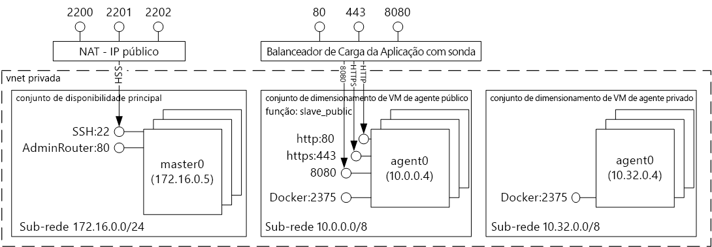
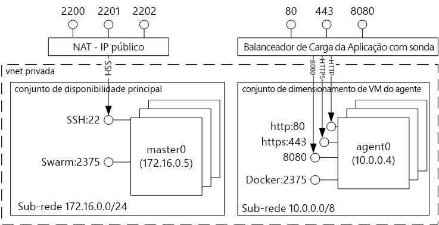
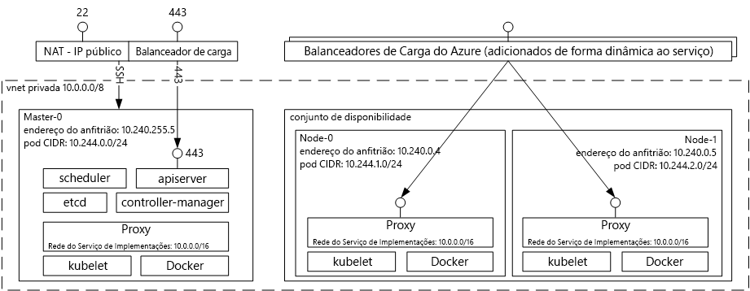

# Contentor de tooDocker introdução alojamento soluções com o serviço de contentor do AzureIntroduction tooDocker container hosting solutions with Azure Container Service 
Serviço de contentor do Azure torna mais simples para si toocreate, configurar e gerir um cluster de máquinas virtuais que estão pré-configuradas toorun de aplicações.Azure Container Service makes it simpler for you toocreate, configure, and manage a cluster of virtual machines that are preconfigured toorun containerized applications. Utiliza uma configuração otimizada de populares ferramentas open-source de agendamento e orquestração.It uses an optimized configuration of popular open-source scheduling and orchestration tools. Isto permite-lhe toouse suas competências existentes, ou desenhar após um corpo de grande e crescente de conhecimentos de Comunidade, toodeploy e gerir as aplicações baseadas no contentor no Microsoft Azure.This enables you toouse your existing skills, or draw upon a large and growing body of community expertise, toodeploy and manage container-based applications on Microsoft Azure.

Olá Docker contentor formato tooensure que os contentores de aplicação são portabilidade total tira partido do serviço de contentor do Azure.Azure Container Service leverages hello Docker container format tooensure that your application containers are fully portable. Também suporta a sua escolha de Marathon e DC/OS, Docker Swarm ou Kubernetes para que pode dimensionar toothousands estas aplicações de contentores, ou até mesmo dezenas de milhares.It also supports your choice of Marathon and DC/OS, Docker Swarm, or Kubernetes so that you can scale these applications toothousands of containers, or even tens of thousands.

Ao utilizar o serviço de contentor do Azure, pode tirar partido das funcionalidades de nível empresarial do Azure, mantendo ainda portabilidade de aplicação – incluindo portabilidade em camadas de orquestração Olá.By using Azure Container Service, you can take advantage of the enterprise-grade features of Azure, while still maintaining application portability--including portability at hello orchestration layers.

## Utilizar o Azure Container ServiceUsing Azure Container Service
O nosso objetivo com o serviço de contentor do Azure é tooprovide num ambiente de alojamento do contentor utilizando ferramentas open source e tecnologias que estão atualmente populares entre os nossos clientes.Our goal with Azure Container Service is tooprovide a container hosting environment by using open-source tools and technologies that are popular among our customers today. fim de toothis, expomos pontos finais de API standard Olá para o orchestrator escolhido (DC/OS, Docker Swarm ou Kubernetes).toothis end, we expose hello standard API endpoints for your chosen orchestrator (DC/OS, Docker Swarm, or Kubernetes). Utilizando estes pontos finais, pode tirar partido do software que seja capaz de falar com pontos finais de toothose.By using these endpoints, you can leverage any software that is capable of talking toothose endpoints. Por exemplo, no caso de Olá do ponto final de Docker Swarm do Olá, poderá escolher interface de linha de comandos (CLI) do toouse Olá Docker.For example, in hello case of hello Docker Swarm endpoint, you might choose toouse hello Docker command-line interface (CLI). Para DC/OS, pode optar por utilizar Olá DCOS CLI.For DC/OS, you might choose hello DCOS CLI. Para Kubernetes, pode optar por `kubectl`.For Kubernetes, you might choose `kubectl`.

## Criar um cluster de Docker com o Azure Container ServiceCreating a Docker cluster by using Azure Container Service
toobegin utilizando o serviço de contentor do Azure, implementar um cluster do serviço de contentor do Azure através do portal Olá (Olá pesquisa Marketplace para **serviço de contentor Azure**), utilizando um modelo Azure Resource Manager ([Docker Swarm](https://github.com/Azure/azure-quickstart-templates/tree/master/101-acs-swarm), [DC/SO](https://github.com/Azure/azure-quickstart-templates/tree/master/101-acs-dcos), ou [Kubernetes](https://github.com/Azure/azure-quickstart-templates/tree/master/101-acs-kubernetes)), ou com Olá [Azure CLI 2.0](container-service-create-acs-cluster-cli.md).toobegin using Azure Container Service, you deploy an Azure Container Service cluster via hello portal (search hello Marketplace for **Azure Container Service**), by using an Azure Resource Manager template ([Docker Swarm](https://github.com/Azure/azure-quickstart-templates/tree/master/101-acs-swarm), [DC/OS](https://github.com/Azure/azure-quickstart-templates/tree/master/101-acs-dcos), or [Kubernetes](https://github.com/Azure/azure-quickstart-templates/tree/master/101-acs-kubernetes)), or with hello [Azure CLI 2.0](container-service-create-acs-cluster-cli.md). Olá fornecido modelos de início rápido podem ser modificadas tooinclude adicionais ou avançada configuração do Azure.hello provided quickstart templates can be modified tooinclude additional or advanced Azure configuration. Para mais informações, consulte [Deploy an Azure Container Service cluster (Implementar um cluster do Azure Container Service)](container-service-deployment.md).For more information, see [Deploy an Azure Container Service cluster](container-service-deployment.md).

## Implementar uma aplicaçãoDeploying an application
O Azure Container Service permite escolher o Docker Swarm, o DC/OS ou o Kubernetes para orquestração.Azure Container Service provides a choice of Docker Swarm, DC/OS, or Kubernetes for orchestration. O modo como implementa a aplicação depende da sua escolha do orquestrador.How you deploy your application depends on your choice of orchestrator.

### Utilizar DC/OSUsing DC/OS
DC/OS é um sistema operativo distribuído com base no kernel do Olá Apache Mesos sistemas distribuídos.DC/OS is a distributed operating system based on hello Apache Mesos distributed systems kernel. O Apache Mesos está alojado no Olá Apache Software Foundation e lista algumas das Olá [nomes maiores no IT](http://mesos.apache.org/documentation/latest/powered-by-mesos/) como utilizadores e os contribuintes.Apache Mesos is housed at hello Apache Software Foundation and lists some of hello [biggest names in IT](http://mesos.apache.org/documentation/latest/powered-by-mesos/) as users and contributors.

O DC/OS e o Apache Mesos incluem um conjunto impressionante de funcionalidades:DC/OS and Apache Mesos include an impressive feature set:

* Escalabilidade comprovadaProven scalability
* Mestre e subordinados replicados com tolerância a falhas, utilizando o Apache ZooKeeperFault-tolerant replicated master and slaves using Apache ZooKeeper
* Suporte para contentores formatados para DockerSupport for Docker-formatted containers
* Isolamento nativo entre tarefas com contentores LinuxNative isolation between tasks with Linux containers
* Agendamento de vários recursos (memória, CPU, disco e portas)Multiresource scheduling (memory, CPU, disk, and ports)
* APIs Java, Python e C++ para o desenvolvimento de novas aplicações paralelasJava, Python, and C++ APIs for developing new parallel applications
* Uma IU da Web para ver o estado do clusterA web UI for viewing cluster state

Por predefinição, o DC/SO em execução no serviço de contentor do Azure inclui plataforma de orquestração Olá Marathon para cargas de trabalho de agendamento.By default, DC/OS running on Azure Container Service includes hello Marathon orchestration platform for scheduling workloads. No entanto, incluído com Olá implementação de DC/SO de ACS é Olá Mesosphere universo de serviços que podem ser adicionados tooyour serviço.However, included with hello DC/OS deployment of ACS is hello Mesosphere Universe of services that can be added tooyour service. Os serviços no Olá universo incluem Spark, Hadoop, Cassandra e muito mais.Services in hello Universe include Spark, Hadoop, Cassandra, and much more.

#### Utilizar o MarathonUsing Marathon
Marathon é um init em todo o cluster e um sistema de controlo de serviços no cgroups – ou, no caso de Olá do serviço de contentor do Azure, os contentores formatados para Docker.Marathon is a cluster-wide init and control system for services in cgroups--or, in hello case of Azure Container Service, Docker-formatted containers. O Marathon fornece uma IU da Web a partir da qual pode implementar as aplicações.Marathon provides a web UI from which you can deploy your applications. Pode aceder-lhe com um URL semelhante a `http://DNS_PREFIX.REGION.cloudapp.azure.com`, em que DNS\_PREFIX e REGION são definidos no momento da implementação.You can access this at a URL that looks something like `http://DNS_PREFIX.REGION.cloudapp.azure.com` where DNS\_PREFIX and REGION are both defined at deployment time. Como é óbvio, também pode fornecer o seu nome DNS.Of course, you can also provide your own DNS name. Para obter mais informações sobre a execução de um contentor utilizando a IU da web do Olá Marathon, consulte [gestão de contentores de DC/SO através da IU da web do Olá Marathon](container-service-mesos-marathon-ui.md).For more information on running a container using hello Marathon web UI, see [DC/OS container management through hello Marathon web UI](container-service-mesos-marathon-ui.md).

Também pode utilizar Olá REST APIs para comunicar com o Marathon.You can also use hello REST APIs for communicating with Marathon. Existem várias bibliotecas de cliente disponíveis para cada ferramenta.There are a number of client libraries that are available for each tool. Estes incluem uma variedade de linguagens – e, obviamente, pode utilizar o protocolo HTTP de Olá em qualquer idioma.They cover a variety of languages--and, of course, you can use hello HTTP protocol in any language. Além disso, muitas ferramentas DevOps populares fornecem suporte para o Marathon.In addition, many popular DevOps tools provide support for Marathon. Isto proporciona flexibilidade máxima para a sua equipa de operações quando estiver a trabalhar com um cluster do Azure Container Service.This provides maximum flexibility for your operations team when you are working with an Azure Container Service cluster. Para obter mais informações sobre a execução de um contentor utilizando Olá API REST do Marathon, consulte [gestão de contentores de DC/SO através de Olá API REST do Marathon](container-service-mesos-marathon-rest.md).For more information on running a container by using hello Marathon REST API, see [DC/OS container management through hello Marathon REST API](container-service-mesos-marathon-rest.md).

### Utilizar o Docker SwarmUsing Docker Swarm
O Docker Swarm fornece clustering nativo para o Docker.Docker Swarm provides native clustering for Docker. Uma vez que o Docker Swarm serve Olá API do Docker padrão, qualquer ferramenta que já comunica com um daemon de Docker pode utilizar anfitriões de toomultiple de escala de tootransparently Swarm no serviço de contentor do Azure.Because Docker Swarm serves hello standard Docker API, any tool that already communicates with a Docker daemon can use Swarm tootransparently scale toomultiple hosts on Azure Container Service.

[!INCLUDE [container-service-swarm-mode-note](../../../includes/container-service-swarm-mode-note.md)]

Ferramentas suportadas para gerir contentores num Swarm cluster incluem, mas não estarem limitadas aos seguintes Olá:Supported tools for managing containers on a Swarm cluster include, but are not limited to, hello following:

* DokkuDokku
* CLI do Docker e Docker ComposeDocker CLI and Docker Compose
* KraneKrane
* JenkinsJenkins

### Utilizar KubernetesUsing Kubernetes
O Kubernetes é uma ferramenta popular de orquestração do contentor de grau de produção de código aberto.Kubernetes is a popular open-source, production-grade container orchestrator tool. O Kubernetes automatiza a implementação, o dimensionamento e a gestão de aplicações no contentor.Kubernetes automates deployment, scaling, and management of containerized applications. Porque é uma solução de open source e é controlada pela Comunidade de open source Olá, é executado de forma totalmente integrada no serviço de contentor do Azure e podem ser utilizados toodeploy contentores à escala no serviço de contentor do Azure.Because it is an open-source solution and is driven by hello open-source community, it runs seamlessly on Azure Container Service and can be used toodeploy containers at scale on Azure Container Service.

Tem um conjunto avançado de funcionalidades, incluindo:It has a rich set of features including:
* Dimensionamento horizontalHorizontal scaling
* Deteção do serviço e balanceamento de cargaService discovery and load balancing
* Gestão de segredos e configuraçãoSecrets and configuration management
* Implementações e reversões automáticas com base em APIAPI-based automated rollouts and rollbacks
* AutorrecuperaçãoSelf-healing

## VídeosVideos
Introdução ao Azure Container Service (101):Getting started with Azure Container Service (101):  

> [!VIDEO https://channel9.msdn.com/Shows/Azure-Friday/Azure-Container-Service-101/player]
>
>

Olá aplicações a utilizar a criar serviço de contentor do Azure (compilação 2016)Building Applications Using hello Azure Container Service (Build 2016)

> [!VIDEO https://channel9.msdn.com/Events/Build/2016/B822/player]
>
>

## Passos seguintesNext steps

Implementar um cluster do serviço de contentor utilizando Olá [portal](container-service-deployment.md) ou [Azure CLI 2.0](container-service-create-acs-cluster-cli.md).Deploy a container service cluster using hello [portal](container-service-deployment.md) or [Azure CLI 2.0](container-service-create-acs-cluster-cli.md).
