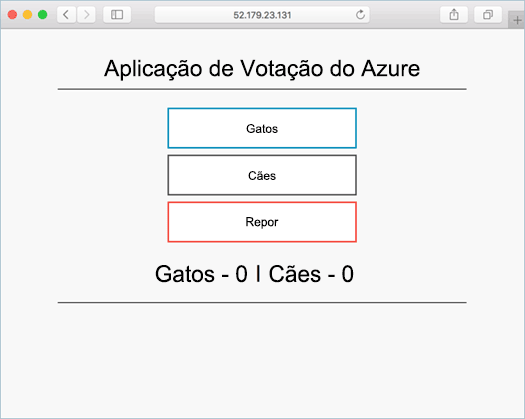

# <a name="deploy-docker-ce-cluster"></a><span data-ttu-id="6fa59-103">Implementar um cluster do Docker CE</span><span class="sxs-lookup"><span data-stu-id="6fa59-103">Deploy Docker CE cluster</span></span>

<span data-ttu-id="6fa59-104">Este guia de introdução, um cluster Docker CE é implementado utilizando Olá CLI do Azure.</span><span class="sxs-lookup"><span data-stu-id="6fa59-104">In this quick start, a Docker CE cluster is deployed using hello Azure CLI.</span></span> <span data-ttu-id="6fa59-105">Uma aplicação de contentor multi constituída front-end web e uma instância de Redis, em seguida, é implementada e é executada no cluster de Olá.</span><span class="sxs-lookup"><span data-stu-id="6fa59-105">A multi-container application consisting of web front end and a Redis instance is then deployed and run on hello cluster.</span></span> <span data-ttu-id="6fa59-106">Depois de concluída, a aplicação Olá está acessível através de Olá internet.</span><span class="sxs-lookup"><span data-stu-id="6fa59-106">Once completed, hello application is accessible over hello internet.</span></span>

<span data-ttu-id="6fa59-107">O Docker CE no Azure Container Service encontra-se em pré-visualização e **não deve ser utilizado em cargas de trabalho de produção**.</span><span class="sxs-lookup"><span data-stu-id="6fa59-107">Docker CE on Azure Container Service is in preview and **should not be used for production workloads**.</span></span>

<span data-ttu-id="6fa59-108">Se não tiver uma subscrição do Azure, crie uma [conta gratuita](https://azure.microsoft.com/free/?WT.mc_id=A261C142F) antes de começar.</span><span class="sxs-lookup"><span data-stu-id="6fa59-108">If you don't have an Azure subscription, create a [free account](https://azure.microsoft.com/free/?WT.mc_id=A261C142F) before you begin.</span></span>

<span data-ttu-id="6fa59-109">Se escolher tooinstall e utilizar Olá CLI localmente, este guia de introdução requer que está a executar versão CLI do Azure de Olá 2.0.4 ou posterior.</span><span class="sxs-lookup"><span data-stu-id="6fa59-109">If you choose tooinstall and use hello CLI locally, this quickstart requires that you are running hello Azure CLI version 2.0.4 or later.</span></span> <span data-ttu-id="6fa59-110">Executar `az --version` versão de Olá toofind.</span><span class="sxs-lookup"><span data-stu-id="6fa59-110">Run `az --version` toofind hello version.</span></span> <span data-ttu-id="6fa59-111">Se precisar de tooinstall ou atualização, consulte [instalar o Azure CLI 2.0]( /cli/azure/install-azure-cli).</span><span class="sxs-lookup"><span data-stu-id="6fa59-111">If you need tooinstall or upgrade, see [Install Azure CLI 2.0]( /cli/azure/install-azure-cli).</span></span>

## <a name="create-a-resource-group"></a><span data-ttu-id="6fa59-112">Criar um grupo de recursos</span><span class="sxs-lookup"><span data-stu-id="6fa59-112">Create a resource group</span></span>

<span data-ttu-id="6fa59-113">Criar um grupo de recursos com Olá [criar grupo az](/cli/azure/group#create) comando.</span><span class="sxs-lookup"><span data-stu-id="6fa59-113">Create a resource group with hello [az group create](/cli/azure/group#create) command.</span></span> <span data-ttu-id="6fa59-114">Um grupo de recursos do Azure é um grupo lógico, no qual os recursos do Azure são implementados e geridos.</span><span class="sxs-lookup"><span data-stu-id="6fa59-114">An Azure resource group is a logical group in which Azure resources are deployed and managed.</span></span>

<span data-ttu-id="6fa59-115">Olá exemplo seguinte cria um grupo de recursos denominado *myResourceGroup* no Olá *ukwest* localização.</span><span class="sxs-lookup"><span data-stu-id="6fa59-115">hello following example creates a resource group named *myResourceGroup* in hello *ukwest* location.</span></span>

```azurecli-interactive
az group create --name myResourceGroup --location ukwest
```

<span data-ttu-id="6fa59-116">Saída:</span><span class="sxs-lookup"><span data-stu-id="6fa59-116">Output:</span></span>

```json
{
  "id": "/subscriptions/00000000-0000-0000-0000-000000000000/resourceGroups/myResourceGroup",
  "location": "westcentralus",
  "managedBy": null,
  "name": "myResourceGroup",
  "properties": {
    "provisioningState": "Succeeded"
  },
  "tags": null
}
```

## <a name="create-docker-swarm-cluster"></a><span data-ttu-id="6fa59-117">Criar um cluster do Docker Swarm</span><span class="sxs-lookup"><span data-stu-id="6fa59-117">Create Docker Swarm cluster</span></span>

<span data-ttu-id="6fa59-118">Criar um cluster Docker CE no serviço de contentor do Azure com Olá [az acs criar](/cli/azure/acs#create) comando.</span><span class="sxs-lookup"><span data-stu-id="6fa59-118">Create a Docker CE cluster in Azure Container Service with hello [az acs create](/cli/azure/acs#create) command.</span></span> 

<span data-ttu-id="6fa59-119">Olá exemplo seguinte cria um cluster com o nome *mySwarmCluster* com o um Linux principal de nós e três nós de agente do Linux.</span><span class="sxs-lookup"><span data-stu-id="6fa59-119">hello following example creates a cluster named *mySwarmCluster* with one Linux master node and three Linux agent nodes.</span></span>

```azurecli-interactive
az acs create --name mySwarmCluster --orchestrator-type dockerce --resource-group myResourceGroup --generate-ssh-keys
```

<span data-ttu-id="6fa59-120">Após vários minutos, o comando de Olá concluir e devolve informações de formatação json sobre cluster Olá.</span><span class="sxs-lookup"><span data-stu-id="6fa59-120">After several minutes, hello command completes and returns json formatted information about hello cluster.</span></span>

## <a name="connect-toohello-cluster"></a><span data-ttu-id="6fa59-121">Ligue o cluster de toohello</span><span class="sxs-lookup"><span data-stu-id="6fa59-121">Connect toohello cluster</span></span>

<span data-ttu-id="6fa59-122">Ao longo deste guia de introdução, terá de Olá FQDN do mestre de Docker Swarm Olá e agrupamento de agentes do Olá Docker.</span><span class="sxs-lookup"><span data-stu-id="6fa59-122">Throughout this quick start, you need hello FQDN of both hello Docker Swarm master and hello Docker agent pool.</span></span> <span data-ttu-id="6fa59-123">Execute Olá tooreturn ambos Olá FQDNs mestre e o agente de comando a seguir.</span><span class="sxs-lookup"><span data-stu-id="6fa59-123">Run hello following command tooreturn both hello master and agent FQDNs.</span></span>


```bash
az acs list --resource-group myResourceGroup --query '[*].{Master:masterProfile.fqdn,Agent:agentPoolProfiles[0].fqdn}' -o table
```

<span data-ttu-id="6fa59-124">Saída:</span><span class="sxs-lookup"><span data-stu-id="6fa59-124">Output:</span></span>

```bash
Master                                                               Agent
-------------------------------------------------------------------  --------------------------------------------------------------------
myswarmcluster-myresourcegroup-d5b9d4mgmt.ukwest.cloudapp.azure.com  myswarmcluster-myresourcegroup-d5b9d4agent.ukwest.cloudapp.azure.com
```

<span data-ttu-id="6fa59-125">Crie um SSH mestre do túnel toohello Swarm.</span><span class="sxs-lookup"><span data-stu-id="6fa59-125">Create an SSH tunnel toohello Swarm master.</span></span> <span data-ttu-id="6fa59-126">Substitua `MasterFQDN` com endereço FQDN Olá mestre do Olá Swarm.</span><span class="sxs-lookup"><span data-stu-id="6fa59-126">Replace `MasterFQDN` with hello FQDN address of hello Swarm master.</span></span>

```bash
ssh -p 2200 -fNL localhost:2374:/var/run/docker.sock azureuser@MasterFQDN
```

<span data-ttu-id="6fa59-127">Conjunto Olá `DOCKER_HOST` variável de ambiente.</span><span class="sxs-lookup"><span data-stu-id="6fa59-127">Set hello `DOCKER_HOST` environment variable.</span></span> <span data-ttu-id="6fa59-128">Isto permite-lhe comandos de docker toorun contra Olá Docker Swarm sem ter de nome de Olá toospecify do anfitrião de Olá.</span><span class="sxs-lookup"><span data-stu-id="6fa59-128">This allows you toorun docker commands against hello Docker Swarm without having toospecify hello name of hello host.</span></span>

```bash
export DOCKER_HOST=localhost:2374
```

<span data-ttu-id="6fa59-129">Agora, está pronto toorun serviços Docker Olá Docker Swarm.</span><span class="sxs-lookup"><span data-stu-id="6fa59-129">You are now ready toorun Docker services on hello Docker Swarm.</span></span>


## <a name="run-hello-application"></a><span data-ttu-id="6fa59-130">Executar a aplicação Olá</span><span class="sxs-lookup"><span data-stu-id="6fa59-130">Run hello application</span></span>

<span data-ttu-id="6fa59-131">Crie um ficheiro denominado `azure-vote.yaml` e Olá cópia seguir o conteúdo para a mesma.</span><span class="sxs-lookup"><span data-stu-id="6fa59-131">Create a file named `azure-vote.yaml` and copy hello following content into it.</span></span>


```yaml
version: '3'
services:
  azure-vote-back:
    image: redis
    ports:
        - "6379:6379"

  azure-vote-front:
    image: microsoft/azure-vote-front:redis-v1
    environment:
      REDIS: azure-vote-back
    ports:
        - "80:80"
```

<span data-ttu-id="6fa59-132">Executar Olá [pilha docker implementar](https://docs.docker.com/engine/reference/commandline/stack_deploy/) serviço de Azure voto toocreate Olá de comandos.</span><span class="sxs-lookup"><span data-stu-id="6fa59-132">Run hello [docker stack deploy](https://docs.docker.com/engine/reference/commandline/stack_deploy/) command toocreate hello Azure Vote service.</span></span>

```bash
docker stack deploy azure-vote --compose-file azure-vote.yaml
```

<span data-ttu-id="6fa59-133">Saída:</span><span class="sxs-lookup"><span data-stu-id="6fa59-133">Output:</span></span>

```bash
Creating network azure-vote_default
Creating service azure-vote_azure-vote-back
Creating service azure-vote_azure-vote-front
```

<span data-ttu-id="6fa59-134">Olá utilize [docker pilha ps](https://docs.docker.com/engine/reference/commandline/stack_ps/) estado da implementação Olá tooreturn da aplicação Olá de comandos.</span><span class="sxs-lookup"><span data-stu-id="6fa59-134">Use hello [docker stack ps](https://docs.docker.com/engine/reference/commandline/stack_ps/) command tooreturn hello deployment status of hello application.</span></span>

```bash
docker stack ps azure-vote
```

<span data-ttu-id="6fa59-135">Uma vez Olá `CURRENT STATE` de cada serviço é `Running`, Olá aplicação esteja pronta.</span><span class="sxs-lookup"><span data-stu-id="6fa59-135">Once hello `CURRENT STATE` of each service is `Running`, hello application is ready.</span></span>

```bash
ID                  NAME                            IMAGE                                 NODE                               DESIRED STATE       CURRENT STATE                ERROR               PORTS
tnklkv3ogu3i        azure-vote_azure-vote-front.1   microsoft/azure-vote-front:redis-v1   swarmm-agentpool0-66066781000004   Running             Running 5 seconds ago                            
lg99i4hy68r9        azure-vote_azure-vote-back.1    redis:latest                          swarmm-agentpool0-66066781000002   Running             Running about a minute ago
```

## <a name="test-hello-application"></a><span data-ttu-id="6fa59-136">Testar a aplicação Olá</span><span class="sxs-lookup"><span data-stu-id="6fa59-136">Test hello application</span></span>

<span data-ttu-id="6fa59-137">Procure toohello FQDN do Olá Swarm agente conjunto tootest saída Olá aplicação de voto do Azure.</span><span class="sxs-lookup"><span data-stu-id="6fa59-137">Browse toohello FQDN of hello Swarm agent pool tootest out hello Azure Vote application.</span></span>



## <a name="delete-cluster"></a><span data-ttu-id="6fa59-139">Eliminar o cluster</span><span class="sxs-lookup"><span data-stu-id="6fa59-139">Delete cluster</span></span>
<span data-ttu-id="6fa59-140">Quando o cluster de Olá já não é necessário, pode utilizar Olá [eliminação do grupo de az](/cli/azure/group#delete) comando o grupo de recursos do tooremove Olá, serviço de contentor e relacionados todos os recursos.</span><span class="sxs-lookup"><span data-stu-id="6fa59-140">When hello cluster is no longer needed, you can use hello [az group delete](/cli/azure/group#delete) command tooremove hello resource group, container service, and all related resources.</span></span>

```azurecli-interactive
az group delete --name myResourceGroup --yes --no-wait
```

## <a name="get-hello-code"></a><span data-ttu-id="6fa59-141">Obter o código de Olá</span><span class="sxs-lookup"><span data-stu-id="6fa59-141">Get hello code</span></span>

<span data-ttu-id="6fa59-142">Neste início rápido, imagens de contentor previamente criadas tem sido utilizado toocreate um serviço de Docker.</span><span class="sxs-lookup"><span data-stu-id="6fa59-142">In this quick start, pre-created container images have been used toocreate a Docker service.</span></span> <span data-ttu-id="6fa59-143">Olá relacionados com o código da aplicação, Dockerfile, e o ficheiro de Compose estão disponíveis no GitHub.</span><span class="sxs-lookup"><span data-stu-id="6fa59-143">hello related application code, Dockerfile, and Compose file are available on GitHub.</span></span>

[<span data-ttu-id="6fa59-144">https://github.com/Azure-Samples/azure-voting-app-redis</span><span class="sxs-lookup"><span data-stu-id="6fa59-144">https://github.com/Azure-Samples/azure-voting-app-redis</span></span>](https://github.com/Azure-Samples/azure-voting-app-redis.git)

## <a name="next-steps"></a><span data-ttu-id="6fa59-145">Passos seguintes</span><span class="sxs-lookup"><span data-stu-id="6fa59-145">Next steps</span></span>

<span data-ttu-id="6fa59-146">Este início rápido, implementar um cluster Docker Swarm e implementar uma aplicação de contentor multi tooit.</span><span class="sxs-lookup"><span data-stu-id="6fa59-146">In this quick start, you deployed a Docker Swarm cluster and deployed a multi-container application tooit.</span></span>

<span data-ttu-id="6fa59-147">toolearn sobre a integração de Docker transfira com o Visual Studio Team Services, continuar toohello CI/CD com o Docker Swarm e VSTS.</span><span class="sxs-lookup"><span data-stu-id="6fa59-147">toolearn about integrating Docker warm with Visual Studio Team Services, continue toohello CI/CD with Docker Swarm and VSTS.</span></span>

> [!div class="nextstepaction"]
> [<span data-ttu-id="6fa59-148">CI/CD com Docker Swarm e VSTS</span><span class="sxs-lookup"><span data-stu-id="6fa59-148">CI/CD with Docker Swarm and VSTS</span></span>](./container-service-docker-swarm-setup-ci-cd.md)