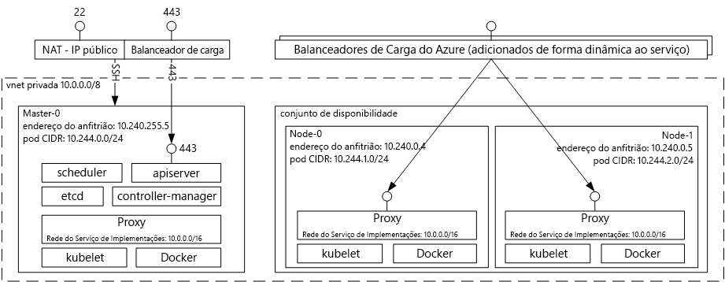

# Introdução tooAzure serviço de contentor para KubernetesIntroduction tooAzure Container Service for Kubernetes
Serviço de contentor do Azure para Kubernetes torna simple toocreate, configurar e gerir um cluster de máquinas virtuais que estão pré-configuradas toorun de aplicações.Azure Container Service for Kubernetes makes it simple toocreate, configure, and manage a cluster of virtual machines that are preconfigured toorun containerized applications. Isto permite-lhe toouse suas competências existentes, ou desenhar após um corpo de grande e crescente de conhecimentos de Comunidade, toodeploy e gerir as aplicações baseadas no contentor no Microsoft Azure.This enables you toouse your existing skills, or draw upon a large and growing body of community expertise, toodeploy and manage container-based applications on Microsoft Azure.

Ao utilizar o serviço de contentor do Azure, pode tirar partido das Olá funcionalidades de nível empresarial do Azure, mantendo ainda portabilidade de aplicações através de Kubernetes e Olá formato de imagem de Docker.By using Azure Container Service, you can take advantage of hello enterprise-grade features of Azure, while still maintaining application portability through Kubernetes and hello Docker image format.

## Utilizar o Azure Container Service para KubernetesUsing Azure Container Service for Kubernetes
O nosso objetivo com o serviço de contentor do Azure é tooprovide num ambiente de alojamento do contentor utilizando ferramentas open source e tecnologias que estão atualmente populares entre os nossos clientes.Our goal with Azure Container Service is tooprovide a container hosting environment by using open-source tools and technologies that are popular among our customers today. fim de toothis, expomos pontos finais da API de Kubernetes padrão Olá.toothis end, we expose hello standard Kubernetes API endpoints. Utilizando estes pontos finais padrão, pode tirar partido do software que seja capaz de comunicar tooa Kubernetes cluster.By using these standard endpoints, you can leverage any software that is capable of talking tooa Kubernetes cluster. Por exemplo, pode escolher [kubectl](https://kubernetes.io/docs/user-guide/kubectl-overview/), [helm](https://helm.sh/) ou [draft](https://github.com/Azure/draft).For example, you might choose [kubectl](https://kubernetes.io/docs/user-guide/kubectl-overview/), [helm](https://helm.sh/), or [draft](https://github.com/Azure/draft).

## Criar um cluster do Kubernetes com o Azure Container ServiceCreating a Kubernetes cluster using Azure Container Service
toobegin utilizando o serviço de contentor do Azure, implementar um cluster do serviço de contentor do Azure com Olá [Azure CLI 2.0](container-service-kubernetes-walkthrough.md) ou através do portal Olá (Olá pesquisa Marketplace para **serviço de contentor Azure**).toobegin using Azure Container Service, deploy an Azure Container Service cluster with hello [Azure CLI 2.0](container-service-kubernetes-walkthrough.md) or via hello portal (search hello Marketplace for **Azure Container Service**). Se um utilizador avançado que necessitam de mais controlo sobre os modelos do Azure Resource Manager Olá, pode utilizar open source para Olá [motor de acs](https://github.com/Azure/acs-engine) projeto toobuild os seus próprios Kubernetes personalizados do cluster e implementá-la através de Olá `az` CLI.If you are an advanced user who needs more control over hello Azure Resource Manager templates, you can use hello open source [acs-engine](https://github.com/Azure/acs-engine) project toobuild your own custom Kubernetes cluster and deploy it via hello `az` CLI.

### Utilizar KubernetesUsing Kubernetes
O Kubernetes automatiza a implementação, o dimensionamento e a gestão de aplicações no contentor.Kubernetes automates deployment, scaling, and management of containerized applications. Tem um conjunto avançado de funcionalidades, incluindo:It has a rich set of features including:
* Empacotamento automáticoAutomatic binpacking
* AutorrecuperaçãoSelf-healing
* Dimensionamento horizontalHorizontal scaling
* Deteção do serviço e balanceamento de cargaService discovery and load balancing
* Implementações e reversões automáticasAutomated rollouts and rollbacks
* Gestão de segredos e de configuraçõesSecret and configuration management
* Orquestração de armazenamentoStorage orchestration
* Execução de lotesBatch execution

Diagrama da arquitetura de Kubernetes implementado através do Azure Container Service:Architectural diagram of Kubernetes deployed via Azure Container Service:

## VídeosVideos

Suporte de Kubernetes no Azure Container Service (Azure Friday, janeiro de 2017):Kubernetes Support in Azure Container Services (Azure Friday, January 2017):

> [!VIDEO https://channel9.msdn.com/Shows/Azure-Friday/Kubernetes-Support-in-Azure-Container-Services/player]
>
>

Ferramentas para Programar e Implementar Aplicações no Kubernetes (Azure OpenDev, junho de 2017):Tools for Developing and Deploying Applications on Kubernetes (Azure OpenDev, June 2017):

> [!VIDEO https://channel9.msdn.com/Events/AzureOpenDev/June2017/Tools-for-Developing-and-Deploying-Applications-on-Kubernetes/player]
>
>

## Passos seguintesNext steps

Explorar Olá [início rápido de Kubernetes](container-service-kubernetes-walkthrough.md) toobegin explorar o serviço de contentor do Azure hoje.Explore hello [Kubernetes Quickstart](container-service-kubernetes-walkthrough.md) toobegin exploring Azure Container Service today.
