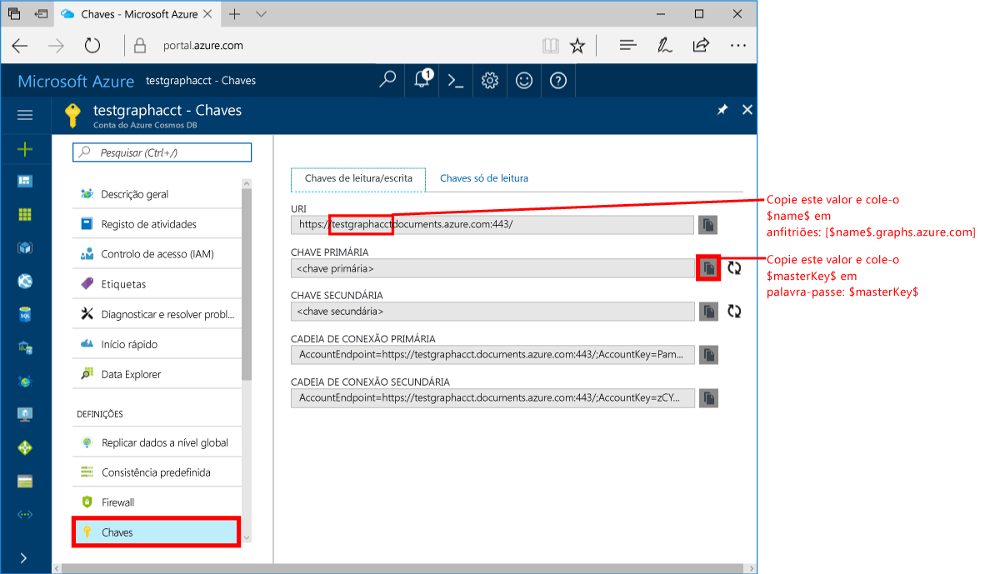
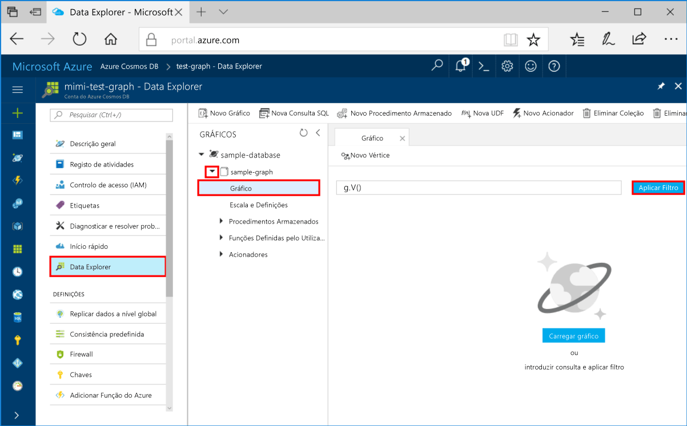
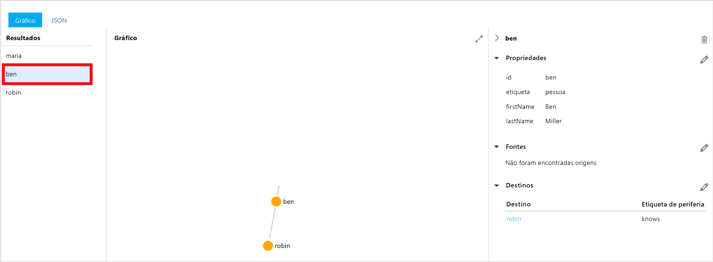
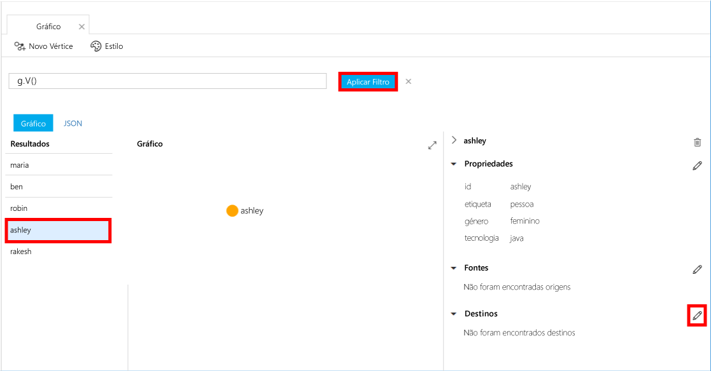
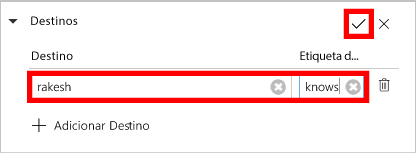
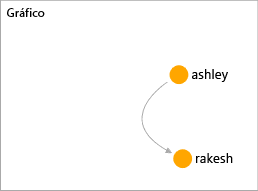

# <a name="azure-cosmos-db-create-a-graph-database-using-java-and-hello-azure-portal"></a>BD do Azure do Cosmos: Criar uma base de dados do gráfico com o Java e Olá portal do Azure

O Azure Cosmos DB é um serviço de bases de dados com vários modelos e distribuído globalmente da Microsoft. Pode criar e consultar documentos, chave/valor e bases de dados de gráfico, sendo todas beneficiam das capacidades de dimensionamento horizontal núcleo Olá da base de dados do Azure Cosmos e distribuição global Olá rapidamente. 

Este guia de introdução cria um gráfico da base de dados utilizando Olá ferramentas portais do Azure para a base de dados do Azure Cosmos. Este guia de introdução mostra também como tooquickly criar uma aplicação de consola Java utilizando uma base de dados do gráfico com Olá OSS [Gremlin Java](https://mvnrepository.com/artifact/org.apache.tinkerpop/gremlin-driver) controlador. Olá instruções deste guia de introdução podem ser seguidas em qualquer sistema operativo que seja capaz de executar Java. Este guia de introdução o familiarizes com criar e modificar recursos do gráfico na Olá IU ou através de programação, optando-se a sua preferência. 

## <a name="prerequisites"></a>Pré-requisitos

* [Java Development Kit (JDK) 1.7+](http://www.oracle.com/technetwork/java/javase/downloads/jdk8-downloads-2133151.html)
    * Ubuntu, executado `apt-get install default-jdk` tooinstall Olá JDK.
    * Ser tooset se Olá JAVA_HOME ambiente toopoint variável toohello pasta onde Olá JDK está instalado.
* [Transferir](http://maven.apache.org/download.cgi) e [instalar](http://maven.apache.org/install.html) um arquivo binário [Maven](http://maven.apache.org/)
    * No Ubuntu, pode executar `apt-get install maven` tooinstall Maven.
* [Git](https://www.git-scm.com/)
    * No Ubuntu, pode executar `sudo apt-get install git` tooinstall Git.

[!INCLUDE [quickstarts-free-trial-note](../../includes/quickstarts-free-trial-note.md)]

## <a name="create-a-database-account"></a>Criar uma conta de base de dados

Antes de poder criar uma base de dados do gráfico, terá de toocreate uma conta de base de dados Gremlin (gráfico) com base de dados do Azure Cosmos.

[!INCLUDE [cosmos-db-create-dbaccount-graph](../../includes/cosmos-db-create-dbaccount-graph.md)]

## <a name="add-a-graph"></a>Adicionar um gráfico

Agora, pode utilizar a ferramenta Explorador de dados de Olá no Olá toocreate do portal do Azure, uma base de dados do gráfico. 

1. No Olá portal do Azure, no menu de navegação esquerdo Olá, clique em **Explorador de dados (pré-visualização)**. 
2. No Olá **Explorador de dados (pré-visualização)** painel, clique em **gráfico novo**, em seguida, preencha a página Olá utilizando Olá seguintes informações:

    

    Definição|Valor sugerido|Descrição
    ---|---|---
    ID da base de dados|base de dados de exemplo|Olá ID para a sua nova base de dados. Os nomes das bases de dados têm de ter entre um e 255 carateres e não podem conter `/ \ # ?` nem espaços à direita.
    ID do Graph|gráfico de exemplo|ID de Olá para o novo gráfico. Os nomes de gráfico têm Olá requisitos mesmo caráter como ids de base de dados.
    Capacidade de Armazenamento| 10 GB|Deixe o valor predefinido de Olá. Esta é a capacidade de armazenamento Olá da base de dados de Olá.
    Débito|400 RUs|Deixe o valor predefinido de Olá. Pode dimensionar débito hello mais tarde se quiser tooreduce latência.
    Chave de partição|Deixar em branco|Para efeitos de Olá deste guia de introdução, deixe a chave de partição Olá em branco.

3. Depois do formulário de Olá é preenchido, clique em **OK**.

## <a name="clone-hello-sample-application"></a>Aplicação de exemplo de Olá do clone

Agora vamos clonar uma aplicação de gráfico a partir do github, definir a cadeia de ligação de Olá e executá-la. Pode ver como é fácil toowork com dados através de programação. 

1. Abra uma janela de terminal do git, tais como o git bash, e `cd` tooa diretório de trabalho.  

2. Execute Olá repositório do comando tooclone Olá exemplo a seguir. 

    ```bash
    git clone https://github.com/Azure-Samples/azure-cosmos-db-graph-java-getting-started.git
    ```

## <a name="review-hello-code"></a>Rever o código de Olá

Certifiquemo-numa revisão rápida do que está a acontecer na aplicação Olá. Abra Olá `Program.java` ficheiros da pasta de \src\GetStarted Olá e localizar estas linhas de código. 

* Olá Gremlin `Client` é inicializado da configuração de Olá no `src/remote.yaml`.

    ```java
    cluster = Cluster.build(new File("src/remote.yaml")).create();
    ...
    client = cluster.connect();
    ```

* Uma série de passos Gremlin são executados utilizando Olá `client.submit` método.

    ```java
    ResultSet results = client.submit(gremlin);

    CompletableFuture<List<Result>> completableFutureResults = results.all();
    List<Result> resultList = completableFutureResults.get();

    for (Result result : resultList) {
        System.out.println(result.toString());
    }
    ```

## <a name="update-your-connection-string"></a>Atualizar a cadeia de ligação

1. Ficheiro de src/remote.yaml Olá aberta. 

3. Preencha o *anfitriões*, *username*, e *palavra-passe* valores no ficheiro de src/remote.yaml Olá. rest Olá das definições de Olá não é necessário toobe alterado.

    Definição|Valor sugerido|Descrição
    ---|---|---
    Anfitriões|[***.graphs.azure.com]|Consulte a captura de ecrã de Olá após esta tabela. Este valor é o valor do URI de Gremlin Olá na página de descrição geral de Olá de Olá portal do Azure, entre parênteses Retos, com um Olá: 443 / removido.<br><br>Este valor também pode ser obtido a partir do separador de chaves Olá, utilizando o valor do URI Olá ao remover https://, alterar toographs de documentos e remover à direita Olá: 443 /.
    Nome de utilizador|/dbs/sample-database/colls/sample-graph|Olá recursos com formato Olá `/dbs/<db>/colls/<coll>` onde `<db>` é o nome de base de dados existente e `<coll>` é o nome de coleção existente.
    Palavra-passe|*A chave mestra principal*|Consulte Olá captura de ecrã segundo após esta tabela. Este valor é a chave primária, o que pode obter a partir da página de chaves de Olá de Olá portal do Azure, na caixa de chave primária de Olá. Copie o valor de Olá utilizando o botão de copiar Olá no lado direito de Olá da caixa de Olá.

    Para o valor de anfitriões de Olá, copie Olá **Gremlin URI** valor Olá **descrição geral** página. Se estiver vazia, consulte as instruções de Olá na linha de anfitriões de Olá no Olá precedente tabela sobre a criação de Olá Gremlin URI a partir do painel de chaves Olá.


    Para o valor de palavra-passe Olá, copie Olá **chave primária** de Olá **chaves** painel: 

## <a name="run-hello-console-app"></a>Executar a aplicação de consola Olá

1. Na janela de terminal git Olá, `cd` pasta azure-cosmos-db-graph-java-getting-started toohello.

2. Na janela de terminal git Olá, escreva `mvn package` tooinstall Olá necessário pacotes de Java.

3. Na janela de terminal git Olá, execute `mvn exec:java -D exec.mainClass=GetStarted.Program` no Olá toostart de janela de terminal, a aplicação de Java.

janela de terminal Olá apresenta vértices Olá a serem adicionados toohello gráfico. Após a conclusão do programa de Olá, mude toohello back portal do Azure no seu browser da internet. 

<a id="add-sample-data"></a>
## <a name="review-and-add-sample-data"></a>Rever e adicionar dados de exemplo

Agora pode voltar atrás tooData Explorador e ver vértices Olá adicionados toohello gráfico e adicionar pontos de dados adicionais.

1. No Explorador de dados, expanda Olá **base de dados de exemplo**/**exemplo gráfico**, clique em **gráfico**e, em seguida, clique em **aplicar o filtro**. 

   

2. No Olá **resultados** lista, tenha em atenção de que os novos utilizadores Olá adicionado toohello gráfico. Selecione **Bernardo** e repare que ele estabeleceu toorobin. Pode mover vértices Olá-se no Explorador do gráfico Olá, ampliar e reduzir e expandir o tamanho de Olá da superfície de Explorador de gráfico de Olá. 

   

3. Vamos adicionar alguns gráfico de toohello de utilizadores novos com Olá Explorador de dados. Clique em Olá **vértice novo** gráfico tooyour do botão tooadd dados.

   

4. Introduza uma etiqueta de *pessoa* , em seguida, introduza Olá seguintes chaves e valores toocreate vértice primeiro de Olá no gráfico de Olá. Tenha em atenção que pode criar propriedades exclusivas para cada pessoa no seu gráfico. Chave de id de Olá só é necessária.

    key|valor|Notas
    ----|----|----
    ID|ashley|Olá Identificador exclusivo para o vértice Olá. Se não especificar, é gerado um id automaticamente.
    género|feminino| 
    técnico | java | 

    > [!NOTE]
    > Neste guia de início rápido, criámos uma coleção não particionada. No entanto, se criar uma coleção particionada ao especificar uma chave de partição durante a criação de coleção de Olá, terá de chave de partição de Olá tooinclude como uma chave em cada novo vértice. 

5. Clique em **OK**. Poderá ser necessário tooexpand toosee o ecrã **OK** no Olá parte inferior do ecrã de Olá.

6. Clique em **Vértice Novo** novamente e adicione outro utilizador. Introduza uma etiqueta de *pessoa* , em seguida, introduza o seguinte Olá chaves e valores:

    key|valor|Notas
    ----|----|----
    ID|rakesh|Olá Identificador exclusivo para o vértice Olá. Se não especificar, é gerado um id automaticamente.
    género|masculino| 
    escola|MIT| 

7. Clique em **OK**. 

8. Clique em **aplicar filtro** com predefinição Olá `g.V()` filtro. Todos os utilizadores de Olá agora mostram Olá **resultados** lista. Como adicionar mais dados, pode utilizar filtros toolimit os resultados. Por predefinição, o Explorador de dados utiliza `g.V()` tooretrieve todos os vértices num gráfico, mas podem alterar esse tooa diferentes [consulta gráfico](tutorial-query-graph.md), tais como `g.V().count()`, tooreturn uma contagem de todos os vértices Olá no gráfico de Olá no formato JSON.

9. Agora, podemos ligar rakesh e ashley. Certifique-se **ashley** no selecionado na Olá **resultados** lista, em seguida, clique no botão de edição Olá junto demasiado**destinos** no inferior direita. Poderá ser necessário toowiden Olá de toosee a janela **propriedades** área.

   

10. No Olá **destino** caixa tipo *rakesh*e em Olá **etiqueta Edge** caixa tipo *sabe*e, em seguida, clique em Olá caixa de verificação.

   

11. Agora selecionar **rakesh** da lista de resultados de Olá e ver se ashley e rakesh estão ligados. 

   

    Também pode utilizar os procedimentos de toocreate armazenado do Explorador de dados, UDFs e lógica de negócio do lado do servidor de tooperform de acionadores bem como o débito de escala. Explorador de dados expõe todos os Olá incorporada programático acesso aos dados disponível no Olá APIs, mas fornece acesso fácil tooyour dados no Olá portal do Azure.


## <a name="review-slas-in-hello-azure-portal"></a>Reveja os SLAs no Olá portal do Azure

[!INCLUDE [cosmosdb-tutorial-review-slas](../../includes/cosmos-db-tutorial-review-slas.md)]

## <a name="clean-up-resources"></a>Limpar recursos

Se não toocontinue toouse esta aplicação, elimine todos os recursos criados por este guia de introdução no Olá portal do Azure com Olá os seguintes passos: 

1. No menu da esquerda de Olá no Olá portal do Azure, clique em **grupos de recursos** e, em seguida, clique em nome de Olá do recurso de Olá que criou. 
2. Na sua página de grupo de recursos, clique em **eliminar**, escreva o nome de Olá de Olá recursos toodelete na caixa de texto Olá e, em seguida, clique em **eliminar**.

## <a name="next-steps"></a>Passos seguintes

Este guia de introdução, aprendeu como criar um gráfico com o Explorador de dados de Olá toocreate uma conta de base de dados do Azure Cosmos e executar uma aplicação. Agora, pode criar consultas mais complexas e implementar lógica poderosa para percorrer gráficos com Gremlin. 

> [!div class="nextstepaction"]
> [Query using Gremlin](tutorial-query-graph.md) (Utilizar Gremlin para consultar)

