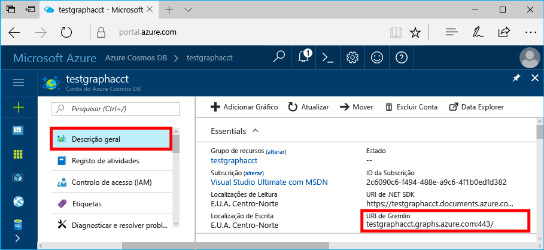
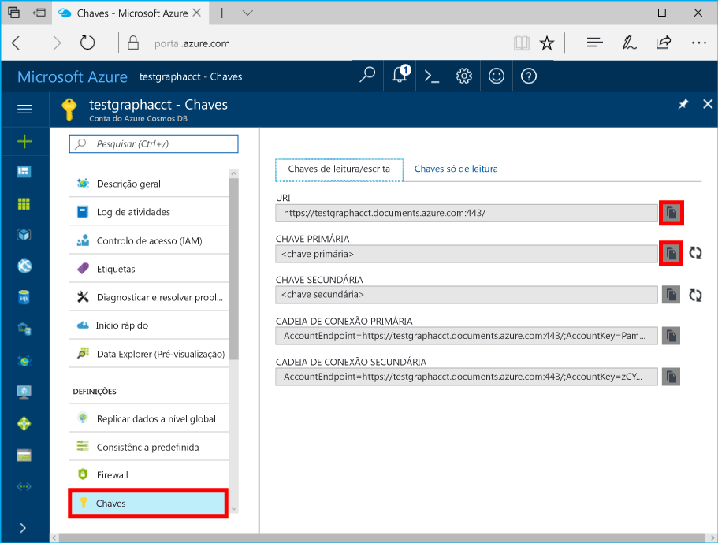

# <a name="azure-cosmos-db-build-a-nodejs-application-by-using-graph-api"></a><span data-ttu-id="4be78-103">Azure Cosmos DB: Criar uma aplicação Node.js com o Graph API</span><span class="sxs-lookup"><span data-stu-id="4be78-103">Azure Cosmos DB: Build a Node.js application by using Graph API</span></span>

<span data-ttu-id="4be78-104">BD do Azure do Cosmos é serviço de base de dados com múltiplos modelo Olá globalmente distribuída da Microsoft.</span><span class="sxs-lookup"><span data-stu-id="4be78-104">Azure Cosmos DB is hello globally distributed multi-model database service from Microsoft.</span></span> <span data-ttu-id="4be78-105">Pode criar e consultar documentos, chave/valor e bases de dados de gráfico, sendo todas beneficiam das capacidades de dimensionamento horizontal núcleo Olá da base de dados do Azure Cosmos e distribuição global Olá rapidamente.</span><span class="sxs-lookup"><span data-stu-id="4be78-105">You can quickly create and query document, key/value, and graph databases, all of which benefit from hello global distribution and horizontal scale capabilities at hello core of Azure Cosmos DB.</span></span> 

<span data-ttu-id="4be78-106">Este artigo de início rápido demonstra como toocreate uma base de dados do Azure Cosmos conta Graph API (pré-visualização), a base de dados e o gráfico utilizando Olá portal do Azure.</span><span class="sxs-lookup"><span data-stu-id="4be78-106">This quick-start article demonstrates how toocreate an Azure Cosmos DB account for Graph API (preview), database, and graph by using hello Azure portal.</span></span> <span data-ttu-id="4be78-107">Em seguida, criar e executar uma aplicação de consola utilizando Olá open source [Gremlin Node.js](https://www.npmjs.com/package/gremlin-secure) controlador.</span><span class="sxs-lookup"><span data-stu-id="4be78-107">You then build and run a console app by using hello open-source [Gremlin Node.js](https://www.npmjs.com/package/gremlin-secure) driver.</span></span>  

> [!NOTE]
> <span data-ttu-id="4be78-108">módulo de npm Olá `gremlin-secure` é uma versão modificada do `gremlin` módulo, com suporte para SSL e SASL necessárias para ligar a base de dados do Azure Cosmos.</span><span class="sxs-lookup"><span data-stu-id="4be78-108">hello npm module `gremlin-secure` is a modified version of `gremlin` module, with support for SSL and SASL required for connecting with Azure Cosmos DB.</span></span> <span data-ttu-id="4be78-109">O código de origem está disponível no [GitHub](https://github.com/CosmosDB/gremlin-javascript).</span><span class="sxs-lookup"><span data-stu-id="4be78-109">Source code is available on [GitHub](https://github.com/CosmosDB/gremlin-javascript).</span></span>
>

## <a name="prerequisites"></a><span data-ttu-id="4be78-110">Pré-requisitos</span><span class="sxs-lookup"><span data-stu-id="4be78-110">Prerequisites</span></span>

<span data-ttu-id="4be78-111">Antes de poder executar este exemplo, tem de ter Olá os seguintes pré-requisitos:</span><span class="sxs-lookup"><span data-stu-id="4be78-111">Before you can run this sample, you must have hello following prerequisites:</span></span>
* <span data-ttu-id="4be78-112">Versão de [Node.js](https://nodejs.org/en/) v0.10.29 ou superior</span><span class="sxs-lookup"><span data-stu-id="4be78-112">[Node.js](https://nodejs.org/en/) version v0.10.29 or later</span></span>
* [<span data-ttu-id="4be78-113">Git</span><span class="sxs-lookup"><span data-stu-id="4be78-113">Git</span></span>](http://git-scm.com/)

[!INCLUDE [quickstarts-free-trial-note](../../includes/quickstarts-free-trial-note.md)]

## <a name="create-a-database-account"></a><span data-ttu-id="4be78-114">Criar uma conta de base de dados</span><span class="sxs-lookup"><span data-stu-id="4be78-114">Create a database account</span></span>

[!INCLUDE [cosmos-db-create-dbaccount-graph](../../includes/cosmos-db-create-dbaccount-graph.md)]

## <a name="add-a-graph"></a><span data-ttu-id="4be78-115">Adicionar um gráfico</span><span class="sxs-lookup"><span data-stu-id="4be78-115">Add a graph</span></span>

[!INCLUDE [cosmos-db-create-graph](../../includes/cosmos-db-create-graph.md)]

## <a name="clone-hello-sample-application"></a><span data-ttu-id="4be78-116">Aplicação de exemplo de Olá do clone</span><span class="sxs-lookup"><span data-stu-id="4be78-116">Clone hello sample application</span></span>

<span data-ttu-id="4be78-117">Agora vamos clone uma Graph API aplicação a partir do GitHub, definir a cadeia de ligação de Olá e executá-la.</span><span class="sxs-lookup"><span data-stu-id="4be78-117">Now let's clone a Graph API app from GitHub, set hello connection string, and run it.</span></span> <span data-ttu-id="4be78-118">Verá como é fácil toowork com dados através de programação.</span><span class="sxs-lookup"><span data-stu-id="4be78-118">You'll see how easy it is toowork with data programmatically.</span></span> 

1. <span data-ttu-id="4be78-119">Abra uma janela de terminal do Git, tais como o Git Bash e altere (através de `cd` comando) tooa diretório de trabalho.</span><span class="sxs-lookup"><span data-stu-id="4be78-119">Open a Git terminal window, such as Git Bash, and change (via `cd` command) tooa working directory.</span></span>  

2. <span data-ttu-id="4be78-120">Execute Olá repositório do comando tooclone Olá exemplo a seguir.</span><span class="sxs-lookup"><span data-stu-id="4be78-120">Run hello following command tooclone hello sample repository.</span></span> 

    ```bash
    git clone https://github.com/Azure-Samples/azure-cosmos-db-graph-nodejs-getting-started.git
    ```

3. <span data-ttu-id="4be78-121">Abra o ficheiro de solução Olá no Visual Studio.</span><span class="sxs-lookup"><span data-stu-id="4be78-121">Open hello solution file in Visual Studio.</span></span> 

## <a name="review-hello-code"></a><span data-ttu-id="4be78-122">Rever o código de Olá</span><span class="sxs-lookup"><span data-stu-id="4be78-122">Review hello code</span></span>

<span data-ttu-id="4be78-123">Certifiquemo-numa revisão rápida do que está a acontecer na aplicação Olá.</span><span class="sxs-lookup"><span data-stu-id="4be78-123">Let's make a quick review of what's happening in hello app.</span></span> <span data-ttu-id="4be78-124">Abra Olá `app.js` ficheiro e, irá encontrar Olá seguintes linhas de código.</span><span class="sxs-lookup"><span data-stu-id="4be78-124">Open hello `app.js` file, and you'll find hello following lines of code.</span></span> 

* <span data-ttu-id="4be78-125">cliente de Gremlin Olá é criado.</span><span class="sxs-lookup"><span data-stu-id="4be78-125">hello Gremlin client is created.</span></span>

    ```nodejs
    const client = Gremlin.createClient(
        443, 
        config.endpoint, 
        { 
            "session": false, 
            "ssl": true, 
            "user": `/dbs/${config.database}/colls/${config.collection}`,
            "password": config.primaryKey
        });
    ```

  <span data-ttu-id="4be78-126">Olá configurações estão todos em `config.js`, que iremos editar no Olá secção a seguir.</span><span class="sxs-lookup"><span data-stu-id="4be78-126">hello configurations are all in `config.js`, which we edit in hello following section.</span></span>

* <span data-ttu-id="4be78-127">Uma série de passos Gremlin são executados com Olá `client.execute` método.</span><span class="sxs-lookup"><span data-stu-id="4be78-127">A series of Gremlin steps are executed with hello `client.execute` method.</span></span>

    ```nodejs
    console.log('Running Count'); 
    client.execute("g.V().count()", { }, (err, results) => {
        if (err) return console.error(err);
        console.log(JSON.stringify(results));
        console.log();
    });
    ```

## <a name="update-your-connection-string"></a><span data-ttu-id="4be78-128">Atualizar a cadeia de ligação</span><span class="sxs-lookup"><span data-stu-id="4be78-128">Update your connection string</span></span>

1. <span data-ttu-id="4be78-129">Ficheiro de config.js Olá aberta.</span><span class="sxs-lookup"><span data-stu-id="4be78-129">Open hello config.js file.</span></span> 

2. <span data-ttu-id="4be78-130">No config.js, preencha a chave de Endpoint Olá com Olá **Gremlin URI** valor Olá **descrição geral** página do Olá portal do Azure.</span><span class="sxs-lookup"><span data-stu-id="4be78-130">In config.js, fill in hello config.endpoint key with hello **Gremlin URI** value from hello **Overview** page of hello Azure portal.</span></span> 

    `config.endpoint = "GRAPHENDPOINT";`

    

   <span data-ttu-id="4be78-132">Se hello **Gremlin URI** valor está em branco, pode gerar o valor de Olá de Olá **chaves** página no portal de Olá, utilizando Olá **URI** valor, removendo https:// e alteração toographs de documentos.</span><span class="sxs-lookup"><span data-stu-id="4be78-132">If hello **Gremlin URI** value is blank, you can generate hello value from hello **Keys** page in hello portal, using hello **URI** value, removing https://, and changing documents toographs.</span></span>

   <span data-ttu-id="4be78-133">ponto final de Gremlin Olá tem de ser único nome de anfitrião de Olá sem número de porta de protocolo/Olá, como `mygraphdb.graphs.azure.com` (não `https://mygraphdb.graphs.azure.com` ou `mygraphdb.graphs.azure.com:433`).</span><span class="sxs-lookup"><span data-stu-id="4be78-133">hello Gremlin endpoint must be only hello host name without hello protocol/port number, like `mygraphdb.graphs.azure.com` (not `https://mygraphdb.graphs.azure.com` or `mygraphdb.graphs.azure.com:433`).</span></span>

3. <span data-ttu-id="4be78-134">Preencha, config.js, valor de config.primaryKey Olá com Olá **chave primária** valor Olá **chaves** página do Olá portal do Azure.</span><span class="sxs-lookup"><span data-stu-id="4be78-134">In config.js, fill in hello config.primaryKey value in with hello **Primary Key** value from hello **Keys** page of hello Azure portal.</span></span> 

    `config.primaryKey = "PRIMARYKEY";`

   

4. <span data-ttu-id="4be78-136">Introduza o nome de base de dados de Olá e o nome do gráfico (contentor) para o valor de Olá do config.database e config.collection.</span><span class="sxs-lookup"><span data-stu-id="4be78-136">Enter hello database name, and graph (container) name for hello value of config.database and config.collection.</span></span> 

<span data-ttu-id="4be78-137">Eis um exemplo de como deve ser o aspeto do seu ficheiro config.js concluído:</span><span class="sxs-lookup"><span data-stu-id="4be78-137">Here is an example of what your completed config.js file should look like:</span></span>

```nodejs
var config = {}

// Note that this must not have HTTPS or hello port number
config.endpoint = "testgraphacct.graphs.azure.com";
config.primaryKey = "Pams6e7LEUS7LJ2Qk0fjZf3eGo65JdMWHmyn65i52w8ozPX2oxY3iP0yu05t9v1WymAHNcMwPIqNAEv3XDFsEg==";
config.database = "graphdb"
config.collection = "Persons"

module.exports = config;
```

## <a name="run-hello-console-app"></a><span data-ttu-id="4be78-138">Executar a aplicação de consola Olá</span><span class="sxs-lookup"><span data-stu-id="4be78-138">Run hello console app</span></span>

1. <span data-ttu-id="4be78-139">Abra uma janela de terminal e altere (através de `cd` comando) toohello o diretório de instalação para o ficheiro de Package. JSON Olá que está incluído no projeto Olá.</span><span class="sxs-lookup"><span data-stu-id="4be78-139">Open a terminal window and change (via `cd` command) toohello installation directory for hello package.json file that's included in hello project.</span></span>  

2. <span data-ttu-id="4be78-140">Executar `npm install` tooinstall Olá necessário módulos npm, incluindo `gremlin-secure`.</span><span class="sxs-lookup"><span data-stu-id="4be78-140">Run `npm install` tooinstall hello required npm modules, including `gremlin-secure`.</span></span>

3. <span data-ttu-id="4be78-141">Executar `node app.js` num terminal toostart a aplicação de nó.</span><span class="sxs-lookup"><span data-stu-id="4be78-141">Run `node app.js` in a terminal toostart your node application.</span></span>

## <a name="browse-with-data-explorer"></a><span data-ttu-id="4be78-142">Procurar com o Data Explorer</span><span class="sxs-lookup"><span data-stu-id="4be78-142">Browse with Data Explorer</span></span>

<span data-ttu-id="4be78-143">Agora pode voltar atrás tooData Explorer no Olá tooview portal do Azure, consultar, modificar e trabalhar com os novos dados de gráfico.</span><span class="sxs-lookup"><span data-stu-id="4be78-143">You can now go back tooData Explorer in hello Azure portal tooview, query, modify, and work with your new graph data.</span></span>

<span data-ttu-id="4be78-144">No Explorador de dados, a nova base de dados Olá aparece no Olá **gráficos** painel.</span><span class="sxs-lookup"><span data-stu-id="4be78-144">In Data Explorer, hello new database appears in hello **Graphs** pane.</span></span> <span data-ttu-id="4be78-145">Expanda a base de dados de Olá, seguido de coleção de Olá, em seguida, clique em **gráfico**.</span><span class="sxs-lookup"><span data-stu-id="4be78-145">Expand hello database, followed by hello collection, then click **Graph**.</span></span>

<span data-ttu-id="4be78-146">dados de Olá gerados pela aplicação de exemplo de Olá são apresentados no painel seguinte da Olá dentro Olá **gráfico** separador quando clicar em **aplicar filtro**.</span><span class="sxs-lookup"><span data-stu-id="4be78-146">hello data generated by hello sample app is displayed in hello next pane within hello **Graph** tab when you click **Apply Filter**.</span></span>

<span data-ttu-id="4be78-147">Experimente concluir `g.V()` com `.has('firstName', 'Thomas')` filtro de Olá tootest.</span><span class="sxs-lookup"><span data-stu-id="4be78-147">Try completing `g.V()` with `.has('firstName', 'Thomas')` tootest hello filter.</span></span> <span data-ttu-id="4be78-148">Tenha em atenção que o valor de Olá é sensível às maiúsculas e minúsculas.</span><span class="sxs-lookup"><span data-stu-id="4be78-148">Do note that hello value is case sensitive.</span></span>

## <a name="review-slas-in-hello-azure-portal"></a><span data-ttu-id="4be78-149">Reveja os SLAs no Olá portal do Azure</span><span class="sxs-lookup"><span data-stu-id="4be78-149">Review SLAs in hello Azure portal</span></span>

[!INCLUDE [cosmosdb-tutorial-review-slas](../../includes/cosmos-db-tutorial-review-slas.md)]

## <a name="clean-up-your-resources"></a><span data-ttu-id="4be78-150">Apague os seus recursos</span><span class="sxs-lookup"><span data-stu-id="4be78-150">Clean up your resources</span></span>

<span data-ttu-id="4be78-151">Se não planear toocontinue utilizar esta aplicação, elimine todos os recursos que criou neste artigo, Olá seguinte:</span><span class="sxs-lookup"><span data-stu-id="4be78-151">If you do not plan toocontinue using this app, delete all resources that you created in this article by doing hello following:</span></span> 

1. <span data-ttu-id="4be78-152">No Olá portal do Azure, no menu de navegação esquerdo Olá, clique em **grupos de recursos**e, em seguida, clique em nome de Olá do recurso de Olá que criou.</span><span class="sxs-lookup"><span data-stu-id="4be78-152">In hello Azure portal, on hello left navigation menu, click **Resource groups**, and then click hello name of hello resource that you created.</span></span> 
2. <span data-ttu-id="4be78-153">Na sua página de grupo de recursos, clique em **eliminar**, escreva o nome Olá Olá recursos toobe eliminado e, em seguida, clique em **eliminar**.</span><span class="sxs-lookup"><span data-stu-id="4be78-153">On your resource group page, click **Delete**, type hello name of hello resource toobe deleted, and then click **Delete**.</span></span>

## <a name="next-steps"></a><span data-ttu-id="4be78-154">Passos seguintes</span><span class="sxs-lookup"><span data-stu-id="4be78-154">Next steps</span></span>

<span data-ttu-id="4be78-155">Neste artigo, aprendeu como criar um gráfico com o Explorador de dados toocreate uma conta de base de dados do Azure Cosmos e executar uma aplicação.</span><span class="sxs-lookup"><span data-stu-id="4be78-155">In this article, you've learned how toocreate an Azure Cosmos DB account, create a graph by using Data Explorer, and run an app.</span></span> <span data-ttu-id="4be78-156">Agora pode criar consultas mais complexas e implementar a lógica de passagem de gráfico através do Gremlin.</span><span class="sxs-lookup"><span data-stu-id="4be78-156">You can now build more complex queries and implement powerful graph traversal logic by using Gremlin.</span></span> 

> [!div class="nextstepaction"]
> <span data-ttu-id="4be78-157">[Query using Gremlin](tutorial-query-graph.md) (Utilizar Gremlin para consultar)</span><span class="sxs-lookup"><span data-stu-id="4be78-157">[Query using Gremlin](tutorial-query-graph.md)</span></span>
