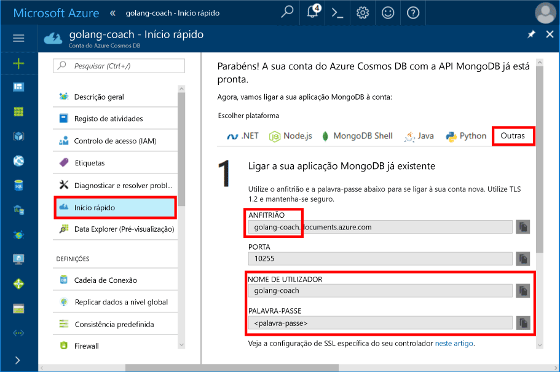
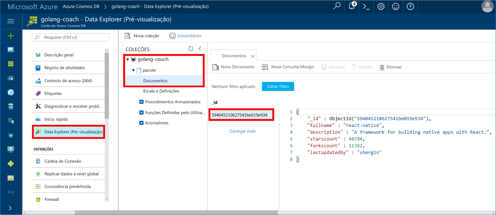

# <a name="azure-cosmos-db-build-a-mongodb-api-console-app-with-golang-and-hello-azure-portal"></a><span data-ttu-id="4a07b-103">BD do Azure do Cosmos: Criar uma aplicação de consola do MongoDB API com Golang e Olá portal do Azure</span><span class="sxs-lookup"><span data-stu-id="4a07b-103">Azure Cosmos DB: Build a MongoDB API console app with Golang and hello Azure portal</span></span>

<span data-ttu-id="4a07b-104">O Azure Cosmos DB é um serviço de bases de dados com vários modelos e distribuído globalmente da Microsoft.</span><span class="sxs-lookup"><span data-stu-id="4a07b-104">Azure Cosmos DB is Microsoft’s globally distributed multi-model database service.</span></span> <span data-ttu-id="4a07b-105">Pode criar e consultar documentos, chave/valor e bases de dados de gráfico, sendo todas beneficiam das capacidades de dimensionamento horizontal núcleo Olá da base de dados do Azure Cosmos e distribuição global Olá rapidamente.</span><span class="sxs-lookup"><span data-stu-id="4a07b-105">You can quickly create and query document, key/value, and graph databases, all of which benefit from hello global distribution and horizontal scale capabilities at hello core of Azure Cosmos DB.</span></span>

<span data-ttu-id="4a07b-106">Este início rápido demonstra como toouse existente [MongoDB](https://docs.microsoft.com/en-us/azure/cosmos-db/mongodb-introduction) aplicações escritas no [Golang](https://golang.org/) e ligá-lo tooyour Azure Cosmos DB da base de dados, que suporta ligações de cliente do MongoDB.</span><span class="sxs-lookup"><span data-stu-id="4a07b-106">This quick-start demonstrates how toouse an existing [MongoDB](https://docs.microsoft.com/en-us/azure/cosmos-db/mongodb-introduction) app written in [Golang](https://golang.org/) and connect it tooyour Azure Cosmos DB database, which supports MongoDB client connections.</span></span>

<span data-ttu-id="4a07b-107">Por outras palavras, a aplicação de Golang apenas sabe que está a ligar tooa base de dados com APIs do MongoDB.</span><span class="sxs-lookup"><span data-stu-id="4a07b-107">In other words, your Golang application only knows that it's connecting tooa database using MongoDB APIs.</span></span> <span data-ttu-id="4a07b-108">É transparente toohello aplicação Olá dados é armazenada na base de dados do Azure Cosmos.</span><span class="sxs-lookup"><span data-stu-id="4a07b-108">It is transparent toohello application that hello data is stored in Azure Cosmos DB.</span></span>

## <a name="prerequisites"></a><span data-ttu-id="4a07b-109">Pré-requisitos</span><span class="sxs-lookup"><span data-stu-id="4a07b-109">Prerequisites</span></span>

- <span data-ttu-id="4a07b-110">Uma subscrição do Azure.</span><span class="sxs-lookup"><span data-stu-id="4a07b-110">An Azure subscription.</span></span> <span data-ttu-id="4a07b-111">Se não tiver uma subscrição do Azure, crie uma [conta gratuita](https://azure.microsoft.com/free) antes de começar.</span><span class="sxs-lookup"><span data-stu-id="4a07b-111">If you don’t have an Azure subscription, create a [free account](https://azure.microsoft.com/free) before you begin.</span></span>
- <span data-ttu-id="4a07b-112">[Aceda](https://golang.org/dl/) e um conhecimento básico de Olá [aceda](https://golang.org/) idioma.</span><span class="sxs-lookup"><span data-stu-id="4a07b-112">[Go](https://golang.org/dl/) and a basic knowledge of hello [Go](https://golang.org/) language.</span></span>
- <span data-ttu-id="4a07b-113">Um IDE — [Gogland](https://www.jetbrains.com/go/) da Jetbrains, o [Visual Studio Code](https://code.visualstudio.com/) da Microsoft ou o [Atom](https://atom.io/).</span><span class="sxs-lookup"><span data-stu-id="4a07b-113">An IDE — [Gogland](https://www.jetbrains.com/go/) by Jetbrains, [Visual Studio Code](https://code.visualstudio.com/) by Microsoft, or [Atom](https://atom.io/).</span></span> <span data-ttu-id="4a07b-114">Neste tutorial, estamos a utilizar o Goglang.</span><span class="sxs-lookup"><span data-stu-id="4a07b-114">In this tutorial, I'm using Goglang.</span></span>

<a id="create-account"></a>
## <a name="create-a-database-account"></a><span data-ttu-id="4a07b-115">Criar uma conta de base de dados</span><span class="sxs-lookup"><span data-stu-id="4a07b-115">Create a database account</span></span>

[!INCLUDE [cosmos-db-create-dbaccount](../../includes/cosmos-db-create-dbaccount-mongodb.md)]

## <a name="clone-hello-sample-application"></a><span data-ttu-id="4a07b-116">Aplicação de exemplo de Olá do clone</span><span class="sxs-lookup"><span data-stu-id="4a07b-116">Clone hello sample application</span></span>

<span data-ttu-id="4a07b-117">Clone a aplicação de exemplo de Olá e instalar pacotes de Olá necessário.</span><span class="sxs-lookup"><span data-stu-id="4a07b-117">Clone hello sample application and install hello required packages.</span></span>

1. <span data-ttu-id="4a07b-118">Crie uma pasta denominada CosmosDBSample Olá GOROOT\src pasta, o que é C:\Go\ por predefinição.</span><span class="sxs-lookup"><span data-stu-id="4a07b-118">Create a folder named CosmosDBSample inside hello GOROOT\src folder, which is C:\Go\ by default.</span></span>
2. <span data-ttu-id="4a07b-119">Execute Olá seguir o comando utilizando uma janela de terminal do git, tais como o repositório do git bash tooclone Olá exemplo na pasta de CosmosDBSample Olá.</span><span class="sxs-lookup"><span data-stu-id="4a07b-119">Run hello following command using a git terminal window such as git bash tooclone hello sample repository into hello CosmosDBSample folder.</span></span> 

    ```bash
    git clone https://github.com/Azure-Samples/azure-cosmos-db-mongodb-golang-getting-started.git
    ```
3.  <span data-ttu-id="4a07b-120">Execute Olá pacote do comando tooget Olá mgo a seguir.</span><span class="sxs-lookup"><span data-stu-id="4a07b-120">Run hello following command tooget hello mgo package.</span></span> 

    ```
    go get gopkg.in/mgo.v2
    ```

<span data-ttu-id="4a07b-121">Olá [mgo](http://labix.org/mgo) controlador (pronuncia-se como *mango*) é um [MongoDB](http://www.mongodb.org/) controlador para Olá [aceda idioma](http://golang.org/) que implementa um avançada e também testado seleção de funcionalidades numa API muito simple padrão aceda idioms a seguir.</span><span class="sxs-lookup"><span data-stu-id="4a07b-121">hello [mgo](http://labix.org/mgo) driver (pronounced as *mango*) is a [MongoDB](http://www.mongodb.org/) driver for hello [Go language](http://golang.org/) that implements a rich and well tested selection of features under a very simple API following standard Go idioms.</span></span>

<a id="connection-string"></a>

## <a name="update-your-connection-string"></a><span data-ttu-id="4a07b-122">Atualizar a cadeia de ligação</span><span class="sxs-lookup"><span data-stu-id="4a07b-122">Update your connection string</span></span>

<span data-ttu-id="4a07b-123">Agora, volte atrás toohello tooget portal do Azure que as informações de cadeia de ligação e copie-o para a aplicação Olá.</span><span class="sxs-lookup"><span data-stu-id="4a07b-123">Now go back toohello Azure portal tooget your connection string information and copy it into hello app.</span></span>

1. <span data-ttu-id="4a07b-124">Clique em **início rápido** no Olá menu de navegação esquerdo e, em seguida, clique em **outros** tooview Olá ligação cadeia informações necessárias pela Olá aceda aplicação.</span><span class="sxs-lookup"><span data-stu-id="4a07b-124">Click **Quick start** in hello left navigation menu, and then click **Other** tooview hello connection string information required by hello Go application.</span></span>

2. <span data-ttu-id="4a07b-125">No Goglang, abra o ficheiro de main.go de Olá no diretório de GOROOT\CosmosDBSample Olá e atualizar Olá seguintes linhas de código utilizando Olá cadeia as informações de ligação Olá portal do Azure, conforme mostrado na seguinte captura de ecrã de Olá.</span><span class="sxs-lookup"><span data-stu-id="4a07b-125">In Goglang, open hello main.go file in hello GOROOT\CosmosDBSample directory and update hello following lines of code using hello connection string information from hello Azure portal as shown in hello following screenshot.</span></span> 

    <span data-ttu-id="4a07b-126">nome da base de dados de Olá é o prefixo de Olá de Olá **anfitrião** valor no painel de cadeia de ligação de portal do Azure Olá.</span><span class="sxs-lookup"><span data-stu-id="4a07b-126">hello Database name is hello prefix of hello **Host** value in hello Azure portal connection string pane.</span></span> <span data-ttu-id="4a07b-127">Para a conta de Olá mostrada na imagem de Olá abaixo, o nome de base de dados de Olá é golang ministrar.</span><span class="sxs-lookup"><span data-stu-id="4a07b-127">For hello account shown in hello image below, hello Database name is golang-coach.</span></span>

    ```go
    Database: "hello prefix of hello Host value in hello Azure portal",
    Username: "hello Username in hello Azure portal",
    Password: "hello Password in hello Azure portal",
    ```

    

3. <span data-ttu-id="4a07b-129">Guarde o ficheiro de main.go Olá.</span><span class="sxs-lookup"><span data-stu-id="4a07b-129">Save hello main.go file.</span></span>

## <a name="review-hello-code"></a><span data-ttu-id="4a07b-130">Rever o código de Olá</span><span class="sxs-lookup"><span data-stu-id="4a07b-130">Review hello code</span></span>

<span data-ttu-id="4a07b-131">Certifiquemo-numa revisão rápida do que está a acontecer no ficheiro de main.go Olá.</span><span class="sxs-lookup"><span data-stu-id="4a07b-131">Let's make a quick review of what's happening in hello main.go file.</span></span> 

### <a name="connecting-hello-go-app-tooazure-cosmos-db"></a><span data-ttu-id="4a07b-132">Ligar Olá aceda aplicação tooAzure Cosmos DB</span><span class="sxs-lookup"><span data-stu-id="4a07b-132">Connecting hello Go app tooAzure Cosmos DB</span></span>

<span data-ttu-id="4a07b-133">BD do Azure do Cosmos suporta Olá MongoDB SSL ativado.</span><span class="sxs-lookup"><span data-stu-id="4a07b-133">Azure Cosmos DB supports hello SSL-enabled MongoDB.</span></span> <span data-ttu-id="4a07b-134">tooconnect tooan MongoDB SSL ativado, terá de toodefine Olá **DialServer** funcionar [mgo. DialInfo](http://gopkg.in/mgo.v2#DialInfo)e a utilização de Olá [tls. *Marcação* ](http://golang.org/pkg/crypto/tls#Dial) ligação de Olá tooperform de função.</span><span class="sxs-lookup"><span data-stu-id="4a07b-134">tooconnect tooan SSL-enabled MongoDB, you need toodefine hello **DialServer** function in [mgo.DialInfo](http://gopkg.in/mgo.v2#DialInfo), and make use of hello [tls.*Dial*](http://golang.org/pkg/crypto/tls#Dial) function tooperform hello connection.</span></span>

<span data-ttu-id="4a07b-135">Olá seguinte fragmento de código Golang liga ao hello aceda aplicação API do Azure Cosmos DB MongoDB.</span><span class="sxs-lookup"><span data-stu-id="4a07b-135">hello following Golang code snippet connects hello Go app with Azure Cosmos DB MongoDB API.</span></span> <span data-ttu-id="4a07b-136">Olá *DialInfo* classe contém opções para estabelecer uma sessão com um cluster do MongoDB.</span><span class="sxs-lookup"><span data-stu-id="4a07b-136">hello *DialInfo* class holds options for establishing a session with a MongoDB cluster.</span></span>

```go
// DialInfo holds options for establishing a session with a MongoDB cluster.
dialInfo := &mgo.DialInfo{
    Addrs:    []string{"golang-couch.documents.azure.com:10255"}, // Get HOST + PORT
    Timeout:  60 * time.Second,
    Database: "database", // It can be anything
    Username: "username", // Username
    Password: "Azure database connect password from Azure Portal", // PASSWORD
    DialServer: func(addr *mgo.ServerAddr) (net.Conn, error) {
        return tls.Dial("tcp", addr.String(), &tls.Config{})
    },
}

// Create a session which maintains a pool of socket connections
// tooour Azure Cosmos DB MongoDB database.
session, err := mgo.DialWithInfo(dialInfo)

if err != nil {
    fmt.Printf("Can't connect toomongo, go error %v\n", err)
    os.Exit(1)
}

defer session.Close()

// SetSafe changes hello session safety mode.
// If hello safe parameter is nil, hello session is put in unsafe mode, 
// and writes become fire-and-forget,
// without error checking. hello unsafe mode is faster since operations won't hold on waiting for a confirmation.
// 
session.SetSafe(&mgo.Safe{})
```

<span data-ttu-id="4a07b-137">Olá **mgo. Dial()** é utilizado o método quando não existe nenhuma ligação de SSL.</span><span class="sxs-lookup"><span data-stu-id="4a07b-137">hello **mgo.Dial()** method is used when there is no SSL connection.</span></span> <span data-ttu-id="4a07b-138">Para uma ligação SSL, Olá **mgo. DialWithInfo()** método não é necessário.</span><span class="sxs-lookup"><span data-stu-id="4a07b-138">For an SSL connection, hello **mgo.DialWithInfo()** method is required.</span></span>

<span data-ttu-id="4a07b-139">Uma instância de Olá **{} de DialWIthInfo** objeto é o objeto de sessão de Olá toocreate utilizados.</span><span class="sxs-lookup"><span data-stu-id="4a07b-139">An instance of hello **DialWIthInfo{}** object is used toocreate hello session object.</span></span> <span data-ttu-id="4a07b-140">Assim que a sessão de Olá é estabelecida, pode aceder a coleção de Olá utilizando Olá seguinte fragmento de código:</span><span class="sxs-lookup"><span data-stu-id="4a07b-140">Once hello session is established, you can access hello collection by using hello following code snippet:</span></span>

```go
collection := session.DB(“database”).C(“package”)
```

<a id="create-document"></a>

### <a name="create-a-document"></a><span data-ttu-id="4a07b-141">Criar um documento</span><span class="sxs-lookup"><span data-stu-id="4a07b-141">Create a document</span></span>

```go
// Model
type Package struct {
    Id bson.ObjectId  `bson:"_id,omitempty"`
    FullName      string
    Description   string
    StarsCount    int
    ForksCount    int
    LastUpdatedBy string
}

// insert Document in collection
err = collection.Insert(&Package{
    FullName:"react",
    Description:"A framework for building native apps with React.",
    ForksCount: 11392,
    StarsCount:48794,
    LastUpdatedBy:"shergin",

})

if err != nil {
    log.Fatal("Problem inserting data: ", err)
    return
}
```

### <a name="query-or-read-a-document"></a><span data-ttu-id="4a07b-142">Consultar ou ler um documento</span><span class="sxs-lookup"><span data-stu-id="4a07b-142">Query or read a document</span></span>

<span data-ttu-id="4a07b-143">O Azure Cosmos DB suporta consultas extensas de documentos JSON armazenados em cada coleção.</span><span class="sxs-lookup"><span data-stu-id="4a07b-143">Azure Cosmos DB supports rich queries against JSON documents stored in each collection.</span></span> <span data-ttu-id="4a07b-144">Olá código de exemplo seguinte mostra uma consulta que pode ser executado contra documentos Olá na sua coleção.</span><span class="sxs-lookup"><span data-stu-id="4a07b-144">hello following sample code shows a query that you can run against hello documents in your collection.</span></span>

```go
// Get a Document from hello collection
result := Package{}
err = collection.Find(bson.M{"fullname": "react"}).One(&result)
if err != nil {
    log.Fatal("Error finding record: ", err)
    return
}

fmt.Println("Description:", result.Description)
```


### <a name="update-a-document"></a><span data-ttu-id="4a07b-145">Atualizar um documento</span><span class="sxs-lookup"><span data-stu-id="4a07b-145">Update a document</span></span>

```go
// Update a document
updateQuery := bson.M{"_id": result.Id}
change := bson.M{"$set": bson.M{"fullname": "react-native"}}
err = collection.Update(updateQuery, change)
if err != nil {
    log.Fatal("Error updating record: ", err)
    return
}
```

### <a name="delete-a-document"></a><span data-ttu-id="4a07b-146">Eliminar um documento</span><span class="sxs-lookup"><span data-stu-id="4a07b-146">Delete a document</span></span>

<span data-ttu-id="4a07b-147">O Azure Cosmos DB suporta a eliminação de documentos JSON.</span><span class="sxs-lookup"><span data-stu-id="4a07b-147">Azure Cosmos DB supports deleting JSON documents.</span></span>

```go
// Delete a document
query := bson.M{"_id": result.Id}
err = collection.Remove(query)
if err != nil {
   log.Fatal("Error deleting record: ", err)
   return
}
```
    
## <a name="run-hello-app"></a><span data-ttu-id="4a07b-148">Executar a aplicação Olá</span><span class="sxs-lookup"><span data-stu-id="4a07b-148">Run hello app</span></span>

1. <span data-ttu-id="4a07b-149">No Goglang, certifique-se de que o GOPATH (disponível em **ficheiro**, **definições**, **aceda**, **GOPATH**) incluem a localização de Olá no qual Olá gopkg foi instalado, que é USERPROFILE\go por predefinição.</span><span class="sxs-lookup"><span data-stu-id="4a07b-149">In Goglang, ensure that your GOPATH (available under **File**, **Settings**, **Go**, **GOPATH**) include hello location in which hello gopkg was installed, which is USERPROFILE\go by default.</span></span> 
2. <span data-ttu-id="4a07b-150">Comente linhas Olá que elimina o documento de Olá, linhas 91-96, para que possa ver documentos Olá após a aplicação Olá em execução.</span><span class="sxs-lookup"><span data-stu-id="4a07b-150">Comment out hello lines that delete hello document, lines 91-96, so that you can see hello document after running hello app.</span></span>
3. <span data-ttu-id="4a07b-151">No Goglang, clique em **Executar**e, em seguida, clique em **Executar “Criar main.go e executar”**.</span><span class="sxs-lookup"><span data-stu-id="4a07b-151">In Goglang, click **Run**, and then click **Run 'Build main.go and run'**.</span></span>

    <span data-ttu-id="4a07b-152">aplicação Olá concluída e apresenta a descrição de Olá documento Olá criado no [criar um documento](#create-document).</span><span class="sxs-lookup"><span data-stu-id="4a07b-152">hello app finishes and displays hello description of hello document created in [Create a document](#create-document).</span></span>
    
    ```
    Description: A framework for building native apps with React.
    
    Process finished with exit code 0
    ```

    
    
## <a name="review-your-document-in-data-explorer"></a><span data-ttu-id="4a07b-154">Rever o documento no Data Explorer</span><span class="sxs-lookup"><span data-stu-id="4a07b-154">Review your document in Data Explorer</span></span>

<span data-ttu-id="4a07b-155">Volte toohello toosee portal do Azure o documento no Explorador de dados.</span><span class="sxs-lookup"><span data-stu-id="4a07b-155">Go back toohello Azure portal toosee your document in Data Explorer.</span></span>

1. <span data-ttu-id="4a07b-156">Clique em **Explorador de dados (pré-visualização)** no menu de navegação esquerdo Olá, expanda **golang ministrar**, **pacote**e, em seguida, clique em **documentos**.</span><span class="sxs-lookup"><span data-stu-id="4a07b-156">Click **Data Explorer (Preview)** in hello left navigation menu, expand **golang-coach**, **package**, and then click **Documents**.</span></span> <span data-ttu-id="4a07b-157">No Olá **documentos** separador, clique em Olá \_documento de Olá toodisplay id no painel direito Olá.</span><span class="sxs-lookup"><span data-stu-id="4a07b-157">In hello **Documents** tab, click hello \_id toodisplay hello document in hello right pane.</span></span> 

    
    
2. <span data-ttu-id="4a07b-159">Pode trabalhar com Olá documento inline e clique em **atualização** toosave-lo.</span><span class="sxs-lookup"><span data-stu-id="4a07b-159">You can then work with hello document inline and click **Update** toosave it.</span></span> <span data-ttu-id="4a07b-160">Também pode eliminar Olá documento ou criar novos documentos ou consultas.</span><span class="sxs-lookup"><span data-stu-id="4a07b-160">You can also delete hello document, or create new documents or queries.</span></span>

## <a name="review-slas-in-hello-azure-portal"></a><span data-ttu-id="4a07b-161">Reveja os SLAs no Olá portal do Azure</span><span class="sxs-lookup"><span data-stu-id="4a07b-161">Review SLAs in hello Azure portal</span></span>

[!INCLUDE [cosmosdb-tutorial-review-slas](../../includes/cosmos-db-tutorial-review-slas.md)]

## <a name="clean-up-resources"></a><span data-ttu-id="4a07b-162">Limpar recursos</span><span class="sxs-lookup"><span data-stu-id="4a07b-162">Clean up resources</span></span>

<span data-ttu-id="4a07b-163">Se não toocontinue toouse esta aplicação, elimine todos os recursos criados por este guia de introdução no Olá portal do Azure com Olá os seguintes passos:</span><span class="sxs-lookup"><span data-stu-id="4a07b-163">If you're not going toocontinue toouse this app, delete all resources created by this quickstart in hello Azure portal with hello following steps:</span></span>

1. <span data-ttu-id="4a07b-164">No menu da esquerda de Olá no Olá portal do Azure, clique em **grupos de recursos** e, em seguida, clique em nome de Olá do recurso de Olá que criou.</span><span class="sxs-lookup"><span data-stu-id="4a07b-164">From hello left-hand menu in hello Azure portal, click **Resource groups** and then click hello name of hello resource you created.</span></span> 
2. <span data-ttu-id="4a07b-165">Na sua página de grupo de recursos, clique em **eliminar**, escreva o nome de Olá de Olá recursos toodelete na caixa de texto Olá e, em seguida, clique em **eliminar**.</span><span class="sxs-lookup"><span data-stu-id="4a07b-165">On your resource group page, click **Delete**, type hello name of hello resource toodelete in hello text box, and then click **Delete**.</span></span>

## <a name="next-steps"></a><span data-ttu-id="4a07b-166">Passos seguintes</span><span class="sxs-lookup"><span data-stu-id="4a07b-166">Next steps</span></span>

<span data-ttu-id="4a07b-167">Este guia de introdução, aprendeu como toocreate uma conta de base de dados do Azure Cosmos e execute uma aplicação de Golang utilizando hello API para MongoDB.</span><span class="sxs-lookup"><span data-stu-id="4a07b-167">In this quickstart, you've learned how toocreate an Azure Cosmos DB account and run a Golang app using hello API for MongoDB.</span></span> <span data-ttu-id="4a07b-168">Agora pode importar a conta de base de dados do Cosmos tooyour de dados adicionais.</span><span class="sxs-lookup"><span data-stu-id="4a07b-168">You can now import additional data tooyour Cosmos DB account.</span></span> 

> [!div class="nextstepaction"]
> [<span data-ttu-id="4a07b-169">Importe dados para a base de dados do Azure Cosmos para Olá API do MongoDB</span><span class="sxs-lookup"><span data-stu-id="4a07b-169">Import data into Azure Cosmos DB for hello MongoDB API</span></span>](mongodb-migrate.md)
