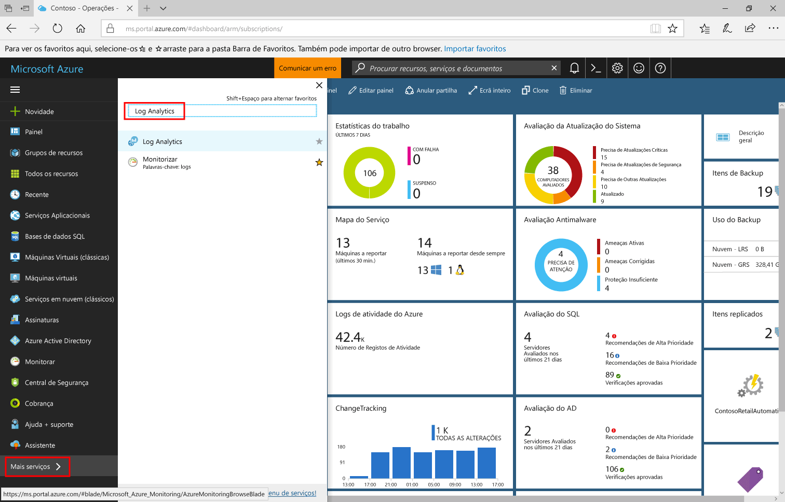
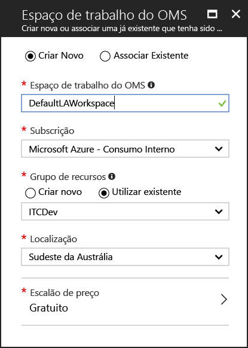

# Criar uma área de trabalho de análise de registos no portal do Azure
No Portal do Azure que pode configurar uma área de trabalho de análise de registos, que é um ambiente de análise de registos exclusivo com as suas próprias repositório de dados, as origens de dados e soluções.  Os passos descritos neste artigo são necessários se de que pretende recolher dados das seguintes origens:

* Recursos do Azure na sua subscrição
* Computadores monitorizados pelo System Center Operations Manager no local
* Coleções de dispositivos do System Center Configuration Manager 
* Dados de diagnóstico ou de registo do armazenamento do Azure

Para outras origens, como VMs do Azure e os computadores Windows ou Linux no seu ambiente, consulte os tópicos seguintes:

*  [Recolher dados sobre máquinas virtuais do Azure](log-analytics-quick-collect-azurevm.md) 
*  [Recolher dados sobre computadores com Linux](log-analytics-quick-collect-linux-computer.md)
*  [Recolher dados sobre computadores Windows](log-analytics-quick-collect-windows-computer.md)

Se não tiver uma subscrição do Azure, crie uma [conta gratuita](https://azure.microsoft.com/free/?WT.mc_id=A261C142F) antes de começar.

## Inicie sessão no portal do Azure
Inicie sessão no portal do Azure em [https://portal.azure.com](https://portal.azure.com). 

## Criar áreas de trabalho
1. No portal do Azure, clique em **mais serviços** encontrado no canto inferior esquerdo. Na lista de recursos, escreva **Log Analytics**. À medida que começa a escrever, a lista filtra com base na sua entrada. Selecione **Iniciar análise**.       
2. Clique em **criar**e, em seguida, selecione as opções para os seguintes itens:

  * Forneça um nome para o novo **área de trabalho OMS**, tais como *DefaultLAWorkspace*. 
  * Selecione uma **Subscrição** à qual ligar ao escolher na lista pendente se a predefinição selecionada não é adequada.
  * Para **grupo de recursos**, optar por utilizar um recurso existente grupo já configuração ou crie um novo.  
  * Selecione um disponível **localização**.  Para obter mais informações, consulte o artigo que [regiões análise de registos está disponível no](https://azure.microsoft.com/regions/services/).
  * Pode escolher entre três diferentes **escalões de preço** na análise de registos, mas para este guia de introdução que vai selecionar o **livre** camada.  Para obter informações adicionais sobre as camadas específicas, consulte [detalhes de preços de análise do registo](https://azure.microsoft.com/pricing/details/log-analytics/).

           
3. Depois de fornecer as informações necessárias sobre o **área de trabalho OMS** painel, clique em **OK**.  

Enquanto as informações são confirmadas e a área de trabalho criada, pode acompanhar o progresso em **Notificações**, no menu. 

## Passos seguintes
Agora que tem uma área de trabalho disponível, pode configurar a recolha de monitorização de telemetria, executar pesquisas de registo para analisar os dados e adicionar uma solução de gestão para fornecer dados adicionais e informações de análise. 

* Para ativar a recolha de dados a partir dos recursos do Azure com o diagnóstico do Azure ou o armazenamento do Azure, consulte [métricas para utilização na análise de registos e registos do serviço Azure recolher](log-analytics-azure-storage.md).  
* [Adicionar o System Center Operations Manager como uma origem de dados](log-analytics-om-agents.md) para recolher dados de agentes de relatórios do seu grupo de gestão do Operations Manager e guarde-o no seu repositório de área de trabalho de análise de registos. 
* Ligar [do Configuration Manager](log-analytics-sccm.md) para importar a computadores que são membros de coleções na hierarquia.  
* Reveja o [soluções de gestão](/log-analytics-add-solutions.md) disponíveis e como adicionar ou remover uma solução da sua área de trabalho.

