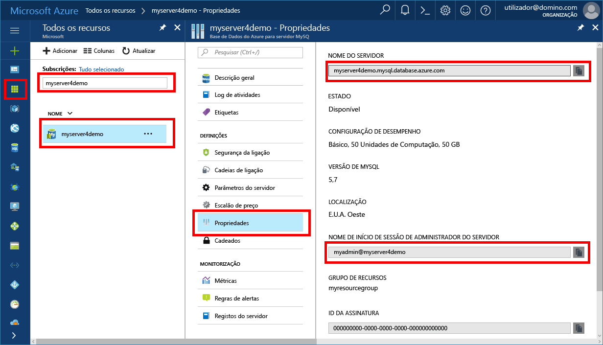

# <a name="azure-database-for-mysql-use-connectorc-tooconnect-and-query-data"></a>Base de dados do Azure para MySQL: tooconnect e consulta de dados de utilização conector/C++
Este guia de introdução demonstra como tooconnect tooan Azure base de dados para MySQL utilizando uma aplicação de C++. Mostra como toouse SQL instruções tooquery, inserir, atualizar e eliminar os dados na base de dados de Olá. Olá passos deste artigo partem do princípio de que está familiarizado com o desenvolvimento utilizando C++ e que é novo tooworking com base de dados do Azure para MySQL.

## <a name="prerequisites"></a>Pré-requisitos
Este guia de introdução utiliza recursos Olá criados destes guias como um ponto de partida:
- [Criar uma Base de Dados do Azure para o servidor MySQL com o portal do Azure](./quickstart-create-mysql-server-database-using-azure-portal.md)
- [Criar uma Base de Dados do Azure para o servidor MySQL com a CLI do Azure](./quickstart-create-mysql-server-database-using-azure-cli.md)

Também tem de:
- Instalar o [.NET Framework](https://www.microsoft.com/net/download)
- Instalar o [Visual Studio](https://www.visualstudio.com/downloads/)
- Instalar o [MySQL Connector/C++](https://dev.mysql.com/downloads/connector/cpp/) 
- Instalar o [Boost](http://www.boost.org/)

## <a name="install-visual-studio-and-net"></a>Instalar o Visual Studio e .NET
Olá passos nesta secção partem do princípio de que está familiarizado com o desenvolvimento através do .NET.

### <a name="windows"></a>**Windows**
1. Instale o Visual Studio 2017 Community, o qual é um IDE gratuito, extensível e repleto de funcionalidades para criar aplicações modernas para Android, iOS e Windows, bem como aplicações Web e de bases de dados e serviços cloud. Pode instalar o Olá completa do .NET Framework ou apenas .NET Core. Olá fragmentos de código em projetos de início rápido Olá com uma. Se já tiver o Visual Studio instalado no seu computador, ignore Olá junto dois passos.
   - Transferir Olá [instalador do Visual Studio 2017](https://www.visualstudio.com/thank-you-downloading-visual-studio/?sku=Community&rel=15). 
   - Execute o instalador Olá e siga Olá instalação pede toocomplete Olá instalação.

### <a name="configure-visual-studio"></a>**Configurar o Visual Studio**
1. Propriedade do projeto do Visual Studio, > propriedades de configuração > C/C++ > linker > geral > diretórios de bibliotecas adicionais, adicione o diretório de lib\opt Olá (ou seja,: C:\Program Files (x86) \MySQL\MySQL conector C++ 1.1.9\lib\opt) de Olá c + + conector.
2. No Visual Studio, project property > configuration properties > C/C++ > general > additional include directories
   - Adicione o diretório include/ do conector C++ (ou seja: C:\Programas (x86)\MySQL\MySQL Connector C++ 1.1.9\include\)
   - Adicione o diretório de raiz da biblioteca Boost (ou seja: C:\boost_1_64_0\)
3. Propriedade do projeto do Visual Studio, > propriedades de configuração > C/C++ > linker > entrada > dependências adicionais, adicionar o campo de texto Olá mysqlcppconn.lib
4. O mysqlcppconn.dll de cópia de Olá c + + conector pasta de biblioteca no passo 3 toohello mesmo diretório que o executável da aplicação Olá ou adicioná-la toohello variável de ambiente para a aplicação possa encontrar.

## <a name="get-connection-information"></a>Obter informações da ligação
Obter Olá ligação informações necessárias tooconnect toohello base de dados do Azure para MySQL. Terá de Olá credenciais de início de sessão e nome de servidor completamente qualificado.

1. Inicie sessão no toohello [portal do Azure](https://portal.azure.com/).
2. No menu da esquerda Olá, no portal do Azure, clique em **todos os recursos** e procure o servidor de Olá que criou, tais como **myserver4demo**.
3. Clique no nome do servidor de Olá.
4. Servidor de Olá selecione **propriedades** página. Tome nota do Olá **nome do servidor** e **nome de início de sessão de administração do servidor**.
 
5. Se se esquecer da sua informações de início de sessão do servidor, navegue até toohello **descrição geral** página nome de início de sessão de administrador de servidor Olá tooview e, se necessário, de reposição de palavra-passe de Olá.

## <a name="connect-create-table-and-insert-data"></a>Ligar, criar tabela e inserir dados
Seguinte Olá de utilização code tooconnect e carregar dados de Olá utilizando **CREATE TABLE** e **INSERT INTO** instruções SQL. código de Olá utiliza sql::Driver classe com Olá connect() método tooestablish tooMySQL uma ligação. Em seguida, o código de Olá utiliza método createStatement() e execute () toorun Olá da base de dados comandos. 

Substitua os parâmetros de anfitrião, DBName, utilizador e palavra-passe de Olá valores Olá que especificou quando criou o servidor de Olá e base de dados. 

```c++
#include <stdlib.h>
#include <iostream>
#include "stdafx.h"

#include "mysql_connection.h"
#include <cppconn/driver.h>
#include <cppconn/exception.h>
#include <cppconn/prepared_statement.h>
using namespace std;

int main()
{
    sql::Driver *driver;
    sql::Connection *con;
    sql::Statement *stmt;
    sql::PreparedStatement *pstmt;

    try
    {
        driver = get_driver_instance();
        //for demonstration only. never save password in hello code!
        con = driver>connect("tcp://myserver4demo.mysql.database.azure.com:3306/quickstartdb", "myadmin@myserver4demo", "server_admin_password");
    }
    catch (sql::SQLException e)
    {
        cout << "Could not connect toodatabase. Error message: " << e.what() << endl;
        system("pause");
        exit(1);
    }

    stmt = con>createStatement();
    stmt>execute("DROP TABLE IF EXISTS inventory");
    cout << "Finished dropping table (if existed)" << endl;
    stmt>execute("CREATE TABLE inventory (id serial PRIMARY KEY, name VARCHAR(50), quantity INTEGER);");
    cout << "Finished creating table" << endl;
    delete stmt;

    pstmt = con>prepareStatement("INSERT INTO inventory(name, quantity) VALUES(?,?)");
    pstmt>setString(1, "banana");
    pstmt>setInt(2, 150);
    pstmt>execute();
    cout << "One row inserted." << endl;

    pstmt>setString(1, "orange");
    pstmt>setInt(2, 154);
    pstmt>execute();
    cout << "One row inserted." << endl;

    pstmt>setString(1, "apple");
    pstmt>setInt(2, 100);
    pstmt>execute();
    cout << "One row inserted." << endl;
    
    delete pstmt;   
    delete con;
    system("pause");
    return 0;

```

## <a name="read-data"></a>Ler dados

Seguinte de Olá utilize code tooconnect e ler Olá dados utilizando um **SELECIONE** instrução SQL. código de Olá utiliza sql::Driver classe com Olá connect() método tooestablish tooMySQL uma ligação. Em seguida, código de Olá utiliza o método prepareStatement() e executeQuery() toorun Olá selecione comandos. Por fim, o código de Olá utiliza next() tooadvance toohello registos nos resultados de Olá. Em seguida, o código de Olá utiliza valores de Olá tooparse getInt() e GetString () no registo de Olá.

Substitua os parâmetros de anfitrião, DBName, utilizador e palavra-passe de Olá valores Olá que especificou quando criou o servidor de Olá e base de dados. 

```csharp
#include <stdlib.h>
#include <iostream>
#include "stdafx.h"

#include "mysql_connection.h"
#include <cppconn/driver.h>
#include <cppconn/exception.h>
#include <cppconn/resultset.h>
#include <cppconn/prepared_statement.h>
using namespace std;

int main()
{
    sql::Driver *driver;
    sql::Connection *con;
    sql::PreparedStatement *pstmt;
    sql::ResultSet *result;

    try
    {
        driver = get_driver_instance();
        //for demonstration only. never save password in hello code!
        con = driver>connect("tcp://myserver4demo.mysql.database.azure.com:3306/quickstartdb", "myadmin@myserver4demo", "server_admin_password");
    }
    catch (sql::SQLException e)
    {
        cout << "Could not connect toodatabase. Error message: " << e.what() << endl;
        system("pause");
        exit(1);
    }   

//  select  
    pstmt = con>prepareStatement("SELECT * FROM inventory;");
    result = pstmt>executeQuery();  
    
    while (result>next())
        printf("Reading from table=(%d, %s, %d)\n", result>getInt(1), result>getString(2).c_str(), result>getInt(3));   
    
    delete result;
    delete pstmt;   
    delete con;
    system("pause");
    return 0;
}
```

## <a name="update-data"></a>Atualizar dados
Seguinte de Olá utilize code tooconnect e ler Olá dados utilizando um **ATUALIZAÇÃO** instrução SQL. código de Olá utiliza sql::Driver classe com Olá connect() método tooestablish tooMySQL uma ligação. Em seguida, o código de Olá utiliza método prepareStatement() e executeQuery() toorun Olá comandos de atualização. 

Substitua os parâmetros de anfitrião, DBName, utilizador e palavra-passe de Olá valores Olá que especificou quando criou o servidor de Olá e base de dados. 

```csharp
#include <stdlib.h>
#include <iostream>
#include "stdafx.h"

#include "mysql_connection.h"
#include <cppconn/driver.h>
#include <cppconn/exception.h>
#include <cppconn/prepared_statement.h>
using namespace std;

int main()
{
    sql::Driver *driver;
    sql::Connection *con;
    sql::PreparedStatement *pstmt;

    try
    {
        driver = get_driver_instance();
        //for demonstration only. never save password in hello code!
        con = driver>connect("tcp://myserver4demo.mysql.database.azure.com:3306/quickstartdb", "myadmin@myserver4demo", "server_admin_password");
    }
    catch (sql::SQLException e)
    {
        cout << "Could not connect toodatabase. Error message: " << e.what() << endl;
        system("pause");
        exit(1);
    }   

    //update
    pstmt = con>prepareStatement("UPDATE inventory SET quantity = ? WHERE name = ?");
    pstmt>setInt(1, 200);
    pstmt>setString(2, "banana");
    pstmt>executeQuery();
    printf("Row updated\n");
    
    delete con;
    delete pstmt;
    system("pause");
    return 0;
}
```


## <a name="delete-data"></a>Eliminar dados
Seguinte de Olá utilize code tooconnect e ler Olá dados utilizando um **eliminar** instrução SQL. código de Olá utiliza sql::Driver classe com Olá connect() método tooestablish tooMySQL uma ligação. Em seguida, o código de Olá utiliza prepareStatement() de método e executeQuery() toorun Olá eliminar comandos.

Substitua os parâmetros de anfitrião, DBName, utilizador e palavra-passe de Olá valores Olá que especificou quando criou o servidor de Olá e base de dados. 

```csharp
#include <stdlib.h>
#include <iostream>
#include "stdafx.h"

#include "mysql_connection.h"
#include <cppconn/driver.h>
#include <cppconn/exception.h>
#include <cppconn/resultset.h>
#include <cppconn/prepared_statement.h>
using namespace std;

int main()
{
    sql::Driver *driver;
    sql::Connection *con;
    sql::PreparedStatement *pstmt;
    sql::ResultSet *result;

    try
    {
        driver = get_driver_instance();
        //for demonstration only. never save password in hello code!
        con = driver>connect("tcp://myserver4demo.mysql.database.azure.com:3306/quickstartdb", "myadmin@myserver4demo", "server_admin_password");
    }
    catch (sql::SQLException e)
    {
        cout << "Could not connect toodatabase. Error message: " << e.what() << endl;
        system("pause");
        exit(1);
    }
        
    //delete
    pstmt = con>prepareStatement("DELETE FROM inventory WHERE name = ?");
    pstmt>setString(1, "orange");
    result = pstmt>executeQuery();
    printf("Row deleted\n");    
    
    delete pstmt;
    delete con;
    delete result;
    system("pause");
    return 0;
}
```

## <a name="next-steps"></a>Passos seguintes
> [!div class="nextstepaction"]
> [Migrar o tooAzure de base de dados MySQL da base de dados para utilizar a captura e restauro de MySQL](concepts-migrate-dump-restore.md)
