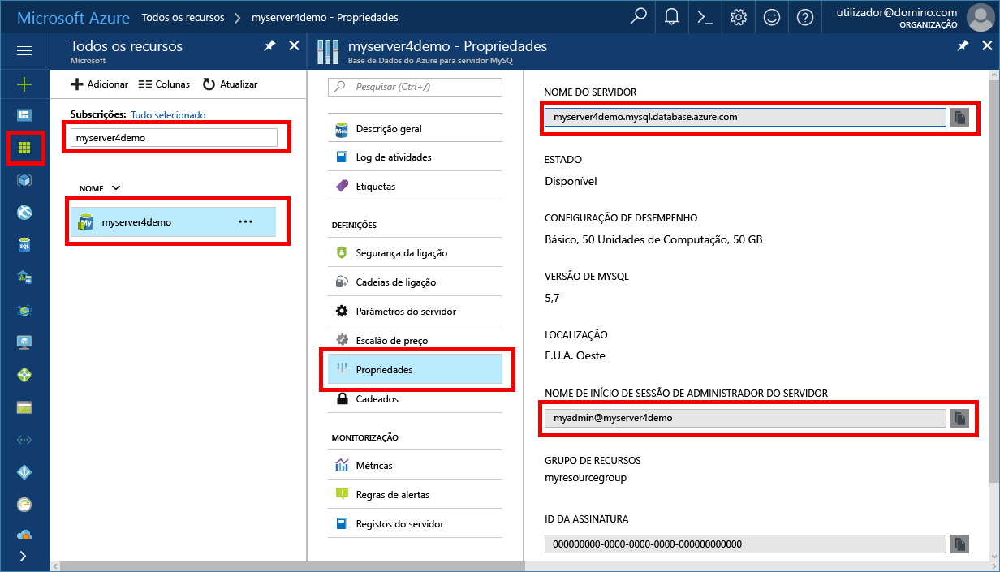

# <a name="azure-database-for-mysql-use-php-tooconnect-and-query-data"></a>Base de dados do Azure para MySQL: dados de utilização PHP tooconnect e consulta
Este guia de introdução demonstra como tooconnect tooan Azure base de dados para utilizar o MySQL um [PHP](http://php.net/manual/intro-whatis.php) aplicação. Mostra como toouse SQL instruções tooquery, inserir, atualizar e eliminar os dados na base de dados de Olá. Este artigo pressupõe que está familiarizado com o desenvolvimento com o PHP, mas que são tooworking nova com base de dados do Azure para MySQL.

## <a name="prerequisites"></a>Pré-requisitos
Este guia de introdução utiliza recursos Olá criados destes guias como um ponto de partida:
- [Criar uma Base de Dados do Azure para o servidor MySQL com o portal do Azure](./quickstart-create-mysql-server-database-using-azure-portal.md)
- [Criar uma Base de Dados do Azure para o servidor MySQL com a CLI do Azure](./quickstart-create-mysql-server-database-using-azure-cli.md)

## <a name="install-php"></a>Instalar o PHP
Instale o PHP no seu próprio servidor ou crie uma [aplicação Web](https://docs.microsoft.com/en-us/azure/app-service-web/app-service-web-overview) do Azure que inclua o PHP.

### <a name="macos"></a>MacOS
- Transfira a [versão 7.1.4 do PHP](http://php.net/downloads.php)
- Instalar o PHP e consulte toohello [PHP manual](http://php.net/manual/install.macosx.php) para configuração adicional

### <a name="linux-ubuntu"></a>Linux (Ubuntu)
- Transfira a [versão 7.1.4 do PHP (x64) não segura para threads](http://php.net/downloads.php)
- Instalar o PHP e consulte toohello [PHP manual](http://php.net/manual/install.unix.php) para configuração adicional

### <a name="windows"></a>Windows
- Transfira a [versão 7.1.4 do PHP (x64) não segura para threads](http://windows.php.net/download#php-7.1)
- Instalar o PHP e consulte toohello [PHP manual](http://php.net/manual/install.windows.php) para configuração adicional

## <a name="get-connection-information"></a>Obter informações da ligação
Obter Olá ligação informações necessárias tooconnect toohello base de dados do Azure para MySQL. Terá de Olá credenciais de início de sessão e nome de servidor completamente qualificado.

1. Inicie sessão no toohello [portal do Azure](https://portal.azure.com/).
2. No painel esquerdo Olá, clique em **todos os recursos**e, em seguida, procure servidor Olá criou (por exemplo, **myserver4demo**).
3. Clique no nome do servidor de Olá.
4. Servidor de Olá selecione **propriedades** página. Tome nota do Olá **nome do servidor** e **nome de início de sessão de administração do servidor**.
 
5. Se se esquecer da sua informações de início de sessão do servidor, navegue até toohello **descrição geral** página nome de início de sessão de administrador de servidor Olá tooview e, se necessário, de reposição de palavra-passe de Olá.

## <a name="connect-and-create-a-table"></a>Ligar-se e criar uma tabela
Code tooconnect a seguir de Olá de utilização e criar uma tabela utilizando **CREATE TABLE** instrução SQL. 

código de Olá utiliza Olá **MySQL melhorada extensão** classe (mysqli) incluído no PHP. Olá, métodos de chamada de código [mysqli_init](http://php.net/manual/mysqli.init.php) e [mysqli_real_connect](http://php.net/manual/mysqli.real-connect.php) tooconnect tooMySQL. Em seguida, chama o método [mysqli_query](http://php.net/manual/mysqli.query.php) consulta de Olá toorun. Em seguida, chama o método [mysqli_close](http://php.net/manual/mysqli.close.php) ligação de Olá tooclose.

Substitua os parâmetros de anfitrião, nome de utilizador, palavra-passe e db_name Olá os seus próprios valores. 

```php
<?php
$host = 'myserver4demo.mysql.database.azure.com';
$username = 'myadmin@myserver4demo';
$password = 'your_password';
$db_name = 'your_database';

//Establishes hello connection
$conn = mysqli_init();
mysqli_real_connect($conn, $host, $username, $password, $db_name, 3306);
if (mysqli_connect_errno($conn)) {
die('Failed tooconnect tooMySQL: '.mysqli_connect_error());
}

// Run hello create table query
if (mysqli_query($conn, '
CREATE TABLE Products (
`Id` INT NOT NULL AUTO_INCREMENT ,
`ProductName` VARCHAR(200) NOT NULL ,
`Color` VARCHAR(50) NOT NULL ,
`Price` DOUBLE NOT NULL ,
PRIMARY KEY (`Id`)
);
')) {
printf("Table created\n");
}

//Close hello connection
mysqli_close($conn);
?>
```

## <a name="insert-data"></a>Inserir dados
Code tooconnect a seguir de Olá de utilização e inserir dados, utilizando um **inserir** instrução SQL.

código de Olá utiliza Olá **MySQL melhorada extensão** classe (mysqli) incluído no PHP. código de Olá utiliza o método [mysqli_prepare](http://php.net/manual/mysqli.prepare.php) toocreate um preparado inserir declaração, em seguida, vincula Olá parâmetros para cada valor de coluna inseridas utilizando o método [mysqli_stmt_bind_param](http://php.net/manual/mysqli-stmt.bind-param.php). código de Olá executa a instrução de Olá utilizando o método [mysqli_stmt_execute](http://php.net/manual/mysqli-stmt.execute.php) e, posteriormente, fechar Olá instrução utilizando o método [mysqli_stmt_close](http://php.net/manual/mysqli-stmt.close.php).

Substitua os parâmetros de anfitrião, nome de utilizador, palavra-passe e db_name Olá os seus próprios valores. 

```php
<?php
$host = 'myserver4demo.mysql.database.azure.com';
$username = 'myadmin@myserver4demo';
$password = 'your_password';
$db_name = 'your_database';

//Establishes hello connection
$conn = mysqli_init();
mysqli_real_connect($conn, $host, $username, $password, $db_name, 3306);
if (mysqli_connect_errno($conn)) {
die('Failed tooconnect tooMySQL: '.mysqli_connect_error());
}

//Create an Insert prepared statement and run it
$product_name = 'BrandNewProduct';
$product_color = 'Blue';
$product_price = 15.5;
if ($stmt = mysqli_prepare($conn, "INSERT INTO Products (ProductName, Color, Price) VALUES (?, ?, ?)")) {
mysqli_stmt_bind_param($stmt, 'ssd', $product_name, $product_color, $product_price);
mysqli_stmt_execute($stmt);
printf("Insert: Affected %d rows\n", mysqli_stmt_affected_rows($stmt));
mysqli_stmt_close($stmt);
}

// Close hello connection
mysqli_close($conn);
?>
```

## <a name="read-data"></a>Ler dados
Seguinte de Olá utilize code tooconnect e ler Olá dados utilizando um **SELECIONE** instrução SQL.  código de Olá utiliza Olá **MySQL melhorada extensão** classe (mysqli) incluído no PHP. código de Olá utiliza o método [mysqli_query](http://php.net/manual/mysqli.query.php) executar a consulta de sql Olá e utiliza [mysqli_fetch_assoc](http://php.net/manual/mysqli-result.fetch-assoc.php) método toofetch Olá linhas resultantes.

Substitua os parâmetros de anfitrião, nome de utilizador, palavra-passe e db_name Olá os seus próprios valores. 

```php
<?php
$host = 'myserver4demo.mysql.database.azure.com';
$username = 'myadmin@myserver4demo';
$password = 'your_password';
$db_name = 'your_database';

//Establishes hello connection
$conn = mysqli_init();
mysqli_real_connect($conn, $host, $username, $password, $db_name, 3306);
if (mysqli_connect_errno($conn)) {
die('Failed tooconnect tooMySQL: '.mysqli_connect_error());
}

//Run hello Select query
printf("Reading data from table: \n");
$res = mysqli_query($conn, 'SELECT * FROM Products');
while ($row = mysqli_fetch_assoc($res)) {
var_dump($row);
}

//Close hello connection
mysqli_close($conn);
?>
```

## <a name="update-data"></a>Atualizar dados
Seguinte de Olá utilize code tooconnect e atualizar Olá dados utilizando um **ATUALIZAR** instrução SQL.

código de Olá utiliza Olá **MySQL melhorada extensão** classe (mysqli) incluído no PHP. código de Olá utiliza o método [mysqli_prepare](http://php.net/manual/mysqli.prepare.php) toocreate uma instrução de atualização preparado, em seguida, vincula parâmetros Olá para cada valor de coluna atualizado utilizando o método [mysqli_stmt_bind_param](http://php.net/manual/mysqli-stmt.bind-param.php). código de Olá executa a instrução de Olá utilizando o método [mysqli_stmt_execute](http://php.net/manual/mysqli-stmt.execute.php) e, posteriormente, fechar Olá instrução utilizando o método [mysqli_stmt_close](http://php.net/manual/mysqli-stmt.close.php).

Substitua os parâmetros de anfitrião, nome de utilizador, palavra-passe e db_name Olá os seus próprios valores. 

```php
<?php
$host = 'myserver4demo.mysql.database.azure.com';
$username = 'myadmin@myserver4demo';
$password = 'your_password';
$db_name = 'your_database';

//Establishes hello connection
$conn = mysqli_init();
mysqli_real_connect($conn, $host, $username, $password, $db_name, 3306);
if (mysqli_connect_errno($conn)) {
die('Failed tooconnect tooMySQL: '.mysqli_connect_error());
}

//Run hello Update statement
$product_name = 'BrandNewProduct';
$new_product_price = 15.1;
if ($stmt = mysqli_prepare($conn, "UPDATE Products SET Price = ? WHERE ProductName = ?")) {
mysqli_stmt_bind_param($stmt, 'ds', $new_product_price, $product_name);
mysqli_stmt_execute($stmt);
printf("Update: Affected %d rows\n", mysqli_stmt_affected_rows($stmt));

//Close hello connection
mysqli_stmt_close($stmt);
}

mysqli_close($conn);
?>
```


## <a name="delete-data"></a>Eliminar dados
Seguinte de Olá utilize code tooconnect e ler Olá dados utilizando um **eliminar** instrução SQL. 

código de Olá utiliza Olá **MySQL melhorada extensão** classe (mysqli) incluído no PHP. código de Olá utiliza o método [mysqli_prepare](http://php.net/manual/mysqli.prepare.php) toocreate um preparado elimine declaração, em seguida, vincula Olá parâmetros para olá onde cláusula na instrução de Olá utilizando o método [mysqli_stmt_bind_param](http://php.net/manual/mysqli-stmt.bind-param.php). código de Olá executa a instrução de Olá utilizando o método [mysqli_stmt_execute](http://php.net/manual/mysqli-stmt.execute.php) e, posteriormente, fechar Olá instrução utilizando o método [mysqli_stmt_close](http://php.net/manual/mysqli-stmt.close.php).

Substitua os parâmetros de anfitrião, nome de utilizador, palavra-passe e db_name Olá os seus próprios valores. 

```php
<?php
$host = 'myserver4demo.mysql.database.azure.com';
$username = 'myadmin@myserver4demo';
$password = 'your_password';
$db_name = 'your_database';

//Establishes hello connection
$conn = mysqli_init();
mysqli_real_connect($conn, $host, $username, $password, $db_name, 3306);
if (mysqli_connect_errno($conn)) {
die('Failed tooconnect tooMySQL: '.mysqli_connect_error());
}

//Run hello Delete statement
$product_name = 'BrandNewProduct';
if ($stmt = mysqli_prepare($conn, "DELETE FROM Products WHERE ProductName = ?")) {
mysqli_stmt_bind_param($stmt, 's', $product_name);
mysqli_stmt_execute($stmt);
printf("Delete: Affected %d rows\n", mysqli_stmt_affected_rows($stmt));
mysqli_stmt_close($stmt);
}

//Close hello connection
mysqli_close($conn);
?>
```

## <a name="next-steps"></a>Passos seguintes
> [!div class="nextstepaction"]
> [Criar uma aplicação Web PHP e MySQL no Azure](../app-service-web/app-service-web-tutorial-php-mysql.md?toc=%2fazure%2fmysql%2ftoc.json)
