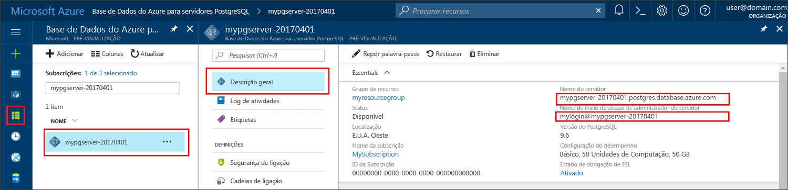

# <a name="azure-database-for-postgresql-use-java-tooconnect-and-query-data"></a><span data-ttu-id="ca01a-103">Base de dados do Azure para PostgreSQL: dados de utilização Java tooconnect e consulta</span><span class="sxs-lookup"><span data-stu-id="ca01a-103">Azure Database for PostgreSQL: Use Java tooconnect and query data</span></span>
<span data-ttu-id="ca01a-104">Este guia de introdução demonstra como tooconnect tooan Azure base de dados para PostgreSQL utilizando uma aplicação de Java.</span><span class="sxs-lookup"><span data-stu-id="ca01a-104">This quickstart demonstrates how tooconnect tooan Azure Database for PostgreSQL using a Java application.</span></span> <span data-ttu-id="ca01a-105">Mostra como toouse SQL instruções tooquery, inserir, atualizar e eliminar os dados na base de dados de Olá.</span><span class="sxs-lookup"><span data-stu-id="ca01a-105">It shows how toouse SQL statements tooquery, insert, update, and delete data in hello database.</span></span> <span data-ttu-id="ca01a-106">Olá passos deste artigo partem do princípio de que está familiarizado com o desenvolvimento com o Java e que é novo tooworking com base de dados do Azure para PostgreSQL.</span><span class="sxs-lookup"><span data-stu-id="ca01a-106">hello steps in this article assume that you are familiar with developing using Java, and that you are new tooworking with Azure Database for PostgreSQL.</span></span>

## <a name="prerequisites"></a><span data-ttu-id="ca01a-107">Pré-requisitos</span><span class="sxs-lookup"><span data-stu-id="ca01a-107">Prerequisites</span></span>
<span data-ttu-id="ca01a-108">Este guia de introdução utiliza recursos Olá criados destes guias como um ponto de partida:</span><span class="sxs-lookup"><span data-stu-id="ca01a-108">This quickstart uses hello resources created in either of these guides as a starting point:</span></span>
- [<span data-ttu-id="ca01a-109">Criar BD - Portal</span><span class="sxs-lookup"><span data-stu-id="ca01a-109">Create DB - Portal</span></span>](quickstart-create-server-database-portal.md)
- [<span data-ttu-id="ca01a-110">Criar BD - CLI do Azure</span><span class="sxs-lookup"><span data-stu-id="ca01a-110">Create DB - Azure CLI</span></span>](quickstart-create-server-database-azure-cli.md)

<span data-ttu-id="ca01a-111">Também tem de:</span><span class="sxs-lookup"><span data-stu-id="ca01a-111">You also need to:</span></span>
- <span data-ttu-id="ca01a-112">Transferir Olá [PostgreSQL JDBC controlador](https://jdbc.postgresql.org/download.html) correspondentes à sua versão do Java e Olá Kit de desenvolvimento Java.</span><span class="sxs-lookup"><span data-stu-id="ca01a-112">Download hello [PostgreSQL JDBC Driver](https://jdbc.postgresql.org/download.html) matching your version of Java and hello Java Development Kit.</span></span>
- <span data-ttu-id="ca01a-113">Inclua Olá ficheiro jar de PostgreSQL JDBC (por exemplo postgresql-42.1.1.jar) na sua classpath de aplicação.</span><span class="sxs-lookup"><span data-stu-id="ca01a-113">Include hello PostgreSQL JDBC jar file (for example postgresql-42.1.1.jar) in your application classpath.</span></span> <span data-ttu-id="ca01a-114">Para obter mais informações, consulte [detalhes do caminho da classe](https://jdbc.postgresql.org/documentation/head/classpath.html).</span><span class="sxs-lookup"><span data-stu-id="ca01a-114">For more information, see [classpath details](https://jdbc.postgresql.org/documentation/head/classpath.html).</span></span>

## <a name="get-connection-information"></a><span data-ttu-id="ca01a-115">Obter informações da ligação</span><span class="sxs-lookup"><span data-stu-id="ca01a-115">Get connection information</span></span>
<span data-ttu-id="ca01a-116">Obter Olá ligação informações necessárias tooconnect toohello base de dados do Azure para PostgreSQL.</span><span class="sxs-lookup"><span data-stu-id="ca01a-116">Get hello connection information needed tooconnect toohello Azure Database for PostgreSQL.</span></span> <span data-ttu-id="ca01a-117">Terá de Olá credenciais de início de sessão e nome de servidor completamente qualificado.</span><span class="sxs-lookup"><span data-stu-id="ca01a-117">You need hello fully qualified server name and login credentials.</span></span>

1. <span data-ttu-id="ca01a-118">Inicie sessão no toohello [portal do Azure](https://portal.azure.com/).</span><span class="sxs-lookup"><span data-stu-id="ca01a-118">Log in toohello [Azure portal](https://portal.azure.com/).</span></span>
2. <span data-ttu-id="ca01a-119">No menu da esquerda Olá, no portal do Azure, clique em **todos os recursos** e procure o servidor de Olá que criou, tais como **mypgserver 20170401**.</span><span class="sxs-lookup"><span data-stu-id="ca01a-119">From hello left-hand menu in Azure portal, click **All resources** and search for hello server you have created, such as **mypgserver-20170401**.</span></span>
3. <span data-ttu-id="ca01a-120">Clique no nome do servidor de Olá **mypgserver 20170401**.</span><span class="sxs-lookup"><span data-stu-id="ca01a-120">Click hello server name **mypgserver-20170401**.</span></span>
4. <span data-ttu-id="ca01a-121">Servidor de Olá selecione **descrição geral** página.</span><span class="sxs-lookup"><span data-stu-id="ca01a-121">Select hello server's **Overview** page.</span></span> <span data-ttu-id="ca01a-122">Tome nota do Olá **nome do servidor** e **nome de início de sessão de administração do servidor**.</span><span class="sxs-lookup"><span data-stu-id="ca01a-122">Make a note of hello **Server name** and **Server admin login name**.</span></span>
 <span data-ttu-id="ca01a-123"></span><span class="sxs-lookup"><span data-stu-id="ca01a-123"></span></span>
5. <span data-ttu-id="ca01a-124">Se se esquecer da sua informações de início de sessão do servidor, navegue até toohello **descrição geral** página nome de início de sessão de administrador de servidor Olá tooview e, se necessário, de reposição de palavra-passe de Olá.</span><span class="sxs-lookup"><span data-stu-id="ca01a-124">If you forget your server login information, navigate toohello **Overview** page tooview hello Server admin login name and, if necessary, reset hello password.</span></span>

## <a name="connect-create-table-and-insert-data"></a><span data-ttu-id="ca01a-125">Ligar, criar tabela e inserir dados</span><span class="sxs-lookup"><span data-stu-id="ca01a-125">Connect, create table, and insert data</span></span>
<span data-ttu-id="ca01a-126">Olá de utilização seguintes código tooconnect e carregar Olá dados utilizando a função de Olá com um **inserir** instrução SQL.</span><span class="sxs-lookup"><span data-stu-id="ca01a-126">Use hello following code tooconnect and load hello data using hello function with an **INSERT** SQL statement.</span></span> <span data-ttu-id="ca01a-127">Olá métodos [getConnection()](https://www.postgresql.org/docs/7.4/static/jdbc-use.html), [createStatement()](https://jdbc.postgresql.org/documentation/head/query.html), e [executeQuery()](https://jdbc.postgresql.org/documentation/head/query.html) são utilizado tooconnect, remover e criar a tabela de Olá.</span><span class="sxs-lookup"><span data-stu-id="ca01a-127">hello methods [getConnection()](https://www.postgresql.org/docs/7.4/static/jdbc-use.html), [createStatement()](https://jdbc.postgresql.org/documentation/head/query.html), and [executeQuery()](https://jdbc.postgresql.org/documentation/head/query.html) are used tooconnect, drop, and create hello table.</span></span> <span data-ttu-id="ca01a-128">Olá [prepareStatement](https://jdbc.postgresql.org/documentation/head/query.html) objeto é utilizado toobuild Olá de comandos insert, com setString() e setInt() toobind Olá os valores de parâmetros.</span><span class="sxs-lookup"><span data-stu-id="ca01a-128">hello [prepareStatement](https://jdbc.postgresql.org/documentation/head/query.html) object is used toobuild hello insert commands, with setString() and setInt() toobind hello parameter values.</span></span> <span data-ttu-id="ca01a-129">Método [executeUpdate()](https://jdbc.postgresql.org/documentation/head/update.html) executa Olá comando para cada conjunto de parâmetros.</span><span class="sxs-lookup"><span data-stu-id="ca01a-129">Method [executeUpdate()](https://jdbc.postgresql.org/documentation/head/update.html) runs hello command for each set of parameters.</span></span> 

<span data-ttu-id="ca01a-130">Substitua o anfitrião de Olá, base de dados, utilizador e os parâmetros de palavra-passe com valores de Olá que especificou quando criou o seu servidor e base de dados.</span><span class="sxs-lookup"><span data-stu-id="ca01a-130">Replace hello host, database, user, and password parameters with hello values that you specified when you created your own server and database.</span></span>

```java
import java.sql.*;
import java.util.Properties;

public class CreateTableInsertRows {

    public static void main (String[] args)  throws Exception
    {

        // Initialize connection variables.
        String host = "mypgserver-20170401.postgres.database.azure.com";
        String database = "mypgsqldb";
        String user = "mylogin@mypgserver-20170401";
        String password = "<server_admin_password>";

        // check that hello driver is installed
        try
        {
            Class.forName("org.postgresql.Driver");
        }
        catch (ClassNotFoundException e)
        {
            throw new ClassNotFoundException("PostgreSQL JDBC driver NOT detected in library path.", e);
        }

        System.out.println("PostgreSQL JDBC driver detected in library path.");

        Connection connection = null;

        // Initialize connection object
        try
        {
            String url = String.format("jdbc:postgresql://%s/%s", host, database);
            
            // set up hello connection properties
            Properties properties = new Properties();
            properties.setProperty("user", user);
            properties.setProperty("password", password);
            properties.setProperty("ssl", "true");

            // get connection
            connection = DriverManager.getConnection(url, properties);
        }
        catch (SQLException e)
        {
            throw new SQLException("Failed toocreate connection toodatabase.", e);
        }
        if (connection != null) 
        { 
            System.out.println("Successfully created connection toodatabase.");
        
            // Perform some SQL queries over hello connection.
            try
            {
                // Drop previous table of same name if one exists.
                Statement statement = connection.createStatement();
                statement.execute("DROP TABLE IF EXISTS inventory;");
                System.out.println("Finished dropping table (if existed).");
    
                // Create table.
                statement.execute("CREATE TABLE inventory (id serial PRIMARY KEY, name VARCHAR(50), quantity INTEGER);");
                System.out.println("Created table.");
    
                // Insert some data into table.
                int nRowsInserted = 0;
                PreparedStatement preparedStatement = connection.prepareStatement("INSERT INTO inventory (name, quantity) VALUES (?, ?);");
                preparedStatement.setString(1, "banana");
                preparedStatement.setInt(2, 150);
                nRowsInserted += preparedStatement.executeUpdate();

                preparedStatement.setString(1, "orange");
                preparedStatement.setInt(2, 154);
                nRowsInserted += preparedStatement.executeUpdate();

                preparedStatement.setString(1, "apple");
                preparedStatement.setInt(2, 100);
                nRowsInserted += preparedStatement.executeUpdate();
                System.out.println(String.format("Inserted %d row(s) of data.", nRowsInserted));
    
                // NOTE No need toocommit all changes toodatabase, as auto-commit is enabled by default.
    
            }
            catch (SQLException e)
            {
                throw new SQLException("Encountered an error when executing given sql statement.", e);
            }       
        }
        else {
            System.out.println("Failed toocreate connection toodatabase.");
        }
        System.out.println("Execution finished.");
    }
}
```

## <a name="read-data"></a><span data-ttu-id="ca01a-131">Ler dados</span><span class="sxs-lookup"><span data-stu-id="ca01a-131">Read data</span></span>
<span data-ttu-id="ca01a-132">Seguinte de Olá utilizar código de dados de Olá tooread com um **SELECIONE** instrução SQL.</span><span class="sxs-lookup"><span data-stu-id="ca01a-132">Use hello following code tooread hello data with a **SELECT** SQL statement.</span></span> <span data-ttu-id="ca01a-133">Olá métodos [getConnection()](https://www.postgresql.org/docs/7.4/static/jdbc-use.html), [createStatement()](https://jdbc.postgresql.org/documentation/head/query.html), e [executeQuery()](https://jdbc.postgresql.org/documentation/head/query.html) são utilizado tooconnect, criar e executar a instrução select Olá.</span><span class="sxs-lookup"><span data-stu-id="ca01a-133">hello methods [getConnection()](https://www.postgresql.org/docs/7.4/static/jdbc-use.html), [createStatement()](https://jdbc.postgresql.org/documentation/head/query.html), and [executeQuery()](https://jdbc.postgresql.org/documentation/head/query.html) are used tooconnect, create, and run hello select statement.</span></span> <span data-ttu-id="ca01a-134">resultados de Olá são processados utilizando um [ResultSet](https://www.postgresql.org/docs/7.4/static/jdbc-query.html) objeto.</span><span class="sxs-lookup"><span data-stu-id="ca01a-134">hello results are processed using a [ResultSet](https://www.postgresql.org/docs/7.4/static/jdbc-query.html) object.</span></span> 

<span data-ttu-id="ca01a-135">Substitua o anfitrião de Olá, base de dados, utilizador e os parâmetros de palavra-passe com valores de Olá que especificou quando criou o seu servidor e base de dados.</span><span class="sxs-lookup"><span data-stu-id="ca01a-135">Replace hello host, database, user, and password parameters with hello values that you specified when you created your own server and database.</span></span>

```java
import java.sql.*;
import java.util.Properties;

public class ReadTable {

    public static void main (String[] args)  throws Exception
    {

        // Initialize connection variables.
        String host = "mypgserver-20170401.postgres.database.azure.com";
        String database = "mypgsqldb";
        String user = "mylogin@mypgserver-20170401";
        String password = "<server_admin_password>";

        // check that hello driver is installed
        try
        {
            Class.forName("org.postgresql.Driver");
        }
        catch (ClassNotFoundException e)
        {
            throw new ClassNotFoundException("PostgreSQL JDBC driver NOT detected in library path.", e);
        }

        System.out.println("PostgreSQL JDBC driver detected in library path.");

        Connection connection = null;

        // Initialize connection object
        try
        {
            String url = String.format("jdbc:postgresql://%s/%s", host, database);
            
            // set up hello connection properties
            Properties properties = new Properties();
            properties.setProperty("user", user);
            properties.setProperty("password", password);
            properties.setProperty("ssl", "true");

            // get connection
            connection = DriverManager.getConnection(url, properties);
        }
        catch (SQLException e)
        {
            throw new SQLException("Failed toocreate connection toodatabase.", e);
        }
        if (connection != null) 
        { 
            System.out.println("Successfully created connection toodatabase.");
        
            // Perform some SQL queries over hello connection.
            try
            {
    
                Statement statement = connection.createStatement();
                ResultSet results = statement.executeQuery("SELECT * from inventory;");
                while (results.next())
                {
                    String outputString = 
                        String.format(
                            "Data row = (%s, %s, %s)",
                            results.getString(1),
                            results.getString(2),
                            results.getString(3));
                    System.out.println(outputString);
                }
            }
            catch (SQLException e)
            {
                throw new SQLException("Encountered an error when executing given sql statement.", e);
            }       
        }
        else {
            System.out.println("Failed toocreate connection toodatabase.");
        }
        System.out.println("Execution finished.");
    }
}

```

## <a name="update-data"></a><span data-ttu-id="ca01a-136">Atualizar dados</span><span class="sxs-lookup"><span data-stu-id="ca01a-136">Update data</span></span>
<span data-ttu-id="ca01a-137">Seguinte de Olá utilizar código de dados de Olá toochange com um **ATUALIZAÇÃO** instrução SQL.</span><span class="sxs-lookup"><span data-stu-id="ca01a-137">Use hello following code toochange hello data with an **UPDATE** SQL statement.</span></span> <span data-ttu-id="ca01a-138">Olá métodos [getConnection()](https://www.postgresql.org/docs/7.4/static/jdbc-use.html), [prepareStatement()](https://jdbc.postgresql.org/documentation/head/query.html), e [executeUpdate()](https://jdbc.postgresql.org/documentation/head/update.html) são utilizado tooconnect, preparar e execute a instrução de atualização de Olá.</span><span class="sxs-lookup"><span data-stu-id="ca01a-138">hello methods [getConnection()](https://www.postgresql.org/docs/7.4/static/jdbc-use.html), [prepareStatement()](https://jdbc.postgresql.org/documentation/head/query.html), and [executeUpdate()](https://jdbc.postgresql.org/documentation/head/update.html) are used tooconnect, prepare, and run hello update statement.</span></span> 

<span data-ttu-id="ca01a-139">Substitua o anfitrião de Olá, base de dados, utilizador e os parâmetros de palavra-passe com valores de Olá que especificou quando criou o seu servidor e base de dados.</span><span class="sxs-lookup"><span data-stu-id="ca01a-139">Replace hello host, database, user, and password parameters with hello values that you specified when you created your own server and database.</span></span>

```java
import java.sql.*;
import java.util.Properties;

public class UpdateTable {
    public static void main (String[] args)  throws Exception
    {

        // Initialize connection variables.
        String host = "mypgserver-20170401.postgres.database.azure.com";
        String database = "mypgsqldb";
        String user = "mylogin@mypgserver-20170401";
        String password = "<server_admin_password>";

        // check that hello driver is installed
        try
        {
            Class.forName("org.postgresql.Driver");
        }
        catch (ClassNotFoundException e)
        {
            throw new ClassNotFoundException("PostgreSQL JDBC driver NOT detected in library path.", e);
        }

        System.out.println("PostgreSQL JDBC driver detected in library path.");

        Connection connection = null;

        // Initialize connection object
        try
        {
            String url = String.format("jdbc:postgresql://%s/%s", host, database);
            
            // set up hello connection properties
            Properties properties = new Properties();
            properties.setProperty("user", user);
            properties.setProperty("password", password);
            properties.setProperty("ssl", "true");

            // get connection
            connection = DriverManager.getConnection(url, properties);
        }
        catch (SQLException e)
        {
            throw new SQLException("Failed toocreate connection toodatabase.", e);
        }
        if (connection != null) 
        { 
            System.out.println("Successfully created connection toodatabase.");
        
            // Perform some SQL queries over hello connection.
            try
            {
                // Modify some data in table.
                int nRowsUpdated = 0;
                PreparedStatement preparedStatement = connection.prepareStatement("UPDATE inventory SET quantity = ? WHERE name = ?;");
                preparedStatement.setInt(1, 200);
                preparedStatement.setString(2, "banana");
                nRowsUpdated += preparedStatement.executeUpdate();
                System.out.println(String.format("Updated %d row(s) of data.", nRowsUpdated));
    
                // NOTE No need toocommit all changes toodatabase, as auto-commit is enabled by default.
            }
            catch (SQLException e)
            {
                throw new SQLException("Encountered an error when executing given sql statement.", e);
            }       
        }
        else {
            System.out.println("Failed toocreate connection toodatabase.");
        }
        System.out.println("Execution finished.");
    }
}
```
## <a name="delete-data"></a><span data-ttu-id="ca01a-140">Eliminar dados</span><span class="sxs-lookup"><span data-stu-id="ca01a-140">Delete data</span></span>
<span data-ttu-id="ca01a-141">Seguinte de Olá de utilização código tooremove dados com um **eliminar** instrução SQL.</span><span class="sxs-lookup"><span data-stu-id="ca01a-141">Use hello following code tooremove data with a **DELETE** SQL statement.</span></span> <span data-ttu-id="ca01a-142">Olá métodos [getConnection()](https://www.postgresql.org/docs/7.4/static/jdbc-use.html), [prepareStatement()](https://jdbc.postgresql.org/documentation/head/query.html), e [executeUpdate()](https://jdbc.postgresql.org/documentation/head/update.html) são utilizado tooconnect, preparar e execute a instrução delete de Olá.</span><span class="sxs-lookup"><span data-stu-id="ca01a-142">hello methods [getConnection()](https://www.postgresql.org/docs/7.4/static/jdbc-use.html), [prepareStatement()](https://jdbc.postgresql.org/documentation/head/query.html), and [executeUpdate()](https://jdbc.postgresql.org/documentation/head/update.html) are used tooconnect, prepare, and run hello delete statement.</span></span> 

<span data-ttu-id="ca01a-143">Substitua o anfitrião de Olá, base de dados, utilizador e os parâmetros de palavra-passe com valores de Olá que especificou quando criou o seu servidor e base de dados.</span><span class="sxs-lookup"><span data-stu-id="ca01a-143">Replace hello host, database, user, and password parameters with hello values that you specified when you created your own server and database.</span></span>

```java
import java.sql.*;
import java.util.Properties;

public class DeleteTable {
    public static void main (String[] args)  throws Exception
    {

        // Initialize connection variables.
        String host = "mypgserver-20170401.postgres.database.azure.com";
        String database = "mypgsqldb";
        String user = "mylogin@mypgserver-20170401";
        String password = "<server_admin_password>";

        // check that hello driver is installed
        try
        {
            Class.forName("org.postgresql.Driver");
        }
        catch (ClassNotFoundException e)
        {
            throw new ClassNotFoundException("PostgreSQL JDBC driver NOT detected in library path.", e);
        }

        System.out.println("PostgreSQL JDBC driver detected in library path.");

        Connection connection = null;

        // Initialize connection object
        try
        {
            String url = String.format("jdbc:postgresql://%s/%s", host, database);
            
            // set up hello connection properties
            Properties properties = new Properties();
            properties.setProperty("user", user);
            properties.setProperty("password", password);
            properties.setProperty("ssl", "true");

            // get connection
            connection = DriverManager.getConnection(url, properties);
        }
        catch (SQLException e)
        {
            throw new SQLException("Failed toocreate connection toodatabase.", e);
        }
        if (connection != null) 
        { 
            System.out.println("Successfully created connection toodatabase.");
        
            // Perform some SQL queries over hello connection.
            try
            {
                // Delete some data from table.
                int nRowsDeleted = 0;
                PreparedStatement preparedStatement = connection.prepareStatement("DELETE FROM inventory WHERE name = ?;");
                preparedStatement.setString(1, "orange");
                nRowsDeleted += preparedStatement.executeUpdate();
                System.out.println(String.format("Deleted %d row(s) of data.", nRowsDeleted));
    
                // NOTE No need toocommit all changes toodatabase, as auto-commit is enabled by default.
            }
            catch (SQLException e)
            {
                throw new SQLException("Encountered an error when executing given sql statement.", e);
            }       
        }
        else {
            System.out.println("Failed toocreate connection toodatabase.");
        }
        System.out.println("Execution finished.");
    }
}
```

## <a name="next-steps"></a><span data-ttu-id="ca01a-144">Passos seguintes</span><span class="sxs-lookup"><span data-stu-id="ca01a-144">Next steps</span></span>
> [!div class="nextstepaction"]
> [<span data-ttu-id="ca01a-145">Migrar a base de dados com Exportar e Importar</span><span class="sxs-lookup"><span data-stu-id="ca01a-145">Migrate your database using Export and Import</span></span>](./howto-migrate-using-export-and-import.md)
