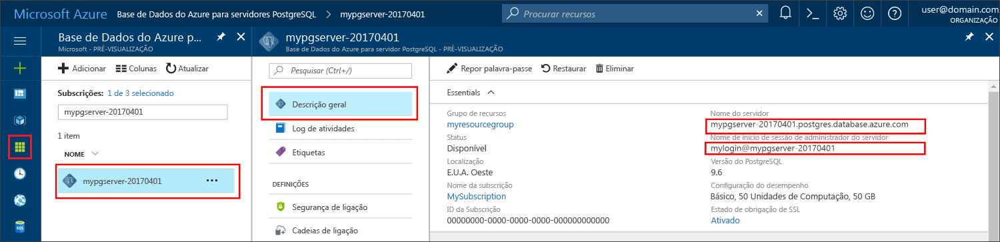

# <a name="azure-database-for-postgresql-use-php-tooconnect-and-query-data"></a><span data-ttu-id="fd9d9-103">Base de dados do Azure para PostgreSQL: dados de utilização PHP tooconnect e consulta</span><span class="sxs-lookup"><span data-stu-id="fd9d9-103">Azure Database for PostgreSQL: Use PHP tooconnect and query data</span></span>
<span data-ttu-id="fd9d9-104">Este guia de introdução demonstra como tooconnect tooan Azure base de dados de utilização de PostgreSQL um [PHP](http://php.net/manual/intro-whatis.php) aplicação.</span><span class="sxs-lookup"><span data-stu-id="fd9d9-104">This quickstart demonstrates how tooconnect tooan Azure Database for PostgreSQL using a [PHP](http://php.net/manual/intro-whatis.php) application.</span></span> <span data-ttu-id="fd9d9-105">Mostra como toouse SQL instruções tooquery, inserir, atualizar e eliminar os dados na base de dados de Olá.</span><span class="sxs-lookup"><span data-stu-id="fd9d9-105">It shows how toouse SQL statements tooquery, insert, update, and delete data in hello database.</span></span> <span data-ttu-id="fd9d9-106">Este artigo pressupõe que está familiarizado com o desenvolvimento com o PHP, mas que são tooworking nova com base de dados do Azure para PostgreSQL.</span><span class="sxs-lookup"><span data-stu-id="fd9d9-106">This article assumes you are familiar with development using PHP, but that you are new tooworking with Azure Database for PostgreSQL.</span></span>

## <a name="prerequisites"></a><span data-ttu-id="fd9d9-107">Pré-requisitos</span><span class="sxs-lookup"><span data-stu-id="fd9d9-107">Prerequisites</span></span>
<span data-ttu-id="fd9d9-108">Este guia de introdução utiliza recursos Olá criados destes guias como um ponto de partida:</span><span class="sxs-lookup"><span data-stu-id="fd9d9-108">This quickstart uses hello resources created in either of these guides as a starting point:</span></span>
- [<span data-ttu-id="fd9d9-109">Criar BD - Portal</span><span class="sxs-lookup"><span data-stu-id="fd9d9-109">Create DB - Portal</span></span>](quickstart-create-server-database-portal.md)
- [<span data-ttu-id="fd9d9-110">Criar BD - CLI do Azure</span><span class="sxs-lookup"><span data-stu-id="fd9d9-110">Create DB - Azure CLI</span></span>](quickstart-create-server-database-azure-cli.md)

## <a name="install-php"></a><span data-ttu-id="fd9d9-111">Instalar o PHP</span><span class="sxs-lookup"><span data-stu-id="fd9d9-111">Install PHP</span></span>
<span data-ttu-id="fd9d9-112">Instale o PHP no seu próprio servidor ou crie uma [aplicação Web](https://docs.microsoft.com/en-us/azure/app-service-web/app-service-web-overview) do Azure que inclua o PHP.</span><span class="sxs-lookup"><span data-stu-id="fd9d9-112">Install PHP on your own server, or create an Azure [web app](https://docs.microsoft.com/en-us/azure/app-service-web/app-service-web-overview) that includes PHP.</span></span>

### <a name="windows"></a><span data-ttu-id="fd9d9-113">Windows</span><span class="sxs-lookup"><span data-stu-id="fd9d9-113">Windows</span></span>
- <span data-ttu-id="fd9d9-114">Transfira a [versão 7.1.4 do PHP (x64) não segura para threads](http://windows.php.net/download#php-7.1)</span><span class="sxs-lookup"><span data-stu-id="fd9d9-114">Download [PHP 7.1.4 non-thread safe (x64) version](http://windows.php.net/download#php-7.1)</span></span>
- <span data-ttu-id="fd9d9-115">Instalar o PHP e consulte toohello [PHP manual](http://php.net/manual/install.windows.php) para configuração adicional</span><span class="sxs-lookup"><span data-stu-id="fd9d9-115">Install PHP and refer toohello [PHP manual](http://php.net/manual/install.windows.php) for further configuration</span></span>
- <span data-ttu-id="fd9d9-116">código de Olá utiliza Olá **pgsql** classe (ext/php_pgsql.dll) que está incluído na Olá instalação do PHP.</span><span class="sxs-lookup"><span data-stu-id="fd9d9-116">hello code uses hello **pgsql** class (ext/php_pgsql.dll)  that is included in hello PHP installation.</span></span> 
- <span data-ttu-id="fd9d9-117">Olá ativado **pgsql** extensão editando o ficheiro de configuração do php.ini Olá, normalmente localizado no `C:\Program Files\PHP\v7.1\php.ini`.</span><span class="sxs-lookup"><span data-stu-id="fd9d9-117">Enabled hello **pgsql** extension by editing hello php.ini configuration file, typically located at `C:\Program Files\PHP\v7.1\php.ini`.</span></span> <span data-ttu-id="fd9d9-118">ficheiro de configuração de Olá deve conter uma linha com o texto de Olá `extension=php_pgsql.so`.</span><span class="sxs-lookup"><span data-stu-id="fd9d9-118">hello configuration file should contain a line with hello text `extension=php_pgsql.so`.</span></span> <span data-ttu-id="fd9d9-119">Se não for apresentado, adicionar Olá texto e guarde o ficheiro de Olá.</span><span class="sxs-lookup"><span data-stu-id="fd9d9-119">If it is not shown, add hello text and save hello file.</span></span> <span data-ttu-id="fd9d9-120">Se estiver presente, texto Olá comentado, mas com um prefixo de ponto e vírgula, anule os comentários texto Olá por ponto e vírgula de Olá a remover.</span><span class="sxs-lookup"><span data-stu-id="fd9d9-120">If hello text is present, but commented with a semicolon prefix, uncomment hello text by removing hello semicolon.</span></span>

### <a name="linux-ubuntu"></a><span data-ttu-id="fd9d9-121">Linux (Ubuntu)</span><span class="sxs-lookup"><span data-stu-id="fd9d9-121">Linux (Ubuntu)</span></span>
- <span data-ttu-id="fd9d9-122">Transfira a [versão 7.1.4 do PHP (x64) não segura para threads](http://php.net/downloads.php)</span><span class="sxs-lookup"><span data-stu-id="fd9d9-122">Download [PHP 7.1.4 non-thread safe (x64) version](http://php.net/downloads.php)</span></span> 
- <span data-ttu-id="fd9d9-123">Instalar o PHP e consulte toohello [PHP manual](http://php.net/manual/install.unix.php) para configuração adicional</span><span class="sxs-lookup"><span data-stu-id="fd9d9-123">Install PHP and refer toohello [PHP manual](http://php.net/manual/install.unix.php) for further configuration</span></span>
- <span data-ttu-id="fd9d9-124">código de Olá utiliza Olá **pgsql** classe (php_pgsql.so).</span><span class="sxs-lookup"><span data-stu-id="fd9d9-124">hello code uses hello **pgsql** class (php_pgsql.so).</span></span> <span data-ttu-id="fd9d9-125">Instale-o ao executar `sudo apt-get install php-pgsql`.</span><span class="sxs-lookup"><span data-stu-id="fd9d9-125">Install it by running `sudo apt-get install php-pgsql`.</span></span>
- <span data-ttu-id="fd9d9-126">Olá ativado **pgsql** extensão editando Olá `/etc/php/7.0/mods-available/pgsql.ini` ficheiro de configuração.</span><span class="sxs-lookup"><span data-stu-id="fd9d9-126">Enabled hello **pgsql** extension by editing hello `/etc/php/7.0/mods-available/pgsql.ini` configuration file.</span></span> <span data-ttu-id="fd9d9-127">ficheiro de configuração de Olá deve conter uma linha com o texto de Olá `extension=php_pgsql.so`.</span><span class="sxs-lookup"><span data-stu-id="fd9d9-127">hello configuration file should contain a line with hello text `extension=php_pgsql.so`.</span></span> <span data-ttu-id="fd9d9-128">Se não for apresentado, adicionar Olá texto e guarde o ficheiro de Olá.</span><span class="sxs-lookup"><span data-stu-id="fd9d9-128">If it is not shown, add hello text and save hello file.</span></span> <span data-ttu-id="fd9d9-129">Se estiver presente, texto Olá comentado, mas com um prefixo de ponto e vírgula, anule os comentários texto Olá por ponto e vírgula de Olá a remover.</span><span class="sxs-lookup"><span data-stu-id="fd9d9-129">If hello text is present, but commented with a semicolon prefix, uncomment hello text by removing hello semicolon.</span></span>

### <a name="macos"></a><span data-ttu-id="fd9d9-130">MacOS</span><span class="sxs-lookup"><span data-stu-id="fd9d9-130">MacOS</span></span>
- <span data-ttu-id="fd9d9-131">Transfira a [versão 7.1.4 do PHP](http://php.net/downloads.php)</span><span class="sxs-lookup"><span data-stu-id="fd9d9-131">Download [PHP 7.1.4 version](http://php.net/downloads.php)</span></span>
- <span data-ttu-id="fd9d9-132">Instalar o PHP e consulte toohello [PHP manual](http://php.net/manual/install.macosx.php) para configuração adicional</span><span class="sxs-lookup"><span data-stu-id="fd9d9-132">Install PHP and refer toohello [PHP manual](http://php.net/manual/install.macosx.php) for further configuration</span></span>

## <a name="get-connection-information"></a><span data-ttu-id="fd9d9-133">Obter informações da ligação</span><span class="sxs-lookup"><span data-stu-id="fd9d9-133">Get connection information</span></span>
<span data-ttu-id="fd9d9-134">Obter Olá ligação informações necessárias tooconnect toohello base de dados do Azure para PostgreSQL.</span><span class="sxs-lookup"><span data-stu-id="fd9d9-134">Get hello connection information needed tooconnect toohello Azure Database for PostgreSQL.</span></span> <span data-ttu-id="fd9d9-135">Terá de Olá credenciais de início de sessão e nome de servidor completamente qualificado.</span><span class="sxs-lookup"><span data-stu-id="fd9d9-135">You need hello fully qualified server name and login credentials.</span></span>

1. <span data-ttu-id="fd9d9-136">Inicie sessão no toohello [portal do Azure](https://portal.azure.com/).</span><span class="sxs-lookup"><span data-stu-id="fd9d9-136">Log in toohello [Azure portal](https://portal.azure.com/).</span></span>
2. <span data-ttu-id="fd9d9-137">No menu da esquerda Olá, no portal do Azure, clique em **todos os recursos** e procure o servidor de Olá que criou, tais como **mypgserver 20170401**.</span><span class="sxs-lookup"><span data-stu-id="fd9d9-137">From hello left-hand menu in Azure portal, click **All resources** and search for hello server you have created, such as **mypgserver-20170401**.</span></span>
3. <span data-ttu-id="fd9d9-138">Clique no nome do servidor de Olá **mypgserver 20170401**.</span><span class="sxs-lookup"><span data-stu-id="fd9d9-138">Click hello server name **mypgserver-20170401**.</span></span>
4. <span data-ttu-id="fd9d9-139">Servidor de Olá selecione **descrição geral** página.</span><span class="sxs-lookup"><span data-stu-id="fd9d9-139">Select hello server's **Overview** page.</span></span> <span data-ttu-id="fd9d9-140">Tome nota do Olá **nome do servidor** e **nome de início de sessão de administração do servidor**.</span><span class="sxs-lookup"><span data-stu-id="fd9d9-140">Make a note of hello **Server name** and **Server admin login name**.</span></span>
 <span data-ttu-id="fd9d9-141"></span><span class="sxs-lookup"><span data-stu-id="fd9d9-141"></span></span>
5. <span data-ttu-id="fd9d9-142">Se se esquecer da sua informações de início de sessão do servidor, navegue até toohello **descrição geral** página nome de início de sessão de administrador de servidor Olá tooview e, se necessário, de reposição de palavra-passe de Olá.</span><span class="sxs-lookup"><span data-stu-id="fd9d9-142">If you forget your server login information, navigate toohello **Overview** page tooview hello Server admin login name and, if necessary, reset hello password.</span></span>

## <a name="connect-and-create-a-table"></a><span data-ttu-id="fd9d9-143">Ligar-se e criar uma tabela</span><span class="sxs-lookup"><span data-stu-id="fd9d9-143">Connect and create a table</span></span>
<span data-ttu-id="fd9d9-144">Code tooconnect a seguir de Olá de utilização e criar uma tabela utilizando **CREATE TABLE** instrução de SQL, seguida de **INSERT INTO** linhas de tooadd instruções SQL na tabela de Olá.</span><span class="sxs-lookup"><span data-stu-id="fd9d9-144">Use hello following code tooconnect and create a table using **CREATE TABLE** SQL statement, followed by **INSERT INTO** SQL statements tooadd rows into hello table.</span></span>

<span data-ttu-id="fd9d9-145">método de chamada de código de Olá [pg_connect()](http://php.net/manual/en/function.pg-connect.php) tooconnect tooAzure da base de dados PostgreSQL.</span><span class="sxs-lookup"><span data-stu-id="fd9d9-145">hello code call method [pg_connect()](http://php.net/manual/en/function.pg-connect.php) tooconnect tooAzure Database for PostgreSQL.</span></span> <span data-ttu-id="fd9d9-146">Em seguida, chama o método [pg_query()](http://php.net/manual/en/function.pg-query.php) várias vezes toorun vários comandos, e [pg_last_error()](http://php.net/manual/en/function.pg-last-error.php) toocheck Olá detalhes se um erro de cada vez.</span><span class="sxs-lookup"><span data-stu-id="fd9d9-146">Then it calls method [pg_query()](http://php.net/manual/en/function.pg-query.php) several times toorun several commands, and [pg_last_error()](http://php.net/manual/en/function.pg-last-error.php) toocheck hello details if an error occurred each time.</span></span> <span data-ttu-id="fd9d9-147">Em seguida, chama o método [pg_close()](http://php.net/manual/en/function.pg-close.php) ligação de Olá tooclose.</span><span class="sxs-lookup"><span data-stu-id="fd9d9-147">Then it calls method [pg_close()](http://php.net/manual/en/function.pg-close.php) tooclose hello connection.</span></span>

<span data-ttu-id="fd9d9-148">Substitua Olá `$host`, `$database`, `$user`, e `$password` parâmetros com os seus próprios valores.</span><span class="sxs-lookup"><span data-stu-id="fd9d9-148">Replace hello `$host`, `$database`, `$user`, and `$password` parameters with your own values.</span></span> 

```php
<?php
    // Initialize connection variables.
    $host = "mypgserver-20170401.postgres.database.azure.com";
    $database = "mypgsqldb";
    $user = "mylogin@mypgserver-20170401";
    $password = "<server_admin_password>";

    // Initialize connection object.
    $connection = pg_connect("host=$host dbname=$database user=$user password=$password") 
        or die("Failed toocreate connection toodatabase: ". pg_last_error(). "<br/>");
    print "Successfully created connection toodatabase.<br/>";

    // Drop previous table of same name if one exists.
    $query = "DROP TABLE IF EXISTS inventory;";
    pg_query($connection, $query) 
        or die("Encountered an error when executing given sql statement: ". pg_last_error(). "<br/>");
    print "Finished dropping table (if existed).<br/>";

    // Create table.
    $query = "CREATE TABLE inventory (id serial PRIMARY KEY, name VARCHAR(50), quantity INTEGER);";
    pg_query($connection, $query) 
        or die("Encountered an error when executing given sql statement: ". pg_last_error(). "<br/>");
    print "Finished creating table.<br/>";

    // Insert some data into table.
    $name = '\'banana\'';
    $quantity = 150;
    $query = "INSERT INTO inventory (name, quantity) VALUES ($1, $2);";
    pg_query($connection, $query) 
        or die("Encountered an error when executing given sql statement: ". pg_last_error(). "<br/>");

    $name = '\'orange\'';
    $quantity = 154;
    $query = "INSERT INTO inventory (name, quantity) VALUES ($name, $quantity);";
    pg_query($connection, $query) 
        or die("Encountered an error when executing given sql statement: ". pg_last_error(). "<br/>");

    $name = '\'apple\'';
    $quantity = 100;
    $query = "INSERT INTO inventory (name, quantity) VALUES ($name, $quantity);";
    pg_query($connection, $query) 
        or die("Encountered an error when executing given sql statement: ". pg_last_error()). "<br/>";

    print "Inserted 3 rows of data.<br/>";

    // Closing connection
    pg_close($connection);
?>
```

## <a name="read-data"></a><span data-ttu-id="fd9d9-149">Ler dados</span><span class="sxs-lookup"><span data-stu-id="fd9d9-149">Read data</span></span>
<span data-ttu-id="fd9d9-150">Seguinte de Olá utilize code tooconnect e ler Olá dados utilizando um **SELECIONE** instrução SQL.</span><span class="sxs-lookup"><span data-stu-id="fd9d9-150">Use hello following code tooconnect and read hello data using a **SELECT** SQL statement.</span></span> 

 <span data-ttu-id="fd9d9-151">método de chamada de código de Olá [pg_connect()](http://php.net/manual/en/function.pg-connect.php) tooconnect tooAzure da base de dados PostgreSQL.</span><span class="sxs-lookup"><span data-stu-id="fd9d9-151">hello code call method [pg_connect()](http://php.net/manual/en/function.pg-connect.php) tooconnect tooAzure Database for PostgreSQL.</span></span> <span data-ttu-id="fd9d9-152">Em seguida, chama o método [pg_query()](http://php.net/manual/en/function.pg-query.php) toorun Olá comando de selecção, mantendo os resultados de Olá num conjunto de resultados, e [pg_last_error()](http://php.net/manual/en/function.pg-last-error.php) toocheck Olá detalhes se Ocorreu um erro.</span><span class="sxs-lookup"><span data-stu-id="fd9d9-152">Then it calls method [pg_query()](http://php.net/manual/en/function.pg-query.php) toorun hello SELECT command, keeping hello results in a result set, and [pg_last_error()](http://php.net/manual/en/function.pg-last-error.php) toocheck hello details if an error occurred.</span></span>  <span data-ttu-id="fd9d9-153">conjunto de resultados de Olá tooread, método [pg_fetch_row()](http://php.net/manual/en/function.pg-fetch-row.php) denomina-se num ciclo, uma vez por linha de linha de Olá e os dados são obtidos numa matriz `$row`, com o valor de uma de dados por coluna em cada posição da matriz.</span><span class="sxs-lookup"><span data-stu-id="fd9d9-153">tooread hello result set, method [pg_fetch_row()](http://php.net/manual/en/function.pg-fetch-row.php) is called in a loop, once per row, and hello row data is retrieved in an array `$row`, with one data value per column in each array position.</span></span>  <span data-ttu-id="fd9d9-154">conjunto de resultados de Olá toofree, método [pg_free_result()](http://php.net/manual/en/function.pg-free-result.php) é chamado.</span><span class="sxs-lookup"><span data-stu-id="fd9d9-154">toofree hello result set, method [pg_free_result()](http://php.net/manual/en/function.pg-free-result.php) is called.</span></span> <span data-ttu-id="fd9d9-155">Em seguida, chama o método [pg_close()](http://php.net/manual/en/function.pg-close.php) ligação de Olá tooclose.</span><span class="sxs-lookup"><span data-stu-id="fd9d9-155">Then it calls method [pg_close()](http://php.net/manual/en/function.pg-close.php) tooclose hello connection.</span></span>

<span data-ttu-id="fd9d9-156">Substitua Olá `$host`, `$database`, `$user`, e `$password` parâmetros com os seus próprios valores.</span><span class="sxs-lookup"><span data-stu-id="fd9d9-156">Replace hello `$host`, `$database`, `$user`, and `$password` parameters with your own values.</span></span> 

```php
<?php
    // Initialize connection variables.
    $host = "mypgserver-20170401.postgres.database.azure.com";
    $database = "mypgsqldb";
    $user = "mylogin@mypgserver-20170401";
    $password = "<server_admin_password>";
    
    // Initialize connection object.
    $connection = pg_connect("host=$host dbname=$database user=$user password=$password")
                or die("Failed toocreate connection toodatabase: ". pg_last_error(). "<br/>");

    print "Successfully created connection toodatabase. <br/>";

    // Perform some SQL queries over hello connection.
    $query = "SELECT * from inventory";
    $result_set = pg_query($connection, $query) 
        or die("Encountered an error when executing given sql statement: ". pg_last_error(). "<br/>");
    while ($row = pg_fetch_row($result_set))
    {
        print "Data row = ($row[0], $row[1], $row[2]). <br/>";
    }

    // Free result_set
    pg_free_result($result_set);

    // Closing connection
    pg_close($connection);
?>
```

## <a name="update-data"></a><span data-ttu-id="fd9d9-157">Atualizar dados</span><span class="sxs-lookup"><span data-stu-id="fd9d9-157">Update data</span></span>
<span data-ttu-id="fd9d9-158">Seguinte de Olá utilize code tooconnect e atualizar Olá dados utilizando um **ATUALIZAR** instrução SQL.</span><span class="sxs-lookup"><span data-stu-id="fd9d9-158">Use hello following code tooconnect and update hello data using a **UPDATE** SQL statement.</span></span>

<span data-ttu-id="fd9d9-159">método de chamada de código de Olá [pg_connect()](http://php.net/manual/en/function.pg-connect.php) tooconnect tooAzure da base de dados PostgreSQL.</span><span class="sxs-lookup"><span data-stu-id="fd9d9-159">hello code call method [pg_connect()](http://php.net/manual/en/function.pg-connect.php) tooconnect tooAzure Database for PostgreSQL.</span></span> <span data-ttu-id="fd9d9-160">Em seguida, chama o método [pg_query()](http://php.net/manual/en/function.pg-query.php) toorun um comando, e [pg_last_error()](http://php.net/manual/en/function.pg-last-error.php) toocheck Olá detalhes se Ocorreu um erro.</span><span class="sxs-lookup"><span data-stu-id="fd9d9-160">Then it calls method [pg_query()](http://php.net/manual/en/function.pg-query.php) toorun a command, and [pg_last_error()](http://php.net/manual/en/function.pg-last-error.php) toocheck hello details if an error occurred.</span></span> <span data-ttu-id="fd9d9-161">Em seguida, chama o método [pg_close()](http://php.net/manual/en/function.pg-close.php) ligação de Olá tooclose.</span><span class="sxs-lookup"><span data-stu-id="fd9d9-161">Then it calls method [pg_close()](http://php.net/manual/en/function.pg-close.php) tooclose hello connection.</span></span>

<span data-ttu-id="fd9d9-162">Substitua Olá `$host`, `$database`, `$user`, e `$password` parâmetros com os seus próprios valores.</span><span class="sxs-lookup"><span data-stu-id="fd9d9-162">Replace hello `$host`, `$database`, `$user`, and `$password` parameters with your own values.</span></span> 

```php
<?php
    // Initialize connection variables.
    $host = "mypgserver-20170401.postgres.database.azure.com";
    $database = "mypgsqldb";
    $user = "mylogin@mypgserver-20170401";
    $password = "<server_admin_password>";

    // Initialize connection object.
    $connection = pg_connect("host=$host dbname=$database user=$user password=$password")
                or die("Failed toocreate connection toodatabase: ". pg_last_error(). ".<br/>");

    print "Successfully created connection toodatabase. <br/>";

    // Modify some data in table.
    $new_quantity = 200;
    $name = '\'banana\'';
    $query = "UPDATE inventory SET quantity = $new_quantity WHERE name = $name;";
    pg_query($connection, $query) 
        or die("Encountered an error when executing given sql statement: ". pg_last_error(). ".<br/>");
    print "Updated 1 row of data. </br>";

    // Closing connection
    pg_close($connection);
?>
```


## <a name="delete-data"></a><span data-ttu-id="fd9d9-163">Eliminar dados</span><span class="sxs-lookup"><span data-stu-id="fd9d9-163">Delete data</span></span>
<span data-ttu-id="fd9d9-164">Seguinte de Olá utilize code tooconnect e ler Olá dados utilizando um **eliminar** instrução SQL.</span><span class="sxs-lookup"><span data-stu-id="fd9d9-164">Use hello following code tooconnect and read hello data using a **DELETE** SQL statement.</span></span> 

 <span data-ttu-id="fd9d9-165">método de chamada de código de Olá [pg_connect()](http://php.net/manual/en/function.pg-connect.php) tooconnect base de dados demasiado do Azure para PostgreSQL.</span><span class="sxs-lookup"><span data-stu-id="fd9d9-165">hello code call method [pg_connect()](http://php.net/manual/en/function.pg-connect.php) tooconnect too Azure Database for PostgreSQL.</span></span> <span data-ttu-id="fd9d9-166">Em seguida, chama o método [pg_query()](http://php.net/manual/en/function.pg-query.php) toorun um comando, e [pg_last_error()](http://php.net/manual/en/function.pg-last-error.php) toocheck Olá detalhes se Ocorreu um erro.</span><span class="sxs-lookup"><span data-stu-id="fd9d9-166">Then it calls method [pg_query()](http://php.net/manual/en/function.pg-query.php) toorun a command, and [pg_last_error()](http://php.net/manual/en/function.pg-last-error.php) toocheck hello details if an error occurred.</span></span> <span data-ttu-id="fd9d9-167">Em seguida, chama o método [pg_close()](http://php.net/manual/en/function.pg-close.php) ligação de Olá tooclose.</span><span class="sxs-lookup"><span data-stu-id="fd9d9-167">Then it calls method [pg_close()](http://php.net/manual/en/function.pg-close.php) tooclose hello connection.</span></span>

<span data-ttu-id="fd9d9-168">Substitua Olá `$host`, `$database`, `$user`, e `$password` parâmetros com os seus próprios valores.</span><span class="sxs-lookup"><span data-stu-id="fd9d9-168">Replace hello `$host`, `$database`, `$user`, and `$password` parameters with your own values.</span></span> 

```php
<?php
    // Initialize connection variables.
    $host = "mypgserver-20170401.postgres.database.azure.com";
    $database = "mypgsqldb";
    $user = "mylogin@mypgserver-20170401";
    $password = "<server_admin_password>";

    // Initialize connection object.
    $connection = pg_connect("host=$host dbname=$database user=$user password=$password")
            or die("Failed toocreate connection toodatabase: ". pg_last_error(). ". </br>");

    print "Successfully created connection toodatabase. <br/>";

    // Delete some data from table.
    $name = '\'orange\'';
    $query = "DELETE FROM inventory WHERE name = $name;";
    pg_query($connection, $query) 
        or die("Encountered an error when executing given sql statement: ". pg_last_error(). ". <br/>");
    print "Deleted 1 row of data. <br/>";

    // Closing connection
    pg_close($connection);
?>
```

## <a name="next-steps"></a><span data-ttu-id="fd9d9-169">Passos seguintes</span><span class="sxs-lookup"><span data-stu-id="fd9d9-169">Next steps</span></span>
> [!div class="nextstepaction"]
> [<span data-ttu-id="fd9d9-170">Migrar a base de dados com Exportar e Importar</span><span class="sxs-lookup"><span data-stu-id="fd9d9-170">Migrate your database using Export and Import</span></span>](./howto-migrate-using-export-and-import.md)
