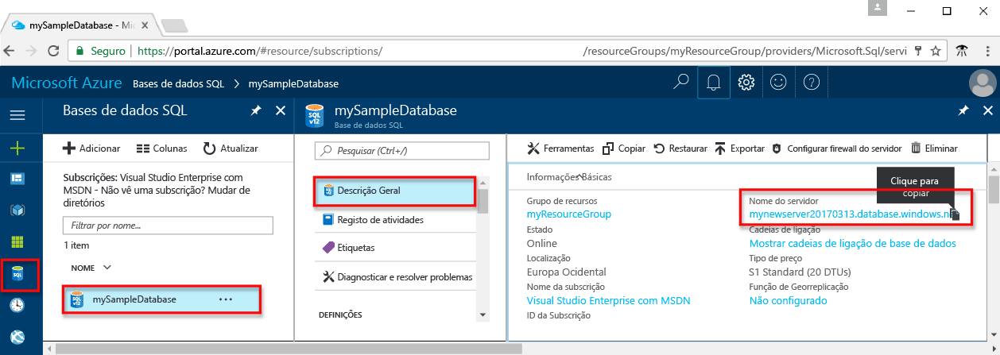
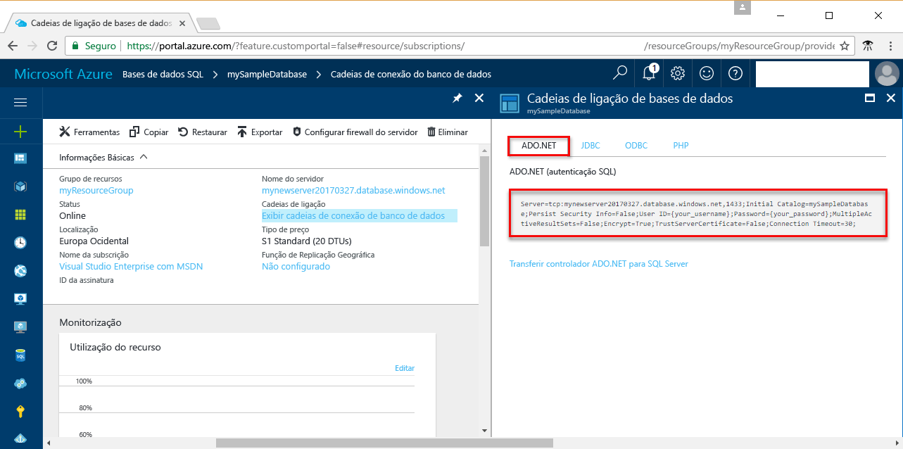

# <a name="use-net-c-with-visual-studio-tooconnect-and-query-an-azure-sql-database"></a><span data-ttu-id="7adce-103">Utilize o .NET (c#) com o Visual Studio tooconnect e consultar uma base de dados SQL do Azure</span><span class="sxs-lookup"><span data-stu-id="7adce-103">Use .NET (C#) with Visual Studio tooconnect and query an Azure SQL database</span></span>

<span data-ttu-id="7adce-104">Este tutorial de início rápido demonstra como toouse Olá [.NET framework](https://www.microsoft.com/net/) toocreate um c# programa com o Visual Studio tooconnect tooan SQL database do Azure e utilizar os dados de tooquery de instruções Transact-SQL.</span><span class="sxs-lookup"><span data-stu-id="7adce-104">This quick start tutorial demonstrates how toouse hello [.NET framework](https://www.microsoft.com/net/) toocreate a C# program with Visual Studio tooconnect tooan Azure SQL database and use Transact-SQL statements tooquery data.</span></span>

## <a name="prerequisites"></a><span data-ttu-id="7adce-105">Pré-requisitos</span><span class="sxs-lookup"><span data-stu-id="7adce-105">Prerequisites</span></span>

<span data-ttu-id="7adce-106">toocomplete rápida neste tutorial de início, certifique-se de que tem o seguinte Olá:</span><span class="sxs-lookup"><span data-stu-id="7adce-106">toocomplete this quick start tutorial, make sure you have hello following:</span></span>

- <span data-ttu-id="7adce-107">Uma base de dados SQL do Azure.</span><span class="sxs-lookup"><span data-stu-id="7adce-107">An Azure SQL database.</span></span> <span data-ttu-id="7adce-108">Este guia de introdução utiliza recursos de Olá criados destes inícios rápidos:</span><span class="sxs-lookup"><span data-stu-id="7adce-108">This quick start uses hello resources created in one of these quick starts:</span></span> 

   - [<span data-ttu-id="7adce-109">Criar BD - Portal</span><span class="sxs-lookup"><span data-stu-id="7adce-109">Create DB - Portal</span></span>](sql-database-get-started-portal.md)
   - [<span data-ttu-id="7adce-110">Criar BD - CLI</span><span class="sxs-lookup"><span data-stu-id="7adce-110">Create DB - CLI</span></span>](sql-database-get-started-cli.md)
   - [<span data-ttu-id="7adce-111">Criar BD - PowerShell</span><span class="sxs-lookup"><span data-stu-id="7adce-111">Create DB - PowerShell</span></span>](sql-database-get-started-powershell.md)

- <span data-ttu-id="7adce-112">A [regra de firewall ao nível do servidor](sql-database-get-started-portal.md#create-a-server-level-firewall-rule) para o endereço IP público de Olá do computador Olá utilizar para este tutorial de início rápido.</span><span class="sxs-lookup"><span data-stu-id="7adce-112">A [server-level firewall rule](sql-database-get-started-portal.md#create-a-server-level-firewall-rule) for hello public IP address of hello computer you use for this quick start tutorial.</span></span>
- <span data-ttu-id="7adce-113">Uma instalação do [Visual Studio Community 2017, Visual Studio Professional 2017 ou Visual Studio Enterprise 2017](https://www.visualstudio.com/downloads/).</span><span class="sxs-lookup"><span data-stu-id="7adce-113">An installation of [Visual Studio Community 2017, Visual Studio Professional 2017, or Visual Studio Enterprise 2017](https://www.visualstudio.com/downloads/).</span></span>

## <a name="sql-server-connection-information"></a><span data-ttu-id="7adce-114">Informações de ligação do servidor SQL</span><span class="sxs-lookup"><span data-stu-id="7adce-114">SQL server connection information</span></span>

<span data-ttu-id="7adce-115">Obter Olá ligação informações necessárias tooconnect toohello SQL database do Azure.</span><span class="sxs-lookup"><span data-stu-id="7adce-115">Get hello connection information needed tooconnect toohello Azure SQL database.</span></span> <span data-ttu-id="7adce-116">Precisa de nome de servidor completamente qualificado de Olá, nome de base de dados e informações de início de sessão nos procedimentos seguintes Olá.</span><span class="sxs-lookup"><span data-stu-id="7adce-116">You will need hello fully qualified server name, database name, and login information in hello next procedures.</span></span>

1. <span data-ttu-id="7adce-117">Inicie sessão no toohello [portal do Azure](https://portal.azure.com/).</span><span class="sxs-lookup"><span data-stu-id="7adce-117">Log in toohello [Azure portal](https://portal.azure.com/).</span></span>
2. <span data-ttu-id="7adce-118">Selecione **bases de dados SQL** no menu da esquerda do Olá e clique em sua base de dados no Olá **bases de dados SQL** página.</span><span class="sxs-lookup"><span data-stu-id="7adce-118">Select **SQL Databases** from hello left-hand menu, and click your database on hello **SQL databases** page.</span></span> 
3. <span data-ttu-id="7adce-119">No Olá **descrição geral** página para a base de dados, consulte Olá nome completamente qualificado servidor conforme mostrado no Olá seguinte imagem.</span><span class="sxs-lookup"><span data-stu-id="7adce-119">On hello **Overview** page for your database, review hello fully qualified server name as shown in hello following image.</span></span> <span data-ttu-id="7adce-120">Pode colocar o cursor sobre Olá toobring de nome de servidor se Olá **clique toocopy** opção.</span><span class="sxs-lookup"><span data-stu-id="7adce-120">You can hover over hello server name toobring up hello **Click toocopy** option.</span></span> 

    

4. <span data-ttu-id="7adce-122">Se se esquecer da sua informações de início de sessão do servidor de SQL Database do Azure, navegue toohello base de dados do SQL server página tooview Olá admin nome do servidor.</span><span class="sxs-lookup"><span data-stu-id="7adce-122">If you forget your Azure SQL Database server login information, navigate toohello SQL Database server page tooview hello server admin name.</span></span> <span data-ttu-id="7adce-123">Pode repor a palavra-passe de Olá se necessário.</span><span class="sxs-lookup"><span data-stu-id="7adce-123">You can reset hello password if necessary.</span></span>

5. <span data-ttu-id="7adce-124">Clique em **Mostrar cadeias de ligação da base de dados**.</span><span class="sxs-lookup"><span data-stu-id="7adce-124">Click **Show database connection strings**.</span></span>

6. <span data-ttu-id="7adce-125">Olá revisão concluída **ADO.NET** cadeia de ligação.</span><span class="sxs-lookup"><span data-stu-id="7adce-125">Review hello complete **ADO.NET** connection string.</span></span>

    

> [!IMPORTANT]
> <span data-ttu-id="7adce-127">Tem de ter uma regra de firewall no local para o endereço IP público de Olá do computador Olá em que executar este tutorial.</span><span class="sxs-lookup"><span data-stu-id="7adce-127">You must have a firewall rule in place for hello public IP address of hello computer on which you perform this tutorial.</span></span> <span data-ttu-id="7adce-128">Se estiver num computador diferente ou ter um endereço IP público diferentes, crie um [através de regra de firewall ao nível do servidor Olá portal do Azure](sql-database-get-started-portal.md#create-a-server-level-firewall-rule).</span><span class="sxs-lookup"><span data-stu-id="7adce-128">If you are on a different computer or have a different public IP address, create a [server-level firewall rule using hello Azure portal](sql-database-get-started-portal.md#create-a-server-level-firewall-rule).</span></span> 
>
  
## <a name="create-a-new-visual-studio-project"></a><span data-ttu-id="7adce-129">Criar um novo projeto do Visual Studio</span><span class="sxs-lookup"><span data-stu-id="7adce-129">Create a new Visual Studio project</span></span>

1. <span data-ttu-id="7adce-130">No Visual Studio, escolha **Ficheiro**, **Novo**, **Projeto**.</span><span class="sxs-lookup"><span data-stu-id="7adce-130">In Visual Studio, choose **File**, **New**, **Project**.</span></span> 
2. <span data-ttu-id="7adce-131">No Olá **novo projeto** caixa de diálogo e expanda **Visual c#**.</span><span class="sxs-lookup"><span data-stu-id="7adce-131">In hello **New Project** dialog, and expand **Visual C#**.</span></span>
3. <span data-ttu-id="7adce-132">Selecione **aplicação de consola** e introduza *sqltest* para o nome do projeto Olá.</span><span class="sxs-lookup"><span data-stu-id="7adce-132">Select **Console App** and enter *sqltest* for hello project name.</span></span>
4. <span data-ttu-id="7adce-133">Clique em **OK** toocreate e novo projeto de Olá abrir no Visual Studio</span><span class="sxs-lookup"><span data-stu-id="7adce-133">Click **OK** toocreate and open hello new project in Visual Studio</span></span>
4. <span data-ttu-id="7adce-134">No Explorador de Soluções, clique com o botão direito do rato em **sqltest** e clique em **Gerir Pacotes NuGet**.</span><span class="sxs-lookup"><span data-stu-id="7adce-134">In Solution Explorer, right-click **sqltest** and click **Manage NuGet Packages**.</span></span> 
5. <span data-ttu-id="7adce-135">No Olá **procurar**, procure ```System.Data.SqlClient``` e, quando encontrar, selecione-o.</span><span class="sxs-lookup"><span data-stu-id="7adce-135">On hello **Browse**, search for ```System.Data.SqlClient``` and, when found, select it.</span></span>
6. <span data-ttu-id="7adce-136">No Olá **SqlClient** página, clique em **instalar**.</span><span class="sxs-lookup"><span data-stu-id="7adce-136">In hello **System.Data.SqlClient** page, click **Install**.</span></span>
7. <span data-ttu-id="7adce-137">Quando concluída a instalação de Olá, reveja as alterações de Olá e, em seguida, clique em **OK** tooclose Olá **pré-visualização** janela.</span><span class="sxs-lookup"><span data-stu-id="7adce-137">When hello install completes, review hello changes and then click **OK** tooclose hello **Preview** window.</span></span> 
8. <span data-ttu-id="7adce-138">Se for apresentada uma janela **Aceitação de Licença**, clique em **Aceito**.</span><span class="sxs-lookup"><span data-stu-id="7adce-138">If a **License Acceptance** window appears, click **I Accept**.</span></span>

## <a name="insert-code-tooquery-sql-database"></a><span data-ttu-id="7adce-139">Inserir código tooquery SQL da base de dados</span><span class="sxs-lookup"><span data-stu-id="7adce-139">Insert code tooquery SQL database</span></span>
1. <span data-ttu-id="7adce-140">Comutador demasiado (ou abrir se necessário) **Program.cs**</span><span class="sxs-lookup"><span data-stu-id="7adce-140">Switch too(or open if necessary) **Program.cs**</span></span>

2. <span data-ttu-id="7adce-141">Substituir conteúdo Olá **Program.cs** com Olá seguinte código e adicione os valores apropriados Olá para o seu servidor, base de dados, utilizador e palavra-passe.</span><span class="sxs-lookup"><span data-stu-id="7adce-141">Replace hello contents of **Program.cs** with hello following code and add hello appropriate values for your server, database, user, and password.</span></span>

```csharp
using System;
using System.Data.SqlClient;
using System.Text;

namespace sqltest
{
    class Program
    {
        static void Main(string[] args)
        {
            try 
            { 
                SqlConnectionStringBuilder builder = new SqlConnectionStringBuilder();
                builder.DataSource = "your_server.database.windows.net"; 
                builder.UserID = "your_user";            
                builder.Password = "your_password";     
                builder.InitialCatalog = "your_database";

                using (SqlConnection connection = new SqlConnection(builder.ConnectionString))
                {
                    Console.WriteLine("\nQuery data example:");
                    Console.WriteLine("=========================================\n");
                    
                    connection.Open();       
                    StringBuilder sb = new StringBuilder();
                    sb.Append("SELECT TOP 20 pc.Name as CategoryName, p.name as ProductName ");
                    sb.Append("FROM [SalesLT].[ProductCategory] pc ");
                    sb.Append("JOIN [SalesLT].[Product] p ");
                    sb.Append("ON pc.productcategoryid = p.productcategoryid;");
                    String sql = sb.ToString();

                    using (SqlCommand command = new SqlCommand(sql, connection))
                    {
                        using (SqlDataReader reader = command.ExecuteReader())
                        {
                            while (reader.Read())
                            {
                                Console.WriteLine("{0} {1}", reader.GetString(0), reader.GetString(1));
                            }
                        }
                    }                    
                }
            }
            catch (SqlException e)
            {
                Console.WriteLine(e.ToString());
            }
            Console.ReadLine();
        }
    }
}
```

## <a name="run-hello-code"></a><span data-ttu-id="7adce-142">Executar código Olá</span><span class="sxs-lookup"><span data-stu-id="7adce-142">Run hello code</span></span>

1. <span data-ttu-id="7adce-143">Prima **F5** aplicação de Olá toorun.</span><span class="sxs-lookup"><span data-stu-id="7adce-143">Press **F5** toorun hello application.</span></span>
2. <span data-ttu-id="7adce-144">Certifique-se de que as linhas de 20 superior Olá são devolvidas e, em seguida, feche a janela de aplicação Olá.</span><span class="sxs-lookup"><span data-stu-id="7adce-144">Verify that hello top 20 rows are returned and then close hello application window.</span></span>

## <a name="next-steps"></a><span data-ttu-id="7adce-145">Passos seguintes</span><span class="sxs-lookup"><span data-stu-id="7adce-145">Next steps</span></span>

- <span data-ttu-id="7adce-146">Saiba como demasiado[ligar e consultar uma base de dados SQL do Azure utilizando o .NET core](sql-database-connect-query-dotnet-core.md) no Linux/Windows/macOS.</span><span class="sxs-lookup"><span data-stu-id="7adce-146">Learn how too[connect and query an Azure SQL database using .NET core](sql-database-connect-query-dotnet-core.md) on Windows/Linux/macOS.</span></span>  
- <span data-ttu-id="7adce-147">Saiba mais sobre [introdução ao .NET Core em Windows/Linux/macOS utilizando a linha de comandos Olá](/dotnet/core/tutorials/using-with-xplat-cli).</span><span class="sxs-lookup"><span data-stu-id="7adce-147">Learn about [Getting started with .NET Core on Windows/Linux/macOS using hello command line](/dotnet/core/tutorials/using-with-xplat-cli).</span></span>
- <span data-ttu-id="7adce-148">Saiba como demasiado[conceber a sua primeira SQL database do Azure com o SSMS](sql-database-design-first-database.md) ou [conceber a sua primeira SQL database do Azure através do .NET](sql-database-design-first-database-csharp.md).</span><span class="sxs-lookup"><span data-stu-id="7adce-148">Learn how too[Design your first Azure SQL database using SSMS](sql-database-design-first-database.md) or [Design your first Azure SQL database using .NET](sql-database-design-first-database-csharp.md).</span></span>
- <span data-ttu-id="7adce-149">Para obter mais informações sobre o .NET, veja a [Documentação .NET](https://docs.microsoft.com/dotnet/).</span><span class="sxs-lookup"><span data-stu-id="7adce-149">For more information about .NET, see [.NET documentation](https://docs.microsoft.com/dotnet/).</span></span>
