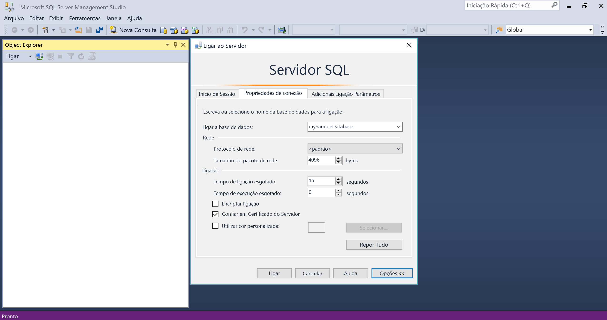
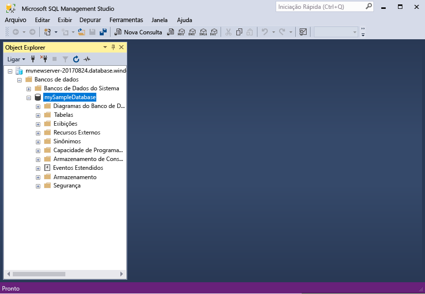
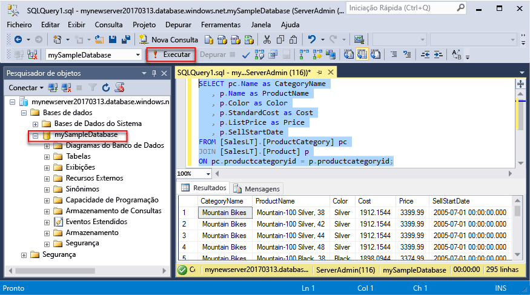
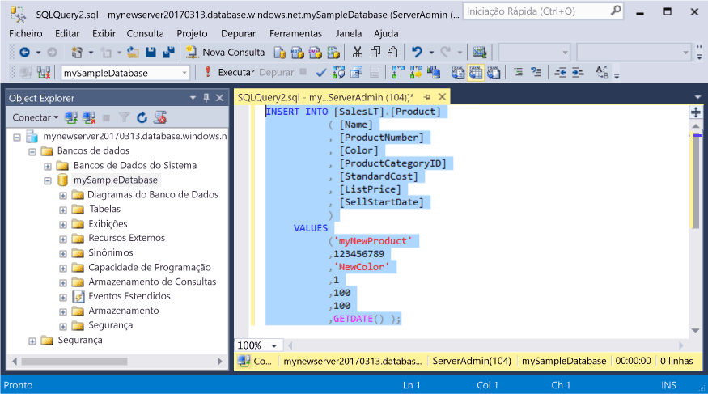
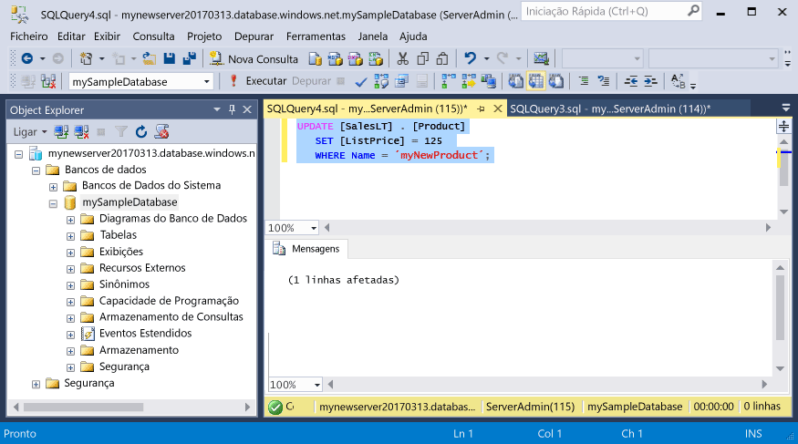
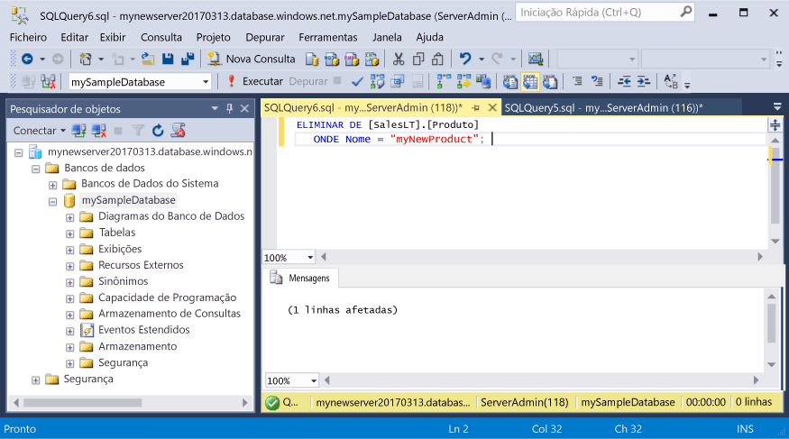

# <a name="azure-sql-database-use-sql-server-management-studio-tooconnect-and-query-data"></a>Base de dados SQL do Azure: Utilize o SQL Server Management Studio tooconnect e consulta de dados

[SQL Server Management Studio](https://msdn.microsoft.com/library/ms174173.aspx) (SSMS) é um ambiente integrado para a gestão qualquer infraestrutura de SQL Server, a partir do SQL Server tooSQL base de dados do Microsoft Windows. Este guia de introdução demonstra como toouse SSMS tooconnect tooan SQL database do Azure e, em seguida, tooquery de instruções de utilização Transact-SQL, inserem, atualizar e eliminar os dados na base de dados de Olá. 

## <a name="prerequisites"></a>Pré-requisitos

Este guia de introdução utiliza como os respetivos recursos Olá de ponto de partida criados destes inícios rápidos:

- [Criar BD - Portal](sql-database-get-started-portal.md)
- [Criar BD - CLI](sql-database-get-started-cli.md)
- [Criar BD - PowerShell](sql-database-get-started-powershell.md)

Antes de começar, certifique-se de que instalou a versão mais recente do Olá do [SSMS](https://msdn.microsoft.com/library/mt238290.aspx). 

## <a name="sql-server-connection-information"></a>Informações de ligação do servidor SQL

Obter Olá ligação informações necessárias tooconnect toohello SQL database do Azure. Precisa de nome de servidor completamente qualificado de Olá, nome de base de dados e informações de início de sessão nos procedimentos seguintes Olá.

1. Inicie sessão no toohello [portal do Azure](https://portal.azure.com/).
2. Selecione **bases de dados SQL** no menu da esquerda do Olá e clique em sua base de dados no Olá **bases de dados SQL** página. 
3. No Olá **descrição geral** da base de dados, reveja o nome de servidor completamente qualificado Olá conforme mostrado na imagem de Olá abaixo. Pode colocar o cursor sobre Olá toobring de nome de servidor se Olá **clique toocopy** opção.

    

4. Se tenha esquecido informações de início de sessão de Olá para o servidor da SQL Database do Azure, navegue toohello base de dados do SQL server página tooview Olá admin nome do servidor e, se necessário, de reposição de palavra-passe de Olá. 

## <a name="connect-tooyour-database"></a>Ligar a base de dados tooyour

Utilize o SQL Server Management Studio tooestablish um servidor de SQL Database do Azure de tooyour de ligação. 

> [!IMPORTANT]
> Um servidor lógico da Base de Dados SQL do Azure ouve na porta 1433. Se está a tentar efetuar tooconnect tooan SQL Database do Azure servidor lógico de dentro de uma firewall empresarial, esta porta tem de ser aberta na firewall da empresa Olá para toosuccessfully a ligação.
>

1. Abra o SQL Server Management Studio.

2. No Olá **ligar tooServer** caixa de diálogo, introduza Olá seguintes informações:

   | Definição       | Valor sugerido | Descrição | 
   | ------------ | ------------------ | ------------------------------------------------- | 
   | **Tipo de servidor** | Motor de base de dados | Este valor é preciso. |
   | **Nome do servidor** | nome de servidor completamente qualificado Olá | Olá nome deve ser algo semelhante ao seguinte: **mynewserver20170313.database.windows.net**. |
   | **Autenticação** | Autenticação do SQL Server | Autenticação de SQL é o tipo de autenticação apenas de Olá que configurámos neste tutorial. |
   | **Início de sessão** | conta de administrador do servidor de Olá | Esta é a conta de Olá que especificou quando criou o servidor de Olá. |
   | **Palavra-passe** | Olá palavra-passe da sua conta de administrador do servidor | Esta é a palavra-passe de Olá que especificou quando criou o servidor de Olá. |

     

3. Clique em **opções** no Olá **ligar tooserver** caixa de diálogo. No Olá **ligar toodatabase** secção, introduza **mySampleDatabase** base de dados do tooconnect toothis.

     

4. Clique em **Ligar**. é aberta a janela do Explorador de objetos de Olá no SSMS. 

     

5. No Object Explorer, expanda **bases de dados** e, em seguida, expanda **mySampleDatabase** objetos de Olá tooview na base de dados de exemplo de Olá.

## <a name="query-data"></a>Consultar dados

Seguinte de Olá de utilização código tooquery para produtos de primeiros 20 Olá por categoria utilizando Olá [SELECIONE](https://msdn.microsoft.com/library/ms189499.aspx) instrução Transact-SQL.

1. No Object Explorer, clique com o botão direito do rato em **mySampleDatabase** e, em seguida, clique em **Nova Consulta**. Uma janela de consulta em branco abre-se que está ligado tooyour base de dados.
2. Na janela de consulta Olá, introduza Olá seguinte consulta:

   ```sql
   SELECT pc.Name as CategoryName, p.name as ProductName
   FROM [SalesLT].[ProductCategory] pc
   JOIN [SalesLT].[Product] p
   ON pc.productcategoryid = p.productcategoryid;
   ```

3. Na barra de ferramentas Olá, clique em **executar** tooretrieve dados das tabelas de produto e ProductCategory Olá.

    

## <a name="insert-data"></a>Inserir dados

Utilize Olá seguinte código tooinsert novo produto na tabela de SalesLT.Product Olá utilizando Olá [inserir](https://msdn.microsoft.com/library/ms174335.aspx) instrução Transact-SQL.

1. Na janela de consulta Olá, substitua a consulta anterior Olá com Olá seguinte consulta:

   ```sql
   INSERT INTO [SalesLT].[Product]
           ( [Name]
           , [ProductNumber]
           , [Color]
           , [ProductCategoryID]
           , [StandardCost]
           , [ListPrice]
           , [SellStartDate]
           )
     VALUES
           ('myNewProduct'
           ,123456789
           ,'NewColor'
           ,1
           ,100
           ,100
           ,GETDATE() );
   ```

2. Na barra de ferramentas Olá, clique em **executar** tooinsert uma nova linha na tabela de produto Olá.

    

## <a name="update-data"></a>Atualizar dados

Seguinte de Olá de utilização código tooupdate Olá novo produto que adicionou anteriormente utilizando Olá [ATUALIZAÇÃO](https://msdn.microsoft.com/library/ms177523.aspx) instrução Transact-SQL.

1. Na janela de consulta Olá, substitua a consulta anterior Olá com Olá seguinte consulta:

   ```sql
   UPDATE [SalesLT].[Product]
   SET [ListPrice] = 125
   WHERE Name = 'myNewProduct';
   ```

2. Na barra de ferramentas Olá, clique em **executar** tooupdate Olá especificado linha Olá produto tabela.

    

## <a name="delete-data"></a>Eliminar dados

Seguinte de Olá de utilização código toodelete Olá novo produto que adicionou anteriormente utilizando Olá [eliminar](https://msdn.microsoft.com/library/ms189835.aspx) instrução Transact-SQL.

1. Na janela de consulta Olá, substitua a consulta anterior Olá com Olá seguinte consulta:

   ```sql
   DELETE FROM [SalesLT].[Product]
   WHERE Name = 'myNewProduct';
   ```

2. Na barra de ferramentas Olá, clique em **executar** toodelete Olá especificado linha Olá produto tabela.

    

## <a name="next-steps"></a>Passos seguintes

- toolearn sobre como criar e gerir servidores e bases de dados com o Transact-SQL, consulte [Saiba mais sobre os servidores de base de dados do Azure SQL Server e bases de dados](sql-database-servers-databases.md).
- Para obter informações sobre o SSMS, consulte o artigo [Use SQL Server Management Studio (Utilizar o SQL Server Management Studio)](https://msdn.microsoft.com/library/ms174173.aspx).
- tooconnect e consulta utilizando o Visual Studio Code, consulte [ligar e consultar com o Visual Studio Code](sql-database-connect-query-vscode.md).
- tooconnect e a consulta utilizando o .NET, consulte [ligar e consultar com .NET](sql-database-connect-query-dotnet.md).
- tooconnect e consulta com o PHP, consulte [ligar e consultar com o PHP](sql-database-connect-query-php.md).
- tooconnect e a consulta com o Node.js, consulte [ligar e consultar com o Node.js](sql-database-connect-query-nodejs.md).
- tooconnect e consulta utilizando Java, consulte [ligar e consultar com o Java](sql-database-connect-query-java.md).
- tooconnect e a consulta com o Python, consulte [ligar e consultar com o Python](sql-database-connect-query-python.md).
- tooconnect e consulta utilizando Ruby, consulte [ligar e consultar com Ruby](sql-database-connect-query-ruby.md).
