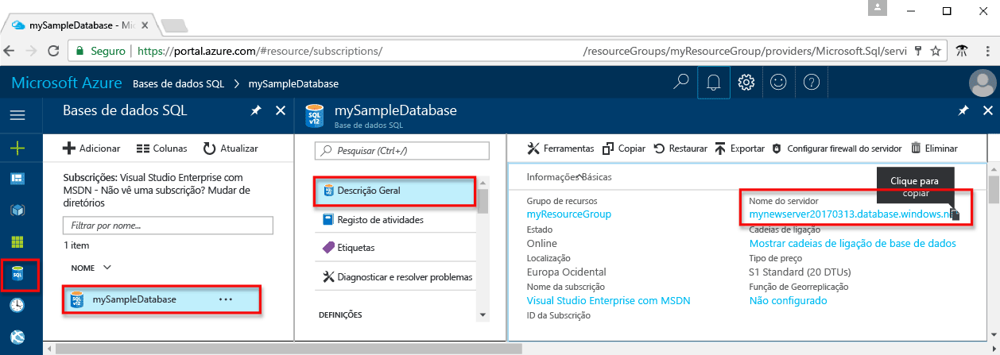
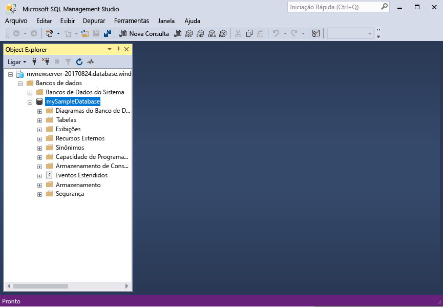

# <a name="design-your-first-azure-sql-database"></a><span data-ttu-id="30490-103">Conceber a sua primeira base de dados SQL do Azure</span><span class="sxs-lookup"><span data-stu-id="30490-103">Design your first Azure SQL database</span></span>

<span data-ttu-id="30490-104">Base de dados SQL do Azure é um relacional da base de dados como um serviço (DBaaS) no Olá Microsoft Cloud ("Azure").</span><span class="sxs-lookup"><span data-stu-id="30490-104">Azure SQL Database is a relational database-as-a service (DBaaS) in hello Microsoft Cloud ("Azure").</span></span> <span data-ttu-id="30490-105">Neste tutorial, saiba como toouse Olá portal do Azure e [SQL Server Management Studio](https://msdn.microsoft.com/library/ms174173.aspx) (SSMS) para:</span><span class="sxs-lookup"><span data-stu-id="30490-105">In this tutorial, you learn how toouse hello Azure portal and [SQL Server Management Studio](https://msdn.microsoft.com/library/ms174173.aspx) (SSMS) to:</span></span> 

> [!div class="checklist"]
> * <span data-ttu-id="30490-106">Criar uma base de dados no Olá portal do Azure</span><span class="sxs-lookup"><span data-stu-id="30490-106">Create a database in hello Azure portal</span></span>
> * <span data-ttu-id="30490-107">Configurar uma regra de firewall ao nível do servidor no Olá portal do Azure</span><span class="sxs-lookup"><span data-stu-id="30490-107">Set up a server-level firewall rule in hello Azure portal</span></span>
> * <span data-ttu-id="30490-108">Ligar a base de dados toohello com SSMS</span><span class="sxs-lookup"><span data-stu-id="30490-108">Connect toohello database with SSMS</span></span>
> * <span data-ttu-id="30490-109">Criar tabelas com o SSMS</span><span class="sxs-lookup"><span data-stu-id="30490-109">Create tables with SSMS</span></span>
> * <span data-ttu-id="30490-110">Carregamento em massa com o BCP</span><span class="sxs-lookup"><span data-stu-id="30490-110">Bulk load data with BCP</span></span>
> * <span data-ttu-id="30490-111">Consultar os dados com o SSMS</span><span class="sxs-lookup"><span data-stu-id="30490-111">Query that data with SSMS</span></span>
> * <span data-ttu-id="30490-112">Restaurar Olá tooa de base de dados anterior [ponto no restauro de tempo](sql-database-recovery-using-backups.md#point-in-time-restore) no Olá portal do Azure</span><span class="sxs-lookup"><span data-stu-id="30490-112">Restore hello database tooa previous [point in time restore](sql-database-recovery-using-backups.md#point-in-time-restore) in hello Azure portal</span></span>

<span data-ttu-id="30490-113">Se não tiver uma subscrição do Azure, [criar uma conta gratuita](https://azure.microsoft.com/free/) antes de começar.</span><span class="sxs-lookup"><span data-stu-id="30490-113">If you don't have an Azure subscription, [create a free account](https://azure.microsoft.com/free/) before you begin.</span></span>

## <a name="prerequisites"></a><span data-ttu-id="30490-114">Pré-requisitos</span><span class="sxs-lookup"><span data-stu-id="30490-114">Prerequisites</span></span>

<span data-ttu-id="30490-115">toocomplete disponibilizar este tutorial, se tiver instalado:</span><span class="sxs-lookup"><span data-stu-id="30490-115">toocomplete this tutorial, make sure you have installed:</span></span>
- <span data-ttu-id="30490-116">versão mais recente do Olá do [SQL Server Management Studio](https://msdn.microsoft.com/library/ms174173.aspx) (SSMS).</span><span class="sxs-lookup"><span data-stu-id="30490-116">hello newest version of [SQL Server Management Studio](https://msdn.microsoft.com/library/ms174173.aspx) (SSMS).</span></span>
- <span data-ttu-id="30490-117">versão mais recente do Olá do [BCP e SQLCMD](https://www.microsoft.com/download/details.aspx?id=36433).</span><span class="sxs-lookup"><span data-stu-id="30490-117">hello newest version of [BCP and SQLCMD](https://www.microsoft.com/download/details.aspx?id=36433).</span></span>

## <a name="log-in-toohello-azure-portal"></a><span data-ttu-id="30490-118">Início de sessão toohello portal do Azure</span><span class="sxs-lookup"><span data-stu-id="30490-118">Log in toohello Azure portal</span></span>

<span data-ttu-id="30490-119">Inicie sessão no toohello [portal do Azure](https://portal.azure.com/).</span><span class="sxs-lookup"><span data-stu-id="30490-119">Log in toohello [Azure portal](https://portal.azure.com/).</span></span>

## <a name="create-a-blank-sql-database"></a><span data-ttu-id="30490-120">Criar uma base de dados do SQL Server em branco</span><span class="sxs-lookup"><span data-stu-id="30490-120">Create a blank SQL database</span></span>

<span data-ttu-id="30490-121">É criada uma base de dados SQL do Azure com um conjunto definido de [recursos de armazenamento e computação](sql-database-service-tiers.md).</span><span class="sxs-lookup"><span data-stu-id="30490-121">An Azure SQL database is created with a defined set of [compute and storage resources](sql-database-service-tiers.md).</span></span> <span data-ttu-id="30490-122">base de dados de Olá criada dentro de um [grupo de recursos do Azure](../azure-resource-manager/resource-group-overview.md) e num [servidor lógico da SQL Database do Azure](sql-database-features.md).</span><span class="sxs-lookup"><span data-stu-id="30490-122">hello database is created within an [Azure resource group](../azure-resource-manager/resource-group-overview.md) and in an [Azure SQL Database logical server](sql-database-features.md).</span></span> 

<span data-ttu-id="30490-123">Siga estes passos toocreate uma base de dados do SQL Server em branco.</span><span class="sxs-lookup"><span data-stu-id="30490-123">Follow these steps toocreate a blank SQL database.</span></span> 

1. <span data-ttu-id="30490-124">Clique em Olá **novo** botão encontrado no canto esquerda superior Olá de Olá portal do Azure.</span><span class="sxs-lookup"><span data-stu-id="30490-124">Click hello **New** button found on hello upper left-hand corner of hello Azure portal.</span></span>

2. <span data-ttu-id="30490-125">Selecione **bases de dados** de Olá **novo** página e selecione **base de dados SQL** de Olá **bases de dados** página.</span><span class="sxs-lookup"><span data-stu-id="30490-125">Select **Databases** from hello **New** page, and select **SQL Database** from hello **Databases** page.</span></span> 

   

3. <span data-ttu-id="30490-127">Preencha formulário de base de dados SQL Olá com Olá seguintes informações, conforme mostrado no Olá anterior a imagem:</span><span class="sxs-lookup"><span data-stu-id="30490-127">Fill out hello SQL Database form with hello following information, as shown on hello preceding image:</span></span>   

   | <span data-ttu-id="30490-128">Definição</span><span class="sxs-lookup"><span data-stu-id="30490-128">Setting</span></span>       | <span data-ttu-id="30490-129">Valor sugerido</span><span class="sxs-lookup"><span data-stu-id="30490-129">Suggested value</span></span> | <span data-ttu-id="30490-130">Descrição</span><span class="sxs-lookup"><span data-stu-id="30490-130">Description</span></span> | 
   | ------------ | ------------------ | ------------------------------------------------- | 
   | <span data-ttu-id="30490-131">**Nome da base de dados**</span><span class="sxs-lookup"><span data-stu-id="30490-131">**Database name**</span></span> | <span data-ttu-id="30490-132">mySampleDatabase</span><span class="sxs-lookup"><span data-stu-id="30490-132">mySampleDatabase</span></span> | <span data-ttu-id="30490-133">Para nomes de bases de dados válidos, veja [Database Identifiers](https://docs.microsoft.com/sql/relational-databases/databases/database-identifiers) (Identificadores de Bases de Dados).</span><span class="sxs-lookup"><span data-stu-id="30490-133">For valid database names, see [Database Identifiers](https://docs.microsoft.com/sql/relational-databases/databases/database-identifiers).</span></span> | 
   | <span data-ttu-id="30490-134">**Subscrição**</span><span class="sxs-lookup"><span data-stu-id="30490-134">**Subscription**</span></span> | <span data-ttu-id="30490-135">A sua subscrição</span><span class="sxs-lookup"><span data-stu-id="30490-135">Your subscription</span></span>  | <span data-ttu-id="30490-136">Para obter detalhes sobre as suas subscrições, veja [Subscriptions](https://account.windowsazure.com/Subscriptions) (Subscrições).</span><span class="sxs-lookup"><span data-stu-id="30490-136">For details about your subscriptions, see [Subscriptions](https://account.windowsazure.com/Subscriptions).</span></span> |
   | <span data-ttu-id="30490-137">**Grupo de recursos**</span><span class="sxs-lookup"><span data-stu-id="30490-137">**Resource group**</span></span> | <span data-ttu-id="30490-138">myResourceGroup</span><span class="sxs-lookup"><span data-stu-id="30490-138">myResourceGroup</span></span> | <span data-ttu-id="30490-139">Para nomes de grupo de recursos válidos, veja [Naming rules and restrictions](https://docs.microsoft.com/azure/architecture/best-practices/naming-conventions) (Atribuição de nomes de regras e restrições).</span><span class="sxs-lookup"><span data-stu-id="30490-139">For valid resource group names, see [Naming rules and restrictions](https://docs.microsoft.com/azure/architecture/best-practices/naming-conventions).</span></span> |
   | <span data-ttu-id="30490-140">**Selecione a origem**</span><span class="sxs-lookup"><span data-stu-id="30490-140">**Select source**</span></span> | <span data-ttu-id="30490-141">Base de dados em branco</span><span class="sxs-lookup"><span data-stu-id="30490-141">Blank database</span></span> | <span data-ttu-id="30490-142">Especifica que deve ser criada uma base de dados em branco.</span><span class="sxs-lookup"><span data-stu-id="30490-142">Specifies that a blank database should be created.</span></span> |

4. <span data-ttu-id="30490-143">Clique em **servidor** toocreate e configurar um novo servidor para a sua nova base de dados.</span><span class="sxs-lookup"><span data-stu-id="30490-143">Click **Server** toocreate and configure a new server for your new database.</span></span> <span data-ttu-id="30490-144">Preencha Olá **novo formulário de servidor** com Olá seguintes informações:</span><span class="sxs-lookup"><span data-stu-id="30490-144">Fill out hello **New server form** with hello following information:</span></span> 

   | <span data-ttu-id="30490-145">Definição</span><span class="sxs-lookup"><span data-stu-id="30490-145">Setting</span></span>       | <span data-ttu-id="30490-146">Valor sugerido</span><span class="sxs-lookup"><span data-stu-id="30490-146">Suggested value</span></span> | <span data-ttu-id="30490-147">Descrição</span><span class="sxs-lookup"><span data-stu-id="30490-147">Description</span></span> | 
   | ------------ | ------------------ | ------------------------------------------------- | 
   | <span data-ttu-id="30490-148">**Nome do servidor**</span><span class="sxs-lookup"><span data-stu-id="30490-148">**Server name**</span></span> | <span data-ttu-id="30490-149">Qualquer nome globalmente exclusivo</span><span class="sxs-lookup"><span data-stu-id="30490-149">Any globally unique name</span></span> | <span data-ttu-id="30490-150">Para nomes de servidores válidos, veja [Naming rules and restrictions](https://docs.microsoft.com/azure/architecture/best-practices/naming-conventions) (Atribuição de nomes de regras e restrições).</span><span class="sxs-lookup"><span data-stu-id="30490-150">For valid server names, see [Naming rules and restrictions](https://docs.microsoft.com/azure/architecture/best-practices/naming-conventions).</span></span> | 
   | <span data-ttu-id="30490-151">**Início de sessão de administrador do servidor**</span><span class="sxs-lookup"><span data-stu-id="30490-151">**Server admin login**</span></span> | <span data-ttu-id="30490-152">Qualquer nome válido</span><span class="sxs-lookup"><span data-stu-id="30490-152">Any valid name</span></span> | <span data-ttu-id="30490-153">Para nomes de início de sessão válidos, veja [Database Identifiers](https://docs.microsoft.com/sql/relational-databases/databases/database-identifiers) (Identificadores de Bases de Dados).</span><span class="sxs-lookup"><span data-stu-id="30490-153">For valid login names, see [Database Identifiers](https://docs.microsoft.com/sql/relational-databases/databases/database-identifiers).</span></span>|
   | <span data-ttu-id="30490-154">**Palavra-passe**</span><span class="sxs-lookup"><span data-stu-id="30490-154">**Password**</span></span> | <span data-ttu-id="30490-155">Qualquer palavra-passe válida</span><span class="sxs-lookup"><span data-stu-id="30490-155">Any valid password</span></span> | <span data-ttu-id="30490-156">A palavra-passe tem de ter, pelo menos, 8 carateres e tem de conter carateres de três das seguintes categorias de Olá: carateres maiúsculos, carateres minúsculos, números e carateres não alfanuméricos.</span><span class="sxs-lookup"><span data-stu-id="30490-156">Your password must have at least 8 characters and must contain characters from three of hello following categories: upper case characters, lower case characters, numbers, and non-alphanumeric characters.</span></span> |
   | <span data-ttu-id="30490-157">**Localização**</span><span class="sxs-lookup"><span data-stu-id="30490-157">**Location**</span></span> | <span data-ttu-id="30490-158">Nenhuma localização válida</span><span class="sxs-lookup"><span data-stu-id="30490-158">Any valid location</span></span> | <span data-ttu-id="30490-159">Para obter mais informações sobre regiões, veja [Azure Regions](https://azure.microsoft.com/regions/) (Regiões do Azure).</span><span class="sxs-lookup"><span data-stu-id="30490-159">For information about regions, see [Azure Regions](https://azure.microsoft.com/regions/).</span></span> |

   

5. <span data-ttu-id="30490-161">Clique em **Selecionar**.</span><span class="sxs-lookup"><span data-stu-id="30490-161">Click **Select**.</span></span>

6. <span data-ttu-id="30490-162">Clique em **escalão de preço** toospecify Olá camada e o desempenho do nível de serviço para a sua nova base de dados.</span><span class="sxs-lookup"><span data-stu-id="30490-162">Click **Pricing tier** toospecify hello service tier and performance level for your new database.</span></span> <span data-ttu-id="30490-163">Para este tutorial, selecione **20 DTUs** e **250** GB de armazenamento.</span><span class="sxs-lookup"><span data-stu-id="30490-163">For this tutorial, select **20 DTUs** and **250** GB of storage.</span></span>

   

7. <span data-ttu-id="30490-165">Clique em **Aplicar**.</span><span class="sxs-lookup"><span data-stu-id="30490-165">Click **Apply**.</span></span>  

8. <span data-ttu-id="30490-166">Selecione um **agrupamento** para Olá em branco da base de dados (para este tutorial, utilize Olá predefinição).</span><span class="sxs-lookup"><span data-stu-id="30490-166">Select a **collation** for hello blank database (for this tutorial, use hello default value).</span></span> <span data-ttu-id="30490-167">Para obter mais informações sobre agrupamentos, consulte [agrupamentos](https://docs.microsoft.com/sql/t-sql/statements/collations)</span><span class="sxs-lookup"><span data-stu-id="30490-167">For more information about collations, see [Collations](https://docs.microsoft.com/sql/t-sql/statements/collations)</span></span>

9. <span data-ttu-id="30490-168">Clique em **criar** base de dados do tooprovision Olá.</span><span class="sxs-lookup"><span data-stu-id="30490-168">Click **Create** tooprovision hello database.</span></span> <span data-ttu-id="30490-169">Aprovisionamento demora sobre toocomplete um minuto e um meio.</span><span class="sxs-lookup"><span data-stu-id="30490-169">Provisioning takes about a minute and a half toocomplete.</span></span> 

10. <span data-ttu-id="30490-170">Na barra de ferramentas Olá, clique em **notificações** processo de implementação de Olá toomonitor.</span><span class="sxs-lookup"><span data-stu-id="30490-170">On hello toolbar, click **Notifications** toomonitor hello deployment process.</span></span>

   

## <a name="create-a-server-level-firewall-rule"></a><span data-ttu-id="30490-172">Criar uma regra de firewall ao nível do servidor</span><span class="sxs-lookup"><span data-stu-id="30490-172">Create a server-level firewall rule</span></span>

<span data-ttu-id="30490-173">Olá serviço base de dados do SQL Server cria uma firewall no Olá ao nível do servidor que impede o ligar toohello servidor ou bases de dados no servidor de Olá, a menos que é criada uma regra de firewall firewall de Olá tooopen para endereços IP específicos de ferramentas e aplicações externas.</span><span class="sxs-lookup"><span data-stu-id="30490-173">hello SQL Database service creates a firewall at hello server-level that prevents external applications and tools from connecting toohello server or any databases on hello server unless a firewall rule is created tooopen hello firewall for specific IP addresses.</span></span> <span data-ttu-id="30490-174">Siga estes passos toocreate um [regra de firewall ao nível do servidor de base de dados SQL](sql-database-firewall-configure.md) para endereços IP do cliente e ativar a conectividade externa através de firewall de base de dados SQL Olá para apenas o seu endereço IP.</span><span class="sxs-lookup"><span data-stu-id="30490-174">Follow these steps toocreate a [SQL Database server-level firewall rule](sql-database-firewall-configure.md) for your client's IP address and enable external connectivity through hello SQL Database firewall for your IP address only.</span></span> 

> [!NOTE]
> <span data-ttu-id="30490-175">A Base de Dados SQL comunica através da porta 1433.</span><span class="sxs-lookup"><span data-stu-id="30490-175">SQL Database communicates over port 1433.</span></span> <span data-ttu-id="30490-176">Se estiver a tentar tooconnect a partir de uma rede empresarial, o tráfego de saída através da porta 1433 não poderá permitido pela firewall da sua rede.</span><span class="sxs-lookup"><span data-stu-id="30490-176">If you are trying tooconnect from within a corporate network, outbound traffic over port 1433 may not be allowed by your network's firewall.</span></span> <span data-ttu-id="30490-177">Se assim for, não é possível ligar o servidor de base de dados do Azure SQL tooyour, a menos que o departamento de TI abre-se a porta 1433.</span><span class="sxs-lookup"><span data-stu-id="30490-177">If so, you cannot connect tooyour Azure SQL Database server unless your IT department opens port 1433.</span></span>
>

1. <span data-ttu-id="30490-178">Depois de concluída a implementação de Olá, clique em **bases de dados SQL** do menu da esquerda Olá e, em seguida, clique em **mySampleDatabase** no Olá **bases de dados SQL** página.</span><span class="sxs-lookup"><span data-stu-id="30490-178">After hello deployment completes, click **SQL databases** from hello left-hand menu and then click **mySampleDatabase** on hello **SQL databases** page.</span></span> <span data-ttu-id="30490-179">Olá página de descrição geral para abre a base de dados, que mostra Olá completamente qualificado nome do servidor (tais como **mynewserver20170313.database.windows.net**) e fornece opções para continuar a configuração.</span><span class="sxs-lookup"><span data-stu-id="30490-179">hello overview page for your database opens, showing you hello fully qualified server name (such as **mynewserver20170313.database.windows.net**) and provides options for further configuration.</span></span> <span data-ttu-id="30490-180">Copie este nome de servidor totalmente qualificado para utilizar mais tarde.</span><span class="sxs-lookup"><span data-stu-id="30490-180">Copy this fully qualified server name for use later.</span></span>

   > [!IMPORTANT]
   > <span data-ttu-id="30490-181">Terá deste servidor de tooyour de tooconnect de nome de servidor completamente qualificado e as respetivas bases de dados subsequentes inícios rápidos.</span><span class="sxs-lookup"><span data-stu-id="30490-181">You need this fully qualified server name tooconnect tooyour server and its databases in subsequent quick starts.</span></span>
   > 

    

2. <span data-ttu-id="30490-183">Clique em **definir a firewall do servidor** na barra de ferramentas de Olá conforme mostrado na imagem anterior Olá.</span><span class="sxs-lookup"><span data-stu-id="30490-183">Click **Set server firewall** on hello toolbar as shown in hello previous image.</span></span> <span data-ttu-id="30490-184">Olá **definições de Firewall** abre a página do servidor de base de dados SQL Olá.</span><span class="sxs-lookup"><span data-stu-id="30490-184">hello **Firewall settings** page for hello SQL Database server opens.</span></span> 

    


3. <span data-ttu-id="30490-186">Clique em **Adicionar IP do cliente** no Olá barra de ferramentas tooadd tooa nova regra de firewall de endereços de IP sua atual.</span><span class="sxs-lookup"><span data-stu-id="30490-186">Click **Add client IP** on hello toolbar tooadd your current IP address tooa new firewall rule.</span></span> <span data-ttu-id="30490-187">Uma regra de firewall consegue abrir a porta 1433 para um único endereço IP ou para um intervalo de endereços IP.</span><span class="sxs-lookup"><span data-stu-id="30490-187">A firewall rule can open port 1433 for a single IP address or a range of IP addresses.</span></span>

4. <span data-ttu-id="30490-188">Clique em **Guardar**.</span><span class="sxs-lookup"><span data-stu-id="30490-188">Click **Save**.</span></span> <span data-ttu-id="30490-189">É criada uma regra de firewall ao nível do servidor para o endereço IP atual ao abrir a porta 1433 no servidor lógico de Olá.</span><span class="sxs-lookup"><span data-stu-id="30490-189">A server-level firewall rule is created for your current IP address opening port 1433 on hello logical server.</span></span>

    

4. <span data-ttu-id="30490-191">Clique em **OK** e, em seguida, feche Olá **definições de Firewall** página.</span><span class="sxs-lookup"><span data-stu-id="30490-191">Click **OK** and then close hello **Firewall settings** page.</span></span>

<span data-ttu-id="30490-192">Agora pode ligar o servidor de base de dados SQL toohello e respetivas bases de dados utilizando o SQL Server Management Studio ou outra ferramenta à sua escolha deste endereço IP utilizando a conta de administrador de servidor de Olá criada anteriormente.</span><span class="sxs-lookup"><span data-stu-id="30490-192">You can now connect toohello SQL Database server and its databases using SQL Server Management Studio or another tool of your choice from this IP address using hello server admin account created previously.</span></span>

> [!IMPORTANT]
> <span data-ttu-id="30490-193">Por predefinição, o acesso através de firewall de base de dados SQL Olá está ativado para todos os serviços do Azure.</span><span class="sxs-lookup"><span data-stu-id="30490-193">By default, access through hello SQL Database firewall is enabled for all Azure services.</span></span> <span data-ttu-id="30490-194">Clique em **OFF** no toodisable página para todos os serviços do Azure.</span><span class="sxs-lookup"><span data-stu-id="30490-194">Click **OFF** on this page toodisable for all Azure services.</span></span>

## <a name="sql-server-connection-information"></a><span data-ttu-id="30490-195">Informações de ligação do servidor SQL</span><span class="sxs-lookup"><span data-stu-id="30490-195">SQL server connection information</span></span>

<span data-ttu-id="30490-196">Obter o nome de servidor completamente qualificado de Olá para o servidor da SQL Database do Azure no Olá portal do Azure.</span><span class="sxs-lookup"><span data-stu-id="30490-196">Get hello fully qualified server name for your Azure SQL Database server in hello Azure portal.</span></span> <span data-ttu-id="30490-197">Utilize Olá servidor completamente qualificado tooconnect tooyour ao servidor de nomes utilizando o SQL Server Management Studio.</span><span class="sxs-lookup"><span data-stu-id="30490-197">You use hello fully qualified server name tooconnect tooyour server using SQL Server Management Studio.</span></span>

1. <span data-ttu-id="30490-198">Inicie sessão no toohello [portal do Azure](https://portal.azure.com/).</span><span class="sxs-lookup"><span data-stu-id="30490-198">Log in toohello [Azure portal](https://portal.azure.com/).</span></span>
2. <span data-ttu-id="30490-199">Selecione **bases de dados SQL** no menu da esquerda do Olá e clique em sua base de dados no Olá **bases de dados SQL** página.</span><span class="sxs-lookup"><span data-stu-id="30490-199">Select **SQL Databases** from hello left-hand menu, and click your database on hello **SQL databases** page.</span></span> 
3. <span data-ttu-id="30490-200">No Olá **Essentials** painel Olá página do portal do Azure para a base de dados, localize e, em seguida, copie Olá **nome do servidor**.</span><span class="sxs-lookup"><span data-stu-id="30490-200">In hello **Essentials** pane in hello Azure portal page for your database, locate and then copy hello **Server name**.</span></span>

   

## <a name="connect-toohello-database-with-ssms"></a><span data-ttu-id="30490-202">Ligar a base de dados toohello com SSMS</span><span class="sxs-lookup"><span data-stu-id="30490-202">Connect toohello database with SSMS</span></span>

<span data-ttu-id="30490-203">Utilize [SQL Server Management Studio](https://docs.microsoft.com/sql/ssms/sql-server-management-studio-ssms) tooestablish um servidor de SQL Database do Azure de tooyour de ligação.</span><span class="sxs-lookup"><span data-stu-id="30490-203">Use [SQL Server Management Studio](https://docs.microsoft.com/sql/ssms/sql-server-management-studio-ssms) tooestablish a connection tooyour Azure SQL Database server.</span></span>

1. <span data-ttu-id="30490-204">Abra o SQL Server Management Studio.</span><span class="sxs-lookup"><span data-stu-id="30490-204">Open SQL Server Management Studio.</span></span>

2. <span data-ttu-id="30490-205">No Olá **ligar tooServer** caixa de diálogo, introduza Olá seguintes informações:</span><span class="sxs-lookup"><span data-stu-id="30490-205">In hello **Connect tooServer** dialog box, enter hello following information:</span></span>

   | <span data-ttu-id="30490-206">Definição</span><span class="sxs-lookup"><span data-stu-id="30490-206">Setting</span></span>       | <span data-ttu-id="30490-207">Valor sugerido</span><span class="sxs-lookup"><span data-stu-id="30490-207">Suggested value</span></span> | <span data-ttu-id="30490-208">Descrição</span><span class="sxs-lookup"><span data-stu-id="30490-208">Description</span></span> | 
   | ------------ | ------------------ | ------------------------------------------------- | 
   | <span data-ttu-id="30490-209">Tipo de servidor</span><span class="sxs-lookup"><span data-stu-id="30490-209">Server type</span></span> | <span data-ttu-id="30490-210">Motor de base de dados</span><span class="sxs-lookup"><span data-stu-id="30490-210">Database engine</span></span> | <span data-ttu-id="30490-211">Este valor é necessário</span><span class="sxs-lookup"><span data-stu-id="30490-211">This value is required</span></span> |
   | <span data-ttu-id="30490-212">Nome do servidor</span><span class="sxs-lookup"><span data-stu-id="30490-212">Server name</span></span> | <span data-ttu-id="30490-213">nome de servidor completamente qualificado Olá</span><span class="sxs-lookup"><span data-stu-id="30490-213">hello fully qualified server name</span></span> | <span data-ttu-id="30490-214">Olá nome deve ser algo semelhante ao seguinte: **mynewserver20170313.database.windows.net**.</span><span class="sxs-lookup"><span data-stu-id="30490-214">hello name should be something like this: **mynewserver20170313.database.windows.net**.</span></span> |
   | <span data-ttu-id="30490-215">Autenticação</span><span class="sxs-lookup"><span data-stu-id="30490-215">Authentication</span></span> | <span data-ttu-id="30490-216">Autenticação do SQL Server</span><span class="sxs-lookup"><span data-stu-id="30490-216">SQL Server Authentication</span></span> | <span data-ttu-id="30490-217">Autenticação de SQL é o tipo de autenticação apenas de Olá que configurámos neste tutorial.</span><span class="sxs-lookup"><span data-stu-id="30490-217">SQL Authentication is hello only authentication type that we have configured in this tutorial.</span></span> |
   | <span data-ttu-id="30490-218">Iniciar sessão</span><span class="sxs-lookup"><span data-stu-id="30490-218">Login</span></span> | <span data-ttu-id="30490-219">conta de administrador do servidor de Olá</span><span class="sxs-lookup"><span data-stu-id="30490-219">hello server admin account</span></span> | <span data-ttu-id="30490-220">Esta é a conta de Olá que especificou quando criou o servidor de Olá.</span><span class="sxs-lookup"><span data-stu-id="30490-220">This is hello account that you specified when you created hello server.</span></span> |
   | <span data-ttu-id="30490-221">Palavra-passe</span><span class="sxs-lookup"><span data-stu-id="30490-221">Password</span></span> | <span data-ttu-id="30490-222">Olá palavra-passe da sua conta de administrador do servidor</span><span class="sxs-lookup"><span data-stu-id="30490-222">hello password for your server admin account</span></span> | <span data-ttu-id="30490-223">Esta é a palavra-passe de Olá que especificou quando criou o servidor de Olá.</span><span class="sxs-lookup"><span data-stu-id="30490-223">This is hello password that you specified when you created hello server.</span></span> |

   

3. <span data-ttu-id="30490-225">Clique em **opções** no Olá **ligar tooserver** caixa de diálogo.</span><span class="sxs-lookup"><span data-stu-id="30490-225">Click **Options** in hello **Connect tooserver** dialog box.</span></span> <span data-ttu-id="30490-226">No Olá **ligar toodatabase** secção, introduza **mySampleDatabase** base de dados do tooconnect toothis.</span><span class="sxs-lookup"><span data-stu-id="30490-226">In hello **Connect toodatabase** section, enter **mySampleDatabase** tooconnect toothis database.</span></span>

     

4. <span data-ttu-id="30490-228">Clique em **Ligar**.</span><span class="sxs-lookup"><span data-stu-id="30490-228">Click **Connect**.</span></span> <span data-ttu-id="30490-229">é aberta a janela do Explorador de objetos de Olá no SSMS.</span><span class="sxs-lookup"><span data-stu-id="30490-229">hello Object Explorer window opens in SSMS.</span></span> 

5. <span data-ttu-id="30490-230">No Object Explorer, expanda **bases de dados** e, em seguida, expanda **mySampleDatabase** objetos de Olá tooview na base de dados de exemplo de Olá.</span><span class="sxs-lookup"><span data-stu-id="30490-230">In Object Explorer, expand **Databases** and then expand **mySampleDatabase** tooview hello objects in hello sample database.</span></span>

     

## <a name="create-tables-in-hello-database"></a><span data-ttu-id="30490-232">Criar tabelas na base de dados de Olá</span><span class="sxs-lookup"><span data-stu-id="30490-232">Create tables in hello database</span></span> 

<span data-ttu-id="30490-233">Criar um esquema de base de dados com quatro tabelas que um sistema de gestão do estudante para universities utilizando o modelo [Transact-SQL](https://docs.microsoft.com/sql/t-sql/language-reference):</span><span class="sxs-lookup"><span data-stu-id="30490-233">Create a database schema with four tables that model a student management system for universities using [Transact-SQL](https://docs.microsoft.com/sql/t-sql/language-reference):</span></span>

- <span data-ttu-id="30490-234">Pessoa</span><span class="sxs-lookup"><span data-stu-id="30490-234">Person</span></span>
- <span data-ttu-id="30490-235">Decorrer</span><span class="sxs-lookup"><span data-stu-id="30490-235">Course</span></span>
- <span data-ttu-id="30490-236">Estudante</span><span class="sxs-lookup"><span data-stu-id="30490-236">Student</span></span>
- <span data-ttu-id="30490-237">Esse modelo um sistema de gestão do estudante para universities de crédito</span><span class="sxs-lookup"><span data-stu-id="30490-237">Credit that model a student management system for universities</span></span>

<span data-ttu-id="30490-238">Olá diagrama seguinte mostra como estas tabelas estão relacionado tooeach outro.</span><span class="sxs-lookup"><span data-stu-id="30490-238">hello following diagram shows how these tables are related tooeach other.</span></span> <span data-ttu-id="30490-239">Alguns destas tabelas referenciam colunas nas outras tabelas.</span><span class="sxs-lookup"><span data-stu-id="30490-239">Some of these tables reference columns in other tables.</span></span> <span data-ttu-id="30490-240">Por exemplo, a tabela de estudante Olá referencia Olá **PersonId** coluna Olá **pessoa** tabela.</span><span class="sxs-lookup"><span data-stu-id="30490-240">For example, hello Student table references hello **PersonId** column of hello **Person** table.</span></span> <span data-ttu-id="30490-241">Prático Olá diagrama toounderstand como Olá tabelas neste tutorial são tooone relacionado outro.</span><span class="sxs-lookup"><span data-stu-id="30490-241">Study hello diagram toounderstand how hello tables in this tutorial are related tooone another.</span></span> <span data-ttu-id="30490-242">Para uma visão detalhada das como tabelas de base de dados Efetivo toocreate, consulte [criar tabelas de base de dados Efetivo](https://msdn.microsoft.com/library/cc505842.aspx).</span><span class="sxs-lookup"><span data-stu-id="30490-242">For an in-depth look at how toocreate effective database tables, see [Create effective database tables](https://msdn.microsoft.com/library/cc505842.aspx).</span></span> <span data-ttu-id="30490-243">Para obter informações sobre como escolher tipos de dados, consulte [tipos de dados](https://docs.microsoft.com/sql/t-sql/data-types/data-types-transact-sql).</span><span class="sxs-lookup"><span data-stu-id="30490-243">For information about choosing data types, see [Data types](https://docs.microsoft.com/sql/t-sql/data-types/data-types-transact-sql).</span></span>

> [!NOTE]
> <span data-ttu-id="30490-244">Também pode utilizar Olá [designer de tabela no SQL Server Management Studio](https://msdn.microsoft.com/library/hh272695.aspx) toocreate e as tabelas de design.</span><span class="sxs-lookup"><span data-stu-id="30490-244">You can also use hello [table designer in SQL Server Management Studio](https://msdn.microsoft.com/library/hh272695.aspx) toocreate and design your tables.</span></span> 


1. <span data-ttu-id="30490-246">No Object Explorer, clique com o botão direito do rato em **mySampleDatabase** e, em seguida, clique em **Nova Consulta**.</span><span class="sxs-lookup"><span data-stu-id="30490-246">In Object Explorer, right-click **mySampleDatabase** and click **New Query**.</span></span> <span data-ttu-id="30490-247">Uma janela de consulta em branco abre-se que está ligado tooyour base de dados.</span><span class="sxs-lookup"><span data-stu-id="30490-247">A blank query window opens that is connected tooyour database.</span></span>

2. <span data-ttu-id="30490-248">Na janela de consulta Olá, execute Olá seguintes quatro tabelas da consulta toocreate na base de dados:</span><span class="sxs-lookup"><span data-stu-id="30490-248">In hello query window, execute hello following query toocreate four tables in your database:</span></span> 

   ```sql 
   -- Create Person table

   CREATE TABLE Person
   (
   PersonId   INT IDENTITY PRIMARY KEY,
   FirstName   NVARCHAR(128) NOT NULL,
   MiddelInitial NVARCHAR(10),
   LastName   NVARCHAR(128) NOT NULL,
   DateOfBirth   DATE NOT NULL
   )
   
   -- Create Student table
 
   CREATE TABLE Student
   (
   StudentId INT IDENTITY PRIMARY KEY,
   PersonId  INT REFERENCES Person (PersonId),
   Email   NVARCHAR(256)
   )
   
   -- Create Course table
 
   CREATE TABLE Course
   (
   CourseId  INT IDENTITY PRIMARY KEY,
   Name   NVARCHAR(50) NOT NULL,
   Teacher   NVARCHAR(256) NOT NULL
   ) 

   -- Create Credit table
 
   CREATE TABLE Credit
   (
   StudentId   INT REFERENCES Student (StudentId),
   CourseId   INT REFERENCES Course (CourseId),
   Grade   DECIMAL(5,2) CHECK (Grade <= 100.00),
   Attempt   TINYINT,
   CONSTRAINT  [UQ_studentgrades] UNIQUE CLUSTERED
   (
   StudentId, CourseId, Grade, Attempt
   )
   )
   ```

   

3. <span data-ttu-id="30490-250">Expanda o nó de 'tabelas' de Olá no Olá objeto do SQL Server Management Studio explorer toosee Olá tabelas criadas por si.</span><span class="sxs-lookup"><span data-stu-id="30490-250">Expand hello 'tables' node in hello SQL Server Management Studio Object explorer toosee hello tables you created.</span></span>

   

## <a name="load-data-into-hello-tables"></a><span data-ttu-id="30490-252">Carregar dados para tabelas de Olá</span><span class="sxs-lookup"><span data-stu-id="30490-252">Load data into hello tables</span></span>

1. <span data-ttu-id="30490-253">Crie uma pasta denominada **SampleTableData** nos seus dados de exemplo do transferências pasta toostore da base de dados.</span><span class="sxs-lookup"><span data-stu-id="30490-253">Create a folder called **SampleTableData** in your Downloads folder toostore sample data for your database.</span></span> 

2. <span data-ttu-id="30490-254">Liga a seguir de Olá de contexto e guardá-las em Olá **SampleTableData** pasta.</span><span class="sxs-lookup"><span data-stu-id="30490-254">Right-click hello following links and save them into hello **SampleTableData** folder.</span></span> 

   - [<span data-ttu-id="30490-255">SampleCourseData</span><span class="sxs-lookup"><span data-stu-id="30490-255">SampleCourseData</span></span>](https://sqldbtutorial.blob.core.windows.net/tutorials/SampleCourseData)
   - [<span data-ttu-id="30490-256">SamplePersonData</span><span class="sxs-lookup"><span data-stu-id="30490-256">SamplePersonData</span></span>](https://sqldbtutorial.blob.core.windows.net/tutorials/SamplePersonData)
   - [<span data-ttu-id="30490-257">SampleStudentData</span><span class="sxs-lookup"><span data-stu-id="30490-257">SampleStudentData</span></span>](https://sqldbtutorial.blob.core.windows.net/tutorials/SampleStudentData)
   - [<span data-ttu-id="30490-258">SampleCreditData</span><span class="sxs-lookup"><span data-stu-id="30490-258">SampleCreditData</span></span>](https://sqldbtutorial.blob.core.windows.net/tutorials/SampleCreditData)

3. <span data-ttu-id="30490-259">Abra uma janela de linha de comandos e navegue toohello SampleTableData pasta.</span><span class="sxs-lookup"><span data-stu-id="30490-259">Open a command prompt window and navigate toohello SampleTableData folder.</span></span>

4. <span data-ttu-id="30490-260">Executar Olá os seguintes dados de exemplo de tooinsert comandos em tabelas de Olá, substituindo os valores de Olá para **ServerName**, **DatabaseName**, **UserName**e **Palavra-passe** com valores de Olá para o seu ambiente.</span><span class="sxs-lookup"><span data-stu-id="30490-260">Execute hello following commands tooinsert sample data into hello tables replacing hello values for **ServerName**, **DatabaseName**, **UserName**, and **Password** with hello values for your environment.</span></span>
  
   ```bcp
   bcp Course in SampleCourseData -S <ServerName>.database.windows.net -d <DatabaseName> -U <Username> -P <password> -q -c -t ","
   bcp Person in SamplePersonData -S <ServerName>.database.windows.net -d <DatabaseName> -U <Username> -P <password> -q -c -t ","
   bcp Student in SampleStudentData -S <ServerName>.database.windows.net -d <DatabaseName> -U <Username> -P <password> -q -c -t ","
   bcp Credit in SampleCreditData -S <ServerName>.database.windows.net -d <DatabaseName> -U <Username> -P <password> -q -c -t ","
   ```

<span data-ttu-id="30490-261">Agora tem carregados dados de exemplo para tabelas de Olá que criou anteriormente.</span><span class="sxs-lookup"><span data-stu-id="30490-261">You have now loaded sample data into hello tables you created earlier.</span></span>

## <a name="query-data"></a><span data-ttu-id="30490-262">Consultar dados</span><span class="sxs-lookup"><span data-stu-id="30490-262">Query data</span></span>

<span data-ttu-id="30490-263">Execute Olá seguintes informações de tooretrieve consultas de tabelas de base de dados de Olá.</span><span class="sxs-lookup"><span data-stu-id="30490-263">Execute hello following queries tooretrieve information from hello database tables.</span></span> <span data-ttu-id="30490-264">Consulte [escrever consultas de SQL](https://technet.microsoft.com/library/bb264565.aspx) toolearn mais sobre como escrever consultas SQL.</span><span class="sxs-lookup"><span data-stu-id="30490-264">See [Writing SQL Queries](https://technet.microsoft.com/library/bb264565.aspx) toolearn more about writing SQL queries.</span></span> <span data-ttu-id="30490-265">consulta primeiro Olá junta toofind quatro tabelas todos os todos os Olá os estudantes que estejam taught por ' Dominick Pope' que tem um nível superior a % de 75 na sua classe.</span><span class="sxs-lookup"><span data-stu-id="30490-265">hello first query joins all four tables toofind all hello students taught by 'Dominick Pope' who have a grade higher than 75% in his class.</span></span> <span data-ttu-id="30490-266">consulta segundo Olá associa as quatro tabelas e localiza todos os courses na qual tenha alguma vez inscrito 'Noe Coleman'.</span><span class="sxs-lookup"><span data-stu-id="30490-266">hello second query joins all four tables and finds all courses in which 'Noe Coleman' has ever enrolled.</span></span>

1. <span data-ttu-id="30490-267">Numa janela de consulta do SQL Server Management Studio, execute Olá seguinte consulta:</span><span class="sxs-lookup"><span data-stu-id="30490-267">In a SQL Server Management Studio query window, execute hello following query:</span></span>

   ```sql 
   -- Find hello students taught by Dominick Pope who have a grade higher than 75%

   SELECT  person.FirstName,
   person.LastName,
   course.Name,
   credit.Grade
   FROM  Person AS person
   INNER JOIN Student AS student ON person.PersonId = student.PersonId
   INNER JOIN Credit AS credit ON student.StudentId = credit.StudentId
   INNER JOIN Course AS course ON credit.CourseId = course.courseId
   WHERE course.Teacher = 'Dominick Pope' 
   AND Grade > 75
   ```

2. <span data-ttu-id="30490-268">Numa janela de consulta do SQL Server Management Studio, execute os seguintes consultas:</span><span class="sxs-lookup"><span data-stu-id="30490-268">In a SQL Server Management Studio query window, execute following query:</span></span>

   ```sql
   -- Find all hello courses in which Noe Coleman has ever enrolled

   SELECT  course.Name,
   course.Teacher,
   credit.Grade
   FROM  Course AS course
   INNER JOIN Credit AS credit ON credit.CourseId = course.CourseId
   INNER JOIN Student AS student ON student.StudentId = credit.StudentId
   INNER JOIN Person AS person ON person.PersonId = student.PersonId
   WHERE person.FirstName = 'Noe'
   AND person.LastName = 'Coleman'
   ```

## <a name="restore-a-database-tooa-previous-point-in-time"></a><span data-ttu-id="30490-269">Restaurar um ponto anterior de tooa de base de dados no tempo</span><span class="sxs-lookup"><span data-stu-id="30490-269">Restore a database tooa previous point in time</span></span>

<span data-ttu-id="30490-270">Imagine que tenha eliminado acidentalmente uma tabela.</span><span class="sxs-lookup"><span data-stu-id="30490-270">Imagine you have accidentally deleted a table.</span></span> <span data-ttu-id="30490-271">Este é algo que facilmente não consegue recuperar.</span><span class="sxs-lookup"><span data-stu-id="30490-271">This is something you cannot easily recover from.</span></span> <span data-ttu-id="30490-272">Base de dados SQL do Azure permite-lhe toogo back tooany ponto no tempo no Olá última cópia de segurança too35 dias e restaurar este ponto no tempo tooa novos da base de dados.</span><span class="sxs-lookup"><span data-stu-id="30490-272">Azure SQL Database allows you toogo back tooany point in time in hello last up too35 days and restore this point in time tooa new database.</span></span> <span data-ttu-id="30490-273">Pode toorecover esta base de dados os dados eliminados.</span><span class="sxs-lookup"><span data-stu-id="30490-273">You can you this database toorecover your deleted data.</span></span> <span data-ttu-id="30490-274">Olá passos seguintes restaurar ponto de tooa de base de dados de exemplo de Olá antes de tabelas de Olá foram adicionadas.</span><span class="sxs-lookup"><span data-stu-id="30490-274">hello following steps restore hello sample database tooa point before hello tables were added.</span></span>

1. <span data-ttu-id="30490-275">Na página de base de dados SQL Olá da base de dados, clique em **restaurar** na barra de ferramentas Olá.</span><span class="sxs-lookup"><span data-stu-id="30490-275">On hello SQL Database page for your database, click **Restore** on hello toolbar.</span></span> <span data-ttu-id="30490-276">Olá **restaurar** é aberta a página.</span><span class="sxs-lookup"><span data-stu-id="30490-276">hello **Restore** page opens.</span></span>

   

2. <span data-ttu-id="30490-278">Preencha Olá **restaurar** formulário com informações de Olá necessário:</span><span class="sxs-lookup"><span data-stu-id="30490-278">Fill out hello **Restore** form with hello required information:</span></span>
    * <span data-ttu-id="30490-279">Nome da base de dados: forneça um nome de base de dados</span><span class="sxs-lookup"><span data-stu-id="30490-279">Database name: Provide a database name</span></span> 
    * <span data-ttu-id="30490-280">No momento: Olá selecione **no momento** separador no formulário de restauro Olá</span><span class="sxs-lookup"><span data-stu-id="30490-280">Point-in-time: Select hello **Point-in-time** tab on hello Restore form</span></span> 
    * <span data-ttu-id="30490-281">Ponto de restauro: selecione uma hora que ocorre antes de base de dados de Olá foi alterada</span><span class="sxs-lookup"><span data-stu-id="30490-281">Restore point: Select a time that occurs before hello database was changed</span></span>
    * <span data-ttu-id="30490-282">Servidor de destino: não é possível alterar este valor ao restaurar uma base de dados</span><span class="sxs-lookup"><span data-stu-id="30490-282">Target server: You cannot change this value when restoring a database</span></span> 
    * <span data-ttu-id="30490-283">Agrupamento elástico de bases de dados: selecione **None**</span><span class="sxs-lookup"><span data-stu-id="30490-283">Elastic database pool: Select **None**</span></span>  
    * <span data-ttu-id="30490-284">Escalão de preço: selecione **20 DTUs** e **250 GB** de armazenamento.</span><span class="sxs-lookup"><span data-stu-id="30490-284">Pricing tier: Select **20 DTUs** and **250 GB** of storage.</span></span>

   

3. <span data-ttu-id="30490-286">Clique em **OK** toorestore Olá da base de dados demasiado[restaurar tooa ponto no tempo](sql-database-recovery-using-backups.md#point-in-time-restore) antes de tabelas de Olá foram adicionadas.</span><span class="sxs-lookup"><span data-stu-id="30490-286">Click **OK** toorestore hello database too[restore tooa point in time](sql-database-recovery-using-backups.md#point-in-time-restore) before hello tables were added.</span></span> <span data-ttu-id="30490-287">Restaurar um ponto de diferentes de tooa de base de dados em tempo cria uma base de dados duplicado no Olá mesmo servidor como Olá original da base de dados a partir do ponto de Olá no tempo especificado, desde que está dentro do período de retenção de Olá para sua [camada de serviço](sql-database-service-tiers.md).</span><span class="sxs-lookup"><span data-stu-id="30490-287">Restoring a database tooa different point in time creates a duplicate database in hello same server as hello original database as of hello point in time you specify, as long as it is within hello retention period for your [service tier](sql-database-service-tiers.md).</span></span>

## <a name="next-steps"></a><span data-ttu-id="30490-288">Passos Seguintes</span><span class="sxs-lookup"><span data-stu-id="30490-288">Next Steps</span></span> 
<span data-ttu-id="30490-289">Neste tutorial, aprendeu a tarefas de base de dados básicas, tais como criar uma base de dados e tabelas, carregar e consultar dados e restaurar Olá da base de dados tooa anterior no tempo.</span><span class="sxs-lookup"><span data-stu-id="30490-289">In this tutorial, you learned basic database tasks such as create a database and tables, load and query data, and restore hello database tooa previous point in time.</span></span> <span data-ttu-id="30490-290">Aprendeu a:</span><span class="sxs-lookup"><span data-stu-id="30490-290">You learned how to:</span></span>
> [!div class="checklist"]
> * <span data-ttu-id="30490-291">Criar uma base de dados</span><span class="sxs-lookup"><span data-stu-id="30490-291">Create a database</span></span>
> * <span data-ttu-id="30490-292">Configurar uma regra de firewall</span><span class="sxs-lookup"><span data-stu-id="30490-292">Set up a firewall rule</span></span>
> * <span data-ttu-id="30490-293">Ligar a base de dados de toohello com [SQL Server Management Studio](https://msdn.microsoft.com/library/ms174173.aspx) (SSMS)</span><span class="sxs-lookup"><span data-stu-id="30490-293">Connect toohello database with [SQL Server Management Studio](https://msdn.microsoft.com/library/ms174173.aspx) (SSMS)</span></span>
> * <span data-ttu-id="30490-294">Criar tabelas</span><span class="sxs-lookup"><span data-stu-id="30490-294">Create tables</span></span>
> * <span data-ttu-id="30490-295">Carregamento em massa</span><span class="sxs-lookup"><span data-stu-id="30490-295">Bulk load data</span></span>
> * <span data-ttu-id="30490-296">Consultar os dados</span><span class="sxs-lookup"><span data-stu-id="30490-296">Query that data</span></span>
> * <span data-ttu-id="30490-297">Restaurar Olá da base de dados tooa anterior no tempo com a base de dados SQL [ponto no restauro de tempo](sql-database-recovery-using-backups.md#point-in-time-restore) capacidades</span><span class="sxs-lookup"><span data-stu-id="30490-297">Restore hello database tooa previous point in time using SQL Database [point in time restore](sql-database-recovery-using-backups.md#point-in-time-restore) capabilities</span></span>

<span data-ttu-id="30490-298">Produzir toohello seguinte toolearn tutorial sobre como criar uma base de dados utilizando o Visual Studio e c#.</span><span class="sxs-lookup"><span data-stu-id="30490-298">Advance toohello next tutorial toolearn about designing a database using Visual Studio and C#.</span></span>

> [!div class="nextstepaction"]
>[<span data-ttu-id="30490-299">Estruturar uma base de dados SQL do Azure e estabelecer ligação com c# e ADO.NET</span><span class="sxs-lookup"><span data-stu-id="30490-299">Design an Azure SQL database and connect with C# and ADO.NET</span></span>](sql-database-design-first-database-csharp.md)
