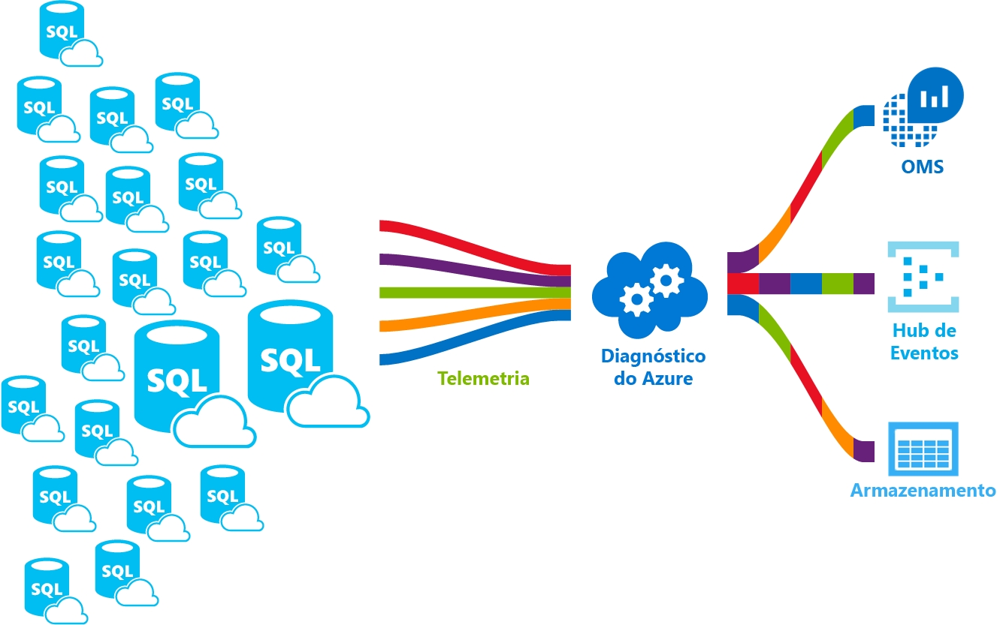

# <a name="azure-sql-database-metrics-and-diagnostics-logging"></a><span data-ttu-id="626a0-103">Métricas de base de dados SQL do Azure e o registo de diagnóstico</span><span class="sxs-lookup"><span data-stu-id="626a0-103">Azure SQL Database metrics and diagnostics logging</span></span> 
<span data-ttu-id="626a0-104">Base de dados SQL do Azure pode emitir métricas e registos de diagnóstico para a monitorização mais fácil.</span><span class="sxs-lookup"><span data-stu-id="626a0-104">Azure SQL Database can emit metrics and diagnostic logs for easier monitoring.</span></span> <span data-ttu-id="626a0-105">Pode configurar a conectividade para um destes recursos do Azure e sessões, funcionários e utilização de recursos de toostore SQL Database do Azure:</span><span class="sxs-lookup"><span data-stu-id="626a0-105">You can configure Azure SQL Database toostore resource usage, workers and sessions, and connectivity into one of these Azure resources:</span></span>
- <span data-ttu-id="626a0-106">**Armazenamento do Azure**: para arquivar grandes quantidades de telemetria a um preço baixo</span><span class="sxs-lookup"><span data-stu-id="626a0-106">**Azure Storage**: For archiving vast amounts of telemetry for a small price</span></span>
- <span data-ttu-id="626a0-107">**Hub de eventos do Azure**: para integrar telemetria de SQL Database do Azure com a sua solução de monitorização personalizada ou pipelines frequente</span><span class="sxs-lookup"><span data-stu-id="626a0-107">**Azure Event Hub**: For integrating Azure SQL Database telemetry with your custom monitoring solution or hot pipelines</span></span>
- <span data-ttu-id="626a0-108">**Análise de registos do Azure**: para Box Olá solução com o Reporting Services, alertas e mitigar as capacidades de monitorização</span><span class="sxs-lookup"><span data-stu-id="626a0-108">**Azure Log Analytics**: For out of hello box monitoring solution with reporting, alerting, and mitigating capabilities</span></span> 

    

## <a name="enable-logging"></a><span data-ttu-id="626a0-110">Ativar registo</span><span class="sxs-lookup"><span data-stu-id="626a0-110">Enable logging</span></span>

<span data-ttu-id="626a0-111">Métricas e registo de diagnóstico não está ativada por predefinição.</span><span class="sxs-lookup"><span data-stu-id="626a0-111">Metrics and diagnostics logging is not enabled by default.</span></span> <span data-ttu-id="626a0-112">Pode ativar e gerir as métricas e registo de diagnóstico utilizando um dos seguintes métodos de Olá:</span><span class="sxs-lookup"><span data-stu-id="626a0-112">You can enable and manage metrics and diagnostics logging using one of hello following methods:</span></span>
- <span data-ttu-id="626a0-113">Portal do Azure</span><span class="sxs-lookup"><span data-stu-id="626a0-113">Azure portal</span></span>
- <span data-ttu-id="626a0-114">PowerShell</span><span class="sxs-lookup"><span data-stu-id="626a0-114">PowerShell</span></span>
- <span data-ttu-id="626a0-115">CLI do Azure</span><span class="sxs-lookup"><span data-stu-id="626a0-115">Azure CLI</span></span>
- <span data-ttu-id="626a0-116">API REST</span><span class="sxs-lookup"><span data-stu-id="626a0-116">REST API</span></span> 
- <span data-ttu-id="626a0-117">Modelo do Resource Manager</span><span class="sxs-lookup"><span data-stu-id="626a0-117">Resource Manager template</span></span>

<span data-ttu-id="626a0-118">Quando ativar métricas e registo de diagnóstico, terá de toospecify Olá recursos do Azure onde são recolhidos os dados selecionados.</span><span class="sxs-lookup"><span data-stu-id="626a0-118">When you enable metrics and diagnostics logging, you need toospecify hello Azure resource where selected data is collected.</span></span> <span data-ttu-id="626a0-119">Opções disponíveis:</span><span class="sxs-lookup"><span data-stu-id="626a0-119">Options available:</span></span>
- <span data-ttu-id="626a0-120">Log analytics</span><span class="sxs-lookup"><span data-stu-id="626a0-120">Log analytics</span></span>
- <span data-ttu-id="626a0-121">Hub de Eventos</span><span class="sxs-lookup"><span data-stu-id="626a0-121">Event Hub</span></span>
- <span data-ttu-id="626a0-122">Storage do Azure</span><span class="sxs-lookup"><span data-stu-id="626a0-122">Azure Storage</span></span> 

<span data-ttu-id="626a0-123">Pode aprovisionar um novo recurso do Azure ou selecione um recurso existente.</span><span class="sxs-lookup"><span data-stu-id="626a0-123">You can provision a new Azure resource or select an existing resource.</span></span> <span data-ttu-id="626a0-124">Depois de selecionar os recursos de armazenamento Olá, terá de toospecify que toocollect de dados.</span><span class="sxs-lookup"><span data-stu-id="626a0-124">After selecting hello storage resource, you need toospecify which data toocollect.</span></span> <span data-ttu-id="626a0-125">As opções disponíveis incluem:</span><span class="sxs-lookup"><span data-stu-id="626a0-125">Options available include:</span></span>

- <span data-ttu-id="626a0-126">**[métricas de 1 minuto](sql-database-metrics-diag-logging.md#1-minute-metrics)**  -contém a percentagem de DTU, limite DTU, percentagem de CPU, percentagem de leitura de dados físicos, escrever o registo de percentagem, Successful/falhado/bloqueado por ligações de firewall, a percentagem de sessões, a percentagem de funcionários, armazenamento, a percentagem de armazenamento, a percentagem de armazenamento XTP</span><span class="sxs-lookup"><span data-stu-id="626a0-126">**[1-minute metrics](sql-database-metrics-diag-logging.md#1-minute-metrics)** - contains DTU percentage, DTU limit, CPU percentage, Physical data read percentage, Log write percentage, Successful/Failed/Blocked by firewall connections, sessions percentage, workers percentage, storage, storage percentage, XTP storage percentage</span></span>

<span data-ttu-id="626a0-127">Se especificar uma conta de AzureStorage ou Hub de eventos, pode especificar um toospecify de política de retenção os dados que é mais antigos do que um selecionado período de tempo é eliminado.</span><span class="sxs-lookup"><span data-stu-id="626a0-127">If you specify Event Hub or an AzureStorage account, you can specify a retention policy toospecify that data that is older than a selected time period is deleted.</span></span> <span data-ttu-id="626a0-128">Se especificar a análise de registos, depende da política de retenção de Olá no escalão de preço selecionado Olá.</span><span class="sxs-lookup"><span data-stu-id="626a0-128">If you specify Log Analytics, hello retention policy depends on hello selected pricing tier.</span></span> <span data-ttu-id="626a0-129">Leia mais sobre [preços de análise de registos](https://azure.microsoft.com/pricing/details/log-analytics/).</span><span class="sxs-lookup"><span data-stu-id="626a0-129">Read more about [Log Analytics pricing](https://azure.microsoft.com/pricing/details/log-analytics/).</span></span> 

<span data-ttu-id="626a0-130">Recomendamos que leia os dois Olá [descrição geral das métricas no Microsoft Azure](../monitoring-and-diagnostics/monitoring-overview-metrics.md) e [descrição geral do Azure os registos de diagnóstico](../monitoring-and-diagnostics/monitoring-overview-of-diagnostic-logs.md) artigos toogain uma compreensão dos não apenas como tooenable registo, mas Olá categorias de métricas e registo suportado pela Olá vários serviços do Azure.</span><span class="sxs-lookup"><span data-stu-id="626a0-130">We recommend that you read both hello [Overview of metrics in Microsoft Azure](../monitoring-and-diagnostics/monitoring-overview-metrics.md) and [Overview of Azure Diagnostic Logs](../monitoring-and-diagnostics/monitoring-overview-of-diagnostic-logs.md) articles toogain an understanding of not only how tooenable logging, but hello metrics and log categories supported by hello various Azure services.</span></span>

### <a name="azure-portal"></a><span data-ttu-id="626a0-131">Portal do Azure</span><span class="sxs-lookup"><span data-stu-id="626a0-131">Azure portal</span></span>

<span data-ttu-id="626a0-132">métricas de tooenable coleção de registos de diagnóstico no Olá portal do Azure, navegue tooyour SQL database do Azure ou a página do conjunto elástico e, em seguida, clique em **definições de diagnóstico**.</span><span class="sxs-lookup"><span data-stu-id="626a0-132">tooenable metrics and diagnostic logs collection in hello Azure portal, navigate tooyour Azure SQL database or elastic pool page, and then click **Diagnostic settings**.</span></span>

   

### <a name="powershell"></a><span data-ttu-id="626a0-134">PowerShell</span><span class="sxs-lookup"><span data-stu-id="626a0-134">PowerShell</span></span>

<span data-ttu-id="626a0-135">tooenable métricas e registo de diagnóstico com o PowerShell, utilize Olá os seguintes comandos:</span><span class="sxs-lookup"><span data-stu-id="626a0-135">tooenable metrics and diagnostics logging using PowerShell, use hello following commands:</span></span>

- <span data-ttu-id="626a0-136">armazenamento de tooenable dos registos de diagnóstico numa conta do Storage, utilize este comando:</span><span class="sxs-lookup"><span data-stu-id="626a0-136">tooenable storage of Diagnostic Logs in a Storage Account, use this command:</span></span>

   ```powershell
   Set-AzureRmDiagnosticSetting -ResourceId [your resource id] -StorageAccountId [your storage account id] -Enabled $true
   ```

   <span data-ttu-id="626a0-137">Olá ID da conta de armazenamento é o id de recurso Olá para toowhich de conta de armazenamento de Olá pretende toosend Olá registos.</span><span class="sxs-lookup"><span data-stu-id="626a0-137">hello Storage Account ID is hello resource id for hello storage account toowhich you want toosend hello logs.</span></span>

- <span data-ttu-id="626a0-138">tooenable de transmissão em fluxo de registos de diagnóstico tooan Hub de eventos, utilize este comando:</span><span class="sxs-lookup"><span data-stu-id="626a0-138">tooenable streaming of Diagnostic Logs tooan Event Hub, use this command:</span></span>

   ```powershell
   Set-AzureRmDiagnosticSetting -ResourceId [your resource id] -ServiceBusRuleId [your service bus rule id] -Enabled $true
   ```

   <span data-ttu-id="626a0-139">Olá ID de regra de barramento de serviço é uma cadeia com este formato:</span><span class="sxs-lookup"><span data-stu-id="626a0-139">hello Service Bus Rule ID is a string with this format:</span></span>

   ```powershell
   {service bus resource ID}/authorizationrules/{key name}
   ``` 

- <span data-ttu-id="626a0-140">Enviar tooenable da área de trabalho do Log Analytics do tooa de registos de diagnóstico, utilize este comando:</span><span class="sxs-lookup"><span data-stu-id="626a0-140">tooenable sending of Diagnostic Logs tooa Log Analytics workspace, use this command:</span></span>

   ```powershell
   Set-AzureRmDiagnosticSetting -ResourceId [your resource id] -WorkspaceId [resource id of hello log analytics workspace] -Enabled $true
   ```

- <span data-ttu-id="626a0-141">Pode obter o id de recurso Olá da sua área de trabalho de análise de registos utilizando Olá os seguintes comandos:</span><span class="sxs-lookup"><span data-stu-id="626a0-141">You can obtain hello resource id of your Log Analytics workspace using hello following command:</span></span>

   ```powershell
   (Get-AzureRmOperationalInsightsWorkspace).ResourceId
   ```

<span data-ttu-id="626a0-142">Pode combinar estas tooenable parâmetros várias opções de saída.</span><span class="sxs-lookup"><span data-stu-id="626a0-142">You can combine these parameters tooenable multiple output options.</span></span>

### <a name="cli"></a><span data-ttu-id="626a0-143">CLI</span><span class="sxs-lookup"><span data-stu-id="626a0-143">CLI</span></span>

<span data-ttu-id="626a0-144">tooenable métricas e registo de diagnóstico utilizando Olá CLI do Azure, Olá utilize os seguintes comandos:</span><span class="sxs-lookup"><span data-stu-id="626a0-144">tooenable metrics and diagnostics logging using hello Azure CLI, use hello following commands:</span></span>

- <span data-ttu-id="626a0-145">armazenamento de tooenable dos registos de diagnóstico numa conta do Storage, utilize este comando:</span><span class="sxs-lookup"><span data-stu-id="626a0-145">tooenable storage of Diagnostic Logs in a Storage Account, use this command:</span></span>

   ```azurecli-interactive
   azure insights diagnostic set --resourceId <resourceId> --storageId <storageAccountId> --enabled true
   ```

   <span data-ttu-id="626a0-146">Olá ID da conta de armazenamento é o id de recurso Olá para toowhich de conta de armazenamento de Olá pretende toosend Olá registos.</span><span class="sxs-lookup"><span data-stu-id="626a0-146">hello Storage Account ID is hello resource id for hello storage account toowhich you want toosend hello logs.</span></span>

- <span data-ttu-id="626a0-147">tooenable de transmissão em fluxo de registos de diagnóstico tooan Hub de eventos, utilize este comando:</span><span class="sxs-lookup"><span data-stu-id="626a0-147">tooenable streaming of Diagnostic Logs tooan Event Hub, use this command:</span></span>

   ```azurecli-interactive
   azure insights diagnostic set --resourceId <resourceId> --serviceBusRuleId <serviceBusRuleId> --enabled true
   ```

   <span data-ttu-id="626a0-148">Olá ID de regra de barramento de serviço é uma cadeia com este formato:</span><span class="sxs-lookup"><span data-stu-id="626a0-148">hello Service Bus Rule ID is a string with this format:</span></span>

   ```azurecli-interactive
   {service bus resource ID}/authorizationrules/{key name}
   ```

- <span data-ttu-id="626a0-149">Enviar tooenable da área de trabalho do Log Analytics do tooa de registos de diagnóstico, utilize este comando:</span><span class="sxs-lookup"><span data-stu-id="626a0-149">tooenable sending of Diagnostic Logs tooa Log Analytics workspace, use this command:</span></span>

   ```azurecli-interactive
   azure insights diagnostic set --resourceId <resourceId> --workspaceId <resource id of hello log analytics workspace> --enabled true
   ```

<span data-ttu-id="626a0-150">Pode combinar estas tooenable parâmetros várias opções de saída.</span><span class="sxs-lookup"><span data-stu-id="626a0-150">You can combine these parameters tooenable multiple output options.</span></span>

### <a name="rest-api"></a><span data-ttu-id="626a0-151">API REST</span><span class="sxs-lookup"><span data-stu-id="626a0-151">REST API</span></span>

<span data-ttu-id="626a0-152">Leia sobre como demasiado[alterar definições de diagnóstico com Olá API REST da Azure Monitor](https://msdn.microsoft.com/library/azure/dn931931.aspx).</span><span class="sxs-lookup"><span data-stu-id="626a0-152">Read about how too[change Diagnostic settings using hello Azure Monitor REST API](https://msdn.microsoft.com/library/azure/dn931931.aspx).</span></span> 

### <a name="resource-manager-template"></a><span data-ttu-id="626a0-153">Modelo do Resource Manager</span><span class="sxs-lookup"><span data-stu-id="626a0-153">Resource Manager template</span></span>

<span data-ttu-id="626a0-154">Leia sobre como demasiado[ativam as definições de diagnóstico durante a criação de recursos utilizando o modelo do Resource Manager](../monitoring-and-diagnostics/monitoring-enable-diagnostic-logs-using-template.md).</span><span class="sxs-lookup"><span data-stu-id="626a0-154">Read about how too[enable Diagnostic settings at resource creation using Resource Manager template](../monitoring-and-diagnostics/monitoring-enable-diagnostic-logs-using-template.md).</span></span> 

## <a name="stream-into-log-analytics"></a><span data-ttu-id="626a0-155">Fluxo para análise de registos</span><span class="sxs-lookup"><span data-stu-id="626a0-155">Stream into Log Analytics</span></span> 
<span data-ttu-id="626a0-156">Métricas de base de dados SQL do Azure e os registos de diagnóstico podem transmissão em fluxo para análise de registos utilizando a opção de incorporado "Enviar tooLog análise" Olá, no portal de hello, ou ao ativar a análise de registos na definição de diagnóstico através de cmdlets do PowerShell do Azure, CLI do Azure ou REST de Monitor do Azure API.</span><span class="sxs-lookup"><span data-stu-id="626a0-156">Azure SQL Database metrics and diagnostic logs can be streamed into Log Analytics using hello built-in “Send tooLog Analytics” option in hello portal, or by enabling Log Analytics in a diagnostic setting via Azure PowerShell cmdlets, Azure CLI, or Azure Monitor REST API.</span></span>

### <a name="installation-overview"></a><span data-ttu-id="626a0-157">Descrição geral da instalação</span><span class="sxs-lookup"><span data-stu-id="626a0-157">Installation overview</span></span>

<span data-ttu-id="626a0-158">Monitorização frota de SQL Database do Azure é simple com a análise de registos.</span><span class="sxs-lookup"><span data-stu-id="626a0-158">Monitoring Azure SQL Database fleet is simple with Log Analytics.</span></span> <span data-ttu-id="626a0-159">São necessários três passos:</span><span class="sxs-lookup"><span data-stu-id="626a0-159">Three steps are required:</span></span>

1.  <span data-ttu-id="626a0-160">Criar o recurso de análise de registos</span><span class="sxs-lookup"><span data-stu-id="626a0-160">Create Log Analytics resource</span></span>
2.  <span data-ttu-id="626a0-161">Configurar as métricas de toorecord de bases de dados e registos de diagnóstico para Olá criado análise de registos</span><span class="sxs-lookup"><span data-stu-id="626a0-161">Configure databases toorecord metrics and diagnostic logs into hello created Log Analytics</span></span>
3.  <span data-ttu-id="626a0-162">Instalar **análise do Azure SQL** solução a partir da galeria na análise de registos</span><span class="sxs-lookup"><span data-stu-id="626a0-162">Install **Azure SQL Analytics** solution from gallery in Log Analytics</span></span>

### <a name="create-log-analytics-resource"></a><span data-ttu-id="626a0-163">Criar o recurso de análise de registos</span><span class="sxs-lookup"><span data-stu-id="626a0-163">Create Log Analytics resource</span></span>

1. <span data-ttu-id="626a0-164">Clique em **novo** no menu da esquerda Olá.</span><span class="sxs-lookup"><span data-stu-id="626a0-164">Click **New** in hello left-hand menu.</span></span>
2. <span data-ttu-id="626a0-165">Clique em **monitorização + gestão**</span><span class="sxs-lookup"><span data-stu-id="626a0-165">Click **Monitoring + Management**</span></span>
3. <span data-ttu-id="626a0-166">Clique em **análise de registo**</span><span class="sxs-lookup"><span data-stu-id="626a0-166">Click **Log Analytics**</span></span>
4. <span data-ttu-id="626a0-167">Preencha o formulário de análise de registos de Olá com informações adicionais de Olá necessárias: nome de área de trabalho, subscrição, grupo de recursos, localização e escalão de preço.</span><span class="sxs-lookup"><span data-stu-id="626a0-167">Fill in hello Log Analytics form with hello additional information required: workspace name, subscription, resource group, location, and pricing tier.</span></span>

   

### <a name="configure-databases-toorecord-metrics-and-diagnostic-logs"></a><span data-ttu-id="626a0-169">Configurar as métricas de toorecord de bases de dados e registos de diagnóstico</span><span class="sxs-lookup"><span data-stu-id="626a0-169">Configure databases toorecord metrics and diagnostic logs</span></span>

<span data-ttu-id="626a0-170">tooconfigure forma mais fácil olá onde as bases de dados grave as métricas é efetuada através de Olá portal do Azure.</span><span class="sxs-lookup"><span data-stu-id="626a0-170">hello easiest way tooconfigure where databases record their metrics is through hello Azure portal.</span></span> <span data-ttu-id="626a0-171">No Olá portal do Azure, navegue até tooyour recursos de SQL Database do Azure e clique em **as definições de diagnóstico**.</span><span class="sxs-lookup"><span data-stu-id="626a0-171">In hello Azure portal, navigate tooyour Azure SQL Database resource and click **Diagnostics settings**.</span></span> 

### <a name="install-hello-azure-sql-analytics-solution-from-gallery"></a><span data-ttu-id="626a0-172">Instalar a solução de análise do Azure SQL Olá da Galeria</span><span class="sxs-lookup"><span data-stu-id="626a0-172">Install hello Azure SQL Analytics solution from gallery</span></span>  

1. <span data-ttu-id="626a0-173">Depois de Olá recursos de análise de registos é criado e os dados é que fluem para, instale a solução de análise de SQL do Azure.</span><span class="sxs-lookup"><span data-stu-id="626a0-173">Once hello Log Analytics resource is created and your data is flowing into it, install Azure SQL Analytics solution.</span></span> <span data-ttu-id="626a0-174">Isto pode ser feito Olá **soluções galeria** que pode encontrar na home page do Olá OMS e no menu de lado de Olá.</span><span class="sxs-lookup"><span data-stu-id="626a0-174">This can be done through hello **Solutions Gallery** that you can find on hello OMS homepage and in hello side menu.</span></span> <span data-ttu-id="626a0-175">Na Galeria de Olá, localize e clique em **análise do Azure SQL** solução e clique em **adicionar**.</span><span class="sxs-lookup"><span data-stu-id="626a0-175">In hello gallery, find and click **Azure SQL Analytics** solution and click **Add**.</span></span>

   

2. <span data-ttu-id="626a0-177">Na sua home page do OMS, um novo mosaico chamado **análise do Azure SQL** aparece.</span><span class="sxs-lookup"><span data-stu-id="626a0-177">On your OMS homepage, a new tile called **Azure SQL Analytics** appears.</span></span> <span data-ttu-id="626a0-178">Selecionar este mosaico abre o dashboard de análise do Azure SQL Olá.</span><span class="sxs-lookup"><span data-stu-id="626a0-178">Selecting this tile opens hello Azure SQL Analytics dashboard.</span></span>

### <a name="using-azure-sql-analytics-solution"></a><span data-ttu-id="626a0-179">Utilizar a solução de análise SQL do Azure</span><span class="sxs-lookup"><span data-stu-id="626a0-179">Using Azure SQL Analytics Solution</span></span>

<span data-ttu-id="626a0-180">Análise de SQL do Azure é um dashboard hierárquico que permite-lhe toonavigate através da hierarquia de Olá dos recursos da SQL Database do Azure.</span><span class="sxs-lookup"><span data-stu-id="626a0-180">Azure SQL Analytics is a hierarchical dashboard that allows you toonavigate through hello hierarchy of Azure SQL Database resources.</span></span> <span data-ttu-id="626a0-181">Permite esta capacidade é toodo alto nível de monitorização, mas também permite-lhe tooscope o direito de Olá toojust monitorização conjunto de recursos.</span><span class="sxs-lookup"><span data-stu-id="626a0-181">This capability enables you toodo high-level monitoring but it also enables you tooscope your monitoring toojust hello right set of resources.</span></span>
<span data-ttu-id="626a0-182">Dashboard contêm listas de Olá de diferentes recursos em recursos de Olá selecionado.</span><span class="sxs-lookup"><span data-stu-id="626a0-182">Dashboard contains hello lists of different resources under hello selected resource.</span></span> <span data-ttu-id="626a0-183">Por exemplo, para uma subscrição selecionada pode ver Olá todos os servidores, conjuntos elásticos e bases de dados que pertencem toohello selecionada a subscrição.</span><span class="sxs-lookup"><span data-stu-id="626a0-183">For example, for a selected subscription you can see hello all servers, elastic pools and databases that belong toohello selected subscription.</span></span> <span data-ttu-id="626a0-184">Além disso, para conjuntos elásticos e bases de dados, pode ver as métricas de utilização de recursos Olá desse recurso.</span><span class="sxs-lookup"><span data-stu-id="626a0-184">Additionally, for Elastic Pools and databases, you can see hello resource usage metrics of that resource.</span></span> <span data-ttu-id="626a0-185">Isto inclui gráficos para DTU, CPU, e/s, registo, sessões, os trabalhadores, ligações e armazenamento em GB.</span><span class="sxs-lookup"><span data-stu-id="626a0-185">This includes charts for DTU, CPU, IO, LOG, sessions, workers, connections, and storage in GB.</span></span>

## <a name="stream-into-azure-event-hub"></a><span data-ttu-id="626a0-186">Fluxo para o Hub de eventos do Azure</span><span class="sxs-lookup"><span data-stu-id="626a0-186">Stream into Azure Event Hub</span></span>

<span data-ttu-id="626a0-187">Métricas de base de dados SQL do Azure e os registos de diagnóstico podem transmissão em fluxo para o Hub de eventos utilizando a opção de incorporado "fluxo tooan event hub" Olá no portal de hello, ou ao ativar o Id de regra de barramento de serviço na definição de diagnóstico através de Cmdlets do PowerShell do Azure, CLI do Azure ou REST de Monitor do Azure API.</span><span class="sxs-lookup"><span data-stu-id="626a0-187">Azure SQL Database metrics and diagnostic logs can be streamed into Event Hub using hello built-in “Stream tooan event hub” option in hello portal, or by enabling Service Bus Rule Id in a diagnostic setting via Azure PowerShell Cmdlets, Azure CLI, or Azure Monitor REST API.</span></span> 

### <a name="what-toodo-with-metrics-and-diagnostic-logs-in-event-hub"></a><span data-ttu-id="626a0-188">Que toodo com métricas e registos de diagnóstico no Hub de eventos?</span><span class="sxs-lookup"><span data-stu-id="626a0-188">What toodo with metrics and diagnostic logs in Event Hub?</span></span>
<span data-ttu-id="626a0-189">Depois dos dados de Olá selecionado é transmitida em fluxo para o Hub de eventos, são tooenabling próximo um do passo, avançadas cenários de monitorização.</span><span class="sxs-lookup"><span data-stu-id="626a0-189">Once hello selected data is streamed into Event Hub, you are one step closer tooenabling advanced monitoring scenarios.</span></span> <span data-ttu-id="626a0-190">Os Event Hubs atuam como Olá "porta da frente" para um pipeline de eventos e, depois dos dados são recolhidos para um Hub de eventos, podem ser transformado e armazenados através de qualquer fornecedor de análise em tempo real ou adaptadores de criação de batches/armazenamento.</span><span class="sxs-lookup"><span data-stu-id="626a0-190">Event Hubs acts as hello "front door" for an event pipeline, and once data is collected into an Event Hub, it can be transformed and stored using any real-time analytics provider or batching/storage adapters.</span></span> <span data-ttu-id="626a0-191">Os Event Hubs desacoplam a produção de Olá de um fluxo de eventos do consumo desses eventos, Olá para que os consumidores de eventos possam aceder eventos Olá na sua própria agenda.</span><span class="sxs-lookup"><span data-stu-id="626a0-191">Event Hubs decouples hello production of a stream of events from hello consumption of those events, so that event consumers can access hello events on their own schedule.</span></span> <span data-ttu-id="626a0-192">Para obter mais informações sobre o Hub de eventos, consulte:</span><span class="sxs-lookup"><span data-stu-id="626a0-192">For more information on Event Hub, see:</span></span>

- <span data-ttu-id="626a0-193">[Quais são os Event Hubs do Azure](../event-hubs/event-hubs-what-is-event-hubs.md)?</span><span class="sxs-lookup"><span data-stu-id="626a0-193">[What are Azure Event Hubs](../event-hubs/event-hubs-what-is-event-hubs.md)?</span></span>
- [<span data-ttu-id="626a0-194">Introdução ao Event Hubs</span><span class="sxs-lookup"><span data-stu-id="626a0-194">Get started with Event Hubs</span></span>](../event-hubs/event-hubs-csharp-ephcs-getstarted.md)


<span data-ttu-id="626a0-195">Seguem-se apenas algumas formas poderá utilizar Olá capacidade de transmissão em fluxo:</span><span class="sxs-lookup"><span data-stu-id="626a0-195">Here are just a few ways you might use hello streaming capability:</span></span>

-   <span data-ttu-id="626a0-196">Ver estado de funcionamento do serviço por transmissão em fluxo "path frequente" dados tooPowerBI - utilizar Event Hubs, o Stream Analytics e o Power BI, pode facilmente transformar os dados de métricas e diagnóstico para quase em tempo real das informações no seus serviços do Azure.</span><span class="sxs-lookup"><span data-stu-id="626a0-196">View service health by streaming “hot path” data tooPowerBI - Using Event Hubs, Stream Analytics, and PowerBI, you can easily transform your metrics and diagnostics data into near real-time insights on your Azure services.</span></span> <span data-ttu-id="626a0-197">Para uma descrição geral de como processar os dados com o Stream Analytics tooset dos Hubs de eventos e utilizar o Power BI como uma saída, consulte [Stream Analytics e o Power BI](../stream-analytics/stream-analytics-power-bi-dashboard.md).</span><span class="sxs-lookup"><span data-stu-id="626a0-197">For an overview of how tooset up an Event Hubs, process data with Stream Analytics, and use PowerBI as an output, see [Stream Analytics and Power BI](../stream-analytics/stream-analytics-power-bi-dashboard.md).</span></span>
-   <span data-ttu-id="626a0-198">Fluxo registos toothird terceiros telemetria e de registo fluxos – utilizar os Hubs de eventos de transmissão em fluxo podem obter as métricas e registos de diagnóstico no toodifferent soluções de análise de registo e monitorização de terceiros.</span><span class="sxs-lookup"><span data-stu-id="626a0-198">Stream logs toothird-party logging and telemetry streams – Using Event Hubs streaming you can get your metrics and diagnostic logs in toodifferent third-party monitoring and log analytics solutions.</span></span> 
-   <span data-ttu-id="626a0-199">Crie uma plataforma de registo – e telemetria personalizada se já tiver uma plataforma de telemetria personalizada ou são apenas pensar sobre como criar um, Olá altamente dimensionável de publicação-subscrição natureza dos Event Hubs permite-lhe tooflexibly ingestão de registos de diagnóstico.</span><span class="sxs-lookup"><span data-stu-id="626a0-199">Build a custom telemetry and logging platform – If you already have a custom-built telemetry platform or are just thinking about building one, hello highly scalable publish-subscribe nature of Event Hubs allows you tooflexibly ingest diagnostic logs.</span></span> <span data-ttu-id="626a0-200">Consulte [toousing de guia de Dan Rosanova Event Hubs numa plataforma de telemetria de escala global](https://azure.microsoft.com/documentation/videos/build-2015-designing-and-sizing-a-global-scale-telemetry-platform-on-azure-event-Hubs/).</span><span class="sxs-lookup"><span data-stu-id="626a0-200">See [Dan Rosanova’s guide toousing Event Hubs in a global scale telemetry platform](https://azure.microsoft.com/documentation/videos/build-2015-designing-and-sizing-a-global-scale-telemetry-platform-on-azure-event-Hubs/).</span></span>

## <a name="stream-into-azure-storage"></a><span data-ttu-id="626a0-201">Fluxo para o armazenamento do Azure</span><span class="sxs-lookup"><span data-stu-id="626a0-201">Stream into Azure Storage</span></span>

<span data-ttu-id="626a0-202">Métricas de base de dados SQL do Azure e os registos de diagnóstico podem ser armazenados no armazenamento do Azure com a opção de "Conta de armazenamento tooa arquivar" incorporada Olá no Olá portal do Azure, ou ao ativar o armazenamento do Azure na definição de diagnóstico através de Cmdlets do PowerShell do Azure, CLI do Azure ou do Azure API de REST do monitor.</span><span class="sxs-lookup"><span data-stu-id="626a0-202">Azure SQL Database metrics and diagnostic logs can be stored into Azure Storage using hello built-in "Archive tooa storage account” option in hello Azure portal, or by enabling Azure Storage in a diagnostic setting via Azure PowerShell Cmdlets, Azure CLI, or Azure Monitor REST API.</span></span>

### <a name="schema-of-metrics-and-diagnostic-logs-in-hello-storage-account"></a><span data-ttu-id="626a0-203">Esquema de métricas e registos de diagnóstico na conta do storage Olá</span><span class="sxs-lookup"><span data-stu-id="626a0-203">Schema of metrics and diagnostic logs in hello storage account</span></span>

<span data-ttu-id="626a0-204">Assim que tiver configurado a métricas e recolha de registos de diagnóstico, um contentor de armazenamento é criado na conta de armazenamento de Olá que selecionou quando as primeiras linhas de Olá de dados estão disponíveis.</span><span class="sxs-lookup"><span data-stu-id="626a0-204">Once you have set up metrics and diagnostic logs collection, a storage container is created in hello storage account you selected when hello first rows of data are available.</span></span> <span data-ttu-id="626a0-205">estrutura de Olá destas blobs é:</span><span class="sxs-lookup"><span data-stu-id="626a0-205">hello structure of these blobs is:</span></span>

```powershell
insights-{metrics|logs}-{category name}/resourceId=/SUBSCRIPTIONS/{subscription ID}/ RESOURCEGROUPS/{resource group name}/PROVIDERS/Microsoft.SQL/servers/{resource_server}/ databases/{database_name}/y={four-digit numeric year}/m={two-digit numeric month}/d={two-digit numeric day}/h={two-digit 24-hour clock hour}/m=00/PT1H.json
```
    
<span data-ttu-id="626a0-206">Ou, mais simples:</span><span class="sxs-lookup"><span data-stu-id="626a0-206">Or, more simply:</span></span>

```powershell
insights-{metrics|logs}-{category name}/resourceId=/{resource Id}/y={four-digit numeric year}/m={two-digit numeric month}/d={two-digit numeric day}/h={two-digit 24-hour clock hour}/m=00/PT1H.json
```

<span data-ttu-id="626a0-207">Por exemplo, poderá ser um nome de blob para 1 minuto métricas:</span><span class="sxs-lookup"><span data-stu-id="626a0-207">For example, a blob name for 1-minute metrics might be:</span></span>

```powershell
insights-metrics-minute/resourceId=/SUBSCRIPTIONS/s1id1234-5679-0123-4567-890123456789/RESOURCEGROUPS/TESTRESOURCEGROUP/PROVIDERS/MICROSOFT.SQL/ servers/Server1/databases/database1/y=2016/m=08/d=22/h=18/m=00/PT1H.json
```

<span data-ttu-id="626a0-208">No caso de pretender toorecord dados Olá Olá conjunto elástico, o nome do blob é um pouco diferente:</span><span class="sxs-lookup"><span data-stu-id="626a0-208">In case you want toorecord hello data from hello Elastic Pool, blob name is a bit different:</span></span>

```powershell
insights-{metrics|logs}-{category name}/resourceId=/SUBSCRIPTIONS/{subscription ID}/ RESOURCEGROUPS/{resource group name}/PROVIDERS/Microsoft.SQL/servers/{resource_server}/ elasticPools/{elastic_pool_name}/y={four-digit numeric year}/m={two-digit numeric month}/d={two-digit numeric day}/h={two-digit 24-hour clock hour}/m=00/PT1H.json
```

### <a name="download-metrics-and-logs-from-azure-storage"></a><span data-ttu-id="626a0-209">Transferir registos e as métricas do storage do Azure</span><span class="sxs-lookup"><span data-stu-id="626a0-209">Download metrics and logs from Azure storage</span></span>

<span data-ttu-id="626a0-210">Consulte [transferir métricas e registos de diagnóstico do armazenamento do Azure](../storage/blobs/storage-dotnet-how-to-use-blobs.md#download-blobs)</span><span class="sxs-lookup"><span data-stu-id="626a0-210">See [Download metrics and diagnostic logs from Azure Storage](../storage/blobs/storage-dotnet-how-to-use-blobs.md#download-blobs)</span></span>

## <a name="1-minute-metrics"></a><span data-ttu-id="626a0-211">métricas de 1 minuto</span><span class="sxs-lookup"><span data-stu-id="626a0-211">1-minute metrics</span></span>

| |  |
|---|---|
|<span data-ttu-id="626a0-212">**Recurso**</span><span class="sxs-lookup"><span data-stu-id="626a0-212">**Resource**</span></span>|<span data-ttu-id="626a0-213">**Métricas**</span><span class="sxs-lookup"><span data-stu-id="626a0-213">**Metrics**</span></span>|
|<span data-ttu-id="626a0-214">Base de Dados</span><span class="sxs-lookup"><span data-stu-id="626a0-214">Database</span></span>|<span data-ttu-id="626a0-215">Percentagem DTU, DTU utilizado, o limite DTU, percentagem de CPU, percentagem de leitura de dados físicos, escrever o registo de percentagem, Successful/falhado/bloqueado por ligações de firewall, percentagem de sessões, percentagem workers, armazenamento, percentagem de armazenamento, a percentagem de armazenamento XTP, impasses</span><span class="sxs-lookup"><span data-stu-id="626a0-215">DTU percentage, DTU used, DTU limit, CPU percentage, Physical data read percentage, Log write percentage, Successful/Failed/Blocked by firewall connections, sessions percentage, workers percentage, storage, storage percentage, XTP storage percentage, deadlocks</span></span> |
|<span data-ttu-id="626a0-216">Agrupamento elástico</span><span class="sxs-lookup"><span data-stu-id="626a0-216">Elastic pool</span></span>|<span data-ttu-id="626a0-217">percentagem de eDTU, eDTU utilizado, o limite de eDTU, percentagem de CPU, percentagem de leitura de dados físicos, registo escrever percentagem, percentagem de sessões, percentagem workers, armazenamento, a percentagem de armazenamento, limite de armazenamento, percentagem de armazenamento XTP</span><span class="sxs-lookup"><span data-stu-id="626a0-217">eDTU percentage, eDTU used, eDTU limit, CPU percentage, Physical data read percentage, Log write percentage, sessions percentage, workers percentage, storage, storage percentage, storage limit, XTP storage percentage</span></span> |
|||

## <a name="next-steps"></a><span data-ttu-id="626a0-218">Passos seguintes</span><span class="sxs-lookup"><span data-stu-id="626a0-218">Next steps</span></span>

- <span data-ttu-id="626a0-219">Ler ambas Olá [descrição geral das métricas no Microsoft Azure](../monitoring-and-diagnostics/monitoring-overview-metrics.md) e [descrição geral do Azure os registos de diagnóstico](../monitoring-and-diagnostics/monitoring-overview-of-diagnostic-logs.md) artigos toogain uma compreensão dos não apenas como o tooenable registo, mas Olá métricas e categorias de registo suportado pelo Olá em vários serviços do Azure.</span><span class="sxs-lookup"><span data-stu-id="626a0-219">Read both hello [Overview of metrics in Microsoft Azure](../monitoring-and-diagnostics/monitoring-overview-metrics.md) and [Overview of Azure Diagnostic Logs](../monitoring-and-diagnostics/monitoring-overview-of-diagnostic-logs.md) articles toogain an understanding of not only how tooenable logging, but hello metrics and log categories supported by hello various Azure services.</span></span>
- <span data-ttu-id="626a0-220">Leia estas toolearn artigos sobre os event hubs:</span><span class="sxs-lookup"><span data-stu-id="626a0-220">Read these articles toolearn about event hubs:</span></span>
   - <span data-ttu-id="626a0-221">[Quais são os Event Hubs do Azure](../event-hubs/event-hubs-what-is-event-hubs.md)?</span><span class="sxs-lookup"><span data-stu-id="626a0-221">[What are Azure Event Hubs](../event-hubs/event-hubs-what-is-event-hubs.md)?</span></span>
   - [<span data-ttu-id="626a0-222">Introdução ao Event Hubs</span><span class="sxs-lookup"><span data-stu-id="626a0-222">Get started with Event Hubs</span></span>](../event-hubs/event-hubs-csharp-ephcs-getstarted.md)
- <span data-ttu-id="626a0-223">Consulte [transferir métricas e registos de diagnóstico do armazenamento do Azure](../storage/blobs/storage-dotnet-how-to-use-blobs.md#download-blobs)</span><span class="sxs-lookup"><span data-stu-id="626a0-223">See [Download metrics and diagnostic logs from Azure Storage](../storage/blobs/storage-dotnet-how-to-use-blobs.md#download-blobs)</span></span>
