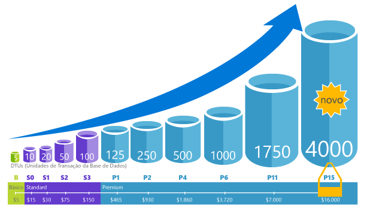
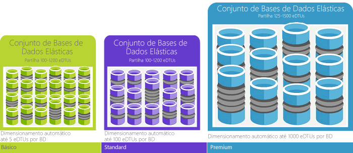

# Base de dados (DTUs) de unidades de transação e unidades de transação de base de dados elásticas (eDTUs)
Este artigo explica as Unidades de Transação da Base de Dados (DTUs) e as Unidades de Transação da Base de Dados Elástica (eDTUs) e o que acontece quando atinge o limite máximo de DTUs ou eDTUs.  

## Quais são as unidades de transação de base de dados (DTUs)?
Para uma única base de dados do SQL do Azure a um nível de desempenho específicos dentro de um [camada de serviço](sql-database-single-database-resources.md), Microsoft garante a um determinado nível de recursos para a base de dados (independentemente de qualquer outra base de dados na nuvem do Azure) e fornecer um nível de desempenho previsível. Esta quantidade de recursos é calculada como um número de unidades de transação de base de dados ou DTUs e é uma medida combinada de CPU, memória, e/s (transação e dados de registo de e/s). O rácio entre estes recursos foi originalmente determinado por uma [carga de trabalho OLTP benchmark](sql-database-benchmark-overview.md) concebido para ser típico de cargas de trabalho do mundo real OLTP. Quando a carga de trabalho excede a quantidade de qualquer um destes recursos, o débito é otimizadas - resultante de desempenho mais lento e de tempos limite. Os recursos utilizados pela sua carga de trabalho não afetam os recursos disponíveis para outras bases de dados do SQL Server na nuvem do Azure e o recurso utilizado por outras cargas de trabalho não afetar os recursos disponíveis para a base de dados do SQL Server.

As DTUs são mais úteis para compreender a quantidade de recursos entre bases de dados do Azure SQL níveis de desempenho diferentes e escalões de serviço relativa. Por exemplo, duplicando as DTUs ao aumentar o nível de desempenho de uma base de dados equivale a duplicando o conjunto de recursos disponíveis para a base de dados. Por exemplo, uma base de dados Premium P11 com 1750 DTUs fornece 350 x mais potência de computação de DTUs do que uma base de dados básica com cinco DTUs.  

Para obter informações mais aprofundada sobre o consumo de recursos (DTU) da sua carga de trabalho, utilize [Azure SQL da base de dados Query Performance Insight](sql-database-query-performance.md) para:

- Identificar os principais de consultas por contagem de CPU/duração/execução que potencialmente pode ser otimizada para um melhor desempenho. Por exemplo, uma consulta exigente em termos de e/s pode beneficiar da utilização de [técnicas de otimização de memória](sql-database-in-memory.md) para tornar o melhor utilização de memória disponível num determinado e o desempenho do escalão de nível de serviço.
- Desagregar os detalhes de uma consulta, ver o texto e o histórico de utilização de recursos.
- Desempenho de acesso de otimização de recomendações que mostram as ações executadas pelo [SQL Database Advisor](sql-database-advisor.md).

Pode [alterar as camadas de serviços](sql-database-service-tiers.md) em qualquer altura, com um período mínimo de indisponibilidade para a aplicação (em média, menos de quatro segundos). Para muitas empresas e aplicações, ser capaz de criar bases de dados e aumentar e reduzir o desempenho a pedido é suficiente, sobretudo se os padrões de utilização forem relativamente previsíveis. No entanto, se tiver padrões de utilização imprevisíveis, pode tornar-se difícil gerir os custos e o seu modelo de negócio. Para este cenário, utilize um conjunto elástico com um determinado número de eDTUs que são partilhados entre vários base de dados no conjunto.

## Quais são as unidades de transação de base de dados elásticas (eDTUs)?
Em vez do que fornecem um conjunto de recursos (DTUs) dedicado para uma base de dados do SQL Server que está sempre disponível, independentemente de se não necessário, pode colocar as bases de dados para um [conjunto elástico](sql-database-elastic-pool.md) num servidor de base de dados SQL que partilha um conjunto de recursos entre esses base de dados. Recursos partilhados num conjunto elástico medido pela elástico unidades de transação de base de dados ou eDTUs. Os conjuntos elásticos fornecem uma solução económica e simples para gerir os objetivos de desempenho de várias bases de dados que tenham padrões de utilização extremamente variáveis e imprevisíveis. Num conjunto elástico, pode garantir que nenhum uma base de dados utiliza todos os recursos de agrupamento e também que uma quantidade mínima de recursos está sempre disponível para uma base de dados num agrupamento elástico. 

A um conjunto é atribuído um número definido de eDTUs, por um preço definido. Dentro do conjunto elástico, é dada às bases de dados individuais a flexibilidade para se dimensionarem automaticamente dentro dos limites configurados. Uma base de dados sobrecarregada pode consumir mais eDTUs para responder às necessidades, enquanto as bases de dados sujeitas a cargas mais leves consomem menos. As bases de dados que não estão sujeitas a qualquer carga não consomem eDTUs. O aprovisionamento de recursos para o conjunto completo e não para bases de dados individuais simplifica as tarefas de gestão. Além disso, tem um orçamento previsível para o conjunto.

Podem ser adicionais mais eDTUs a um conjunto existente sem qualquer período de indisponibilidade da base de dados e sem impacto nas bases de dados do conjunto. Do mesmo modo, se as eDTUs adicionais já não forem necessárias, podem ser removidas de um conjunto existente em qualquer momento. Pode adicionar ou subtrair bases de dados ao conjunto, ou limitar a quantidade de eDTUs que uma base de dados pode utilizar quando está sujeita a muita carga, para reservar eDTUs para outras bases de dados. Se uma base de dados estiver a subutilizar recursos de forma previsível, pode removê-la do conjunto e configurá-la como uma base de dados individual com uma quantidade previsível dos recursos de que precisa.

## Como posso determinar o número de DTUs necessárias para a minha carga de trabalho?
Se pretender migrar a carga de trabalho de uma máquina virtual do SQL Server ou no local existente para a Base de Dados SQL do Azure, pode utilizar a [Calculadora de DTUs](http://dtucalculator.azurewebsites.net/) para se aproximar do número de DTUs necessárias. No caso da carga de trabalho de uma Base de Dados SQL do Azure existente, pode utilizar [Informações de Desempenho de Consultas de Base de Dados SQL](sql-database-query-performance.md) para compreender o consumo de recursos da sua base de dados (DTUs) para obter um conhecimento mais profundo de como otimizar a sua carga de trabalho. Também pode utilizar a DMV [sys.dm_db_ resource_stats](https://msdn.microsoft.com/library/dn800981.aspx) para obter as informações de consumo de recursos da última hora. Em alternativa, a vista de catálogo [sys.resource_stats](http://msdn.microsoft.com/library/dn269979.aspx) também pode ser consultada para obter os mesmos dados dos últimos 14 dias, embora a uma fidelidade inferior das médias de cinco minutos.

## Como posso saber se poderia beneficiar de um conjunto elástico de recursos?
Os conjuntos são adequados para um grande número de bases de dados com padrões de utilização específicos. Para uma determinada base de dados, este padrão caracteriza-se por uma utilização média baixa com picos de utilização relativamente raros. A Base de Dados SQL avalia automaticamente o histórico de utilização de recursos de bases de dados num servidor de Base de Dados SQL existente e recomenda a configuração de conjunto adequada no portal do Azure. Para obter mais informações, consulte [When should an elastic pool be used? (Quando deve ser utilizado um conjunto elástico?)](sql-database-elastic-pool.md)

## O que acontece quando atinjo o meu DTUs máximas?
Os níveis de desempenho são calibrados e geridos para fornecerem os recursos necessários para executar a carga de trabalho da base de dados até aos limites máximos permitidos para a camada de serviço/nível de desempenho selecionado. Se a carga de trabalho estiver a chegar aos limites num dos limites de CPU, E/S de Dados ou E/S de Registo, continua a receber os recursos no nível máximo permitido, mas é provável que sinta um aumento da latência nas suas consultas. Estes limites não resultam em erros, mas num abrandamento da carga de trabalho, a menos que o abrandamento se torne tão acentuado que as consultas comecem a exceder o tempo limite. Se estiver a atingir os limites de número de sessões/pedidos (threads de trabalho) de utilizadores em simultâneo máximo permitido, serão apresentados erros específicos. Veja [Limites de recursos da Base de Dados SQL do Azure]( sql-database-resource-limits.md#what-happens-when-database-and-elastic-pool-resource-limits-are-reached) para obter informações sobre o limite dos recursos além da CPU, memória, E/S de dados e E/S de registos de transações.

## Passos seguintes
* Consulte [camada de serviço](sql-database-service-tiers.md) para obter informações sobre as DTUs e eDTUs disponíveis para bases de dados individuais e conjuntos elásticos, bem como os limites de recursos diferente da CPU, memória, e/s de dados e transações no registo de e/s.
* Veja [SQL Database Query Performance Insight (Informações de Desempenho de Consultas de Base de Dados SQL)](sql-database-query-performance.md) para compreender o seu consumo (de DTUs).
* Veja [Descrição geral de referência da Base de Dados SQL](sql-database-benchmark-overview.md) para compreender a metodologia por detrás da carga de trabalho de referência do OLTP utilizada para determinar a combinação de DTU.
