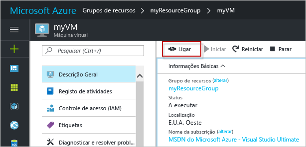

# <a name="create-a-windows-virtual-machine-with-hello-azure-portal"></a><span data-ttu-id="00845-103">Criar uma máquina virtual do Windows com Olá portal do Azure</span><span class="sxs-lookup"><span data-stu-id="00845-103">Create a Windows virtual machine with hello Azure portal</span></span>

<span data-ttu-id="00845-104">Máquinas virtuais do Azure podem ser criadas através de Olá portal do Azure.</span><span class="sxs-lookup"><span data-stu-id="00845-104">Azure virtual machines can be created through hello Azure portal.</span></span> <span data-ttu-id="00845-105">Este método fornece uma interface de utilizador baseada no browser para criar e configurar máquinas virtuais e todos os recursos relacionados.</span><span class="sxs-lookup"><span data-stu-id="00845-105">This method provides a browser-based user interface for creating and configuring virtual machines and all related resources.</span></span> <span data-ttu-id="00845-106">Este passos de início rápido através da criação de uma máquina virtual e instalar um servidor Web num Olá VM.</span><span class="sxs-lookup"><span data-stu-id="00845-106">This Quickstart steps through creating a virtual machine and installing a webserver on hello VM.</span></span>

<span data-ttu-id="00845-107">Se não tiver uma subscrição do Azure, crie uma [conta gratuita](https://azure.microsoft.com/free/?WT.mc_id=A261C142F) antes de começar.</span><span class="sxs-lookup"><span data-stu-id="00845-107">If you don't have an Azure subscription, create a [free account](https://azure.microsoft.com/free/?WT.mc_id=A261C142F) before you begin.</span></span>

## <a name="log-in-tooazure"></a><span data-ttu-id="00845-108">Inicie sessão no tooAzure</span><span class="sxs-lookup"><span data-stu-id="00845-108">Log in tooAzure</span></span>

<span data-ttu-id="00845-109">Inicie sessão no toohello do portal do Azure em http://portal.azure.com.</span><span class="sxs-lookup"><span data-stu-id="00845-109">Log in toohello Azure portal at http://portal.azure.com.</span></span>

## <a name="create-virtual-machine"></a><span data-ttu-id="00845-110">Criar a máquina virtual</span><span class="sxs-lookup"><span data-stu-id="00845-110">Create virtual machine</span></span>

1. <span data-ttu-id="00845-111">Clique em Olá **novo** botão encontrado no canto esquerda superior Olá de Olá portal do Azure.</span><span class="sxs-lookup"><span data-stu-id="00845-111">Click hello **New** button found on hello upper left-hand corner of hello Azure portal.</span></span>

2. <span data-ttu-id="00845-112">Selecione **Computação** e, em seguida, selecione **Windows Server 2016 Datacenter**.</span><span class="sxs-lookup"><span data-stu-id="00845-112">Select **Compute**, and then select **Windows Server 2016 Datacenter**.</span></span> 

3. <span data-ttu-id="00845-113">Introduza as informações da máquina virtual Olá.</span><span class="sxs-lookup"><span data-stu-id="00845-113">Enter hello virtual machine information.</span></span> <span data-ttu-id="00845-114">nome de utilizador Olá e a palavra-passe introduzida aqui é toolog utilizado na máquina virtual de toohello.</span><span class="sxs-lookup"><span data-stu-id="00845-114">hello user name and password entered here is used toolog in toohello virtual machine.</span></span> <span data-ttu-id="00845-115">Quando terminar, clique em **OK**.</span><span class="sxs-lookup"><span data-stu-id="00845-115">When complete, click **OK**.</span></span>

      

4. <span data-ttu-id="00845-117">Selecione um tamanho de Olá VM.</span><span class="sxs-lookup"><span data-stu-id="00845-117">Select a size for hello VM.</span></span> <span data-ttu-id="00845-118">toosee mais tamanhos, selecione **ver todos os** ou alterar Olá **suportada de tipo de disco** filtro.</span><span class="sxs-lookup"><span data-stu-id="00845-118">toosee more sizes, select **View all** or change hello **Supported disk type** filter.</span></span> 

      

5. <span data-ttu-id="00845-120">No painel de definições de Olá, mantenha as predefinições de Olá e clique em **OK**.</span><span class="sxs-lookup"><span data-stu-id="00845-120">On hello settings blade, keep hello defaults and click **OK**.</span></span>

6. <span data-ttu-id="00845-121">Na página de resumo de Olá, clique em **Ok** implementação da máquina virtual toostart Olá.</span><span class="sxs-lookup"><span data-stu-id="00845-121">On hello summary page, click **Ok** toostart hello virtual machine deployment.</span></span>

7. <span data-ttu-id="00845-122">Olá VM será afixado toohello dashboard do portal do Azure.</span><span class="sxs-lookup"><span data-stu-id="00845-122">hello VM will be pinned toohello Azure portal dashboard.</span></span> <span data-ttu-id="00845-123">Depois de concluída a implementação de Olá, o painel de resumo de VM de Olá é aberto automaticamente.</span><span class="sxs-lookup"><span data-stu-id="00845-123">Once hello deployment has completed, hello VM summary blade automatically opens.</span></span>


## <a name="connect-toovirtual-machine"></a><span data-ttu-id="00845-124">Ligue toovirtual máquina</span><span class="sxs-lookup"><span data-stu-id="00845-124">Connect toovirtual machine</span></span>

<span data-ttu-id="00845-125">Crie uma máquina de virtual de toohello de ligação de ambiente de trabalho remoto.</span><span class="sxs-lookup"><span data-stu-id="00845-125">Create a remote desktop connection toohello virtual machine.</span></span>

1. <span data-ttu-id="00845-126">Clique em Olá **Connect** botão de propriedades da máquina virtual Olá.</span><span class="sxs-lookup"><span data-stu-id="00845-126">Click hello **Connect** button on hello virtual machine properties.</span></span> <span data-ttu-id="00845-127">É criado e transferido um ficheiro do Protocolo do Ambiente de Trabalho Remoto (ficheiro .rdp).</span><span class="sxs-lookup"><span data-stu-id="00845-127">A Remote Desktop Protocol file (.rdp file) is created and downloaded.</span></span>

     

2. <span data-ttu-id="00845-129">tooconnect tooyour VM, abra Olá transferido o ficheiro RDP.</span><span class="sxs-lookup"><span data-stu-id="00845-129">tooconnect tooyour VM, open hello downloaded RDP file.</span></span> <span data-ttu-id="00845-130">Se lhe for solicitado, clique em **Ligar**.</span><span class="sxs-lookup"><span data-stu-id="00845-130">If prompted, click **Connect**.</span></span> <span data-ttu-id="00845-131">No Mac, terá de um cliente RDP como esta [cliente de ambiente de trabalho remoto](https://itunes.apple.com/us/app/microsoft-remote-desktop/id715768417?mt=12) de Olá Mac App Store.</span><span class="sxs-lookup"><span data-stu-id="00845-131">On a Mac, you need an RDP client such as this [Remote Desktop Client](https://itunes.apple.com/us/app/microsoft-remote-desktop/id715768417?mt=12) from hello Mac App Store.</span></span>

3. <span data-ttu-id="00845-132">Introduza o nome de utilizador de Olá e a palavra-passe que especificou ao criar a máquina virtual de Olá, em seguida, clique em **Ok**.</span><span class="sxs-lookup"><span data-stu-id="00845-132">Enter hello user name and password you specified when creating hello virtual machine, then click **Ok**.</span></span>

4. <span data-ttu-id="00845-133">Poderá receber um aviso de certificado durante o processo de início de sessão Olá.</span><span class="sxs-lookup"><span data-stu-id="00845-133">You may receive a certificate warning during hello sign-in process.</span></span> <span data-ttu-id="00845-134">Clique em **Sim** ou **continuar** tooproceed com ligação Olá.</span><span class="sxs-lookup"><span data-stu-id="00845-134">Click **Yes** or **Continue** tooproceed with hello connection.</span></span>


## <a name="install-iis-using-powershell"></a><span data-ttu-id="00845-135">Instalar o IIS com o PowerShell</span><span class="sxs-lookup"><span data-stu-id="00845-135">Install IIS using PowerShell</span></span>

<span data-ttu-id="00845-136">Na máquina virtual de Olá, inicie uma sessão do PowerShell e execute Olá os seguintes comandos tooinstall IIS.</span><span class="sxs-lookup"><span data-stu-id="00845-136">On hello virtual machine, start a PowerShell session and run hello following command tooinstall IIS.</span></span>

```powershell
Install-WindowsFeature -name Web-Server -IncludeManagementTools
```

<span data-ttu-id="00845-137">Quando terminar, saia da sessão do RDP Olá e devolver propriedades VM Olá Olá portal do Azure.</span><span class="sxs-lookup"><span data-stu-id="00845-137">When done, exit hello RDP session and return hello VM properties in hello Azure portal.</span></span>

## <a name="open-port-80-for-web-traffic"></a><span data-ttu-id="00845-138">Abrir a porta 80 para o tráfego da Web</span><span class="sxs-lookup"><span data-stu-id="00845-138">Open port 80 for web traffic</span></span> 

<span data-ttu-id="00845-139">Um Grupo de segurança de rede (NSG) protege os tráfegos de entrada e de saída.</span><span class="sxs-lookup"><span data-stu-id="00845-139">A Network security group (NSG) secures inbound and outbound traffic.</span></span> <span data-ttu-id="00845-140">Quando é criada uma VM de Olá portal do Azure, é criada uma regra de entrada na porta 3389 para ligações RDP.</span><span class="sxs-lookup"><span data-stu-id="00845-140">When a VM is created from hello Azure portal, an inbound rule is created on port 3389 for RDP connections.</span></span> <span data-ttu-id="00845-141">Porque esta VM aloja um servidor Web, uma regra NSG tem toobe criado para a porta 80.</span><span class="sxs-lookup"><span data-stu-id="00845-141">Because this VM hosts a webserver, an NSG rule needs toobe created for port 80.</span></span>

1. <span data-ttu-id="00845-142">Na máquina virtual de Olá, clique no nome de Olá de Olá **grupo de recursos**.</span><span class="sxs-lookup"><span data-stu-id="00845-142">On hello virtual machine, click hello name of hello **Resource group**.</span></span>
2. <span data-ttu-id="00845-143">Selecione Olá **grupo de segurança de rede**.</span><span class="sxs-lookup"><span data-stu-id="00845-143">Select hello **network security group**.</span></span> <span data-ttu-id="00845-144">Olá NSG pode ser identificado utilizando Olá **tipo** coluna.</span><span class="sxs-lookup"><span data-stu-id="00845-144">hello NSG can be identified using hello **Type** column.</span></span> 
3. <span data-ttu-id="00845-145">No menu da esquerda Olá, em definições, clique em **regras de segurança de entrada**.</span><span class="sxs-lookup"><span data-stu-id="00845-145">On hello left-hand menu, under settings, click **Inbound security rules**.</span></span>
4. <span data-ttu-id="00845-146">Clique em **Adicionar**.</span><span class="sxs-lookup"><span data-stu-id="00845-146">Click on **Add**.</span></span>
5. <span data-ttu-id="00845-147">Em **Nome**, escreva **http**.</span><span class="sxs-lookup"><span data-stu-id="00845-147">In **Name**, type **http**.</span></span> <span data-ttu-id="00845-148">Certifique-se **intervalo de porta** está definido too80 e **ação** estiver definido demasiado**permitir**.</span><span class="sxs-lookup"><span data-stu-id="00845-148">Make sure **Port range** is set too80 and **Action** is set too**Allow**.</span></span> 
6. <span data-ttu-id="00845-149">Clique em **OK**.</span><span class="sxs-lookup"><span data-stu-id="00845-149">Click **OK**.</span></span>


## <a name="view-hello-iis-welcome-page"></a><span data-ttu-id="00845-150">Olá vista página de boas-vindas do IIS</span><span class="sxs-lookup"><span data-stu-id="00845-150">View hello IIS welcome page</span></span>

<span data-ttu-id="00845-151">Com o IIS instalado e a porta 80 abra tooyour VM, agora pode ser acedido Olá webserver de Olá internet.</span><span class="sxs-lookup"><span data-stu-id="00845-151">With IIS installed, and port 80 open tooyour VM, hello webserver can now be accessed from hello internet.</span></span> <span data-ttu-id="00845-152">Abra um browser e introduza o endereço IP público de Olá do Olá VM.</span><span class="sxs-lookup"><span data-stu-id="00845-152">Open a web browser, and enter hello public IP address of hello VM.</span></span> <span data-ttu-id="00845-153">endereço IP público Olá pode ser encontrado no painel VM Olá no Olá portal do Azure.</span><span class="sxs-lookup"><span data-stu-id="00845-153">hello public IP address can be found on hello VM blade in hello Azure portal.</span></span>

 

## <a name="clean-up-resources"></a><span data-ttu-id="00845-155">Limpar recursos</span><span class="sxs-lookup"><span data-stu-id="00845-155">Clean up resources</span></span>

<span data-ttu-id="00845-156">Quando já não é necessário, elimine o grupo de recursos de Olá, a máquina virtual e todos os recursos relacionados.</span><span class="sxs-lookup"><span data-stu-id="00845-156">When no longer needed, delete hello resource group, virtual machine, and all related resources.</span></span> <span data-ttu-id="00845-157">toodo por isso, selecione o grupo de recursos de Olá a partir do painel da máquina virtual de Olá e clique em **eliminar**.</span><span class="sxs-lookup"><span data-stu-id="00845-157">toodo so, select hello resource group from hello virtual machine blade and click **Delete**.</span></span>

## <a name="next-steps"></a><span data-ttu-id="00845-158">Passos seguintes</span><span class="sxs-lookup"><span data-stu-id="00845-158">Next steps</span></span>

<span data-ttu-id="00845-159">Neste guia de introdução, implementou uma máquina virtual simples, uma regra de grupo de segurança de rede e instalou um servidor Web.</span><span class="sxs-lookup"><span data-stu-id="00845-159">In this quick start, you’ve deployed a simple virtual machine, a network security group rule, and installed a web server.</span></span> <span data-ttu-id="00845-160">toolearn mais informações sobre máquinas virtuais do Azure, continuar toohello tutorial para VMs do Windows.</span><span class="sxs-lookup"><span data-stu-id="00845-160">toolearn more about Azure virtual machines, continue toohello tutorial for Windows VMs.</span></span>

> [!div class="nextstepaction"]
> [<span data-ttu-id="00845-161">Tutoriais de máquinas virtuais do Windows do Azure</span><span class="sxs-lookup"><span data-stu-id="00845-161">Azure Windows virtual machine tutorials</span></span>](./tutorial-manage-vm.md)
