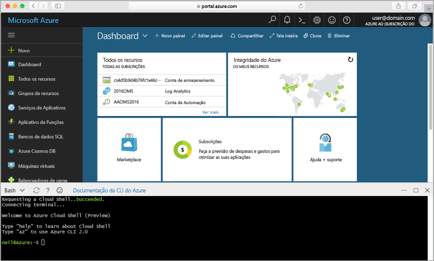

## Iniciar o Azure Cloud ShellLaunch Azure Cloud Shell

Olá Shell de nuvem do Azure é uma shell de deteção livre que podem ser executados diretamente no Olá portal do Azure.hello Azure Cloud Shell is a free Bash shell that you can run directly within hello Azure portal. Tem Olá CLI do Azure pré-instalado e configurado toouse com a sua conta.It has hello Azure CLI preinstalled and configured toouse with your account. Clique em Olá **nuvem Shell** botão no menu de Olá no Olá superior direito da Olá [portal do Azure](https://portal.azure.com).Click hello **Cloud Shell** button on hello menu in hello upper-right of hello [Azure portal](https://portal.azure.com).

botão de Olá inicia uma shell interativa que pode utilizar toorun todas Olá passos neste tópico:hello button launches an interactive shell that you can use toorun all of hello steps in this topic:

