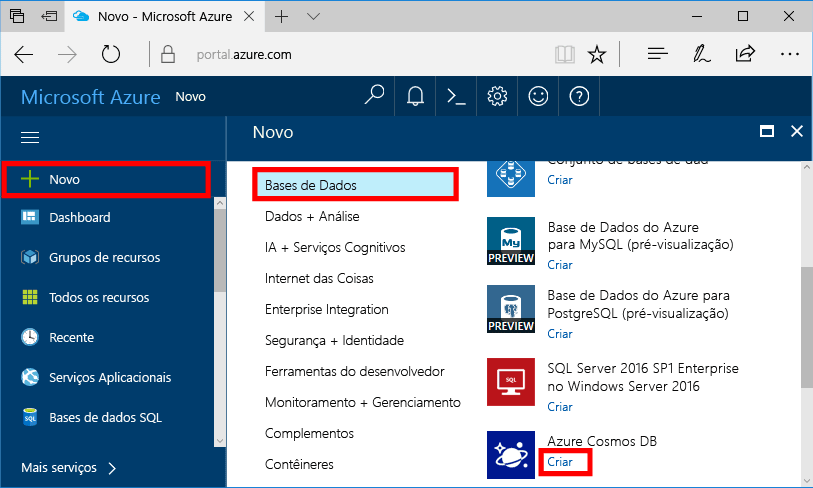
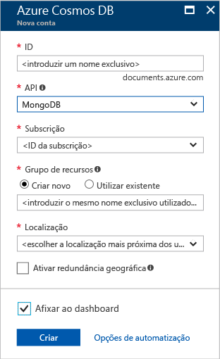
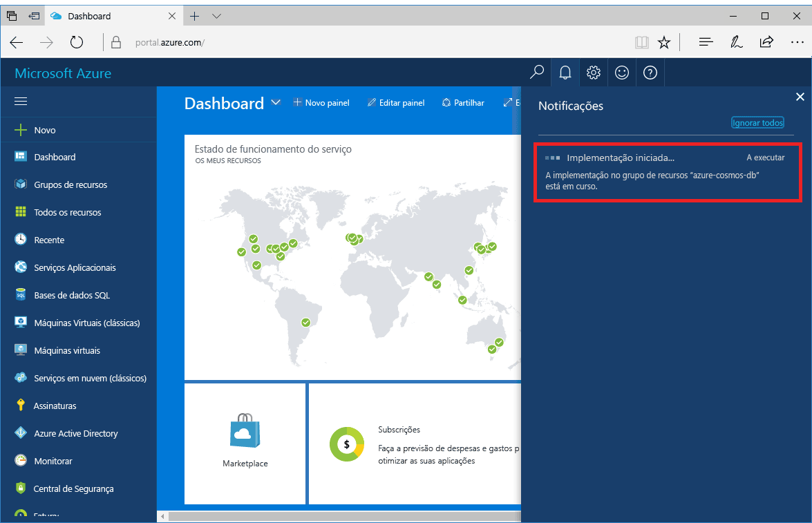
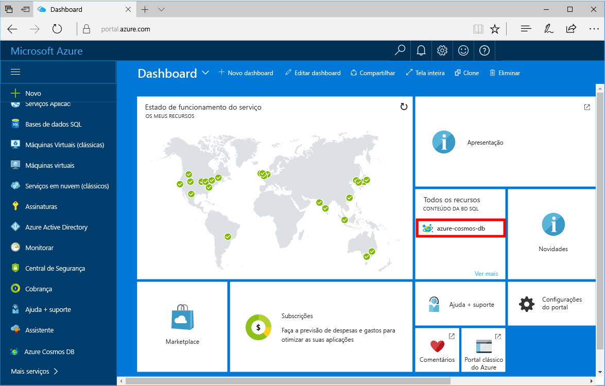

1. Numa nova janela, inicie sessão no toohello [portal do Azure](https://portal.azure.com/).In a new window, sign in toohello [Azure portal](https://portal.azure.com/).
2. No menu à esquerda Olá, clique em **novo**, clique em **bases de dados**e, em **Azure Cosmos DB**, clique em **criar**.In hello left menu, click **New**, click **Databases**, and then under **Azure Cosmos DB**, click **Create**.
   
   

3. No Olá **nova conta** painel, especifique Olá configuração pretendida para Olá conta de base de dados do Azure Cosmos.In hello **New account** blade, specify hello desired configuration for hello Azure Cosmos DB account. 

    Com o Azure Cosmos DB, pode escolher um de quatro modelos de programação: Gremlin (gráficos), MongoDB, SQL (DocumentDB) e Table (chave-valor).With Azure Cosmos DB, you can choose one of four programming models: Gremlin (graph), MongoDB, SQL (DocumentDB), and Table (key-value). 
       
    Neste início rápido irá ser programação contra Olá MongoDB API para escolherá **MongoDB** como preencher o formulário de Olá.In this quick start we'll be programming against hello MongoDB API so you'll choose **MongoDB** as you fill out hello form. Contudo, se tiver dados de gráficos para aplicações de redes sociais, dados de documentos de aplicações de catálogos ou dados de chaves-valores (tabela), tenha em conta que o Azure Cosmos DB pode proporcionar uma plataforma de serviço de bases de dados de elevada disponibilidade e distribuída globalmente para todas as aplicações críticas para a sua atividade.But if you have graph data for a social media app, document data from a catalog app, or key/value (table) data, realize that Azure Cosmos DB can provide a highly available, globally-distributed database service platform for all your mission-critical applications.

    Preencha Olá **nova conta** painel com informações de Olá na tabela de Olá como guia.Fill out hello **New account** blade using hello information in hello table as a guide.
 
    
   
    DefiniçãoSetting|Valor sugeridoSuggested value|DescriçãoDescription
    ---|---|---
    IDID|*Valor exclusivo**Unique value*|Um nome exclusivo que escolher a conta de base de dados do Azure Cosmos tooidentify Olá.A unique name you choose tooidentify hello Azure Cosmos DB account. *Documents.Azure.com* é anexado toohello ID fornecer toocreate seu URI, por isso, utilize um ID exclusivo mas identificável.*documents.azure.com* is appended toohello ID you provide toocreate your URI, so use a unique but identifiable ID. Olá ID pode conter apenas letras minúsculas, números e Olá '-' carateres e tem de ter entre 3 e 50 carateres.hello ID may contain only lowercase letters, numbers, and hello '-' character, and must be between 3 and 50 characters.
    APIAPI|MongoDBMongoDB|Iremos irá programação contra Olá [MongoDB API](../articles/documentdb/documentdb-protocol-mongodb.md) posteriormente neste artigo.We'll be programming against hello [MongoDB API](../articles/documentdb/documentdb-protocol-mongodb.md) later in this article.|
    SubscriçãoSubscription|*A sua subscrição**Your subscription*|Olá subscrição do Azure que pretende que toouse para a conta de base de dados do Azure Cosmos Olá.hello Azure subscription that you want toouse for hello Azure Cosmos DB account. 
    Grupo de RecursosResource Group|*Olá mesmo valor como ID**hello same value as ID*|Olá novo nome grupo de recursos para a sua conta.hello new resource group name for your account. Simplicidade, pode utilizar Olá mesmo nome como o seu ID.For simplicity, you can use hello same name as your ID. 
    LocalizaçãoLocation|*utilizadores de tooyour do Olá região mais próximos**hello region closest tooyour users*|Olá localização geográfica na qual toohost a sua conta de base de dados do Azure Cosmos.hello geographic location in which toohost your Azure Cosmos DB account. Escolha a localização de Olá mais próximos tooyour utilizadores toogive Olá-os dados de toohello acesso mais rápidos.Choose hello location closest tooyour users toogive them hello fastest access toohello data.

4. Clique em **criar** conta de Olá toocreate.Click **Create** toocreate hello account.
5. Na barra de ferramentas Olá, clique em **notificações** processo de implementação de Olá toomonitor.On hello toolbar, click **Notifications** toomonitor hello deployment process.

    

6.  Quando a implementação de Olá estiver concluída, nova conta de Olá aberta de Olá todos os recursos do mosaico.When hello deployment is complete, open hello new account from hello All Resources tile. 

    
