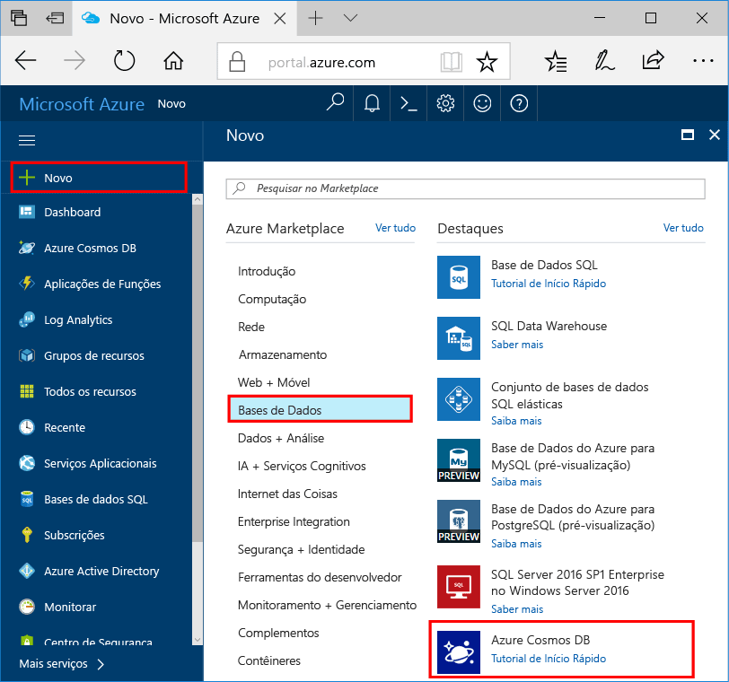

1. Numa nova janela, inicie sessão no toohello [portal do Azure](https://portal.azure.com/).
2. No menu à esquerda Olá, clique em **novo**, clique em **bases de dados**e, em **Azure Cosmos DB**, clique em **criar**.
   
   

3. No Olá **nova conta** painel, especifique Olá configuração pretendida para Olá conta de base de dados do Azure Cosmos. 

    Com o Azure Cosmos DB, pode escolher um de quatro modelos de programação: Gremlin (gráficos), MongoDB, SQL (DocumentDB) e Table (chave-valor). 
    
    Neste início rápido irá ser programação contra Olá API de tabela para que irá escolher **tabela (chave-valor)** como preencher o formulário de Olá. Contudo, se tiver dados de gráficos para aplicações de redes sociais, dados de documentos de aplicações de catálogos ou dados migrados de aplicações MongoDB, tenha em conta que o Azure Cosmos DB pode proporcionar uma plataforma de serviço de bases de dados de elevada disponibilidade e distribuída globalmente para todas as aplicações críticas para a sua atividade.

    Preencha Olá novo painel de conta utilizar informações de Olá na captura de ecrã Olá como guia. Irá escolher valores exclusivos como configurou a sua conta para que os seus valores serão não coincidem Olá captura de ecrã. 
 
    

    Definição|Valor sugerido|Descrição
    ---|---|---
    ID|*Valor exclusivo*|Um nome exclusivo que escolher a conta de base de dados do Azure Cosmos tooidentify Olá. *Documents.Azure.com* é anexado toohello ID fornecer toocreate seu URI, por isso, utilize um ID exclusivo mas identificável. Olá ID pode conter apenas letras minúsculas, números e Olá '-' carateres e tem de ter entre 3 e 50 carateres.
    API|Table (chave-valor)|Iremos irá programação contra Olá [API de tabela](../articles/cosmos-db/table-introduction.md) posteriormente neste artigo.|
    Subscrição|*A sua subscrição*|Olá subscrição do Azure que pretende que toouse para a conta de base de dados do Azure Cosmos Olá. 
    Grupo de Recursos|*Olá mesmo valor como ID*|Olá novo nome grupo de recursos para a sua conta. Simplicidade, pode utilizar Olá mesmo nome como o seu ID. 
    Localização|*utilizadores de tooyour do Olá região mais próximos*|Olá localização geográfica na qual toohost a sua conta de base de dados do Azure Cosmos. Escolha a localização de Olá mais próximos tooyour utilizadores toogive Olá-os dados de toohello acesso mais rápidos.   

4. Clique em **criar** conta de Olá toocreate.
5. Na barra de ferramentas Olá, clique em **notificações** processo de implementação de Olá toomonitor.

    

6.  Quando a implementação de Olá estiver concluída, nova conta de Olá aberta de Olá todos os recursos do mosaico. 

    
