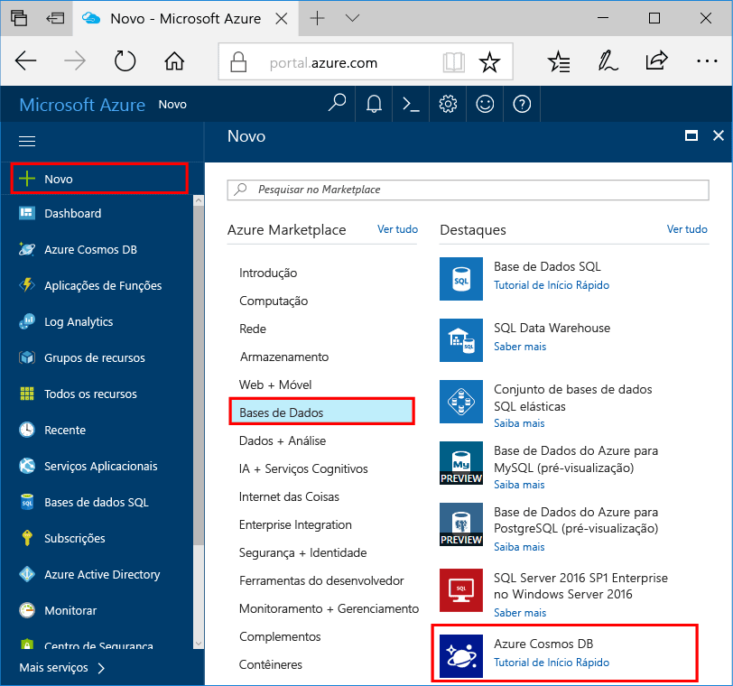

1. Numa nova janela, inicie sessão no toohello [portal do Azure](https://portal.azure.com/).
2. No painel esquerdo Olá, clique em **novo**, clique em **bases de dados**e, em **Azure Cosmos DB**, clique em **criar**.
   
   

3. No Olá **nova conta** painel, especificar a configuração de Olá que pretende para esta conta de base de dados do Azure Cosmos. 

    Com o Azure Cosmos DB, pode escolher um de quatro modelos de programação: Gremlin (gráficos), MongoDB, SQL (DocumentDB) e Table (chave-valor), em que cada um requer uma conta separada.
    
    Neste artigo de início rápido, iremos programa contra Olá API do DocumentDB, por isso, escolha **SQL (DocumentDB)** como preencher o formulário de Olá. Se tiver dados de gráficos para aplicações de redes sociais, dados de chaves/valores (tabela) ou dados migrados de aplicações MongoDB, tenha em conta que o Azure Cosmos DB pode proporcionar uma plataforma de serviço de bases de dados de elevada disponibilidade e distribuída globalmente para todas as aplicações críticas para a sua atividade.

    Preencha os campos de Olá no Olá **nova conta** painel, utilizando os valores de informações Olá Olá seguinte como guia - captura de ecrã pode ser diferente de valores de Olá Olá captura de ecrã.
 
    

    Definição|Valor sugerido|Descrição
    ---|---|---
    ID|*Valor exclusivo*|Um nome exclusivo que identifica esta conta do Azure Cosmos DB. Porque *documents.azure.com* é anexado toohello ID que forneçam toocreate seu URI, utilize um único, mas identificação ID. Olá ID pode conter apenas letras minúsculas, números e carateres de hífen (-) Olá e tem de conter 3 too50 carateres.
    API|SQL (DocumentDB)|Iremos programa contra Olá [DocumentDB API](../articles/documentdb/documentdb-introduction.md) posteriormente neste artigo.|
    Subscrição|*A sua subscrição*|Olá subscrição do Azure que pretende que toouse para esta conta de base de dados do Azure Cosmos. 
    Grupo de Recursos|*Olá mesmo valor como ID*|Olá novo grupo de recursos nome para a sua conta. Simplicidade, pode utilizar Olá mesmo nome como o seu ID. 
    Localização|*utilizadores de tooyour do Olá região mais próximos*|Olá localização geográfica na qual toohost a sua conta de base de dados do Azure Cosmos. Escolha a localização de Olá que esteja mais próximo tooyour utilizadores toogive Olá-os dados de toohello acesso mais rápidos.
4. Clique em **criar** conta de Olá toocreate.
5. Na barra de ferramentas superior de Olá, clique em Olá **notificações** ícone  processo de implementação de Olá toomonitor.

    

6.  Quando a janela de notificações de Olá indica a janela de notificação do Olá implementação Olá criada com êxito, fechar e nova conta de Olá aberta de Olá **todos os recursos** mosaico Olá Dashboard. 

    
 
