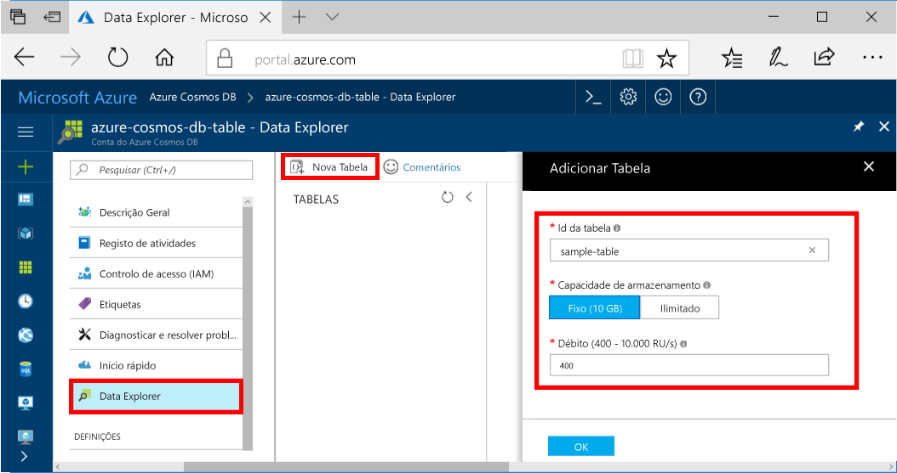

Agora pode utilizar o Explorador de dados toocreate uma tabela e adicionar a base de dados de tooyour de dados. 

1. No Olá portal do Azure, no menu de navegação de Olá, clique em **Explorador de dados (pré-visualização)**. 
2. No painel do Explorador de dados de Olá, clique em **nova tabela**, em seguida, preencha a página Olá utilizando Olá informações a seguir.

    

    Definição|Valor sugerido|Descrição
    ---|---|---
    ID da tabela|tabela de exemplo|Olá ID para a sua tabela de novo. Os nomes de tabela ter Olá requisitos mesmo caráter como ids de base de dados. Os nomes das bases de dados têm de ter entre um e 255 carateres e não podem conter `/ \ # ?` nem espaços à direita.
    Capacidade de armazenamento| 10 GB|Deixe o valor predefinido de Olá. Esta é a capacidade de armazenamento Olá da base de dados de Olá.
    Débito|400 RUs|Deixe o valor predefinido de Olá. Pode dimensionar Olá [débito](../articles/cosmos-db/request-units.md) posterior se pretender tooreduce latência.

3. Depois do formulário de Olá é preenchido, clique em **OK**.
