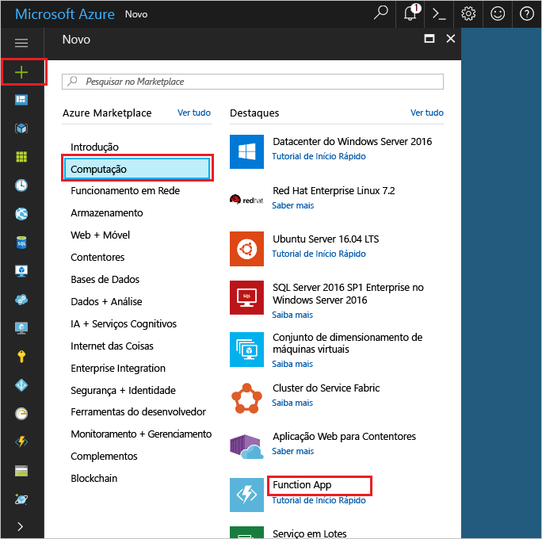

1. Clique em Olá **novo** botão encontrado no canto esquerda superior Olá de Olá portal do Azure.

1. Clique em **Computação** > **Function App** e selecione a sua **Subscrição**. Em seguida, utilize as definições de aplicação de função Olá conforme especificado na tabela de Olá.

    

    | Definição      | Valor sugerido  | Descrição                                        |
    | ------------ |  ------- | -------------------------------------------------- |
    | **Nome da aplicação**  | Nome globalmente exclusivo | Nome que identifica a sua aplicação Function App nova. | 
    | **[Grupo de Recursos](../articles/azure-resource-manager/resource-group-overview.md)** |  myResourceGroup | Dê um nome para Olá novo grupo de recursos no qual toocreate a aplicação de função. | 
    | **[Plano de alojamento](../articles/azure-functions/functions-scale.md)** |   Plano de consumo | Plano de alojamento que define a forma como os recursos são atribuídos tooyour aplicação de função. Na predefinição Olá **consumo planear**, recursos são adicionados dinamicamente conforme exigido pelas suas funções. Só paga pelos tempo Olá que executam as suas funções.   |
    | **Localização** | Europa Ocidental | Escolha uma localização perto de si ou de outros serviços aos quais as suas funções vão aceder. |
    | **[Conta de armazenamento](../articles/storage/common/storage-create-storage-account.md#create-a-storage-account)** |  Nome globalmente exclusivo |  Nome do Olá nova conta de armazenamento utilizado pela sua aplicação de função. Os nomes das contas do Storage devem ter entre 3 e 24 carateres de comprimento e apenas podem conter números e letras minúsculas. Também pode utilizar uma conta já existente. |

1. Clique em **criar** tooprovision e implementar a nova aplicação de função Olá.
