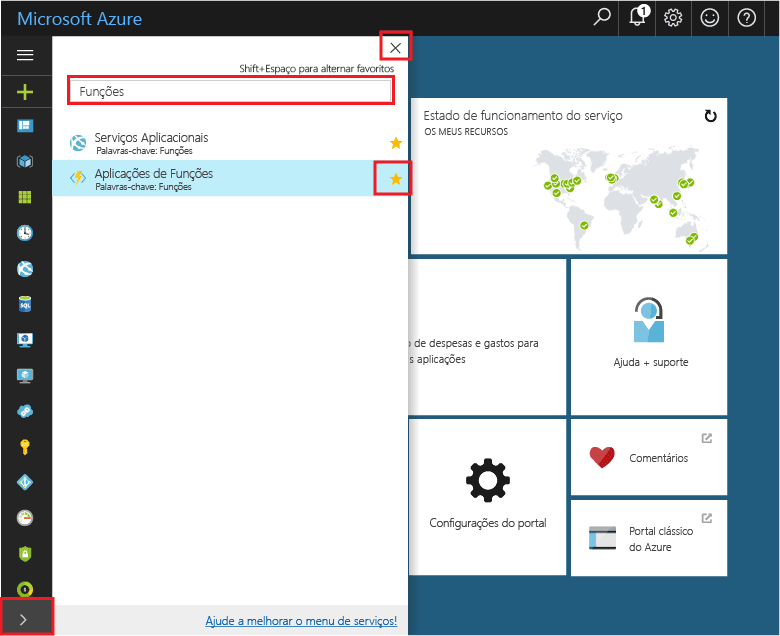
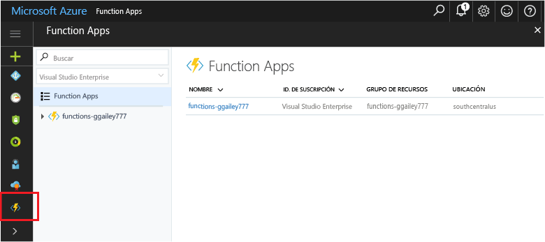

## Adicionar Favoritos de portais de tooyour de aplicações de função 

Se ainda não o fez, adicione os favoritos tooyour de aplicações de função Olá portal do Azure. Isto torna mais fácil toofind as suas aplicações de função. Se tiver o tiver feito, ignore a secção seguinte toohello. 

1. Inicie sessão no toohello [portal do Azure](https://portal.azure.com/).

2. Clique em seta de Olá no Olá na parte inferior esquerda tooexpand todos os serviços, tipo `Functions` no Olá **filtro** campo e, em seguida, clique em estrela Olá seguinte demasiado**aplicações de função**.  
 
    

    Esta ação adiciona o menu de toohello de ícone de funções de Olá esquerda Olá do portal de Olá.

3. Fechar o menu de Olá, em seguida, desloque para baixo o ícone de funções do toohello inferior toosee Olá. Clique neste ícone toosee uma lista de todas as suas aplicações de função. Clique em seu toowork de aplicação de função com as funções nesta aplicação. 
 
    
 
     