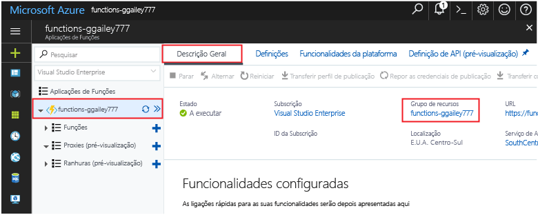

Outros guias de introdução nesta coleção são criados através deste guia de introdução.Other quick starts in this collection build upon this quick start. Se pretender toocontinue toowork subsequentes inícios rápidos ou com tutoriais Olá, não limpar os recursos de Olá criados neste rápido inicie.If you plan toocontinue on toowork with subsequent quick starts or with hello tutorials, do not clean up hello resources created in this quick start. 

Se não planear toocontinue, clique em Olá **grupo de recursos** para aplicação de função Olá no portal de Olá e, em seguida, clique em **eliminar**.If you do not plan toocontinue, click hello **Resource group** for hello function app in hello portal, and then click **Delete**. 

