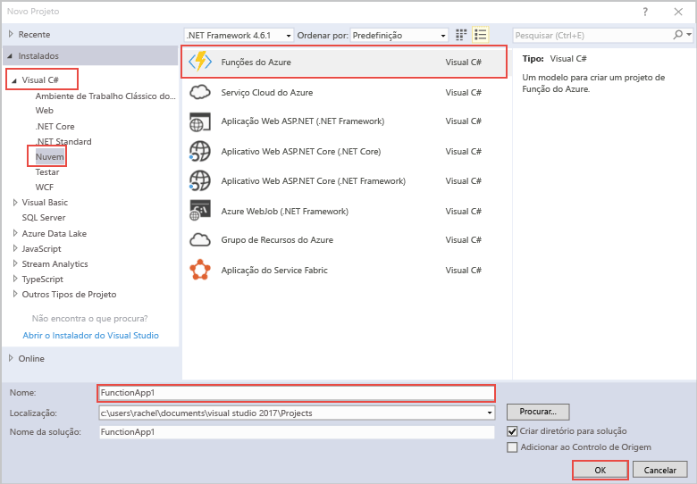

modelo de projeto Olá das funções do Azure no Visual Studio cria um projeto que pode ser publicados tooa a aplicação de função no Azure. As aplicações App Function permitem-lhe agrupar funções como unidades lógicas para uma gestão, implementação e partilha de recursos mais fácil.   

1. Clique direito do rato no nó do projeto Olá no **Explorador de soluções**, em seguida, escolha **adicionar** > **Novo Item**. Escolha **função do Azure** a partir da caixa de diálogo Olá.

2. No Olá **novo projeto** caixa de diálogo, expanda **Visual c#** > **nuvem** nó, selecione **das funções do Azure**, escreva um **Nome** para o seu projeto e clique em **OK**. nome da aplicação Olá função tem de ser válido como um c# espaço de nomes, pelo que não utilize carateres de sublinhado, hífenes ou quaisquer outros carateres não alfanuméricos. 

    
