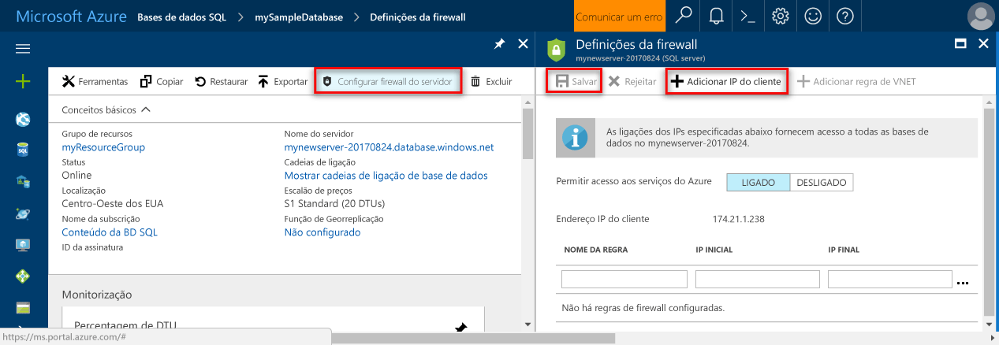

<!--
includes/sql-database-create-new-server-firewall-portal.md

Latest Freshness check:  2016-11-28 , rickbyh.

As of circa 2016-04-11, hello following topics might include this include:
articles/sql-database/sql-database-get-started.md
articles/sql-database/sql-database-configure-firewall-settings
articles/sql-data-warehouse-get-started-provision.md

-->
### Criar uma regra de firewall ao nível do servidor no Olá portal do Azure

1. No painel de servidor SQL Olá, em definições, clique em **Firewall** o painel do SQL Server de Olá do tooopen Olá Firewall.

    <!--  -->

2. Reveja o endereço IP de cliente de Olá apresentado e validar que este é o endereço IP no Olá Internet utilizando um browser da sua preferência (peça "o que é o meu endereço IP). Ocasionalmente, os endereços IP não correspondem devido a vários motivos.

    <!--  -->

3. Partindo do princípio que correspondem aos endereços IP Olá, clique em **Adicionar IP do cliente** na barra de ferramentas Olá.

    

    > [!NOTE]
    > Pode abrir um intervalo de endereços completo ou uma firewall de base de dados SQL Olá no Olá tooa único endereço IP do servidor. Abrir Olá firewall permite aos administradores do SQL Server e base de dados do utilizadores toologin tooany no Olá toowhich de servidor têm credenciais válidas.
    >

4. Clique em **guardar** no Olá toosave da barra de ferramentas esta regra de firewall ao nível do servidor e, em seguida, clique em **OK**.

    

> [!Tip]
> Para obter um tutorial, veja o artigo [Tutorial da Base de Dados SQL: Criar um servidor, uma regra de firewall ao nível do servidor, uma base de dados de exemplo, uma regra de firewall ao nível da base de dados e ligar com o SQL Server](../articles/sql-database/sql-database-get-started.md).    
>
