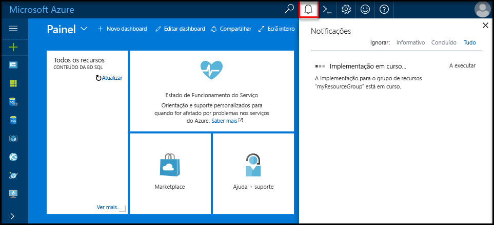

## Início de sessão toohello portal do AzureLog in toohello Azure portal

Inicie sessão no toohello [portal do Azure](https://portal.azure.com/).Log in toohello [Azure portal](https://portal.azure.com/).

## Criar uma base de dados do SQL Server em branco utilizando Olá portal do AzureCreate a blank SQL database using hello Azure portal

É criada uma base de dados SQL do Azure com um conjunto definido de [recursos de armazenamento e computação](../articles/sql-database/sql-database-service-tiers.md).An Azure SQL database is created with a defined set of [compute and storage resources](../articles/sql-database/sql-database-service-tiers.md). base de dados de Olá criada dentro de um [grupo de recursos do Azure](../articles/azure-resource-manager/resource-group-overview.md) e num [servidor lógico da SQL Database do Azure](../articles/sql-database/sql-database-features.md).hello database is created within an [Azure resource group](../articles/azure-resource-manager/resource-group-overview.md) and in an [Azure SQL Database logical server](../articles/sql-database/sql-database-features.md). 

Siga estes passos toocreate uma base de dados do SQL Server em branco.Follow these steps toocreate a blank SQL database. 

1. Clique em Olá **novo** botão encontrado no canto esquerda superior Olá de Olá portal do Azure.Click hello **New** button found on hello upper left-hand corner of hello Azure portal.

2. Selecione **bases de dados** de Olá **novo** página e selecione **base de dados SQL** de Olá **bases de dados** página.Select **Databases** from hello **New** page, and select **SQL Database** from hello **Databases** page. 

   

3. Preencha formulário de base de dados SQL Olá com Olá seguintes informações, conforme mostrado no Olá anterior a imagem:Fill out hello SQL Database form with hello following information, as shown on hello preceding image:   

   | DefiniçãoSetting | Valor sugeridoSuggested value | DescriçãoDescription |
   | --------| --------------- | ----------- | 
   | **Nome da base de dados****Database name** | mySampleDatabasemySampleDatabase | Para nomes de bases de dados válidos, veja [Database Identifiers](https://docs.microsoft.com/sql/relational-databases/databases/database-identifiers) (Identificadores de Bases de Dados).For valid database names, see [Database Identifiers](https://docs.microsoft.com/sql/relational-databases/databases/database-identifiers). | 
   | **Subscrição****Subscription** | A sua subscriçãoYour subscription  | Para obter detalhes sobre as suas subscrições, veja [Subscriptions](https://account.windowsazure.com/Subscriptions) (Subscrições).For details about your subscriptions, see [Subscriptions](https://account.windowsazure.com/Subscriptions). |
   | **Grupo de recursos****Resource group** | myResourceGroupmyResourceGroup | Para nomes de grupo de recursos válidos, veja [Naming rules and restrictions](https://docs.microsoft.com/azure/architecture/best-practices/naming-conventions) (Atribuição de nomes de regras e restrições).For valid resource group names, see [Naming rules and restrictions](https://docs.microsoft.com/azure/architecture/best-practices/naming-conventions). |
   | **Selecione a origem****Select source** | Base de dados em brancoBlank database | Especifica que deve ser criada uma base de dados em branco.Specifies that a blank database should be created. |
   ||||

4. Clique em **servidor** toocreate e configurar um novo servidor para a sua nova base de dados.Click **Server** toocreate and configure a new server for your new database. Preencha Olá **novo formulário de servidor** com Olá seguintes informações:Fill out hello **New server form** with hello following information: 

   | DefiniçãoSetting | Valor sugeridoSuggested value | DescriçãoDescription |
   | --------| --------------- | ----------- | 
   | **Nome do servidor****Server name** | Um nome globalmente exclusivo.Any globally unique name. | Para nomes de servidores válidos, veja [Naming rules and restrictions](https://docs.microsoft.com/azure/architecture/best-practices/naming-conventions) (Atribuição de nomes de regras e restrições).For valid server names, see [Naming rules and restrictions](https://docs.microsoft.com/azure/architecture/best-practices/naming-conventions). | 
   | **Início de sessão de administrador do servidor****Server admin login** | Um nome válido.Any valid name. | Para nomes de início de sessão válidos, veja [Database Identifiers](https://docs.microsoft.com/sql/relational-databases/databases/database-identifiers) (Identificadores de Bases de Dados).For valid login names, see [Database Identifiers](https://docs.microsoft.com/sql/relational-databases/databases/database-identifiers).|
   | **Palavra-passe****Password** | Qualquer palavra-passe válida.Any valid password. | A palavra-passe tem de ter, pelo menos, oito carateres e tem de conter carateres de três das seguintes categorias de Olá: carateres maiúsculos, carateres minúsculos, números e carateres não alfanuméricos.Your password must have at least eight characters and must contain characters from three of hello following categories: upper case characters, lower case characters, numbers, and non-alphanumeric characters. |
   | **Localização****Location** | Nenhuma localização válida.Any valid location. | Para obter mais informações sobre regiões, veja [Azure Regions](https://azure.microsoft.com/regions/) (Regiões do Azure).For information about regions, see [Azure Regions](https://azure.microsoft.com/regions/). |
   ||||

   

5. Clique em **Selecionar**.Click **Select**.

6. Clique em **escalão de preço** toospecify Olá camada e o desempenho do nível de serviço para a sua nova base de dados.Click **Pricing tier** toospecify hello service tier and performance level for your new database. Para este tutorial, selecione **20 DTUs** e **250** GB de armazenamento.For this tutorial, select **20 DTUs** and **250** GB of storage.

   

7. Clique em **Aplicar**.Click **Apply**.  

8. Selecione um **agrupamento** para Olá em branco da base de dados (para este tutorial, utilize Olá predefinição).Select a **collation** for hello blank database (for this tutorial, use hello default value). Para obter mais informações sobre agrupamentos, consulte [agrupamentos](https://docs.microsoft.com/sql/t-sql/statements/collations)For more information about collations, see [Collations](https://docs.microsoft.com/sql/t-sql/statements/collations)

9. Clique em **criar** base de dados do tooprovision Olá.Click **Create** tooprovision hello database. Aprovisionamento demora sobre toocomplete um minuto e um meio.Provisioning takes about a minute and a half toocomplete. 

10. Na barra de ferramentas Olá, clique em **notificações** processo de implementação de Olá toomonitor.On hello toolbar, click **Notifications** toomonitor hello deployment process.

   

## Criar uma regra de firewall ao nível do servidor utilizando Olá portal do AzureCreate a server-level firewall rule using hello Azure portal

Olá serviço base de dados do SQL Server cria uma firewall ao nível de servidor Olá.hello SQL Database service creates a firewall at hello server-level. Inicialmente firewall Olá impede ferramentas externas e aplicações de servidor toohello ou tooany bases de dados no servidor de Olá a ligar.Initially hello firewall prevents external tools and applications from connecting toohello server, or tooany databases on hello server. São permitidas ligações depois de criar uma regra de firewall tooopen especificar endereços IP.Connections are allowed after a firewall rule is created tooopen specific IP addresses. Siga estes passos toocreate um [regra de firewall ao nível do servidor de base de dados SQL](../articles/sql-database/sql-database-firewall-configure.md) para o endereço IP do cliente e tooenable conectividade externa através de firewall de base de dados SQL Olá para apenas o seu endereço IP.Follow these steps toocreate a [SQL Database server-level firewall rule](../articles/sql-database/sql-database-firewall-configure.md) for your client's IP address, and tooenable external connectivity through hello SQL Database firewall for your IP address only. 

> [!NOTE]
> Base de dados SQL do Azure comunica através da porta é 1433.Azure SQL Database communicates over port 1433. Pode ligar tooSQL da base de dados apenas depois de firewall de Olá da sua rede permite tráfego de saída através da porta é 1433.You can connect tooSQL Database only after hello firewall of your network allows outbound traffic through port 1433.

1. Depois de concluída a implementação de Olá, clique em **bases de dados SQL** do menu da esquerda Olá e, em seguida, clique em **mySampleDatabase** no Olá **bases de dados SQL** página.After hello deployment completes, click **SQL databases** from hello left-hand menu and then click **mySampleDatabase** on hello **SQL databases** page. Olá página de descrição geral para abre a base de dados, que mostra Olá completamente qualificado nome do servidor (tais como **mynewserver20170313.database.windows.net**) e fornece opções para continuar a configuração.hello overview page for your database opens, showing you hello fully qualified server name (such as **mynewserver20170313.database.windows.net**) and provides options for further configuration. Copie este nome de servidor totalmente qualificado para utilizar mais tarde.Copy this fully qualified server name for use later.

   > [!IMPORTANT]
   > Terá deste servidor de tooyour de tooconnect de nome de servidor completamente qualificado e as respetivas bases de dados subsequentes inícios rápidos.You need this fully qualified server name tooconnect tooyour server and its databases in subsequent quick starts.
   > 

    

2. Clique em **definir a firewall do servidor** na barra de ferramentas de Olá conforme mostrado na imagem anterior Olá.Click **Set server firewall** on hello toolbar as shown in hello previous image. Olá **definições de Firewall** abre a página do servidor de base de dados SQL Olá.hello **Firewall settings** page for hello SQL Database server opens. 

    

3. Clique em **Adicionar IP do cliente** no Olá barra de ferramentas tooadd tooa nova regra de firewall de endereços de IP sua atual.Click **Add client IP** on hello toolbar tooadd your current IP address tooa new firewall rule. Uma regra de firewall consegue abrir a porta 1433 para um único endereço IP ou para um intervalo de endereços IP.A firewall rule can open port 1433 for a single IP address or a range of IP addresses.

4. Clique em **Guardar**.Click **Save**. É criada uma regra de firewall ao nível do servidor para o endereço IP atual ao abrir a porta 1433 no servidor lógico de Olá.A server-level firewall rule is created for your current IP address opening port 1433 on hello logical server.

    

4. Clique em **OK** e, em seguida, feche Olá **definições de Firewall** página.Click **OK** and then close hello **Firewall settings** page.

Pode agora ligar o servidor de base de dados do Azure SQL toohello e respetivas bases de dados utilizando uma ferramenta como o SQL Server Management Studio (SSMS).You can now connect toohello Azure SQL Database server and its databases by using a tool such as SQL Server Management Studio (SSMS). ligação Olá pertence a este endereço IP e utiliza a conta de administrador de servidor de Olá criada anteriormente.hello connection is from this IP address, and it uses hello server admin account created previously.

> [!IMPORTANT]
> Por predefinição, o acesso através de firewall de base de dados SQL Olá está ativado para todos os serviços do Azure.By default, access through hello SQL Database firewall is enabled for all Azure services. Clique em **OFF** no toodisable página para todos os serviços do Azure.Click **OFF** on this page toodisable for all Azure services.

## Obter valores de cadeia de ligação utilizando Olá portal do AzureGet connection string values using hello Azure portal

Obter o nome de servidor completamente qualificado de Olá para o servidor da SQL Database do Azure no Olá portal do Azure.Get hello fully qualified server name for your Azure SQL Database server in hello Azure portal. Utilize Olá servidor completamente qualificado tooconnect tooyour ao servidor de nomes utilizando o SQL Server Management Studio.You use hello fully qualified server name tooconnect tooyour server using SQL Server Management Studio.

1. Inicie sessão no toohello [portal do Azure](https://portal.azure.com/).Log in toohello [Azure portal](https://portal.azure.com/).

2. Selecione **bases de dados SQL** no menu da esquerda do Olá e clique em sua base de dados no Olá **bases de dados SQL** página.Select **SQL Databases** from hello left-hand menu, and click your database on hello **SQL databases** page. 

3. No Olá **Essentials** painel Olá página do portal do Azure para a base de dados, localize e, em seguida, copie Olá **nome do servidor**.In hello **Essentials** pane in hello Azure portal page for your database, locate and then copy hello **Server name**.

    
