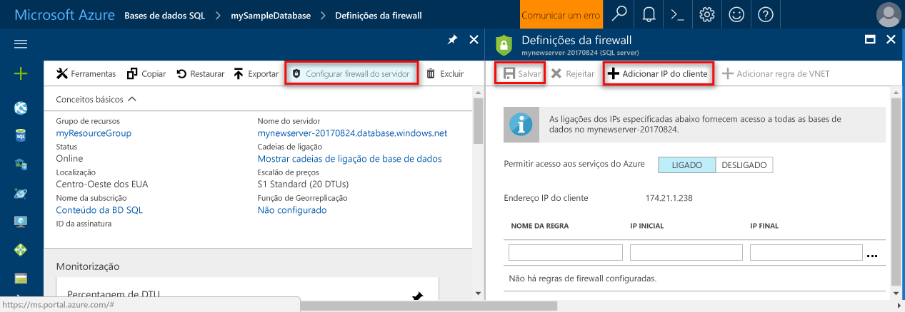

## Início de sessão toohello portal do Azure

Inicie sessão no toohello [portal do Azure](https://portal.azure.com/).

## Criar uma base de dados do SQL Server em branco utilizando Olá portal do Azure

É criada uma base de dados SQL do Azure com um conjunto definido de [recursos de armazenamento e computação](../articles/sql-database/sql-database-service-tiers.md). base de dados de Olá criada dentro de um [grupo de recursos do Azure](../articles/azure-resource-manager/resource-group-overview.md) e num [servidor lógico da SQL Database do Azure](../articles/sql-database/sql-database-features.md). 

Siga estes passos toocreate uma base de dados do SQL Server em branco. 

1. Clique em Olá **novo** botão encontrado no canto esquerda superior Olá de Olá portal do Azure.

2. Selecione **bases de dados** de Olá **novo** página e selecione **base de dados SQL** de Olá **bases de dados** página. 

   

3. Preencha formulário de base de dados SQL Olá com Olá seguintes informações, conforme mostrado no Olá anterior a imagem:   

   | Definição | Valor sugerido | Descrição |
   | --------| --------------- | ----------- | 
   | **Nome da base de dados** | mySampleDatabase | Para nomes de bases de dados válidos, veja [Database Identifiers](https://docs.microsoft.com/sql/relational-databases/databases/database-identifiers) (Identificadores de Bases de Dados). | 
   | **Subscrição** | A sua subscrição  | Para obter detalhes sobre as suas subscrições, veja [Subscriptions](https://account.windowsazure.com/Subscriptions) (Subscrições). |
   | **Grupo de recursos** | myResourceGroup | Para nomes de grupo de recursos válidos, veja [Naming rules and restrictions](https://docs.microsoft.com/azure/architecture/best-practices/naming-conventions) (Atribuição de nomes de regras e restrições). |
   | **Selecione a origem** | Base de dados em branco | Especifica que deve ser criada uma base de dados em branco. |
   ||||

4. Clique em **servidor** toocreate e configurar um novo servidor para a sua nova base de dados. Preencha Olá **novo formulário de servidor** com Olá seguintes informações: 

   | Definição | Valor sugerido | Descrição |
   | --------| --------------- | ----------- | 
   | **Nome do servidor** | Um nome globalmente exclusivo. | Para nomes de servidores válidos, veja [Naming rules and restrictions](https://docs.microsoft.com/azure/architecture/best-practices/naming-conventions) (Atribuição de nomes de regras e restrições). | 
   | **Início de sessão de administrador do servidor** | Um nome válido. | Para nomes de início de sessão válidos, veja [Database Identifiers](https://docs.microsoft.com/sql/relational-databases/databases/database-identifiers) (Identificadores de Bases de Dados).|
   | **Palavra-passe** | Qualquer palavra-passe válida. | A palavra-passe tem de ter, pelo menos, oito carateres e tem de conter carateres de três das seguintes categorias de Olá: carateres maiúsculos, carateres minúsculos, números e carateres não alfanuméricos. |
   | **Localização** | Nenhuma localização válida. | Para obter mais informações sobre regiões, veja [Azure Regions](https://azure.microsoft.com/regions/) (Regiões do Azure). |
   ||||

   

5. Clique em **Selecionar**.

6. Clique em **escalão de preço** toospecify Olá camada e o desempenho do nível de serviço para a sua nova base de dados. Para este tutorial, selecione **20 DTUs** e **250** GB de armazenamento.

   

7. Clique em **Aplicar**.  

8. Selecione um **agrupamento** para Olá em branco da base de dados (para este tutorial, utilize Olá predefinição). Para obter mais informações sobre agrupamentos, consulte [agrupamentos](https://docs.microsoft.com/sql/t-sql/statements/collations)

9. Clique em **criar** base de dados do tooprovision Olá. Aprovisionamento demora sobre toocomplete um minuto e um meio. 

10. Na barra de ferramentas Olá, clique em **notificações** processo de implementação de Olá toomonitor.

   

## Criar uma regra de firewall ao nível do servidor utilizando Olá portal do Azure

Olá serviço base de dados do SQL Server cria uma firewall ao nível de servidor Olá. Inicialmente firewall Olá impede ferramentas externas e aplicações de servidor toohello ou tooany bases de dados no servidor de Olá a ligar. São permitidas ligações depois de criar uma regra de firewall tooopen especificar endereços IP. Siga estes passos toocreate um [regra de firewall ao nível do servidor de base de dados SQL](../articles/sql-database/sql-database-firewall-configure.md) para o endereço IP do cliente e tooenable conectividade externa através de firewall de base de dados SQL Olá para apenas o seu endereço IP. 

> [!NOTE]
> Base de dados SQL do Azure comunica através da porta é 1433. Pode ligar tooSQL da base de dados apenas depois de firewall de Olá da sua rede permite tráfego de saída através da porta é 1433.

1. Depois de concluída a implementação de Olá, clique em **bases de dados SQL** do menu da esquerda Olá e, em seguida, clique em **mySampleDatabase** no Olá **bases de dados SQL** página. Olá página de descrição geral para abre a base de dados, que mostra Olá completamente qualificado nome do servidor (tais como **mynewserver20170313.database.windows.net**) e fornece opções para continuar a configuração. Copie este nome de servidor totalmente qualificado para utilizar mais tarde.

   > [!IMPORTANT]
   > Terá deste servidor de tooyour de tooconnect de nome de servidor completamente qualificado e as respetivas bases de dados subsequentes inícios rápidos.
   > 

    

2. Clique em **definir a firewall do servidor** na barra de ferramentas de Olá conforme mostrado na imagem anterior Olá. Olá **definições de Firewall** abre a página do servidor de base de dados SQL Olá. 

    

3. Clique em **Adicionar IP do cliente** no Olá barra de ferramentas tooadd tooa nova regra de firewall de endereços de IP sua atual. Uma regra de firewall consegue abrir a porta 1433 para um único endereço IP ou para um intervalo de endereços IP.

4. Clique em **Guardar**. É criada uma regra de firewall ao nível do servidor para o endereço IP atual ao abrir a porta 1433 no servidor lógico de Olá.

    

4. Clique em **OK** e, em seguida, feche Olá **definições de Firewall** página.

Pode agora ligar o servidor de base de dados do Azure SQL toohello e respetivas bases de dados utilizando uma ferramenta como o SQL Server Management Studio (SSMS). ligação Olá pertence a este endereço IP e utiliza a conta de administrador de servidor de Olá criada anteriormente.

> [!IMPORTANT]
> Por predefinição, o acesso através de firewall de base de dados SQL Olá está ativado para todos os serviços do Azure. Clique em **OFF** no toodisable página para todos os serviços do Azure.

## Obter valores de cadeia de ligação utilizando Olá portal do Azure

Obter o nome de servidor completamente qualificado de Olá para o servidor da SQL Database do Azure no Olá portal do Azure. Utilize Olá servidor completamente qualificado tooconnect tooyour ao servidor de nomes utilizando o SQL Server Management Studio.

1. Inicie sessão no toohello [portal do Azure](https://portal.azure.com/).

2. Selecione **bases de dados SQL** no menu da esquerda do Olá e clique em sua base de dados no Olá **bases de dados SQL** página. 

3. No Olá **Essentials** painel Olá página do portal do Azure para a base de dados, localize e, em seguida, copie Olá **nome do servidor**.

    
